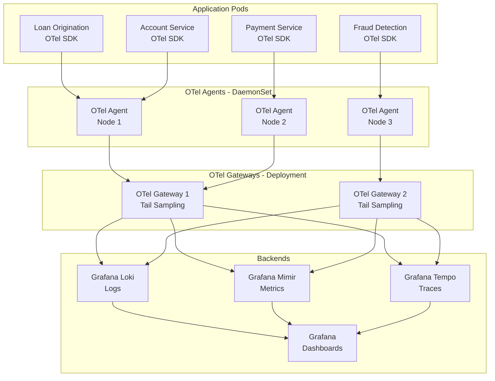
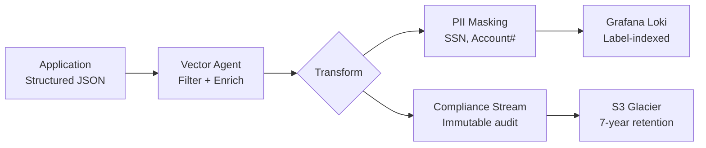
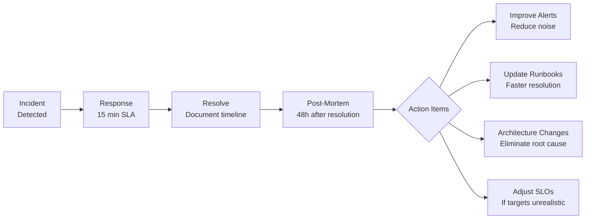

# A-01 Observability Architecture — Acme Corp Banking Modernization

> **Proyecto:** Acme Corp Banking Modernization | **Fecha:** 12 de marzo de 2026
> **Modo:** piloto-auto | **Variante:** tecnica (full)

---

## Executive Summary

Acme Corp is migrating its core banking platform from a monolithic mainframe to a microservices architecture on AWS. This document defines the observability strategy across all three pillars (logs, metrics, traces), designs the OpenTelemetry Collector topology, establishes SLO-based alerting with burn rate windows, and integrates incident response workflows. The platform processes 12M daily transactions across loan origination, account management, payments, and fraud detection services.

---

## S1: Observability Strategy

### Three-Pillar Maturity Assessment

| Pillar | Current (1-5) | Target (12mo) | Gap |
|--------|---------------|---------------|-----|
| Logging | 2 — Unstructured syslog, no correlation | 4 — Structured JSON, correlation IDs | Structured format migration, aggregation pipeline |
| Metrics | 1 — Infrastructure only (CloudWatch basic) | 4 — RED/USE with business KPIs | Full instrumentation, custom dashboards |
| Tracing | 1 — None | 4 — Distributed tracing across all services | OTel SDK integration, sampling strategy |

### OTel Collector Topology



**Topology decision:** Hierarchical (Agent + Gateway) selected because Acme Corp runs 14 microservices in production. Agents handle local batching and filtering. Gateways handle tail-based sampling with trace-ID-based consistent hashing at the NLB.

### Sampling Strategy

| Strategy | Scope | Rate |
|----------|-------|------|
| Head-based probabilistic | Normal success traces | 5% |
| Tail-based (error) | All traces with error spans | 100% |
| Tail-based (latency) | Traces exceeding p95 threshold | 100% |
| Force-sample | Loan origination critical path | 100% |

### Retention Tiers

| Tier | Duration | Storage | Cost/GB/mo |
|------|----------|---------|------------|
| Hot | 7 days | Mimir/Loki/Tempo SSD | $0.23 |
| Warm | 30 days | S3 Standard | $0.023 |
| Cold | 365 days | S3 Glacier | $0.004 |

---

## S2: Logging Architecture

### Structured Log Standard

All services emit JSON logs with mandatory fields:

```json
{
  "timestamp": "2026-03-12T14:32:01.234Z",
  "level": "INFO",
  "service": "loan-origination",
  "traceId": "abc123def456",
  "spanId": "span789",
  "message": "Loan application submitted",
  "environment": "production",
  "version": "2.4.1",
  "loanId": "LN-2026-00847",
  "amount": 450000,
  "applicantId": "CUST-9182"
}
```

### Log Level Standards

| Level | Production Default | Banking Use Cases |
|-------|-------------------|-------------------|
| ERROR | Always on | Failed transactions, compliance violations, integration failures |
| WARN | Always on | Fraud score threshold approached, rate limit 80%, certificate expiry <30d |
| INFO | Always on | Loan submitted, payment processed, account opened, KYC completed |
| DEBUG | Off (enable per-service) | SQL queries, external API payloads, calculation steps |

### Aggregation Pipeline



### Sensitive Data Handling

| Data Type | Masking Rule | Example |
|-----------|-------------|---------|
| SSN | Last 4 only | `***-**-4523` |
| Account Number | First 4 + last 2 | `1234****67` |
| Credit Card | Last 4 only (PCI-DSS) | `****-****-****-8901` |
| Email | Domain preserved | `j***@acme.com` |
| Loan Amount | No masking (business metric) | `$450,000` |

---

## S3: Distributed Tracing

### Trace Propagation

W3C Trace Context headers propagated across:
- HTTP services (REST APIs between microservices)
- gRPC (fraud detection inter-service calls)
- Kafka headers (payment event processing, loan status updates)
- SQS message attributes (notification pipeline)

### Span Design — Loan Origination Critical Path

| Span | Type | Service | Attributes |
|------|------|---------|------------|
| `loan.submit` | Server | Loan Origination | loanId, amount, term, applicantId |
| `credit.check` | Client | Credit Bureau API | bureau=equifax, score, responseTime |
| `fraud.evaluate` | Client | Fraud Detection | riskScore, rulesFired, decision |
| `kyc.verify` | Client | KYC Service | verificationStatus, documentType |
| `underwriting.decide` | Internal | Loan Origination | decision, conditions, approver |
| `db.loan.insert` | Client | PostgreSQL | table=loans, operation=INSERT |
| `event.loan.approved` | Producer | Kafka | topic=loan-events, partition |

### Exemplars Configuration

Metrics-to-trace linking enabled for all latency histograms. When a loan origination latency spike appears on the dashboard, clicking the exemplar navigates directly to the offending trace showing the exact credit bureau call or database query causing the delay.

---

## S4: Metrics & Dashboards

### RED Metrics (per service)

| Service | Rate (req/s) | Error Rate | Duration p50 | Duration p95 | Duration p99 |
|---------|-------------|------------|-------------|-------------|-------------|
| Loan Origination | 45 | 0.3% | 1.2s | 3.8s | 8.1s |
| Account Service | 320 | 0.05% | 42ms | 180ms | 450ms |
| Payment Service | 890 | 0.12% | 85ms | 290ms | 620ms |
| Fraud Detection | 450 | 0.02% | 120ms | 380ms | 950ms |

### Business Metrics

| Metric | Current | SLO Target | Alert Threshold |
|--------|---------|------------|-----------------|
| Loan decisions/hour | 180 | >150 | <120 (20% below SLO) |
| Payment success rate | 99.87% | >99.5% | <99.5% |
| Fraud detection latency p99 | 950ms | <1500ms | >1200ms |
| KYC verification time avg | 4.2s | <10s | >8s |
| Account opening completion | 94% | >90% | <88% |

### Dashboard Hierarchy

| Level | Audience | Content | Refresh |
|-------|----------|---------|---------|
| Executive | CTO, VP Engineering | SLO status (green/yellow/red), error budget remaining, business KPIs | 5 min |
| Service | Engineering leads | RED metrics per service, dependency health, deploy markers | 30s |
| Component | On-call engineers | USE metrics (CPU, memory, connections), GC pauses, queue depths | 10s |
| Business | Product, Compliance | Loan volume, payment success, fraud rates, regulatory SLA | 1 min |

### Cardinality Management

| Problem | Solution | Acme Context |
|---------|----------|-------------|
| Loan IDs as labels | Remove; correlate via traceId | 12M daily loans would explode cardinality |
| Endpoint paths with IDs | Normalize `/loans/{id}` | Prevent unbounded series |
| Per-pod metrics | Aggregate to service level | 14 services x 3 replicas = 42 pods |
| Per-customer metrics | Aggregate to segment | Enterprise/retail/SMB segments only |

---

## S5: Alerting Framework

### SLO-Based Burn Rate Alerts

| Service | SLO | Fast Burn (14.4x/1h) | Medium Burn (6x/6h) | Slow Burn (1x/3d) |
|---------|-----|----------------------|---------------------|--------------------|
| Loan Origination | 99.95% availability | Page P1 immediately | Page P2 business hours | Ticket P3 |
| Payment Service | 99.9% success rate | Page P1 immediately | Page P2 business hours | Ticket P3 |
| Fraud Detection | p99 <1500ms | Page P1 immediately | Page P2 business hours | Ticket P3 |
| Account Service | 99.9% availability | Page P1 immediately | Page P2 business hours | Ticket P3 |

### Alert Routing

| Severity | Notification | Response Time | Escalation |
|----------|-------------|---------------|------------|
| P1 | PagerDuty -> on-call engineer | 15 min | VP Engineering at 30 min |
| P2 | Slack #banking-alerts + on-call | 1 hour | Engineering lead at 2 hours |
| P3 | Jira ticket auto-created | Next business day | Sprint planning review |

### Runbook Requirements

Every alert links to a runbook containing:
1. Diagnostic steps (which dashboards, which queries)
2. Likely root causes for this alert (top 3 historical causes)
3. Remediation actions (restart, scale, rollback, failover)
4. Escalation path with contact information
5. Regulatory notification requirements (OCC, FDIC if customer-impacting)

---

## S6: Incident Response Integration

### On-Call Structure

| Rotation | Schedule | Team | Coverage |
|----------|----------|------|----------|
| Primary | Weekly | Core Banking Engineers (6) | 24/7 |
| Secondary | Weekly | Platform Engineers (4) | 24/7 |
| Escalation | N/A | VP Engineering + CTO | On demand |

### Incident Classification

| Severity | Criteria | Banking Examples |
|----------|----------|-----------------|
| SEV1 | Customer-visible, revenue impact | Payment processing down, loan portal unavailable |
| SEV2 | Degraded performance, workaround exists | Slow loan decisions, partial payment failures |
| SEV3 | Internal impact, no customer effect | Batch reporting delayed, staging environment down |

### Post-Mortem Feedback Loop



### Regulatory Incident Reporting

| Event Type | Reporting Timeline | Authority |
|------------|-------------------|-----------|
| Data breach (PII) | 72 hours | OCC, state regulators |
| Extended outage (>4h) | 36 hours | FDIC |
| Fraud system failure | Immediate | BSA/AML compliance |
| Third-party vendor failure | Per contract SLA | Vendor management |

---

## Validation Checklist

- [x] Three pillars covered with Grafana stack and OTel Collector topology
- [x] Exemplars configured linking latency metrics to traces
- [x] Log levels defined with banking-specific use cases
- [x] Sampling strategy: hybrid (5% head + 100% error/slow + 100% critical paths)
- [x] Metric naming follows `service_component_metric_unit` convention
- [x] Dashboard hierarchy: executive, service, component, business
- [x] SLO-based burn rate alerts with multi-window configuration
- [x] Every alert linked to runbook with regulatory notification requirements
- [x] Alert fatigue metrics tracked (target >80% actionable)
- [x] Incident response: on-call rotation, classification, post-mortem feedback loop

---
**Autor:** Javier Montano | **Generado por:** sofka-observability | **Fecha:** 12 de marzo de 2026
