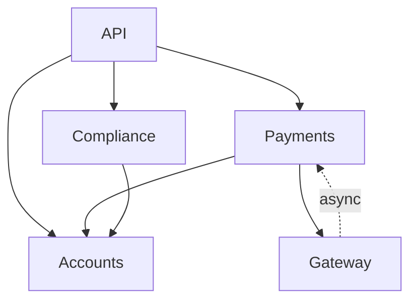
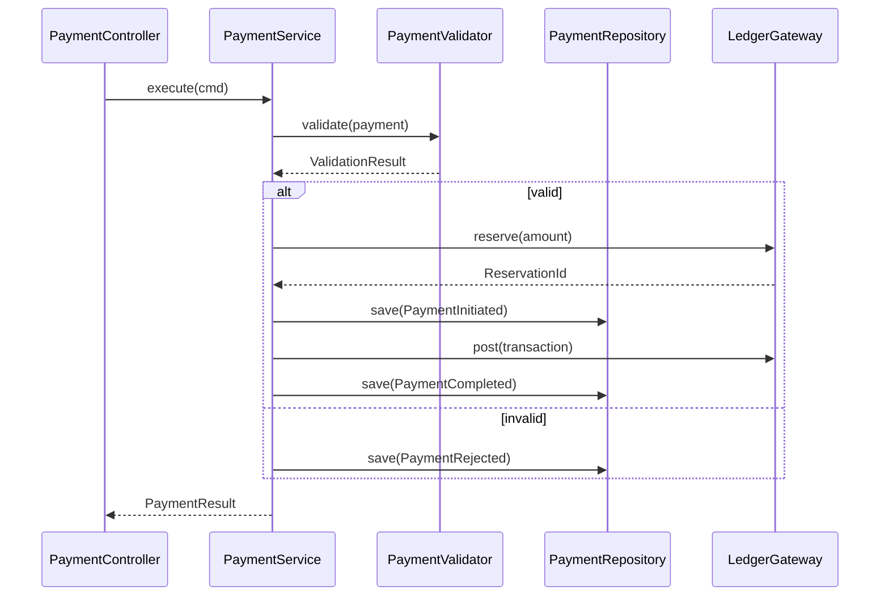

# A-01: Software Architecture Deep — Acme Corp Core Banking Service

**Sistema:** Core Banking Service
**Cliente:** Acme Corp
**Fecha:** 12 de marzo de 2026
**Variante:** Tecnica (full)
**Autor:** Javier Montano — Sofka Technologies

---

## S1: Module View

### Decomposition Strategy

Domain-driven decomposition aligned with banking bounded contexts. Five top-level modules, dependency direction strictly inward toward domain core.

### Modules

| Module | Responsibility | Layer | Owner |
|--------|---------------|-------|-------|
| **Accounts** | Account lifecycle — creation, closure, status transitions, balance queries | Domain | Team Alpha |
| **Payments** | Payment processing — transfers, direct debits, standing orders | Domain | Team Beta |
| **Compliance** | KYC validation, AML screening, regulatory reporting | Domain | Team Gamma |
| **Gateway** | External integrations — SWIFT, card networks, core ledger | Infrastructure | Team Beta |
| **API** | REST/gRPC surface, authentication, rate limiting, request routing | Presentation | Platform |

### Dependency Graph

### Dependency Violations Detected

1. **Payments -> Gateway circular dependency** via async callback. Resolved by introducing a domain event (`PaymentSettled`) consumed by Gateway through an event bus — no direct import.
2. **Compliance imports API DTOs** instead of domain types. Scheduled for refactoring in Phase 1 (see S6).

---

## S2: Component View — Payments Module

### Components

| Component | Type | Responsibility | Interfaces |
|-----------|------|---------------|------------|
| `PaymentController` | Controller | Accepts payment requests, validates input shape | `POST /payments`, `GET /payments/{id}` |
| `PaymentService` | Service | Orchestrates payment flow — validation, execution, notification | `execute(PaymentCommand): PaymentResult` |
| `PaymentValidator` | Service | Business rule validation — limits, account status, fraud score | `validate(Payment): ValidationResult` |
| `PaymentRepository` | Repository | Persistence — command store for payment events | `save(PaymentEvent)`, `findById(PaymentId)` |
| `LedgerGateway` | Gateway | Calls core ledger for balance reservations and postings | `reserve(Amount)`, `post(Transaction)` |

### Interaction Flow

---

## S3: Design Patterns

### Architectural Patterns Selected

#### Hexagonal Architecture (Ports & Adapters)

**Why chosen:** Core Banking requires isolation of business logic from external systems (SWIFT, card networks, core ledger). Hexagonal enables:
- Independent testing of domain logic without infrastructure stubs
- Swapping external providers (e.g., SWIFT to SEPA) without domain changes
- Clear boundary enforcement via port interfaces

**How applied:**
- **Ports (inbound):** `PaymentService`, `AccountService`, `ComplianceService`
- **Ports (outbound):** `LedgerPort`, `NotificationPort`, `AMLScreeningPort`
- **Adapters (inbound):** REST controllers, gRPC handlers, event consumers
- **Adapters (outbound):** `SwiftAdapter`, `CoreLedgerAdapter`, `EmailAdapter`

#### CQRS — Transaction Processing

**Why chosen:** Payment processing requires high write throughput with optimized read paths for reporting and audit. Separating command and query models enables:
- Write model optimized for event append (no joins, no locks)
- Read model materialized for reporting queries (denormalized, indexed)
- Independent scaling of write and read workloads

**How applied:**
- **Command side:** `PaymentRepository` appends domain events to event store
- **Query side:** `PaymentProjection` builds read models from events, stored in PostgreSQL materialized views
- **Sync:** Async projection via Kafka consumer with at-least-once delivery

### Anti-Patterns Detected

| Anti-Pattern | Location | Consequence | Remediation |
|-------------|----------|-------------|-------------|
| **God Service** | `LegacyTransactionService` (2,400 LOC) | Untestable, merge conflicts, unclear responsibility | Extract `PaymentValidator`, `FraudScorer`, `NotificationDispatcher` |
| **Leaky Abstraction** | `ComplianceService` imports `RestTemplate` directly | Infrastructure coupling in domain layer | Introduce `AMLScreeningPort` interface |
| **Shotgun Surgery** | Adding a payment type requires changes in 6 files | High change cost, regression risk | Strategy pattern for payment type handlers |

---

## S4: Quality Attribute Scenarios (ATAM)

| # | Quality Attribute | Stimulus | Response | Measure |
|---|------------------|----------|----------|---------|
| QA-1 | **Performance** | 500 concurrent payment requests arrive during peak hour | System processes all payments through validation, ledger reservation, and completion | p95 latency < 250ms; throughput > 800 TPS |
| QA-2 | **Modifiability** | Business requests a new payment type (instant SEPA) | Development team adds the type with a new strategy handler | Changes confined to <= 3 modules; delivered in <= 5 days |
| QA-3 | **Availability** | Primary database node fails during business hours | System fails over to replica; in-flight transactions retry automatically | Service available within 15s; zero payment loss |

---

## S5: Architecture Decision Records

### ADR-001: Hexagonal Architecture for Core Banking Domain

**Status:** Accepted
**Context:** Core Banking integrates with 4 external systems (SWIFT, card network, core ledger, AML provider). Each has different protocols, SLAs, and change cycles. Business logic must remain stable regardless of external changes.
**Decision:** Adopt Hexagonal Architecture with explicit port interfaces for all external integrations.
**Consequences:**
- (+) Domain logic is independently testable — unit tests run in <2s
- (+) External provider changes require only adapter modifications
- (-) More interfaces and classes than a layered approach
- (-) Team requires training on ports & adapters concepts
**Alternatives:**
- *Layered Architecture:* Simpler, but domain logic coupled to infrastructure changes. Rejected due to integration volatility.
- *Clean Architecture:* Similar benefits, but heavier ceremony (use cases, entities, interactors). Hexagonal is sufficient for this domain size.

### ADR-002: CQRS for Transaction Processing

**Status:** Accepted
**Context:** Payment processing generates 50K+ events/day. Reporting queries (daily reconciliation, audit trail, regulatory reports) are complex joins that degrade write performance when sharing the same model.
**Decision:** Separate command (event store) and query (materialized views) models for the Payments module.
**Consequences:**
- (+) Write throughput increased 3x in load testing
- (+) Reporting queries run against denormalized views — p95 < 100ms
- (-) Eventual consistency: read model may lag 200-500ms behind writes
- (-) Projection failure requires replay mechanism
**Alternatives:**
- *Single model with read replicas:* Simpler, but reporting queries still require complex joins. Rejected for performance reasons.
- *Full Event Sourcing:* Complete audit trail, but operational complexity (snapshotting, schema evolution) exceeds current team capacity. Deferred to Phase 3.

### ADR-003: Kafka for Domain Event Distribution

**Status:** Accepted
**Context:** Multiple modules need to react to payment events (Compliance for AML screening, Gateway for settlement, Accounts for balance updates). Synchronous calls create cascading failure risk.
**Decision:** Use Kafka as the event bus for inter-module domain events. Each consumer group processes events independently.
**Consequences:**
- (+) Loose coupling between modules — failure in Compliance does not block Payments
- (+) Event replay enables rebuilding read models and debugging
- (-) Operational overhead: Kafka cluster management, partition strategy, consumer lag monitoring
- (-) At-least-once delivery requires idempotent consumers
**Alternatives:**
- *RabbitMQ:* Simpler operations, but lacks event replay and partitioned ordering. Rejected for audit requirements.
- *Direct async calls (e.g., Spring @Async):* No infrastructure overhead, but no durability or replay. Rejected for reliability.

---

## S6: Debt & Evolution Plan

### Debt Inventory

| # | Symptom | Root Cause | Impact | Effort | Risk if Unfixed |
|---|---------|-----------|--------|--------|-----------------|
| D-1 | `LegacyTransactionService` has 2,400 LOC, 47 dependencies | Organic growth without refactoring cycles | Modifiability: 3-day changes take 8 days; merge conflicts weekly | 3 sprints | Blocks new payment types; regression rate increasing |
| D-2 | Compliance module imports REST DTOs from API layer | Missing port interface; shortcut during initial build | Testability: integration tests required for unit-level logic | 1 sprint | Any API change breaks Compliance — cascading failures |
| D-3 | No event replay mechanism for CQRS projections | Projection built as MVP without replay consideration | Availability: projection failure requires manual DB rebuild (~4h) | 2 sprints | Audit trail gaps during outages; regulatory risk |
| D-4 | Hardcoded payment type handlers in switch statement | No strategy pattern; types added ad-hoc | Modifiability: adding a payment type touches 6 files | 1 sprint | Each new type increases regression surface |

### Evolution Strategy

**Phase 1 (Sprints 1-3):** Extract services from `LegacyTransactionService`. Introduce `AMLScreeningPort` for Compliance. Testing coverage target: 80% domain layer.

**Phase 2 (Sprints 4-5):** Implement Strategy pattern for payment types. Build event replay mechanism for projections. Monitoring: consumer lag dashboards, projection health checks.

**Phase 3 (Sprints 6-8):** Evaluate Event Sourcing for full audit trail (see ADR-002 deferred). Align module boundaries with team topology. Architecture fitness functions in CI pipeline.

---

*Generado por sofka-software-architecture v6.0 — Sofka Technologies*
