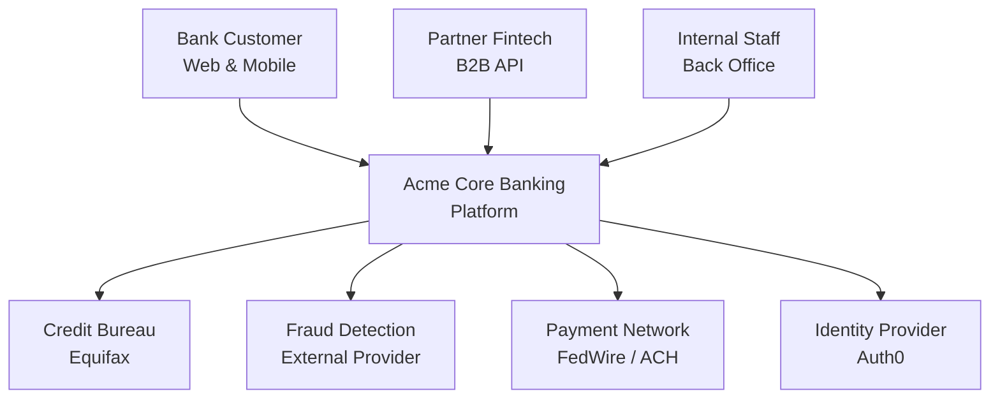
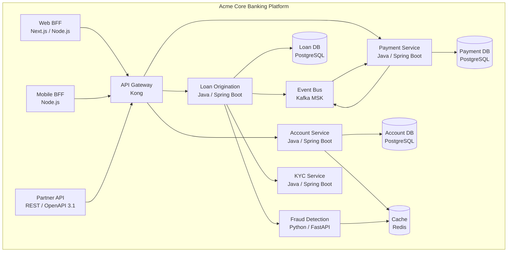
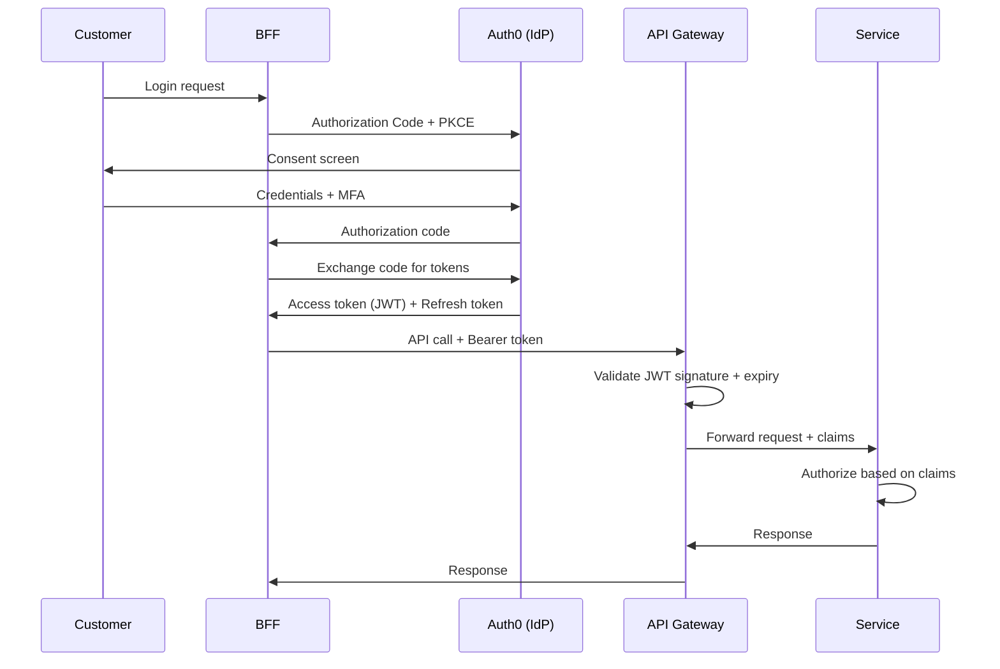

# A-02 Solutions Architecture Deep — Acme Corp Banking Modernization

> **Proyecto:** Acme Corp Banking Modernization | **Fecha:** 12 de marzo de 2026
> **Modo:** piloto-auto | **Variante:** tecnica (full)

---

## Executive Summary

Acme Corp is modernizing its core banking platform from a COBOL mainframe to a microservices architecture on AWS. This document designs the end-to-end solution: C4 container model for 14 banking services, channel architecture with BFF pattern for web, mobile, and partner API, OAuth2/OIDC identity via Auth0, Kong API gateway, 3 integration patterns (sync, async, anti-corruption layer), and a full observability stack with SLI/SLO targets. The platform processes 12M daily transactions across loan origination, payments, account management, and fraud detection.

---

## S1: Solution View (C4 Context & Containers)

### C4 Context Diagram



### C4 Container Diagram



**Key decisions:**
- BFF per channel: Web requires SSR for SEO (public rate pages), Mobile needs lightweight JSON with offline catalog support.
- Kong API Gateway: centralized JWT validation, rate limiting (1000/min partner, 100/min customer), circuit breaker.
- Kafka event bus: loan-payment saga via async events. Payment confirmation is eventual consistency (acceptable for banking with reconciliation).
- Separate databases per domain: loan, account, payment. Enables independent scaling and data sovereignty compliance.

---

## S2: Integration Architecture

### Integration Patterns

| # | Pattern | From | To | Protocol | Why |
|---|---------|------|----|----------|-----|
| 1 | **Request/Reply (sync)** | BFF | Loan Origination | REST/HTTP | Customer expects immediate loan submission confirmation |
| 2 | **Event-Driven (async)** | Loan Origination | Payment Service | Kafka | Loan disbursement is async; decouples from payment network latency |
| 3 | **Anti-Corruption Layer** | Payment Service | Legacy Mainframe | REST + COBOL Adapter | Mainframe uses EBCDIC/copybook format; ACL translates to modern domain model |

### API Gateway Configuration

| Concern | Implementation |
|---------|---------------|
| Authentication | JWT validation (Auth0 issued tokens) |
| Rate Limiting | 1000 req/min per API key (partner), 100 req/min per user |
| Request Routing | Path-based: `/loans/*` -> Loan Service, `/accounts/*` -> Account Service |
| Circuit Breaker | Kong plugin: trip at 50% error rate, 30s recovery |
| Request Transform | Partner API: version header injection, response envelope |

### Data Consistency Model

| Interaction | Consistency | Rationale |
|-------------|-------------|-----------|
| Loan submit -> persist | Strong (sync) | Customer must see confirmed application immediately |
| Loan -> Payment (disbursement) | Eventual (async) | Payment may take hours; status updates via Kafka events |
| Account -> Mainframe sync | Eventual (batch) | Mainframe reconciliation runs every 15 minutes |

---

## S3: Channel & BFF Architecture

### Channel Matrix

| Channel | BFF | Auth Flow | Offline | Key Constraints |
|---------|-----|-----------|---------|-----------------|
| **Web** (SPA) | Web BFF (Next.js SSR) | OAuth2 Auth Code + PKCE | No | SEO for public rate pages; p95 TTFB <800ms |
| **Mobile** (React Native) | Mobile BFF (Node.js) | OAuth2 Auth Code + PKCE | Yes (account summary) | Biometric auth, push notifications, offline balance view |
| **Partner API** | Direct (no BFF) | OAuth2 Client Credentials | N/A | OpenAPI 3.1 spec; versioned (v1, v2); SLA 99.9% |

### BFF Responsibilities

```
Channel -> BFF -> API Gateway -> Microservices

BFF handles:
  - Response aggregation (loan status + payments + documents -> single view)
  - Response shaping (web: full HTML, mobile: minimal JSON)
  - Caching (short TTL for account summary, no cache for transactions)
  - Error translation (service errors -> user-friendly banking messages)

BFF does NOT handle:
  - Business logic (loan calculations, fraud scoring stay in services)
  - Authentication (API Gateway + Auth0)
  - Data persistence (stateless)
```

---

## S4: Identity & Security (Zero Trust)

### Authentication Architecture



### Authorization Model

| Role | Scope | Access |
|------|-------|--------|
| `customer` | Own data | Read/write own loans, accounts, payments |
| `loan_officer` | Branch loans | Review applications, approve <$500K |
| `teller` | Branch transactions | Process deposits, withdrawals <$10K |
| `partner` | API agreement | Read rates, create/read contracted products |
| `admin` | Back office | Full CRUD on all entities |
| `auditor` | Read-only | Full read access, no modifications |

**Implementation:** RBAC via Auth0 roles in JWT claims. ABAC for data-level access (branch_id, loan_amount thresholds).

### Security Controls

| Control | Implementation |
|---------|---------------|
| Encryption in transit | TLS 1.3 everywhere (external + service-to-service) |
| Encryption at rest | AES-256 (RDS, S3, Redis) with AWS KMS CMK |
| API authentication | JWT (Bearer) for all channels |
| Service-to-service | mTLS via Istio service mesh |
| PII protection | Field-level encryption for SSN, tokenization for account numbers |
| Secrets management | AWS Secrets Manager; auto-rotation every 90 days |

---

## S5: Observability (SLI/SLO)

### Observability Stack

| Layer | Tool | Purpose |
|-------|------|---------|
| Logging | Grafana Loki | Structured JSON, correlation IDs, 30-day retention |
| Metrics | Grafana Mimir | RED per service, USE per resource, business KPIs |
| Tracing | OpenTelemetry + Grafana Tempo | Distributed traces, 5% head + 100% error sampling |
| Alerting | Grafana Alerting + PagerDuty | SLO burn rate alerts, on-call rotation |
| Dashboards | Grafana | Executive, service, component, business views |

### SLI/SLO Definitions

| Service | SLI | SLO | Error Budget (30d) |
|---------|-----|-----|-------------------|
| Loan Origination | Successful submission (2xx) | 99.95% | 21.6 min |
| Account Service | Latency p99 < 500ms | 99.9% | 43.2 min |
| Payment Service | Successful payment processing | 99.95% | 21.6 min |
| Fraud Detection | Latency p99 < 1.5s | 99.9% | 43.2 min |
| Partner API | Availability (non-5xx) | 99.9% (SLA) | 43.2 min |
| Web BFF | TTFB p95 < 800ms | 99.5% | 3.6 hrs |

---

## S6: Cross-Cutting Concerns

| Concern | Pattern | Configuration |
|---------|---------|---------------|
| **Caching** | Redis (account summary), HTTP Cache-Control (rates) | Account TTL: 5 min, rates TTL: 1 hour, event-based invalidation |
| **Rate Limiting** | Token bucket at API Gateway | Partner: 1000/min, Customer: 100/min, burst: 2x for 10s |
| **Circuit Breaker** | Kong plugin + Resilience4j | Trip: 50% errors in 60s, recovery: 30s half-open |
| **Retry** | Exponential backoff + jitter | Max 3 retries, initial 100ms, max 5s, idempotency keys |
| **Feature Flags** | LaunchDarkly | Canary releases for new loan products, kill switches |
| **Config Management** | AWS Secrets Manager + SSM Parameter Store | Secrets rotated 90d, non-secrets version-controlled |

---

## S7: Transition Plan

### Migration Phases (Strangler Fig)

| Phase | Scope | Duration | Risk | Rollback |
|-------|-------|----------|------|----------|
| 1 | API Gateway + Auth0 integration | 4 weeks | Low | Revert to direct mainframe access |
| 2 | Loan Origination Service (new flow) | 8 weeks | High | Feature flag to mainframe loan flow |
| 3 | Account Service + read replicas | 6 weeks | Medium | Dual-read from mainframe + new DB |
| 4 | Payment Service + Kafka events | 8 weeks | High | Dual-write: mainframe + new; flag-based cutover |
| 5 | Mobile BFF + Partner API | 4 weeks | Low | Independent channels, no dependency |
| 6 | Mainframe decommission | 12 weeks | Critical | Parallel running with reconciliation |

### Rollout Strategy

```
Phase 2 Example (Loan Origination):
  Dark launch (internal) -> Canary 5% -> 25% -> 50% -> 100%
  Rollback trigger: error rate >1% OR latency p99 >5s
  Rollback action: feature flag to mainframe loan flow (<5 min)
  Reconciliation: compare new vs mainframe decisions daily until 100%
```

---

## Validation Checklist

- [x] C4 context and container diagrams for 14 banking services
- [x] 3 integration patterns documented: sync, async (Kafka), anti-corruption layer (mainframe)
- [x] Channel architecture: Web, Mobile, Partner API with BFF strategy
- [x] Identity: OAuth2/OIDC with Auth0, RBAC + ABAC, Zero Trust controls
- [x] API Gateway: routing, rate limiting, circuit breaker, auth
- [x] Observability: Grafana stack, SLI/SLO for all services
- [x] Cross-cutting: caching, retry, circuit breaker, feature flags, secrets
- [x] Transition: 6 phases, strangler fig from mainframe, rollback criteria per phase

---
**Autor:** Javier Montano | **Generado por:** sofka-solutions-architecture | **Fecha:** 12 de marzo de 2026
