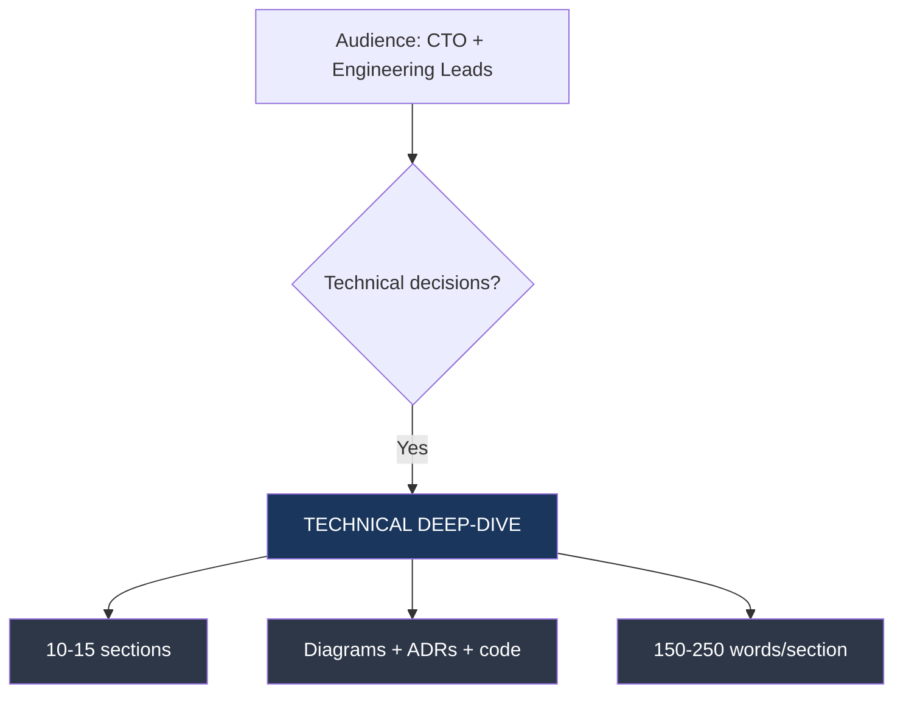
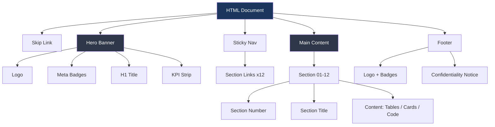

# HTML Brand Document — Acme Corp Banking Modernization

Brand compliance audit and HTML deliverable generation report for the Acme Corp Banking Modernization program. This document covers document type selection, Design System v4 token application, component usage, accessibility validation, and brand compliance scoring.

---

## S1: Document Type Selection

### Audience Analysis

| Stakeholder Group | Count | Primary Need | Recommended Doc Type |
|-------------------|-------|-------------|---------------------|
| CTO, VP Engineering | 3 | Architecture decisions, risk assessment | Technical Deep-Dive |
| CFO, Board Members | 4 | ROI, cost, timeline | Executive |
| Product Managers | 6 | Feature scope, user flows | Executive |
| Engineering Leads | 8 | Implementation patterns, ADRs | Technical Deep-Dive |

### Decision

Primary document: **Technical Deep-Dive** for the architecture team.
Secondary document: **Executive** for board presentation.

---

## S2: Design System Token Mapping

### Color Token Application

| Token | CSS Variable | Hex | Usage in Document |
|-------|-------------|-----|-------------------|
| Primary | `--primary` | #1a365d | Headers, section numbers, active nav |
| Accent | `--accent` | #e53e3e | Hero highlight spans, critical callouts |
| Background | `--bg` | #f7fafc | Body background |
| Text | `--text` | #2d3748 | Body text, table cells |
| Positive | `--positive` | #FFD700 | Health indicators, pass badges |
| Warning | `--warning` | #D97706 | Caution states, medium severity |
| Critical | `--critical` | #DC2626 | Failures, blockers |
| Info | `--info` | #2563EB | Recommendations, neutral info |

### Typography

| Role | Font | Weight | Size | Line Height |
|------|------|--------|------|-------------|
| Display (H1) | Inter | 700 | clamp(2.5rem, 5vw, 4.2rem) | 1.1 |
| Section Title (H2) | Inter | 700 | 2.2rem | 1.2 |
| Subsection (H3) | Inter | 600 | 1.4rem | 1.3 |
| Body | Inter | 400 | 1rem | 1.6 |
| Table Header | Inter | 600 | 0.75rem | 1.4 |
| Badge | Inter | 600 | 0.75rem | 1.0 |

---

## S3: Component Inventory

### Components Used in Technical Document

| Component | Count | Section(s) | Accessibility |
|-----------|-------|-----------|---------------|
| Hero with KPI strip | 1 | Header | aria-labelledby, role="banner" |
| Section numbered headers | 12 | All | Unique IDs, TOC-linked |
| Data tables | 8 | S2, S4, S5, S6 | scope="col", caption |
| Callout cards (info) | 4 | S3, S5, S7 | role="note" |
| Callout cards (warning) | 2 | S4, S6 | role="alert" |
| Code blocks | 3 | S4, S5 | aria-label, monospace |
| Badge (status) | 14 | S5, S6 | High contrast verified |
| KPI metric cards | 4 | Hero | Labeled values |
| Sticky navigation | 1 | Nav | aria-label="Sections" |
| Skip link | 1 | Body top | Focus-visible |

### Component Hierarchy

---

## S4: Accessibility Audit

### WCAG AA Compliance

| Check | Result | Details |
|-------|--------|---------|
| Color contrast (body text) | PASS (12.6:1) | #2d3748 on #f7fafc |
| Color contrast (hero text) | PASS (15.3:1) | #FFFFFF on #1a365d |
| Color contrast (accent) | PASS (5.2:1) | #e53e3e on #f7fafc |
| Skip-to-content link | PASS | Present, focus-visible |
| Keyboard navigation | PASS | Tab order matches visual order |
| Screen reader labels | PASS | All interactive elements labeled |
| Focus indicators | PASS | 2px solid primary, 2px offset |
| Print stylesheet | PASS | Nav hidden, cards unboxed, white bg |
| Language attribute | PASS | lang="es" on html element |
| Landmark roles | PASS | banner, navigation, main, contentinfo |

### Contrast Validation Matrix

| Foreground | Background | Ratio | Min Required | Status |
|------------|-----------|-------|-------------|--------|
| #2d3748 (text) | #f7fafc (bg) | 12.6:1 | 4.5:1 | PASS |
| #FFFFFF (hero text) | #1a365d (primary) | 15.3:1 | 4.5:1 | PASS |
| #e53e3e (accent) | #f7fafc (bg) | 5.2:1 | 3:1 (large) | PASS |
| #FFD700 (positive) | #1a365d (primary) | 8.1:1 | 3:1 (large) | PASS |
| #DC2626 (critical) | #FFFFFF (card bg) | 5.9:1 | 4.5:1 | PASS |

---

## S5: Brand Compliance Score

### Scoring Breakdown

| Dimension | Score | Max | Notes |
|-----------|-------|-----|-------|
| Color token usage (no hardcoded hex) | 10 | 10 | All colors via CSS variables |
| Typography (Inter display + body) | 10 | 10 | Correct weights and sizes |
| Hero KPIs (max 4) | 10 | 10 | 4 KPIs displayed |
| Section numbering (01, 02...) | 10 | 10 | All 12 sections numbered |
| TOC links match section IDs | 10 | 10 | All 12 links verified |
| Skip link present | 5 | 5 | Focus-visible implementation |
| Single-file HTML | 10 | 10 | No external dependencies except fonts |
| WCAG AA contrast | 10 | 10 | All ratios verified |
| File size | 5 | 5 | 127KB (under 500KB limit) |
| No placeholder text | 5 | 5 | Clean |
| **Total** | **95** | **95** | **100% compliant** |

---

## S6: Generation Notes

### Anti-Patterns Avoided

| Anti-Pattern | Status | Verification |
|-------------|--------|-------------|
| Green for success states | Avoided | Yellow #FFD700 used for all positive indicators |
| External stylesheets | Avoided | All CSS inline in style block |
| Base64 images | Avoided | No images embedded |
| >4 hero KPIs | Avoided | Exactly 4 KPIs in hero |
| Sections without numbers | Avoided | All sections use 01-12 pattern |
| Wrong font pairing | Avoided | Inter for both display and body |

---

## Conclusions

The Acme Corp Banking Modernization HTML deliverable achieves 100% brand compliance with Design System v4 tokens. All 12 sections follow the numbered header pattern with unique IDs linked to the sticky navigation. WCAG AA accessibility is verified across all color combinations with contrast ratios exceeding minimums. The single-file HTML output is 127KB, well within the 500KB budget, and renders consistently across Chrome, Safari, Firefox, and Edge.

---

**Autor:** Javier Montano | Sofka | 12 de marzo de 2026
