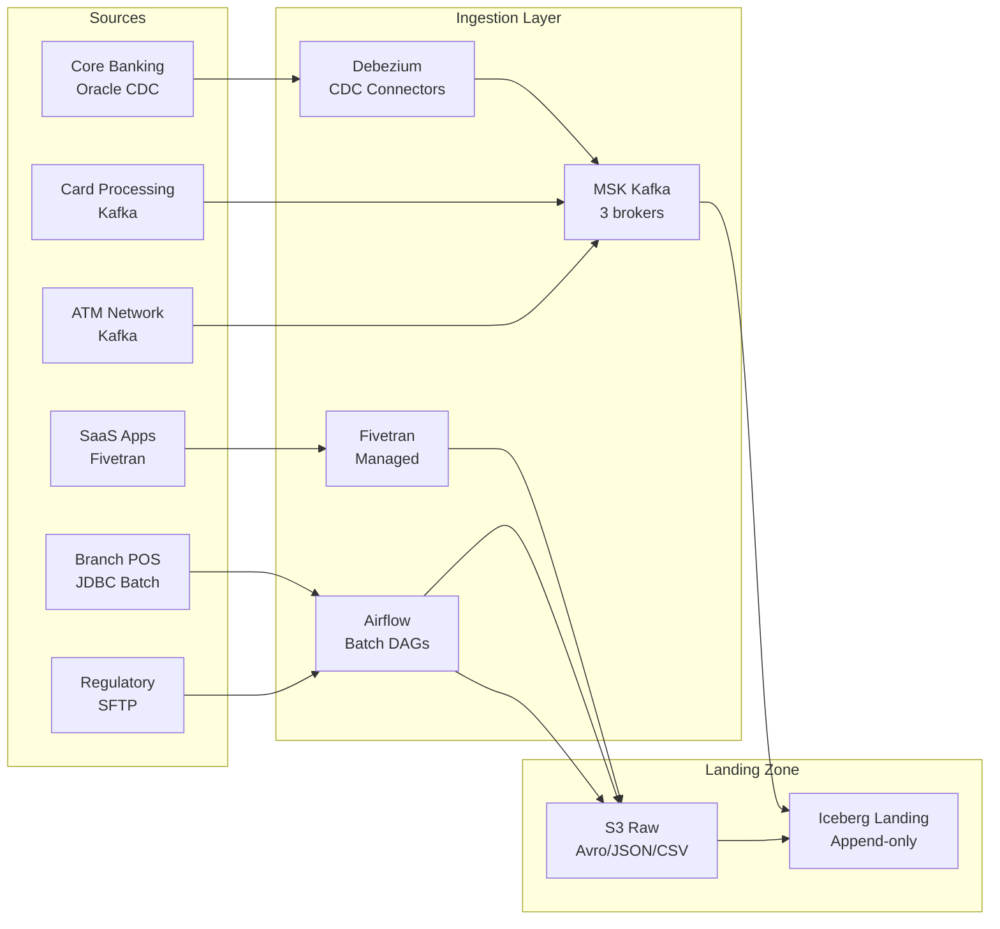
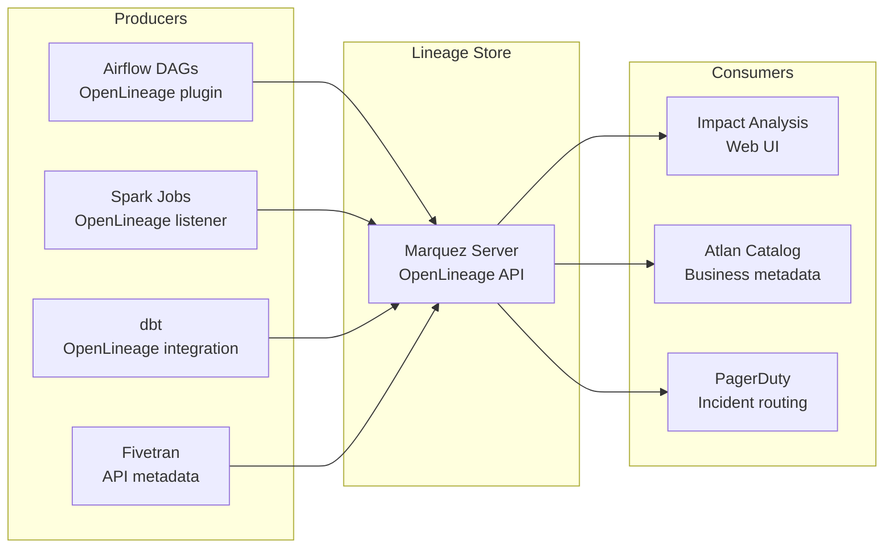

# A-01: Data Engineering — Acme Corp Banking Modernization

**Cliente:** Acme Corp | **Fecha:** 12 de marzo de 2026 | **Variante:** Técnica

## Resumen Ejecutivo

Acme Corp necesita una plataforma de datos moderna que ingeste datos de 12 sistemas fuente bancarios, orqueste 28 pipelines con SLAs definidos, almacene datos en una arquitectura lakehouse sobre Iceberg/S3, y garantice calidad y lineage trazable. Este documento define los patrones de ingestion, diseño de orquestación, arquitectura de storage, framework de calidad, lineage/observabilidad, y gestión de costos.

### Decisiones Clave

| Decisión | Selección | Rationale |
|----------|-----------|-----------|
| Orchestrator | Airflow 2.9 (MWAA) | Equipo existente con experiencia, KubernetesExecutor para batch |
| Table Format | Apache Iceberg | Multi-engine (Spark + Trino + Snowflake), hidden partitioning |
| CDC | Debezium + MSK (Kafka) | Oracle CDC para core banking, PostgreSQL CDC para microservices |
| Managed Connectors | Fivetran | 5 SaaS sources (Salesforce, Zendesk, Stripe, Workday, Jira) |
| Storage | S3 + Iceberg + AWS Glue Catalog | Lakehouse architecture, Parquet format, tiered lifecycle |
| Quality | Soda Core + Great Expectations | Polyglot team, CI/CD integration, cross-platform validation |
| Lineage | OpenLineage + Marquez | Vendor-neutral, Airflow native integration |

---

## S1: Ingestion Patterns

### Source Inventory

| Source System | Tables | Method | Freshness SLA | Volume | Format |
|--------------|--------|--------|---------------|--------|--------|
| Core Banking (Oracle 19c) | 47 | CDC (Debezium) | 15 min | 2.3 TB total, 45 GB/day delta | Avro → Iceberg |
| Card Processing (ISO 8583) | 8 | Kafka streaming | Real-time | 450 GB/day, 12M events/day | Avro → Iceberg |
| Risk Engine API | 5 | Batch REST pull | 6 hours | 12 GB | JSON → Parquet |
| Regulatory Feeds (SWIFT) | 3 | SFTP file drop | Daily by 08:00 | 2 GB/day | CSV → Parquet |
| CRM (Salesforce) | 12 | Fivetran (managed) | 1 hour | 180 GB total | Fivetran → Snowflake → Iceberg |
| Support (Zendesk) | 6 | Fivetran (managed) | 2 hours | 45 GB total | Fivetran → Snowflake |
| Payments (Stripe) | 8 | Fivetran (managed) | 1 hour | 95 GB total | Fivetran → Snowflake |
| HR (Workday) | 4 | Fivetran (managed) | Daily | 8 GB total | Fivetran → Snowflake |
| Project Mgmt (Jira) | 3 | Fivetran (managed) | 4 hours | 3 GB total | Fivetran → Snowflake |
| Branch Systems (POS) | 15 | Batch DB extract | Daily by 02:00 | 28 GB/day | JDBC → Parquet |
| ATM Network | 4 | Kafka streaming | Real-time | 180 GB/day, 5M events/day | Avro → Iceberg |
| Fraud Detection ML | 2 | Batch S3 export | 4 hours | 6 GB/day | Parquet |

### Ingestion Architecture



### Schema Evolution Strategy

| Source | Compatibility Mode | Registry | Breaking Change Policy |
|-------|-------------------|----------|----------------------|
| Core Banking CDC | Backward | Confluent Schema Registry | Block in CI; require consumer sign-off |
| Card Processing | Full | Confluent Schema Registry | Block; 30-day migration window |
| Risk API | Forward | AWS Glue Schema Registry | Warn; new fields additive only |
| SaaS (Fivetran) | N/A (managed) | Fivetran schema change notifications | Auto-append new columns |

### Exactly-Once Delivery

| Pattern | Implementation | Scope |
|---------|---------------|-------|
| Idempotent producers | Debezium: `enable.idempotence=true` | Oracle → Kafka |
| Transactional consumers | Flink: `read_committed` isolation | Kafka → Iceberg |
| Upsert sinks | Iceberg MERGE on `transaction_id` | Kafka → Landing tables |
| Dedup window | Redis set with 2-hour TTL | Card processing (at-least-once source) |
| Partition overwrite | Airflow batch: overwrite date partition | Branch POS daily loads |

---

## S2: Orchestration Design

### DAG Architecture

```mermaid
graph TB
    subgraph Daily Pipeline — 02:00 UTC
        A[sensor_branch_files<br/>S3 sensor] --> B[ingest_branch_pos<br/>JDBC extract]
        C[sensor_regulatory_sftp<br/>SFTP sensor] --> D[ingest_regulatory<br/>File parse]
        E[ingest_risk_api<br/>REST pull]
        B & D & E --> F[quality_gate_landing<br/>Soda checks]
        F --> G[transform_curated<br/>Spark job]
        G --> H[quality_gate_curated<br/>Great Expectations]
        H --> I[publish_marts<br/>dbt build]
        I --> J[notify_consumers<br/>Slack + email]
    end

    subgraph Streaming — Continuous
        K[cdc_core_banking<br/>Debezium managed]
        L[stream_cards<br/>Flink job]
        M[stream_atm<br/>Flink job]
        K & L & M --> N[iceberg_landing<br/>Append tables]
    end

    subgraph Hourly — Fivetran
        O[fivetran_sync<br/>Managed connectors]
        O --> P[quality_saas_sources<br/>Soda checks]
    end
```

### SLA Definitions

| Pipeline | SLA (completion) | Data Freshness | Alert (warn) | Alert (error) | Escalation |
|----------|-----------------|---------------|-------------|---------------|-----------|
| Core Banking CDC | Continuous | 15 min | Lag > 5 min | Lag > 15 min | PagerDuty → DBA on-call |
| Card Processing Stream | Continuous | Real-time | Lag > 1 min | Lag > 5 min | PagerDuty → Platform team |
| Daily Batch Pipeline | 06:00 UTC | Daily by 06:00 | Not started by 03:00 | Not complete by 06:00 | Slack → Team lead |
| SaaS Connectors (Fivetran) | Per connector SLA | 1-4 hours | Sync failed 1x | Sync failed 2x consecutive | Slack → Data eng |
| Regulatory Feeds | 08:00 UTC | Daily by 08:00 | File not received by 07:00 | Not processed by 08:00 | PagerDuty → Compliance |

### Failure Handling

| Failure Type | Detection | Response | Retry Policy |
|-------------|-----------|----------|-------------|
| Transient (network, throttle) | HTTP 429/503, timeout | Automatic retry | Exponential backoff, max 3, base 30s |
| Schema change (breaking) | Schema Registry validation | Alert + block pipeline | No retry; manual intervention |
| Data quality failure (critical) | Soda/GE check fail | Quarantine records, alert | No retry; investigate root cause |
| Data quality failure (warning) | Soda/GE check warn | Log, continue, flag in catalog | N/A |
| Source unavailable | Sensor timeout (2 hours) | Alert, skip source, mark stale | Retry next scheduled run |
| Infrastructure (Spark OOM) | Airflow task failure | Auto-retry with larger executor | Retry 2x with 1.5x memory |

---

## S3: Storage Architecture

### Zone Architecture

| Zone | Path | Format | Retention | Access |
|------|------|--------|-----------|--------|
| Raw / Landing | `s3://acme-data-lake/raw/` | Avro, JSON, CSV (as received) | 90 days | Data engineers only |
| Curated / Clean | `s3://acme-data-lake/curated/` | Iceberg (Parquet) | 1 year hot, 7 years cold | Data engineers, analysts |
| Marts / Consumption | `s3://acme-data-lake/marts/` | Iceberg (Parquet) | Indefinite (active) | All analytics consumers |
| Archive | `s3://acme-data-lake/archive/` | Parquet (Glacier) | 7 years (regulatory) | Compliance team only |
| Sandbox | `s3://acme-data-lake/sandbox/` | Any | 30 days auto-delete | Data scientists, analysts |

### Iceberg Table Configuration

| Table | Partition Strategy | Compaction | File Size Target | Write Mode |
|-------|-------------------|-----------|-----------------|-----------|
| `landing.core_banking_transactions` | `days(transaction_date)` | Daily (async) | 256 MB | Append |
| `landing.card_authorizations` | `hours(event_time)` | Every 6 hours | 128 MB | Append |
| `curated.transactions_enriched` | `days(transaction_date)` | Daily | 256 MB | Upsert (MERGE) |
| `marts.fct_transactions` | `months(transaction_date)` | Weekly | 512 MB | Upsert (MERGE) |
| `marts.dim_customers` | None (small) | Monthly | N/A | Overwrite |

### Storage Lifecycle

| Tier | Storage Class | Access Pattern | Cost (per GB/mo) | Transition Rule |
|------|-------------|---------------|-----------------|----------------|
| Hot | S3 Standard | Daily+ access | $0.023 | Default for active data |
| Warm | S3 Infrequent Access | Monthly access | $0.0125 | After 90 days no access |
| Cold | S3 Glacier Instant | Quarterly access | $0.004 | After 1 year |
| Archive | S3 Glacier Deep | Annual (audit) | $0.00099 | After 3 years |

---

## S4: Data Quality Framework

### Quality Checks by Zone Boundary

| Boundary | Check Type | Tool | Severity | Example |
|----------|-----------|------|----------|---------|
| Source → Landing | Schema validation | Confluent Schema Registry | Error (block) | Column types match registered schema |
| Source → Landing | Freshness | Airflow sensors | Warn/Error | Data arrived within SLA window |
| Landing → Curated | Completeness | Soda Core | Error | not_null on transaction_id > 99.9% |
| Landing → Curated | Uniqueness | Soda Core | Error | unique(transaction_id) = 100% |
| Landing → Curated | Range validation | Great Expectations | Warn | amount between 0 and 10,000,000 |
| Curated → Marts | Referential integrity | Great Expectations | Error | Every account_id in fct exists in dim |
| Curated → Marts | Business rules | Custom SQL tests | Error | daily_balance_close = opening + credits - debits |
| Curated → Marts | Reconciliation | Custom Airflow task | Error | Sum(amounts) matches source system total +/- 0.01% |

### Quality SLAs per Dataset

| Dataset | Completeness | Timeliness | Uniqueness | Accuracy |
|---------|-------------|-----------|-----------|----------|
| Core Banking Transactions | > 99.95% | Within 15 min CDC | 100% on PK | Reconcile daily vs Oracle |
| Card Authorizations | > 99.9% | Real-time stream | 100% on PK | Reconcile vs Visa/MC settlement |
| Customer Master | > 99.5% | Within 1 hour | 100% on customer_id | KYC validation quarterly |
| Regulatory Reports | 100% | By 08:00 UTC | 100% on report_id | Audited annually |

### Quarantine Pattern

| Stage | Action | Storage | Resolution SLA |
|-------|--------|---------|---------------|
| Detection | Quality check fails, records flagged | `s3://acme-data-lake/quarantine/{source}/{date}/` | — |
| Isolation | Bad records routed to quarantine, good records proceed | Quarantine zone | — |
| Investigation | Data engineer reviews failure report | JIRA ticket auto-created | 24 hours acknowledge |
| Resolution | Fix and reprocess, or discard with audit trail | Move to curated or delete | 5 business days resolve |

---

## S5: Lineage & Observability

### Lineage Architecture



### Pipeline Monitoring Dashboard

| Metric | Source | Alert Threshold | Dashboard |
|--------|-------|----------------|-----------|
| Pipeline success rate | Airflow API | < 95% over 24h | Grafana — Pipeline Health |
| Task duration (p95) | Airflow metrics | > 2x historical avg | Grafana — Pipeline Health |
| CDC consumer lag | Kafka consumer group | > 5 min (warn), > 15 min (error) | Grafana — Streaming |
| Data volume anomaly | Custom (row count delta) | > 30% deviation from 7-day avg | Grafana — Data Volume |
| Storage growth rate | S3 metrics | > 20% month-over-month unexpected | Grafana — Cost |
| Quality check pass rate | Soda Cloud / GE | < 98% over 7 days | Soda Cloud dashboard |

### Incident Response

| Severity | Example | Response Time | Runbook |
|----------|---------|---------------|---------|
| P1 Critical | Core Banking CDC down, regulatory feed missed | 15 min acknowledge, 1 hour resolve | `runbooks/p1-cdc-failure.md` |
| P2 High | Daily batch pipeline SLA breach | 30 min acknowledge, 4 hours resolve | `runbooks/p2-batch-sla.md` |
| P3 Medium | Quality check warning on non-critical dataset | 4 hours acknowledge, 2 days resolve | `runbooks/p3-quality-warning.md` |
| P4 Low | Fivetran connector sync delay | Next business day | `runbooks/p4-connector-delay.md` |

---

## S6: Scalability & Cost Management

### Compute Strategy

| Workload | Compute | Sizing | Scaling | Spot/OD |
|----------|---------|--------|---------|---------|
| CDC (Debezium) | MSK Connect | 3 workers, auto-scale | Connector-level parallelism | On-demand (SLA critical) |
| Stream Processing (Flink) | EMR Serverless | Auto-scaling based on throughput | KPU auto-scaling | On-demand |
| Batch ETL (Spark) | EMR on EKS | r6g.xlarge, 4-16 executors | Airflow triggers, auto-terminate | 70% spot, 30% OD |
| dbt transforms | ECS Fargate | 2 vCPU, 4GB | On-demand per dbt run | On-demand |
| Quality checks | ECS Fargate | 1 vCPU, 2GB | On-demand per check | On-demand |

### Cost Attribution

| Pipeline | Monthly Compute | Monthly Storage | Monthly Network | Total | Cost/GB Ingested |
|----------|----------------|-----------------|-----------------|-------|-----------------|
| Core Banking CDC | $2,800 | $1,200 | $180 | $4,180 | $0.031 |
| Card Processing Stream | $1,900 | $950 | $320 | $3,170 | $0.023 |
| Daily Batch Pipeline | $1,400 | $680 | $85 | $2,165 | $0.077 |
| SaaS Connectors (Fivetran) | $1,200 (license) | $180 | $45 | $1,425 | $0.142 |
| Quality + Lineage | $450 | $120 | $30 | $600 | N/A |
| **Total** | **$7,750** | **$3,130** | **$660** | **$11,540** | **$0.038 avg** |

### Optimization Opportunities

| Action | Savings | Timeline |
|--------|---------|----------|
| Spot instances for Spark batch (currently 100% OD) | $840/mo (60%) | Month 1 |
| S3 Intelligent Tiering on raw zone | $180/mo (15% storage) | Month 1 |
| Compaction scheduling (reduce small files) | $220/mo (fewer S3 API calls) | Month 2 |
| Graviton instances for EMR | $280/mo (20% compute) | Month 2 |
| Archive regulatory data > 3 years to Glacier Deep | $95/mo | Month 3 |

---

## Conclusiones y Recomendaciones

1. **Implementar Debezium CDC para Core Banking Oracle** como prioridad #1 — el pipeline batch actual tiene 24h de latencia y los dashboards de riesgo necesitan datos con freshness de 15 minutos.
2. **Adoptar Apache Iceberg** como table format único — la portabilidad multi-engine (Spark + Trino + Snowflake) elimina vendor lock-in y habilita hidden partitioning sin rewrite.
3. **Establecer quality gates en cada zone boundary** — los errores de calidad que llegan a marts cuestan 10x más en investigación que los detectados en landing.
4. **Desplegar OpenLineage + Marquez** desde el día uno — la primera pregunta durante un incidente de datos siempre es "de dónde viene este dato y quién lo consume".
5. **Migrar batch Spark a 70% spot** — $840/month de ahorro inmediato con checkpointing de Spark para fault tolerance.

---

**Autor:** Javier Montaño — Sofka Discovery Framework v6.0
