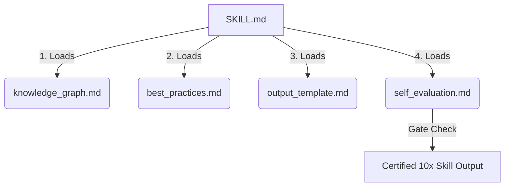

# Knowledge Graph & Ontology (Skill Architecture)

## The Sub-Repo Pattern

A "10x Skill" is NOT a single `SKILL.md` file cluttered with a massive conversational prompt. It is a modular system designed for **Progressive Disclosure**. This architecture protects the agent's limited context window and enforces structured logical thinking.

### Official File Topology

When you create a skill for the user, you must always construct this exact file tree:

```text
agents/skills/[skill-name]/
├── SKILL.md                # Entry point, orchestrator.
└── reference/              # The cognitive "Brain" of the skill.
    ├── knowledge_graph.md  # Domain mapping and conceptual models.
    ├── best_practices.md   # Immutable rules, constraints, edge cases.
    ├── output_template.md  # The exact scaffolding shape of deliverables.
    └── self_evaluation.md  # The rubric for Quality Assurance.
```

## Abstract Representation (Mermaid)


