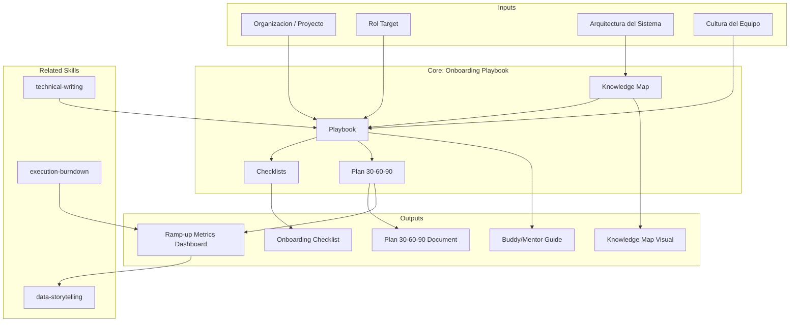

--- [EXPLICIT]
name: metodologia-onboarding-playbook [EXPLICIT]
description:  [EXPLICIT]
  Developer and team onboarding program design, knowledge transfer framework, and ramp-up metrics [EXPLICIT]
  definition. Use when the user asks to "design onboarding program", "create onboarding playbook", [EXPLICIT]
  "plan knowledge transfer", or mentions onboarding checklist, 30-60-90 plan, ramp-up metrics, [EXPLICIT]
  or knowledge map. [EXPLICIT]
argument-hint: "project-or-org role-or-team" [EXPLICIT]
author: Javier Montaño · Comunidad MetodologIA [EXPLICIT]
model: opus
context: fork
allowed-tools:
  - Read
  - Write
  - Edit
  - Glob
  - Grep
  - Bash
  - WebFetch
---

# Playbook de Onboarding

Diseno de programa de onboarding para developers y equipos, framework de transferencia [EXPLICIT]
de conocimiento y definicion de metricas de ramp-up. [EXPLICIT]

## Grounding Guideline

> *A team that does not know where to start loses its first two weeks — and the client's trust.*

1. **Onboarding as investment, not expense.** Every hour invested in a clear playbook saves days of confusion for the receiving team. [EXPLICIT]
2. **Context before tasks.** The team needs to understand the why before the what — without context, tasks are meaningless instructions. [EXPLICIT]
3. **Living document.** A static playbook becomes outdated in the first week — it must evolve with the project. [EXPLICIT]

## TL;DR

- Design structured onboarding program with measurable checkpoints
- Create knowledge map of the system/organization to accelerate ramp-up
- Define 30-60-90 plan with clear objectives and progress metrics
- Establish knowledge transfer framework to reduce tribal knowledge dependency
- Generate reusable checklists per role and experience level

## Inputs

Parse `$1` como **nombre del proyecto/organizacion**, `$2` como **rol o equipo target**. [EXPLICIT]

**Parameters:**
- `{MODO}`: `piloto-auto` (default) | `desatendido` | `supervisado` | `paso-a-paso`
- `{FORMATO}`: `markdown` (default) | `html` | `dual`
- `{VARIANTE}`: `ejecutiva` (~40%) | `tecnica` (full, default)
- `{ROL}`: `developer` (default) | `qa` | `devops` | `lead` | `manager`

## Deliverables

1. **Onboarding Checklist** — Activity list per day/week with owners
2. **Knowledge Map** — Visual map of critical system/organization knowledge
3. **30-60-90 Plan** — Objectives and metrics per period with checkpoints
4. **Knowledge Transfer Framework** — Structured knowledge transfer process
5. **Buddy/Mentor Guide** — Guide for the assigned buddy or mentor

## Process

1. **Critical Knowledge Mapping** — Identify required knowledge per category:
   | Categoria | Ejemplos | Prioridad |
   |---|---|---|
   | Arquitectura | System overview, design decisions, patterns | Semana 1 |
   | Codebase | Estructura, convenciones, key modules | Semana 1-2 |
   | Procesos | Git workflow, PR review, deploy, on-call | Semana 1 |
   | Dominio | Business domain, key concepts, stakeholders | Semana 2-3 |
   | Herramientas | IDE setup, CI/CD, monitoring, communication | Dia 1 |
   | Cultura | Team norms, communication style, decision making | Continuo |
2. **30-60-90 Plan Design**:
   - **30 days (Absorb)**: Complete setup, first commit, meet team, understand architecture
   - **60 days (Contribute)**: Independent features, participate in code reviews, on-call shadow
   - **90 days (Lead)**: Component ownership, mentoring newcomers, improvement proposals
3. **Checklist Creation** — Daily/weekly activities with owner and completion criteria
4. **Knowledge Transfer Framework** — Structure KT sessions:
   - Recorded sessions with prior outline
   - Documentation write-up post-session
   - Practical exercises per session
   - Q&A asincronico documentado
5. **Guia de Buddy/Mentor** — Responsabilidades, cadencia de check-ins, escalation
6. **Metricas de Ramp-up** — Definir indicadores de progreso:
   | Metrica | Target 30d | Target 60d | Target 90d |
   |---|---|---|---|
   | Primer commit productivo | Completado | — | — |
   | PRs mergeados sin rework | — | >70% | >85% |
   | Resolucion de incidentes | Shadow | Con soporte | Independiente |
   | Contribucion a code reviews | Observa | Participa | Lidera |

## Quality Criteria

- [ ] Knowledge map completo con priorizacion temporal
- [ ] Plan 30-60-90 con objetivos SMART por periodo
- [ ] Checklists con responsables y criterios de completitud claros
- [ ] Framework de KT con templates de sesion y follow-up
- [ ] Metricas de ramp-up definidas y medibles
- [ ] Guia de buddy/mentor con responsabilidades explicitas
- [ ] Adaptable por rol (developer, QA, DevOps, lead)

## Assumptions & Limits

- Se asume acceso a al menos 1 persona con conocimiento del sistema para sesiones de KT.
- El programa de onboarding cubre los primeros 90 dias; retenciones posteriores son responsabilidad del equipo.
- Esta skill NO ejecuta el onboarding; genera los artefactos de planificacion y seguimiento.
- Los roles soportados son: developer, QA, DevOps, lead, manager. Roles adicionales requieren extension.

## Edge Cases

| Caso Borde | Estrategia de Manejo |
|---|---|
| Equipo remoto/distribuido sin overlap de horarios | Disenar programa 100% asincrono: videos grabados, documentacion escrita exhaustiva, Q&A asincrono con SLA de 24h. Definir 2 horas minimas de overlap semanal para check-ins criticos. |
| Onboarding masivo (>5 personas simultaneas) | Implementar modelo cohort-based: bootcamp de 1 semana, peer learning entre nuevos integrantes, mentores asignados por ratio 1:3. Crear canal dedicado de preguntas frecuentes. |
| Legacy system sin documentacion ni tests | Sprint 0 de documentacion obligatorio antes del onboarding. Pair programming intensivo con knowledge holders. Priorizar documentar arquitectura y flujos criticos como primer entregable del nuevo integrante. |
| Unico knowledge holder (bus factor = 1) | Priorizar KT de ese conocimiento como urgente. Grabar todas las sesiones. Documentar como riesgo operativo. Disenar plan de redundancia de conocimiento como entregable del onboarding. |

## Decisions & Trade-offs

| Decision | Justificacion | Alternativa Descartada |
|---|---|---|
| Plan 30-60-90 sobre plan libre | Checkpoints definidos permiten medir progreso y detectar problemas temprano. Expectativas claras para ambas partes. | Plan libre: sin estructura medible, dificil detectar bloqueos hasta que es tarde. |
| Knowledge map visual sobre documentacion lineal | Facilita navegacion no secuencial. El nuevo integrante elige su camino segun prioridad. | Documento largo: dificil de navegar, no refleja relaciones entre conceptos. |
| Buddy/mentor asignado sobre soporte organico del equipo | Responsabilidad clara. El nuevo integrante tiene un punto de contacto definido. Reduce friccion de "a quien pregunto". | Soporte organico: diluye responsabilidad, el nuevo queda a la deriva. |

## Knowledge Graph



## Output Templates

### Template 1: Onboarding Playbook (Markdown)

**Filename:** `Onboarding_Playbook_{project}_{rol}_{WIP|Aprobado}.md`

```markdown
# Onboarding Playbook: {project} - {rol}

## TL;DR
{3-5 bullets resumen del programa}

## Knowledge Map
{Mermaid mind map con categorias de conocimiento priorizadas}

## Plan 30-60-90

### Dias 1-30: Absorber
| Semana | Objetivo | Actividades | Criterio de Completitud |
|---|---|---|---|

### Dias 31-60: Contribuir
| Semana | Objetivo | Actividades | Criterio de Completitud |
|---|---|---|---|

### Dias 61-90: Liderar
| Semana | Objetivo | Actividades | Criterio de Completitud |
|---|---|---|---|

## Checklist Dia 1
- [ ] Setup de entorno
- [ ] Accesos y permisos
- [ ] Reunion con buddy/mentor

## Metricas de Ramp-up
| Metrica | Target 30d | Target 60d | Target 90d |
|---|---|---|---|

## Guia del Buddy/Mentor
{Responsabilidades, cadencia de check-ins, escalation}
```

### Template 2: Knowledge Transfer Session Log (Markdown)

**Filename:** `KT_Session_{topic}_{date}_{WIP|Aprobado}.md`

```markdown
# Knowledge Transfer: {topic}

## Metadata
- Fecha: {date}
- Facilitador: {name}
- Asistentes: {list}
- Duracion: {time}

## Outline
{Temas cubiertos con profundidad por tema}

## Key Takeaways
{3-5 puntos criticos documentados}

## Preguntas Pendientes
| Pregunta | Responsable | Fecha Limite |
|---|---|---|

## Ejercicios Practicos
{Actividades para reforzar conocimiento transferido}

## Grabacion
{Link a grabacion si aplica}
```

## Evaluacion

| Dimension | Peso | Criterio |
|---|---|---|
| Trigger Accuracy | 10% | Se activa ante solicitudes de onboarding, KT, ramp-up, 30-60-90, o knowledge map |
| Completeness | 25% | Incluye checklist, knowledge map, plan 30-60-90, guia de buddy, y metricas de ramp-up |
| Clarity | 20% | Objetivos por periodo son SMART; checklists tienen criterio de completitud explicito |
| Robustness | 20% | Adapta programa a diferentes roles, modalidades (remoto/presencial), y volumenes de onboarding |
| Efficiency | 10% | Genera playbook completo con parametros minimos (proyecto + rol) |
| Value Density | 15% | Cada actividad tiene responsable y criterio de exito; cero actividades de relleno |

**Umbral minimo: 7/10**

## Cross-References

- `metodologia-execution-burndown` — Modelo de ramp-up (0.3 / 0.7 / 1.0) alimenta metricas de onboarding
- `metodologia-technical-writing` — Estandar de documentacion para sesiones de KT
- `metodologia-data-storytelling` — Visualizacion de metricas de ramp-up

## Edge Cases

| Escenario | Respuesta |
|---|---|
| Equipo remoto/distribuido | Enfasis en documentacion asincrona, sesiones grabadas, overlap hours |
| Onboarding masivo (>5 personas) | Cohort-based onboarding, bootcamp format, peer learning |
| Legacy system sin documentacion | Sprint 0 de documentacion antes de onboarding, pair programming intensivo |
| Rotacion entre equipos | Playbook modular con base comun + extensiones por equipo |

## Output Artifact

**Primary:** `Onboarding_Playbook_{project}.md` — Checklist, knowledge map, plan 30-60-90.

### HTML (bajo demanda)
- Filename: `{fase}_Onboarding_Playbook_{project}_{WIP}.html`
- Estructura: HTML self-contained branded (Design System MetodologIA v5). Tipo: Light-First Technical. Incluye plan 30-60-90 interactivo con checkboxes, knowledge map visual, y tracker de métricas de ramp-up. WCAG AA, responsive, print-ready.

### DOCX (bajo demanda)
- Filename: `{fase}_onboarding_playbook_{cliente}_{WIP}.docx`
- Generado via python-docx con MetodologIA Design System v5. Portada con nombre del proyecto y rol target, TOC automático, encabezados en Poppins (navy), cuerpo en Trebuchet MS, acentos en gold. Tablas de checklist y plan 30-60-90 con zebra striping. Encabezados y pies de página con branding MetodologIA.

### XLSX (bajo demanda)
- Filename: `{fase}_onboarding_playbook_{cliente}_{WIP}.xlsx`
- Generado via openpyxl con MetodologIA Design System v5. Headers navy con texto blanco Poppins, formato condicional por estado de completitud y periodo (30/60/90 dias), auto-filtros en todas las columnas, valores calculados sin formulas. Hojas: Onboarding Checklist, Plan 30-60-90, Ramp-up Metrics, KT Session Log.

### PPTX (bajo demanda)
- Filename: `{fase}_onboarding_playbook_{cliente}_{WIP}.pptx`
- Generado via python-pptx con MetodologIA Design System v5. Slide master navy gradient, titulos Poppins, cuerpo Trebuchet MS, acentos gold. Max 20 slides variante ejecutiva / 30 variante tecnica. Speaker notes con referencias de evidencia [DOC]/[INFERENCIA]/[SUPUESTO].

### Diagramas (Mermaid)
- Timeline: plan 30-60-90 con milestones
- Mind map: knowledge map del sistema
- Flowchart: proceso de onboarding end-to-end

---
**Autor:** Javier Montaño · Comunidad MetodologIA | **Version:** 1.0.0

## Usage

Example invocations: [EXPLICIT]

- "/onboarding-playbook" — Run the full onboarding playbook workflow
- "onboarding playbook on this project" — Apply to current context

