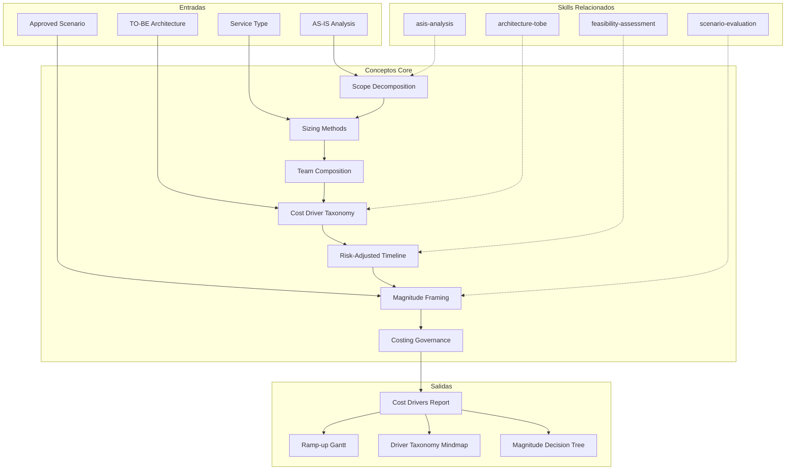

# Cost Estimation: Effort Drivers, Magnitude Indicators & Investment Framing

Translates technical scope into effort drivers, magnitude indicators, team composition models, and
risk-adjusted timeline ranges. Produces structured analysis of WHAT drives cost — not WHAT things cost. [EXPLICIT]
Every output carries explicit disclaimers separating cost identification from pricing decisions. [EXPLICIT]

## Grounding Guideline

**Costing without structure is guessing formatted as a spreadsheet.** This skill imposes analytical discipline on estimation: every driver is identified, every magnitude is triangulated, every assumption is documented. We do not produce prices — we produce the knowledge base that makes informed financial decisions possible.

### Estimation Philosophy

1. **Drivers, not prices.** The value of this skill is not in producing a final number — it is in identifying EVERYTHING that composes that number. Drivers are the truth; the price is a subsequent decision. [EXPLICIT]

2. **Mandatory triangulation.** A single estimation method is an opinion. Two methods are a hypothesis. Three convergent methods are confidence. Always triangulate. [EXPLICIT]

3. **Explicit uncertainty.** Ranges, not points. Scenarios, not certainties. The Cone of Uncertainty is not weakness — it is professional honesty that builds confidence. [EXPLICIT]

## Regla Cardinal

**NUNCA producir valores finales de costo, precio o tarifa.** Este skill identifica CONDUCTORES de
costo, INDUCTORES de esfuerzo, y NOCIONES DE MAGNITUD. [EXPLICIT]

### Costing Philosophy

1. **Costear ≠ Cobrar ≠ Ingresos.** El costeo existe para entender qué cuestan las cosas — completamente
   desconectado de lo que se cobra. El revenue es una decisión comercial posterior e independiente. [EXPLICIT]
   Este skill vive exclusivamente en el dominio del costeo. [EXPLICIT]

2. **Costear para la Excelencia.** El propósito del costeo NO es solo presupuestar — es asegurar calidad,
   excelencia, y un "wow factor" de **hospitalidad irracional**. Cuando sabes lo que las cosas
   verdaderamente cuestan, puedes invertir apropiadamente en calidad. Costear bien = habilitar excelencia. [EXPLICIT]

3. **Margen de innovación = inversión en futuro.** El 5% adicional no es contingencia — es la declaración
   de que la excelencia no es accidental. Es presupuesto deliberado para sorprender al cliente
   positivamente.

La diferencia:

| Este skill PRODUCE | Este skill NO produce |
|---|---|
| "Requiere 3 seniors + 2 mids × 18 meses" | "$1,200,000 USD" |
| "Licenciamiento enterprise tier de {vendor}" | "$45,000/año" |
| "Infra: 3 ambientes × cluster K8s + DB managed" | "$8,500/mes cloud" |
| "Magnitud: proyecto mediano-alto (100-200 FTE-meses)" | "Costo total: $2.3M" |
| "Driver principal: integración con 7 sistemas legacy" | "Integración costará $350K" |

### Disclaimer Obligatorio

Todo output DEBE incluir al pie:

```
DISCLAIMER DE COSTEO
═══════════════════
Este análisis identifica conductores de costo e inductores de esfuerzo. [EXPLICIT]
NO constituye una cotización, presupuesto ni compromiso financiero. [EXPLICIT]
Los valores finales requieren: (1) validación de tarifas vigentes,
(2) negociación comercial, (3) aprobación de alcance definitivo. [EXPLICIT]
Costear ≠ Cobrar. Este documento informa lo primero. [EXPLICIT]
```

### Cone of Uncertainty

Estimates narrow as projects progress. At concept phase: 0.25x-4x. After requirements: 0.67x-1.5x. [EXPLICIT]
After detailed design: 0.8x-1.25x. Communicate ranges, not points. Re-estimate at each phase gate. [EXPLICIT]

## Inputs

Parse `$1` as **project/initiative name**. Detect project context from repo. [EXPLICIT]

**Parameters:**
- `{MODO}`: `piloto-auto` (default) | `desatendido` | `supervisado` | `paso-a-paso`
  - **piloto-auto**: Automático para rutina, HITL para decisiones críticas (selección de magnitud, aprobación de escenarios). Reporta en milestones. [EXPLICIT]
  - **desatendido**: Zero interruptions. Todo auto-resuelto. [EXPLICIT]
  - **supervisado**: Autónomo con reportes en milestones. Preguntas solo ante ambigüedades genuinas. [EXPLICIT]
  - **paso-a-paso**: Confirms before cada sección. [EXPLICIT]
- `{FORMATO}`: `markdown` (default) | `html` | `dual`
- `{VARIANTE}`: `ejecutiva` (~40% — S1 scope + S4 drivers + S6 magnitude) | `técnica` (full 7 sections, default)
- `{TIPO_SERVICIO}`: `SDA` (default) | `QA` | `Management` | `RPA` | `Data-AI` | `Cloud` | `SAS` | `UX-Design`
  - Determines sizing methods, team composition templates, and cost driver categories
  - When omitted, defaults to SDA (backward compatible)

## Delivery Structure: 7 Sections

### S1: Scope Decomposition & Effort Drivers

- WBS: hierarchical decomposition from epic to feature to task
- Feature inventory with complexity classification: simple (<3d), medium (3-10d), complex (10+d)
- **Effort drivers identified**: cada feature con sus inductores de esfuerzo
  - Integración (# sistemas, protocolos, contratos)
  - Migración de datos (volumen, transformación, validación)
  - Compliance/regulatorio (certificaciones, auditorías)
  - Deuda técnica heredada (refactoring requerido)
  - Curva de aprendizaje (stack nuevo, dominio complejo)
- Dependency mapping and scope boundaries

#### Service-Type Scope Templates

When `{TIPO_SERVICIO}` ≠ SDA, use service-appropriate decomposition:

| Service Type | Decomposition Units | Complexity Drivers |
|---|---|---|
| QA | Test suites, automation scripts, environments, test data | Test case count, tool complexity, integration points |
| Management | Workshops, sprints, ceremonies, coaching sessions, deliverables | Team size, methodology complexity, stakeholder count |
| RPA | Processes to automate, bots, integrations, exception handlers | Process steps, decision points, system integrations |
| Data-AI | Pipelines, models, dashboards, data products, governance policies | Data volume, model complexity, source count |
| Cloud | Workloads to migrate, environments, automation scripts, runbooks | Workload complexity (7R), dependency count, compliance needs |
| SAS | Positions to fill, ramp-up plans, knowledge transfer sessions | Role specialization, market scarcity, domain complexity |
| UX-Design | Research studies, wireframes, prototypes, design system components | User complexity, platform count, accessibility requirements |

### S2: Sizing Methods (Magnitud, no Valor)

- T-shirt sizing: S/M/L/XL con rangos de FTE-meses (no dinero)
- Story points calibrados a throughput, no a tarifa
- Reference-class forecasting: comparación con proyectos similares
- Three-point estimation: optimista/probable/pesimista por feature
- COCOMO II: modelo paramétrico por KSLOC/FP (produce esfuerzo-persona, no costo)
- **Triangulación de magnitud**: comparar métodos, flag divergencia >30%
- Output: "Magnitud estimada: X-Y FTE-meses" (NUNCA "costo: $Z")

#### Service-Type Sizing Methods

COCOMO II applies to SDA only. For other service types, use:

- **QA**: Test case complexity scoring (Simple: 0.5h, Medium: 2h, Complex: 8h) × automation factor (manual: 1x, automated: 3x initial + 0.2x ongoing)
- **Management**: Engagement-days model (workshops: 2-5 days, sprint coaching: ongoing FTE, assessment: 5-15 days, transformation: 3-12 months)
- **RPA**: Bot complexity scoring — Simple bot (<10 steps, 1 system): 2-4 weeks; Medium (10-30 steps, 2-3 systems): 4-8 weeks; Complex (>30 steps, 4+ systems): 8-16 weeks
- **Data-AI**: Pipeline complexity (batch: 1-3 weeks, streaming: 3-8 weeks, ML model: 4-16 weeks per iteration, dashboard: 1-4 weeks)
- **Cloud**: Workload migration complexity per 7R (Rehost: 1-2 weeks, Replatform: 2-6 weeks, Refactor: 4-16 weeks per workload)
- **SAS**: Position fill time (standard: 2-4 weeks, specialized: 4-8 weeks, rare: 8-16 weeks) + ramp-up (junior: 8 weeks, mid: 4 weeks, senior: 2 weeks)
- **UX-Design**: Research study (1-3 weeks), wireframe set (1-2 weeks), interactive prototype (2-4 weeks), design system component (0.5-2 weeks)

Universal methods that apply to ALL service types:
- T-shirt sizing (S/M/L/XL)
- Reference-class forecasting
- Three-point estimation (optimistic/probable/pessimistic)

### S3: Team Composition Modeling

- Role mapping: roles requeridos × seniority × % dedicación
- Ramp-up curves: 50% semanas 1-2, 80% semana 4, 100% semana 8
- Communication overhead: Brooks's Law, team topology
- **Driver de equipo**: build vs hire vs contract, onshore vs nearshore vs offshore
- Allocation patterns: full-time vs fractional, specialists time-boxed
- Output: modelo de equipo por fase (roles y cantidades, NO tarifas)
- **Diagrama requerido**: Gantt chart (Mermaid) con timeline de ramp-up del equipo por rol y fase

#### Service-Type Role Templates

| Service Type | Typical Team Composition |
|---|---|
| QA | QA Lead, Test Analysts, Automation Engineers, Performance Testers, Test Manager |
| Management | PM/Scrum Master, Delivery Manager, Agile Coach, Product Owner, UX Specialist |
| RPA | RPA Architect, RPA Developers, Process Analyst, BPMN Analyst, RPA Tester |
| Data-AI | Data Architect, Data Engineers, Data Scientists, ML Engineers, Analytics Engineers, Data Analyst |
| Cloud | Cloud Architect, DevOps Engineers, SREs, Cloud Engineers, DevSecOps Engineer |
| SAS | Talent Acquisition Lead, Technical Interviewer, Onboarding Specialist, Account Manager |
| UX-Design | UX Lead, UX Researcher, UI Designer, Interaction Designer, Accessibility Specialist |

### S4: Cost Driver Taxonomy

**NUEVA SECCIÓN — el corazón del skill evolucionado.**

Identifica y clasifica TODOS los drivers de costo:

| Categoría | Drivers | Cómo Identificar |
|---|---|---|
| **Personal** | # FTEs, seniority mix, duración, ramp-up | Del WBS y modelo de equipo |
| **Licenciamiento** | Vendors, tiers (community/enterprise), periodicidad | Del stack tecnológico AS-IS y TO-BE |
| **Infraestructura** | Ambientes (dev/staging/prod), compute, storage, networking | De arquitectura y deployment |
| **Herramientas** | CI/CD, monitoring, testing, project management | De pipeline DevOps |
| **Training** | Capacitación en stack nuevo, certificaciones | De gap de skills del equipo |
| **Migración** | Volumen de datos, ventanas de migración, rollback | De modelo de datos y SLAs |
| **Compliance** | Auditorías, penetration testing, certificaciones | De regulación de industria |
| **Contingencia** | Known risks (10-15%), unknown-unknowns (15-25%) | Del risk register |
| **Oportunidad** | Costo de NO hacer: deuda acumulada, riesgo operacional | Del AS-IS |

#### Service-Type Specific Drivers

| Service Type | Additional Drivers |
|---|---|
| QA | Test tool licenses (Tricentis, Tosca), test environment provisioning, test data management, ISTQB certification costs |
| Management | Certification costs (PMP, CSM, SAFe), workshop facilitation tools, travel/onsite presence, methodology licensing |
| RPA | Bot platform licenses (UiPath, AA, Power Automate), process mining tools, production bot orchestration infrastructure |
| Data-AI | Data platform licenses (Databricks, Snowflake), GPU compute for training, data labeling, model monitoring tools |
| Cloud | Cloud consumption (pay-as-you-go), migration tooling licenses, multi-cloud management, security tooling |
| SAS | Recruitment platform costs, background check costs, onboarding infrastructure, bench time (between assignments) |
| UX-Design | Design tool licenses (Figma, Sketch), usability testing platforms, research participant incentives, accessibility audit tools |

Por cada driver:
- Nombre y descripción
- Magnitud relativa: Bajo / Medio / Alto / Crítico
- Fase(s) donde impacta
- Owner responsable de validar el valor real

**Diagramas requeridos:**
- Mindmap (Mermaid): visualización de taxonomía de cost drivers por categoría
- Flowchart (Mermaid): árbol de decisión para escenarios de magnitud

### S5: Risk-Adjusted Timeline Ranges

- PERT: (O + 4M + P) / 6 por feature
- Monte Carlo: P50 / P80 / P95 como rangos de duración (no costo)
- Critical path analysis
- Buffer strategy: 20-30% critical path
- Output: "Timeline estimado: X-Y meses (P80)" — sin valor monetario asociado

### S6: Magnitude Framing (replaces Budget Scenarios)

**No produce presupuestos. Produce marcos de magnitud.**

- Clasificación de magnitud del proyecto:
  - Micro (<20 FTE-meses)
  - Pequeño (20-50 FTE-meses)
  - Mediano (50-150 FTE-meses)
  - Grande (150-500 FTE-meses)
  - Enterprise (>500 FTE-meses)
- Rangos por escenario: optimista / probable / pesimista (en FTE-meses)
- Phased funding structure: esfuerzo por fase con gates
- **Indicadores de magnitud comparativa**: "Comparable a un equipo de 8 personas por 18 meses"
- Sensitivity analysis: qué drivers mueven más la aguja
- **Margen de Innovación (5%)**: Toda estimación incluye un 5% de sobre-costo explícitamente
  reservado para invertir en innovación, mejora de experiencia, y mejora continua para
  usuarios/clientes. Este margen NO es contingencia (que se calcula aparte) — es inversión
  deliberada en excelencia y hospitalidad irracional. [EXPLICIT]

### S7: Costing Governance & Disclaimers

- Accuracy tracking framework (estimate vs actual)
- Re-estimation triggers: scope >10%, team change, tech change, risk materialization
- Cognitive bias mitigation: optimism, anchoring, planning fallacy
- **Separación costeo vs cobro**: este skill informa COSTEO (qué recursos se necesitan);
  COBRO (qué se le cobra al cliente) es decisión comercial separada que depende de
  modelo de negocio, margen, estrategia competitiva, y negociación. [EXPLICIT]

## Trade-off Matrix

| Decision | Enables | Constrains | When to Use |
|---|---|---|---|
| **Bottom-up drivers** | Granular, traceable | Time-consuming | Post-discovery |
| **Top-down analogous** | Fast magnitude | Less precise | Pre-discovery |
| **Monte Carlo ranges** | Explicit uncertainty | Needs 3-point estimates | Stakeholder comms |
| **Phased funding** | Risk mitigation | Slower start | High uncertainty |

## Assumptions & Limits

- Identifica drivers y magnitudes, NO produce precios finales
- Scope defined at least to feature level
- Team velocity not transferable between teams
- Costear ≠ Cobrar — este skill no define modelo comercial ni margen

## Edge Cases

| Scenario | Response |
|---|---|
| Client asks for final price | Redirect: "Este análisis identifica drivers. El pricing es decisión comercial separada." |
| Greenfield / no history | Reference-class forecasting. Wider ranges. Flag as high uncertainty. |
| Legacy modernization | +30-50% buffer. Parallel running as driver. |
| Multi-vendor | +15-25% communication overhead driver. |
| Regulatory-heavy | Compliance driver: +20-40% testing effort. |

## Validation Gate

- [ ] WBS with effort drivers identified per feature
- [ ] Multiple sizing methods triangulated (magnitud, not price)
- [ ] Team composition model without rates (roles × quantity × duration)
- [ ] Cost driver taxonomy complete (8+ categories)
- [ ] Timeline ranges with P50/P80/P95
- [ ] Magnitude framing (not budget) with sensitivity analysis
- [ ] Disclaimer de costeo presente
- [ ] Zero final prices in output
- [ ] Margen de innovación 5% incluido (separado de contingencia)
- [ ] Diagramas Mermaid: Gantt (ramp-up), mindmap (drivers), flowchart (escenarios)

## Output Format Protocol

| Format | Default | Description |
|--------|---------|-------------|
| `markdown` | ✅ | Rich Markdown + Mermaid diagrams. Token-efficient. |
| `html` | On demand | Branded HTML (Design System). Visual impact. |
| `dual` | On demand | Both formats. |

Default output is Markdown with embedded Mermaid diagrams. HTML generation requires explicit `{FORMATO}=html` parameter. [EXPLICIT]

## Output Artifact

**Primary:** `06_Cost_Drivers_{TIPO_SERVICIO}_{project}.md` (o `.html` si `{FORMATO}=html|dual`) — Effort drivers, magnitude indicators, team model, timeline ranges, costing governance. Con disclaimer obligatorio.

**Diagramas incluidos:**
- Gantt chart: timeline de ramp-up del equipo
- Mindmap: taxonomía de cost drivers
- Flowchart: árbol de decisión para escenarios de magnitud

## Edge Cases

| Case | Handling Strategy |
|---|---|
| Client asks for final price | Redirect: "This analysis identifies drivers. Pricing is a separate commercial decision." Produce drivers and magnitudes, never prices. |
| Greenfield without history | Reference-class forecasting. Wider ranges. Flag as high uncertainty (Cone of Uncertainty in concept phase: 0.25x-4x). |
| Legacy modernization | +30-50% buffer for undocumented complexity. Parallel running as additional driver. |
| Multi-vendor engagement | +15-25% communication overhead driver. Coordination costs explicit in taxonomy. |
| Regulatory-heavy industry | Compliance driver: +20-40% testing effort. Audits and certifications as separate drivers. |
| Very ambiguous scope (pre-discovery) | Top-down analogous estimation only. Wide ranges with Cone of Uncertainty. Re-estimate post-discovery. |

## Decisions and Trade-offs

| Decision | Discarded Alternative | Justification |
|---|---|---|
| Drivers and magnitudes, NEVER prices | Produce final budget | Costing and charging are separate domains. The skill produces the knowledge base (drivers, inductors, magnitudes). Pricing is a subsequent commercial decision with external variables. |
| Mandatory triangulation (3+ methods) | Single estimation method | One method is opinion. Two are hypothesis. Three convergent are confidence. >30% divergence between methods is a red flag requiring investigation. |
| 5% innovation margin separate from contingency | Contingency only, no innovation margin | The 5% innovation is deliberate investment in excellence and irrational hospitality. It is not contingency (which is calculated separately by risk). |
| Service-type specific sizing methods | COCOMO II for everything | COCOMO II applies only to SDA. QA, RPA, Cloud, Data-AI have fundamentally different sizing units (test cases, bots, workloads, pipelines). |

## Knowledge Graph



## Output Templates

**Formato Markdown (default):**

```
# Cost Drivers: {project} ({TIPO_SERVICIO})
## S1: Scope Decomposition & Effort Drivers
### WBS
### Feature Inventory
| Feature | Complexity | Effort Drivers | Dependencies |
...
## S2: Sizing Methods
### Triangulacion de Magnitud
| Metodo | Resultado (FTE-meses) | Confianza |
...
## S3: Team Composition Model
### Modelo por Fase (roles y cantidades, NO tarifas)
### Gantt de Ramp-up (Mermaid)
## S4: Cost Driver Taxonomy
### Mindmap (Mermaid)
| Categoria | Driver | Magnitud | Fase(s) | Owner |
...
## S5: Risk-Adjusted Timeline
### PERT: P50 / P80 / P95
## S6: Magnitude Framing
### Clasificacion: {micro|pequeno|mediano|grande|enterprise}
### Margen de Innovacion: 5%
## S7: Costing Governance
> DISCLAIMER DE COSTEO
```

**Formato HTML (bajo demanda):**

```
06_Cost_Drivers_{TIPO_SERVICIO}_{project}_{WIP}.html
```
HTML self-contained branded (Design System MetodologIA v5). Light-First Technical. Incluye cost driver taxonomy mindmap interactivo, magnitude framing visual, y Gantt de ramp-up del equipo. WCAG AA, responsive, print-ready. [EXPLICIT]

**Formato XLSX (bajo demanda):**

```
Sheet 1: WBS — epic, feature, task, complexity, effort drivers, dependencies
Sheet 2: Sizing Triangulation — method, result (FTE-months), confidence, divergence
Sheet 3: Team Model — role, seniority, dedication %, phase, quantity (NO rates)
Sheet 4: Cost Driver Taxonomy — category, driver, magnitude, phase, owner
Sheet 5: Timeline — feature, optimistic, probable, pessimistic, PERT, critical path
Sheet 6: Magnitude Scenarios — optimistic, probable, pessimistic (FTE-months)
Sheet 7: Sensitivity Analysis — driver, impact on magnitude, risk level
```

**Formato DOCX (bajo demanda):**

```
06_Cost_Drivers_{TIPO_SERVICIO}_{project}_{WIP}.docx
```
Via python-docx con Design System MetodologIA v5. Cover page, TOC auto, headers/footers branded, tablas zebra. Poppins headings (navy), Trebuchet MS body, gold accents. [EXPLICIT]

**Formato PPTX (bajo demanda):**
- Filename: `{fase}_{entregable}_{cliente}_{WIP}.pptx`
- Via python-pptx con MetodologIA Design System v5. Slide master con gradiente navy, titulos Poppins, cuerpo Trebuchet MS, acentos gold. Max 20 slides (ejecutiva) / 30 slides (tecnica). Speaker notes con referencias de evidencia. Para comites directivos y presentaciones C-level.

## Evaluacion

| Dimension | Peso | Criterio |
|---|---|---|
| Trigger Accuracy | 10% | Activacion correcta ante keywords de cost estimation, effort drivers, sizing, team composition, PERT, Monte Carlo, Phase 4. |
| Completeness | 25% | 7 secciones cubren scope, sizing, team, drivers, timeline, magnitude, y governance. 8+ categorias de drivers. Zero precios en output. |
| Clarity | 20% | Magnitudes en FTE-meses (nunca dinero). Rangos con P50/P80/P95. Disclaimer de costeo presente y claro. |
| Robustness | 20% | Edge cases (precio final solicitado, greenfield, legacy, multi-vendor, regulatory, scope ambiguo) manejados. 8 service types soportados. |
| Efficiency | 10% | Variante ejecutiva reduce a S1+S4+S6 (~40%). Triangulacion flag automatico cuando divergencia >30%. |
| Value Density | 15% | Driver taxonomy accionable (owner por driver). Sensitivity analysis identifica drivers que mas mueven la aguja. Innovation margin 5% explicito. |

**Umbral minimo: 7/10.** Debajo de este umbral, revisar triangulacion de sizing y completeness de driver taxonomy.

---
**Autor:** Javier Montano · Comunidad MetodologIA | **Ultima actualizacion:** 15 de marzo de 2026

## Usage

Example invocations:

- "/cost-estimation" — Run the full cost estimation workflow
- "cost estimation on this project" — Apply to current context

