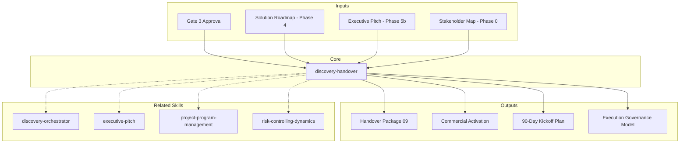

# Discovery Handover — Phase 6: Transition to Execution

Generates the operational transition package that translates discovery deliverables (Phases 0-5) into execution-ready artifacts for Operations and/or Commercial teams. [EXPLICIT]

## Grounding Guideline

**A discovery without a handover is a report filed in a drawer.** The transition from discovery to execution is where value materializes or is lost. Every insight, every risk, every discovery decision must translate into an operational action with an owner, date, and success criteria. The handover is not a summary — it is an activation plan.

### Transition Philosophy

1. **Continuity > documentation.** The handover is not "delivering documents" — it is transferring understanding. Roles change; knowledge is preserved. [EXPLICIT]
2. **Assumptions are debt.** Every unvalidated assumption from discovery is inherited as execution risk. The handover makes them explicit with owners and deadlines. [EXPLICIT]
3. **The first sprint is the most important.** Sprint 0 validates whether the plan survives contact with reality. The handover designs Sprint 0, not just mentions it. [EXPLICIT]

## Inputs (Consumed from Previous Phases)

The handover REQUIRES Gate 3 to be approved. Before generating, validate that the following exist: [EXPLICIT]

| Source | Required Deliverable | Expected File |
|--------|---------------------|------------------|
| Phase 0 | Stakeholder map + RACI | `01_Stakeholder_Map.html` |
| Phase 1 | AS-IS analysis (10 sections) | `03_Analisis_AS-IS.html` |
| Phase 2 | Flow mapping + DDD | `04_Mapeo_Flujos.html` |
| Phase 3 | Scenarios + scoring | `05_Escenarios_ToT.html` |
| Phase 4 | Roadmap + costing | `06_Solution_Roadmap.html` |
| Phase 5a | Functional specification | `07_Especificacion_Funcional.html` |
| Phase 5b | Executive pitch + financial | `08_Pitch_Ejecutivo.html` |

If any deliverable is missing, STOP and list what is missing before proceeding. [EXPLICIT]

**Parameters:**
- `{MODO}`: `piloto-auto` (default) | `desatendido` | `supervisado` | `paso-a-paso`
  - **piloto-auto**: Auto for deliverable compilation and 90-day plan, HITL for pricing validation and owner assignment. [EXPLICIT]
  - **desatendido**: Zero interruptions. Full handover auto-generated. Owners marked as {Assign}. [EXPLICIT]
  - **supervisado**: Autonomous with checkpoint at commercial package and governance. [EXPLICIT]
  - **paso-a-paso**: Confirms each handover section and each owner assignment. [EXPLICIT]
- `{FORMATO}`: `markdown` (default) | `html` | `dual`
- `{VARIANTE}`: `ejecutiva` (~40% — S1 summary + S2 commercial + S6 tracker) | `tecnica` (full 8 sections, default)

## Handover Recipients

The skill must ask the user which is the primary recipient: [EXPLICIT]

| Recipient | Package Focus |
|----------|-------------------|
| **Operations** | Readiness checklist, Phase 1 kickoff, governance, operational risks |
| **Commercial** | Commercial proposal derived from pitch, pricing, sales narrative |
| **Both** | Full package (default) |

## S1: Executive Transition Summary

Synthesize in 1 page maximum: [EXPLICIT]
- **Discovery status**: Phases completed, gates approved, closing date
- **Approved scenario**: Name + final score of the selected scenario (from Phase 3)
- **Approved investment**: Budget range + timeline (from Phase 4/5b)
- **Immediate next steps**: 3-5 actions with owner and deadline (first 2 weeks)
- **Active critical risks**: Top 3 risks inherited from discovery with status

## S2: Commercial Activation Package

Derive from `08_Pitch_Ejecutivo.html`: [EXPLICIT]

### 2.1 Proposal Narrative
- **Client context**: Quantified pain points (from Problem Statement)
- **Value proposition**: 4 pillars (Cost Reduction, Revenue, Risk, Modernization)
- **Differentiators**: Why us vs. alternatives (from Approach Comparison)
- **Simplified financial model**: NPV, IRR, payback in executive format

### 2.2 Pricing Structure
```
┌─────────────────────────────────────────────────────┐
│ PRICING STRUCTURE                                    │
├─────────────────┬──────────┬────────┬───────────────┤
│ Phase           │ Duration │ Team   │ Investment    │
├─────────────────┼──────────┼────────┼───────────────┤
│ Foundation      │ X meses  │ N FTE  │ $XXX,XXX      │
│ Build           │ X meses  │ N FTE  │ $XXX,XXX      │
│ Integrate       │ X meses  │ N FTE  │ $XXX,XXX      │
│ Optimize        │ X meses  │ N FTE  │ $XXX,XXX      │
│ Scale           │ X meses  │ N FTE  │ $XXX,XXX      │
├─────────────────┼──────────┼────────┼───────────────┤
│ TOTAL           │ XX meses │        │ $X,XXX,XXX    │
│ Contingency     │          │        │ XX%           │
└─────────────────┴──────────┴────────┴───────────────┘
```

### 2.3 Commercial Terms
- Billing model: per phase / monthly / milestones
- Investment gates: go/no-go decision points per phase
- Kill criteria: early exit conditions
- Proposed SLAs: response times, quality, governance

### 2.4 Commercial Close Schedule
| Week | Activity | Responsible | Deliverable |
|--------|-----------|-------------|------------|
| 1 | Proposal review with sponsor | Commercial | Proposal v1 |
| 2 | Terms negotiation | Commercial + Legal | Term sheet |
| 3 | Internal approval | Steering | Signed SOW |
| 4 | Operational kick-off | Operations | Phase 1 Plan |

## S3: Operational Readiness Checklist

Map the 9+ prerequisites from the roadmap (Phase 4) to operational tasks: [EXPLICIT]

### 3.1 Team
| Role | Quantity | Status | Hiring Owner | Deadline |
|-----|----------|--------|----------------------|-------------|
| {Role from Phase 4} | N | Pending/Ready | {Name} | {Date} |

### 3.2 Infrastructure
| Component | Specification | Status | Owner | Deadline |
|-----------|----------------|--------|-------|-------------|
| {From AS-IS + Roadmap} | {Specs} | Pending/Ready | {Name} | {Date} |

### 3.3 Access & Permissions
- Source code repositories
- Environments (dev, staging, prod)
- CI/CD tools
- Data and API access
- VPN / remote access

### 3.4 Base Documentation
- [ ] Approved roadmap shared with execution team
- [ ] Functional specification accessible to technical team
- [ ] Risks and mitigations assigned to operational owners
- [ ] Execution RACI (different from discovery RACI) defined
- [ ] Communication channels established (Slack, JIRA, Confluence)

## S4: Kickoff Plan — First 90 Days

Derive from Phase 1 (Foundation) of `06_Solution_Roadmap.html`: [EXPLICIT]

### 4.1 Sprint 0 (Weeks 1-2): Setup
| Day | Activity | Responsible | Output |
|-----|-----------|-------------|--------|
| 1-2 | Technical team onboarding | Delivery Manager | Operational team |
| 3-4 | Dev/staging environment setup | Tech Lead | Environments ready |
| 5 | Target architecture workshop | Architect | Technical decisions |
| 6-7 | CI/CD pipeline configuration | DevOps | Base pipeline |
| 8-10 | First technical spike (highest risk) | Dev Team | PoC validated/invalidated |

### 4.2 Sprint 1-3 (Weeks 3-8): Foundation Execution
- MVP Module #1 (highest value / lowest risk from 3x3 matrix)
- Implement 2-3 core use cases (from Phase 5a)
- Validate 2+ critical business rules (severity CRITICAL)
- First deployment to staging
- Retrospective + velocity adjustment

### 4.3 Sprint 4-6 (Weeks 9-14): Foundation Completion
- Remaining MVP modules
- Integration testing against systems identified in Phase 2
- Performance baseline vs. AS-IS NFRs
- Foundation gate: go/no-go evaluation for Build Phase

### 4.4 Follow-up Metrics (First 90 Days)
| Metric | Target | Source | Frequency |
|---------|--------|--------|-----------|
| Team velocity | Stabilize by Sprint 3 | JIRA/Linear | Weekly |
| Critical defects | 0 in production | Bug tracker | Daily |
| Test coverage | >80% unit, >70% integration | CI pipeline | Per PR |
| Budget burn rate | ≤110% of plan | Finance | Biweekly |
| Materialized risk | 0 of top-3 | Risk register | Weekly |

## S5: Governance Transition Protocol

### 5.1 From Discovery Governance to Execution Governance

| Discovery Role | Transitions to | New Responsible |
|---------------|--------------|-------------------|
| Discovery Conductor | PMO Lead / Scrum Master | {Assign} |
| Technical Architect | Solution Architect (execution) | {Same or new} |
| Domain Analyst | Product Owner / BA | {Assign} |
| Quality Guardian | QA Lead | {Assign} |
| Delivery Manager | Project Manager / Engineering Manager | {Same or new} |
| Data Strategist | Data Architect (execution) | {Same or new} |
| Change Catalyst | Change Manager | {Assign} |

### 5.2 Meeting Structure (Execution)
| Ceremony | Frequency | Participants | Purpose |
|-----------|-----------|---------------|-----------|
| Standup | Daily | Dev team | Impediments + progress |
| Sprint Planning | Biweekly | PO + Dev team | Sprint scope |
| Sprint Review | Biweekly | Stakeholders + Dev | Demo + feedback |
| Retrospective | Biweekly | Dev team | Continuous improvement |
| Steering Committee | Monthly | Sponsors + PMO | Go/no-go, budget, risks |
| Architecture Review | Biweekly | Architects | Technical decisions |

### 5.3 Escalation Path
```
Level 1: Dev Team → Tech Lead (resolution < 4h) [EXPLICIT]
Level 2: Tech Lead → PM / PO (resolution < 24h) [EXPLICIT]
Level 3: PM → Steering Committee (resolution < 1 week) [EXPLICIT]
Level 4: Steering → Executive Sponsor (scope/budget/timeline decisions) [EXPLICIT]
```

## S6: Assumptions & Risks Validation Tracker

Operationalize the pivot points from Phase 4: [EXPLICIT]

### 6.1 Critical Assumptions (from Phase 4 Estimation Pivots)
| # | Assumption | Proposed Validation | Deadline | Owner | Status |
|---|----------|---------------------|----------|-------|--------|
| 1 | {From roadmap} | {PoC / spike / vendor eval} | Week X | {Name} | Pending |
| 2 | ... | ... | ... | ... | ... |

**Rule**: If an assumption is invalidated, activate the conditional switching logic from Phase 3 (alternative scenario).

### 6.2 Inherited Risks (from Phase 4 Risk Register)
| # | Risk | Probability | Impact | Mitigation | Early Warning | Owner |
|---|--------|-------------|---------|-----------|---------------|-------|
| 1 | {From risk register} | High/Medium/Low | High/Medium/Low | {Action} | {Indicator} | {Name} |

**Rule**: Review at each Steering Committee. If early warning triggers, execute immediate mitigation.

### 6.3 Kill Criteria (from Phase 4 Governance)
| Condition | Threshold | Action | Decision Maker |
|-----------|-----------|--------|---------------|
| Budget overrun | >130% of plan | Pause + re-scope | Executive Sponsor |
| Timeline overrun | >150% of Foundation | Re-evaluate approach | Steering Committee |
| Quality failure | >3 critical defects in production | Stop + quality sprint | QA Lead + PM |
| Team attrition | >40% turnover | Pause + re-staff | HR + PM |

## S7: Stakeholder Transition Matrix

Transform the Phase 0 stakeholder map into execution roles: [EXPLICIT]

| Stakeholder | Discovery Role (Phase 0) | Execution Role | Engagement Shift | Communication |
|-------------|------------------------|---------------|-----------------|-------------|
| {Name} | Sponsor | Executive Sponsor | Monthly steering | Dashboard + report |
| {Name} | Champion | Product Owner | Daily/weekly | Sprint reviews |
| {Name} | Informed | Consumer | Per release | Release notes |
| {Name} | Resistant | Early adopter target | Post-MVP | Training + support |

## S8: Final Deliverable

### Output File
`09_Handover_Operaciones_{project}.md` (or `.html` if `{FORMATO}=html|dual`)

### Document Structure
Produce a document with the 8 previous sections, using the brand design system (READ `references/handover-templates.md` for the HTML structure when `{FORMATO}=html|dual`). [EXPLICIT]

## Validation Gate

- [ ] All tables contain real data (no generic placeholders)
- [ ] Owners assigned to all operational tasks
- [ ] Absolute dates (not "Week X" but "2026-04-15")
- [ ] Inherited risks have early warning indicators
- [ ] Kill criteria defined with numeric thresholds
- [ ] Pricing structure complete (if recipient = Commercial or Both)
- [ ] 90-day plan aligned with Phase 1 (Foundation) of roadmap
- [ ] Execution RACI is different from discovery RACI
- [ ] Escalation path documented
- [ ] Ceremony structure defined

## Trade-off Matrix

| Dimension | Option A | Option B | Decision Rule |
|-----------|----------|----------|-------------------|
| Handover scope | Operations only | Commercial + Operations | Both if deal is not closed; Ops only if already signed |
| 90-day detail level | Sprint-level | Week-level | Sprint-level for agile teams; week-level for waterfall |
| Governance | Lightweight (standup + steering) | Full (all ceremonies) | Full if team > 5; lightweight if ≤ 5 |
| Financial tracking | Monthly | Biweekly | Biweekly if budget > $500K; monthly if smaller |
| Stakeholder transition | 1:1 mapping | Transition workshop | Workshop if > 10 stakeholders; mapping if ≤ 10 |

## Edge Cases

| Scenario | Response |
|-----------|----------|
| Gate 3 not approved | DO NOT generate handover. List gaps. |
| Only Quick Reference executed (Phases 1→3→5b) | Simplified handover: S1 + S2 + S6 only. No 90-day plan. |
| Minimal Pipeline (no Phase 0 or 5a) | Omit S7 (no stakeholder map). Simplified S4 without use cases. |
| Client wants commercial proposal only | Generate S1 + S2 only. Mark S3-S7 as "pending post-close". |
| Execution team is different from discovery | Include knowledge transfer session (2-4 hours) in Sprint 0. |
| Multi-vendor execution | Add vendor coordination section in S5 Governance. |

## Assumptions & Limits

- This skill does NOT negotiate commercial terms — it only structures the proposal
- Prices and margins must be validated by the commercial area before sending to the client
- The 90-day plan is a guide — the execution team must adjust during Sprint 0
- Transition roles are suggestions — the final recipient assigns the actual names
- This skill assumes the discovery was executed with the full MetodologIA framework

## Edge Cases

| Case | Handling Strategy |
|---|---|
| Gate 3 not approved but client needs urgent commercial proposal | DO NOT generate full handover. Generate S1 + S2 only with explicit disclaimer that discovery is not closed. List pending gaps as activation conditions. |
| Execution team completely different from discovery team | Include mandatory knowledge transfer session (2-4 hours) in Sprint 0. Document architecture decisions with ADRs. Record walkthrough of key deliverables. |
| Multi-vendor execution with 3+ vendors in the program | Add vendor coordination section in S5 Governance. Define integration contracts between vendors. Establish single point of contact per vendor. Cross-vendor escalation path. |
| Only Quick Reference executed (Phases 1-3-5b) without intermediate phases | Simplified handover: S1 + S2 + S6 only. No 90-day plan (no detailed roadmap). Mark S3-S5, S7 as pending post-commercial close. |

## Decisions & Trade-offs

| Decision | Discarded Alternative | Justification |
|---|---|---|
| 2-week Sprint 0 as mandatory buffer before execution | Start Sprint 1 directly post-handover | Sprint 0 validates whether the plan survives contact with reality. Without environment setup, onboarding and technical spike, Sprint 1 fails due to avoidable impediments. |
| Full governance (all ceremonies) for teams >5 people | Lightweight governance (standup + steering only) | Teams >5 need structure for coordination. Without retrospectives or sprint reviews, the feedback loop breaks and problems accumulate silently. |
| Phase-gate funding over full budget approved upfront | Full program budget approval from the start | Phase-gate reduces client financial risk. Kill criteria at each gate allow controlled exit. Upfront budget creates commitment without results validation. |

## Knowledge Graph



## Output Templates

**MD format (default):**
```
# Operations Handover: {project_name}
## S1: Executive Transition Summary
  - Discovery status, approved scenario, investment
## S2: Commercial Activation Package
  - Narrative, pricing structure, terms, close schedule
## S3: Operational Readiness Checklist
  - Team, infrastructure, access, documentation
## S4: Kickoff Plan — First 90 Days
  - Sprint 0, Sprints 1-3, Sprints 4-6, metrics
## S5-S8: [remaining sections]
```

**DOCX format (secondary):**
- Formal document with branding for client signature
- Auto-generated table of contents
- Sections with numbered headers and approval signatures
- Annex: commercial close schedule as editable table

**HTML format (on demand):**
- Filename: `09_Handover_Operaciones_{project}_{WIP}.html`
- Structure: Self-contained branded HTML (Design System MetodologIA v5). Dark-First Executive. Includes 90-day plan Gantt (Mermaid CDN), interactive operational readiness checklist, and assumption tracker with traffic-light indicators. WCAG AA, responsive, print-ready.

**XLSX format (on demand):**
- Filename: `{phase}_{deliverable}_{client}_{WIP}.xlsx`
- Generated via openpyxl with MetodologIA Design System v5. Headers with navy background and white Poppins text, conditional formatting by status (Pending/In Progress/Ready), auto-filters on all columns, calculated values (no formulas). Sheets: Operational Readiness Checklist, 90-Day Kickoff Plan (sprint by sprint), Assumption & Risk Tracker, Stakeholder Transition Matrix.

**PPTX format (on demand):**
- Filename: `{phase}_{deliverable}_{client}_{WIP}.pptx`
- Generated via python-pptx with MetodologIA Design System v5. Slide master with navy gradient, Poppins titles, Trebuchet MS body, gold accents. Max 20 slides executive / 30 technical. Speaker notes with evidence references. Sections: Executive Transition Summary, Commercial Activation Package, Operational Readiness Checklist, 90-Day Kickoff Plan, Governance & Escalation, Risks & Assumptions Tracker.

## Evaluation

| Dimension | Weight | Criterion | Minimum Threshold |
|---|---|---|---|
| Trigger Accuracy | 10% | Skill activates correctly on mentions of handover, transition, kickoff, discovery close-out | 7/10 |
| Completeness | 25% | All 8 sections cover executive transition, commercial, operational, governance, and tracking | 7/10 |
| Clarity | 20% | Owners assigned to all tasks. Absolute dates. Execution RACI differentiated from discovery RACI. | 7/10 |
| Robustness | 20% | Kill criteria with numeric thresholds. Early warning indicators for inherited risks. Rollback path documented. | 7/10 |
| Efficiency | 10% | Output proportional to recipient (Ops, Commercial, Both). No redundant sections with previous deliverables. | 7/10 |
| Value Density | 15% | 90-day plan with day-by-day activities in Sprint 0. Follow-up metrics with concrete targets. | 7/10 |

**Global minimum threshold:** 7/10. Deliverables below this require re-work before delivery.

## Output Format Protocol

| Format | Default | Description |
|--------|---------|-------------|
| `markdown` | ✅ | Rich Markdown + Mermaid diagrams. Token-efficient. |
| `html` | On demand | Branded HTML (Design System). Visual impact. |
| `dual` | On demand | Both formats. |

Default output is Markdown with embedded Mermaid diagrams. HTML generation requires explicit `{FORMATO}=html` parameter. [EXPLICIT]

## Output Artifact

**Primary:** `09_Handover_Operaciones_{project}.md` (or `.html` if `{FORMATO}=html|dual`) — Executive transition summary, commercial activation package, operational readiness checklist, 90-day kickoff plan, governance transition, assumption tracker, stakeholder transition matrix.

**Included diagrams:**
- Flowchart: governance and escalation flow
- Gantt chart: 90-day plan (first month week-by-week)
- State diagram: discovery-to-execution transition lifecycle

---
**Author:** Javier Montano | **Last updated:** March 12, 2026

## Usage

Example invocations: [EXPLICIT]

- "/discovery-handover" — Run the full discovery handover workflow
- "discovery handover on this project" — Apply to current context

