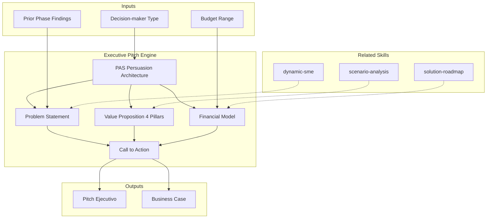

# Executive Pitch & Business Case

Generates C-level presentations with quantified problem statements, 4-pillar value propositions, 3-option comparison analysis, investment summaries with financial models (NPV, IRR, payback), and decision frameworks. Uses Problem-Agitate-Solve (PAS) persuasion architecture. [EXPLICIT]

## Grounding Guideline

**A pitch without numbers is an opinion. A pitch without urgency is a report.** The executive pitch transforms months of technical analysis into a decision narrative that a C-level can approve in 30 minutes. Every slide, every data point, every visual has a single purpose: for the decision-maker to say "yes" with confidence.

### Executive Persuasion Philosophy

1. **Data > opinions.** Every assertion carries a number. Every number carries a source or explicit assumption. Without numbers there is no credibility. [EXPLICIT]
2. **Cost of inaction > cost of action.** The anchor is not the price — it is what happens if you do NOT act. Urgency is not declared; it is demonstrated with the inaction burn rate. [EXPLICIT]
3. **Options, not mandates.** 3 options with clear trade-offs. The decision-maker chooses — the consultant recommends with evidence, not pressure. [EXPLICIT]

## Inputs

- `$1` — Decision-maker type: `cfo`, `cto`, `ceo`, `board` (default: `ceo`)
- `$2` — Budget range indicator: `under1m`, `1m-5m`, `over5m` (default: `1m-5m`)

Parse from `$ARGUMENTS`. Adapts emphasis based on audience. [EXPLICIT]

**Parameters:**
- `{MODO}`: `piloto-auto` (default) | `desatendido` | `supervisado` | `paso-a-paso`
  - **piloto-auto**: Auto para construcción de narrativa y modelado financiero, HITL para validación de claims y call to action. [EXPLICIT]
  - **desatendido**: Zero interruptions. Pitch completo auto-generado. Assumptions documented. [EXPLICIT]
  - **supervisado**: Autónomo con checkpoint en financial model y call to action. [EXPLICIT]
  - **paso-a-paso**: Confirma problem statement, cada value pillar, financial model, y call to action. [EXPLICIT]
- `{FORMATO}`: `markdown` (default) | `html` | `dual`
- `{VARIANTE}`: `ejecutiva` (~40% — S1 hero + S5 investment + S6 call to action) | `técnica` (full 7 sections, default)

## Conditional Logic by Audience

```
IF decision-maker is CFO:
  -> Lead with financial case: NPV, IRR, payback, cost avoidance
  -> Minimize technical detail; focus on financial metrics

IF decision-maker is CTO:
  -> Lead with technical modernization and risk reduction
  -> Include architecture summary; tech debt elimination path

IF decision-maker is CEO:
  -> Lead with strategic alignment and competitive advantage
  -> Market positioning, capability expansion, board-ready narrative

IF decision-maker is Board:
  -> Lead with governance, fiduciary responsibility, risk-adjusted ROI
  -> Include sensitivity analysis and worst-case scenarios

IF budget > $1M:
  -> Add sensitivity analysis: +/-20% cost, +/-10% timeline variance
  -> Include phased funding gates

IF budget > $5M:
  -> Add board-level governance section
  -> Quarterly re-calibration gates mandatory
  -> Kill criteria explicit per phase
```

## Financial Modeling

- **NPV:** Sum[(Year N benefit - Year N cost) / (1 + discount_rate)^N]. Discount rate: 10-15% for enterprise tech.
- **IRR:** Internal rate of return where NPV = 0. Target >25% for 3-year payback.
- **Payback Period:** Months until cumulative benefits = cumulative costs. Target <12 months.
- **Sensitivity Analysis:** +/-20% cost variance and +/-10% benefit variance on payback/NPV.
- **Break-Even:** What adoption rate or efficiency gain needed to break even.

Every financial input must cite its source or state its assumption explicitly. [EXPLICIT]

## Persuasion Architecture (PAS)

1. **Problem:** Quantified pain metrics (current state numbers)
2. **Agitate:** Emotional impact + cost of inaction (monthly burn rate of inaction)
3. **Solve:** Proposed solution with clear benefits and ROI

**Anchoring:** Show worst-case first (inaction cost), then recommended option.
**Social proof:** Industry benchmarks, peer company results.
**Urgency:** Cost of delay quantified per month.

## 7-Section Delivery Structure

### Section 1: Executive Summary (Hero)
3-4 hero KPIs: Cost Savings, Timeline, ROI Payback, Risk Reduction. 150-word narrative: opportunity, urgency, recommendation. [EXPLICIT]

### Section 2: Problem Statement & Current Pain
Business impact metrics table (current vs target vs gap vs annual impact). Pain points severity-rated (CRITICAL/HIGH/MEDIUM). Root cause analysis (technical, process, resource). Cost of inaction table (3-year projection). [EXPLICIT]

### Section 3: Strategic Value — 4-Pillar Proposition
Four value cards: Cost Reduction, Revenue Acceleration, Risk Mitigation, Technical Modernization. Each with metric, mechanism, ROI timeline, Year 1 impact. Cumulative 3-year financial metrics (TCO, NPV, IRR, payback). [EXPLICIT]

### Section 4: Approach Comparison (3+ Options)
Comparison matrix: Do Nothing vs Alternative vs Recommended. Dimensions: upfront cost, annual cost, 3-year TCO, payback, risk reduction, tech debt, scalability, compliance, velocity, implementation risk. Each option with pros/cons/outcome/financial impact. [EXPLICIT]

### Section 5: Investment Summary
Timeline and team table. Budget breakdown card (services, infrastructure, contingency, monthly burn). Phased investment table with gates. [EXPLICIT]

### Section 6: Call to Action & Decision Framework
What we ask for (approach, budget range, timeline, decision deadline). Approval checklist (CFO, CTO, business sponsor, steering). Next steps timeline (week-by-week post-approval). Cost of delay (monthly consequences). [EXPLICIT]

### Section 7: Risk Assessment & Mitigation
Risk table: probability, impact, mitigation, owner. Linked to findings from prior analysis phases. [EXPLICIT]

## Edge Cases

- **No CFO exists:** Lead with operational metrics (time savings, reduced risk) not NPV.
- **Budget pre-approved:** Skip financial justification; focus on execution confidence.
- **Competitor actively pitching:** Add competitive urgency section.
- **Multiple conflicting decision-makers:** Generate value cards per stakeholder concern.
- **Non-technical executive audience:** Zero jargon; business outcomes only; no architecture diagrams.
- **No prior phases completed:** Use industry benchmarks for all metrics; flag everything as estimated.
- **Tiny budget (<$200K):** Simplify to 3-section pitch (problem, solution, ask). Skip sensitivity analysis.

## Trade-off Matrix

| Decision | Option A | Option B | When to Choose A | When to Choose B |
|----------|----------|----------|------------------|------------------|
| **Length** | 3-page executive summary | 15-page full business case | Time-constrained C-level; board pre-read | CFO deep-dive; formal procurement process |
| **Projections** | Aggressive (best-case) | Conservative (worst-case) | Competitive pitch; need to win mindshare | Risk-averse board; regulated industry |
| **Tone** | Push (prescriptive "do this") | Pull (consultative options) | Single decision-maker; clear mandate | Multiple stakeholders; consensus culture |
| **Financial depth** | Summary metrics (NPV, payback) | Full model (sensitivity, Monte Carlo) | CEO/CTO audience; budget < $1M | CFO/Board audience; budget > $5M |

## Assumptions & Limits

- Financial inputs (current costs, savings projections) sourced from prior phases or stated as assumptions
- NPV/IRR calculations use stated discount rate; sensitivity analysis covers variance
- Cannot replace financial auditor review for actual investment decisions
- Persuasion architecture is ethical: no misleading data, no false urgency, no suppressed risks
- Audience-specific framing adjusts emphasis, not facts

## Output Artifact

- `06_Pitch_Ejecutivo_Deep.{md|html}` — Executive pitch narrative (7-section or variante ejecutiva)
- `06b_Business_Case_Deep.{md|html}` — Detailed financial analysis with full sensitivity model
- Format determined by `{FORMATO}` parameter; default is Markdown

## Validation Gate

- [ ] Problem statement quantified with 3+ metrics (current to target with gap %)
- [ ] Financial impact calculated (annual cost of inaction, 3-year TCO, payback period)
- [ ] Value proposition across 4 pillars with specific metrics per pillar
- [ ] 3+ options compared with financial comparison
- [ ] Recommendation clear and strongly positioned with rationale
- [ ] Investment summary shows timeline, team, budget breakdown, phased funding gates
- [ ] Financial assumptions documented and justified; sources cited
- [ ] Sensitivity analysis for budgets >$1M
- [ ] Call to action names decision maker, deadline, and consequences of delay
- [ ] PAS framework applied (problem to agitate to solve)
- [ ] Every claim has a number; every number has a source or stated assumption

## Output Format Protocol

| Format | Default | Description |
|--------|---------|-------------|
| `markdown` | ✅ | Rich Markdown + Mermaid diagrams. Token-efficient. |
| `html` | On demand | Branded HTML (Design System). Visual impact. |
| `dual` | On demand | Both formats. |

Default output is Markdown with embedded Mermaid diagrams. HTML generation requires explicit `{FORMATO}=html` parameter. [EXPLICIT]

### Diagrams (Mermaid)
- Mindmap: 4 value pillars with key metrics
- Gantt chart: investment timeline by phase

## Edge Cases

| Case | Handling Strategy |
|------|---------------------|
| No financial data from prior phases available; all metrics must be estimated | Use industry benchmarks for all projections; tag every figure as [SUPUESTO]; add sensitivity analysis with wider variance bands (+/-30%) |
| Decision-maker changes between pitch preparation and presentation (e.g., CFO replaced by CTO) | Re-run audience conditional logic; restructure lead section and emphasis; preserve financial model but shift narrative framing |
| Client explicitly forbids ROI/NPV claims ("we don't trust projections") | Pivot to qualitative value narrative: risk reduction, capability uplift, competitive positioning; present cost as magnitude ranges only |
| Budget is pre-approved but scope is contested among multiple sponsors | Skip financial justification sections; focus on scope alignment via 3-option comparison; add stakeholder concern mapping per option |

## Decisions & Trade-offs

| Decision | Discarded Alternative | Justification |
|----------|----------------------|---------------|
| Use Problem-Agitate-Solve (PAS) as default persuasion architecture | AIDA (Attention-Interest-Desire-Action) or Minto Pyramid | PAS anchors on cost of inaction, which resonates strongest with C-level budget decisions; AIDA is better for marketing, Minto for analytical reports |
| Always present 3 options (Do Nothing vs Alternative vs Recommended) | Present single recommended option | Multiple options give the decision-maker agency; single-option pitches feel prescriptive and trigger resistance in consensus-driven cultures |
| Lead with audience-specific framing (CFO: financial, CTO: technical) | One-size-fits-all executive summary | Audience-specific framing increases hit rate by matching the decision-maker's primary evaluation lens; generic summaries dilute impact |

## Knowledge Graph



## Output Templates

### Markdown (default)
- Filename: `06_Pitch_Ejecutivo_{cliente}_{WIP}.md`
- Structure: TL;DR > 7-section narrative > Mermaid mindmap (value pillars) > Mermaid Gantt (investment timeline) > ghost menu

### PPTX
- Filename: `06_Pitch_Ejecutivo_{cliente}_{WIP}.pptx`
- Structure: Title slide > Hero KPIs > Problem Statement > Value Pillars > Option Comparison > Investment Summary > Call to Action > Risk Appendix; 1 message per slide; speaker notes with evidence references

### HTML (bajo demanda)
- Filename: `06_Pitch_Ejecutivo_{cliente}_{WIP}.html`
- Estructura: HTML self-contained branded (Design System MetodologIA v5). Dark-First Executive page con hero KPIs animados, financial model interactivo, y 3-option comparison visual. WCAG AA, responsive, print-ready.

### DOCX (bajo demanda)
- Filename: `06_Pitch_Ejecutivo_{cliente}_{WIP}.docx`
- Generado con python-docx bajo MetodologIA Design System v5: portada, TOC automático, encabezados/pies de página con marca, tablas zebra, tipografía Poppins (headings navy), Trebuchet MS (body), acentos dorados

### XLSX (bajo demanda)
- Filename: `{fase}_{entregable}_{cliente}_{WIP}.xlsx`
- Generado via openpyxl con MetodologIA Design System v5. Encabezados con fondo navy y texto blanco Poppins, formato condicional por impacto financiero y nivel de riesgo, auto-filtros en todas las columnas, valores calculados (sin fórmulas). Hojas: Financial Model (NPV/IRR/Payback pre-calculados), 3-Option Comparison Matrix, Investment Timeline by Phase, Risk Assessment Register.

## Evaluacion

| Dimension | Peso | Criterio |
|-----------|------|----------|
| Trigger Accuracy | 10% | Descripcion activa triggers correctos sin falsos positivos |
| Completeness | 25% | Todos los entregables cubren el dominio sin huecos |
| Clarity | 20% | Instrucciones ejecutables sin ambiguedad |
| Robustness | 20% | Maneja edge cases y variantes de input |
| Efficiency | 10% | Proceso no tiene pasos redundantes |
| Value Density | 15% | Cada seccion aporta valor practico directo |

**Umbral minimo**: 7/10 en cada dimension para considerar el skill production-ready.

---
**Autor:** Javier Montaño | **Ultima actualizacion:** 15 de marzo de 2026

## Usage

Example invocations:

- "/executive-pitch" — Run the full executive pitch workflow
- "executive pitch on this project" — Apply to current context

