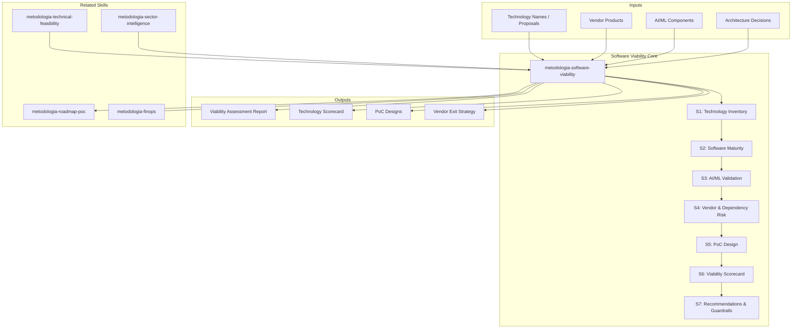

# Service & Technology Viability: Substance vs Smoke Validator

Forensic validation of whether proposed software solutions, technology choices, and AI/ML [EXPLICIT]
components are viable, mature, and fit-for-purpose — or speculative, overhyped, and risky. [EXPLICIT]
This is NOT the multidimensional feasibility analysis (technical-feasibility covers that). [EXPLICIT]
This is a **devoted, deep-cut software validator** that operates at the level of code, APIs, [EXPLICIT]
vendor maturity, community health, and real-world production evidence. [EXPLICIT]

> **Universal scope:** This skill validates viability of software technologies (SDA), automation platforms (RPA), testing tools (QA), management frameworks (Management), data platforms (Data-AI), cloud services (Cloud), and any technological or methodological component proposed in a services engagement.

## Grounding Guideline

**Everything in software is a promise until proven in production.** This skill separates verifiable promises from smoke. It uses first-hand evidence: executable code, documented APIs, reproducible benchmarks, public postmortems, adoption data. It does NOT use: marketing decks, vendor feature comparison tables, non-reproducible demos.

### Software Validation Philosophy

1. **Evidence > narrative.** A reproducible benchmark is worth more than ten customer testimonials. If evidence does not exist, the verdict is provisional — and documented as such. [EXPLICIT]
2. **Smoke is detected in the details.** Vague claims ("state of the art", "enterprise-grade", "AI-powered") without specific metrics, documented datasets, or verifiable production cases are smoke signals until proven otherwise. [EXPLICIT]
3. **Viability is contextual.** A technology can be SUBSTANCE for a team with experience and HIGH RISK for another without it. The verdict is always issued in the context of the project, the team, and the specific constraints. [EXPLICIT]

Escala de veredicto: [EXPLICIT]
- 🟢 **SUBSTANCIA** — producción comprobada, comunidad activa, API estable
- 🟡 **PROMESA VIABLE** — early stage pero con fundamentos sólidos
- 🟠 **RIESGO ALTO** — dependencia de vendor, lock-in, roadmap incierto
- 🔴 **HUMO** — vaporware, hype sin producción, claims no verificables

## Inputs

Parse `$1` as **project name**, `$2` as **technology/solution to validate**. [EXPLICIT]
Accepts: technology names, vendor products, AI/ML proposals, architectural patterns, library choices. [EXPLICIT]

**Parameters:**
- `{MODO}`: `piloto-auto` (default) | `desatendido` | `supervisado` | `paso-a-paso`
  - **piloto-auto**: Auto para inventario y análisis de madurez, HITL para veredictos de AI/ML y evaluación de vendors. [EXPLICIT]
  - **desatendido**: Zero interruptions. Scorecard generado automáticamente. Assumptions documented. [EXPLICIT]
  - **supervisado**: Autónomo con checkpoint en scorecard antes de entrega. [EXPLICIT]
  - **paso-a-paso**: Confirma cada tecnología evaluada, cada score, y el veredicto global. [EXPLICIT]
- `{FORMATO}`: `markdown` (default) | `html` | `dual`
- `{VARIANTE}`: `ejecutiva` (~40% — S1 inventory + S6 scorecard only) | `técnica` (full forensic analysis, default)
- `{TIPO_SERVICIO}`: `SDA` (default) | `QA` | `Management` | `RPA` | `Data-AI` | `Cloud` | `SAS` | `UX-Design`
  - Determines the validation lens and evidence sources

### Service-Type Validation Lenses

The SUBSTANCIA/PROMESA/RIESGO/HUMO scale applies universally. What changes is WHAT gets validated: [EXPLICIT]

| Service Type | What Gets Validated | Key Evidence Sources |
|---|---|---|
| SDA | Languages, frameworks, libraries, architectural patterns | GitHub stars, npm downloads, Stack Overflow activity, CVE database, production case studies |
| QA | Testing tools, automation frameworks, test management platforms | Gartner MQ, analyst reports, community adoption, plugin ecosystem, CI/CD integrations |
| Management | Methodologies (SAFe, DAD, LeSS), PM tools, governance frameworks | Industry adoption rates, certification body health, community activity, case studies |
| RPA | RPA platforms (UiPath, AA, Power Automate, Blue Prism), process mining tools | Gartner MQ, Forrester Wave, vendor financials, community size, partner ecosystem |
| Data-AI | Data platforms (Databricks, Snowflake), ML frameworks, AI models | Benchmarks, academic citations, production deployments, vendor trajectory, open-source health |
| Cloud | Cloud services, migration tools, IaC tools, observability platforms | Cloud provider roadmaps, service maturity, regional availability, compliance certifications |
| SAS | Talent platforms, assessment tools, onboarding systems | Market adoption, integration capabilities, candidate experience ratings |
| UX-Design | Design tools (Figma, Sketch), research platforms, prototyping tools | Market share, plugin ecosystem, collaboration features, enterprise adoption |

## Delivery Structure: 7 Sections

### S1: Technology Inventory & Claim Extraction

Para cada tecnología, framework, vendor, o componente AI/ML propuesto: [EXPLICIT]

| Tecnología | Claim | Fuente del Claim | Evidencia Requerida |
|---|---|---|---|
| {Vendor X AI Platform} | "Reduce development time 50%" | Vendor deck Phase 3 | Production case studies, benchmark |
| {Framework Y} | "Handles 100K rps" | Architecture decision | Load test results, community benchmarks |
| {LLM Integration} | "Automates 80% of workflows" | Scenario B | Pilot results, accuracy metrics |

### S2: Software Maturity Assessment

Por cada pieza de software evaluada: [EXPLICIT]

**2a. Lifecycle Stage**
| Indicador | Qué Buscar | Dónde |
|---|---|---|
| Version | >=1.0 = GA; <1.0 = pre-production; 0.x = experimental | GitHub releases, docs |
| Release cadence | Regular = healthy; erratic = risk | Release notes timeline |
| Breaking changes | Frequent = immature API; rare = stable | Changelogs, migration guides |
| Deprecation policy | Exists = mature; absent = risky | Documentation |
| LTS availability | Available = enterprise-ready; absent = risk | Release policy |

**2b. Community Health**
| Métrica | 🟢 Healthy | 🟠 Warning | 🔴 Risk |
|---|---|---|---|
| GitHub stars | >5K | 1K-5K | <1K |
| Contributors (12mo) | >50 | 10-50 | <10 |
| Open issues / closed ratio | <30% open | 30-60% | >60% |
| Last commit | <30 days | 30-90 days | >90 days |
| Bus factor | >5 maintainers | 2-5 | 1 (single point of failure) |
| Corporate backing | Major sponsor | Startup backed | Individual project |

**2c. Production Evidence**
- Known production users (verifiable, not "trusted by X")
- Public postmortems or case studies
- Stack Overflow activity (questions per month, answer rate)
- Dependency count in npm/Maven/PyPI (who depends on this?)

### S3: AI/ML Specific Validation

**SECCIÓN CRÍTICA — la IA es el campo con mayor ratio humo/substancia.**

Para cada componente AI/ML propuesto: [EXPLICIT]

**3a. Claims vs Reality Matrix**
| Claim | Benchmark Citado | Benchmark Real | Gap | Veredicto |
|---|---|---|---|---|
| "95% accuracy" | Vendor demo | Academic paper on similar task: 72-85% | 10-23% gap | 🟠 RIESGO |
| "Real-time inference" | Marketing | p95 latency in benchmarks: 2.3s | Depends on SLA | 🟡 VIABLE |

**3b. AI Maturity Indicators**
| Indicador | Sustancia | Humo |
|---|---|---|
| Training data | Documented, versioned, representative | "Proprietary" sin detalles |
| Evaluation metrics | Multiple metrics, test set documented | Single accuracy number |
| Failure modes | Documented, graceful degradation | "Works great" sin edge cases |
| Drift monitoring | Built-in, documented | No mention |
| Human-in-the-loop | Designed for it | Fully autonomous claims |
| Explainability | Interpretable outputs | Black box |
| Cost per inference | Documented | Hidden or "contact sales" |
| Data privacy | Clear data handling policy | Vague "we take privacy seriously" |

**3c. LLM-Specific Red Flags** (si aplica)
- Hallucination rate not disclosed → 🔴
- No eval framework for domain-specific accuracy → 🟠
- "Fine-tuned" without documented training data → 🟠
- Claimed automation rate without error analysis → 🔴
- No fallback for model failure/outage → 🔴
- Vendor lock-in on model (no portability) → 🟠

### S4: Vendor & Dependency Risk

**4a. Vendor Viability**
| Factor | Assessment |
|---|---|
| Funding / Revenue | Public financial data, funding rounds, runway |
| Customer retention | NRR if available, churn indicators |
| Competitive position | Market share, differentiation, moat |
| Acquisition risk | Likely acquirer? Product continuity post-acquisition? |
| Pricing model stability | History of price changes, lock-in mechanisms |

**4b. Dependency Chain Analysis**
- Direct dependencies: count, maintenance status, license compatibility
- Transitive dependencies: depth of tree, known vulnerabilities
- Lock-in assessment: cost of switching to alternative
- Supply chain risk: dependencies with single maintainer

### S5: Proof-of-Concept Design

Para cada tecnología con veredicto 🟡 o 🟠, diseña un PoC mínimo: [EXPLICIT]

| Tecnología | PoC Objective | Success Criteria | Effort | Timeline |
|---|---|---|---|---|
| {AI Platform} | Validate accuracy on real data | >85% on 100 production samples | 1 sprint | Sprint 0 |
| {Framework Y} | Load test with production-like data | >50K rps at p99 <200ms | 3 days | Sprint 0 |

Cada PoC debe: [EXPLICIT]
- Usar datos reales (no demo data)
- Medir contra criteria del proyecto (no benchmarks genéricos)
- Tener kill criteria: "Si < X, descartamos esta tecnología"

### S6: Technology Viability Scorecard

```
SOFTWARE VIABILITY SCORECARD
════════════════════════════
Proyecto: {nombre} [EXPLICIT]

| Tecnología | Maturity | Community | Production | AI Score | Vendor | VEREDICTO |
|---|---|---|---|---|---|---|
| {Tech A} | 4/5 | 4/5 | 5/5 | n/a | 4/5 | 🟢 SUBSTANCIA |
| {AI Tool B} | 2/5 | 3/5 | 2/5 | 2/5 | 3/5 | 🟠 RIESGO ALTO |
| {Framework C} | 3/5 | 4/5 | 3/5 | n/a | 5/5 | 🟡 PROMESA VIABLE |

VEREDICTO GLOBAL: [VIABLE / VIABLE CON PoCs / REQUIERE ALTERNATIVAS / NO VIABLE]

ALTERNATIVAS IDENTIFICADAS:
- {AI Tool B} → alternativa: {Open Source X} (🟢 en community, 🟡 en features)

SPIKES OBLIGATORIOS: [N]
TECNOLOGÍAS DESCARTADAS: [lista]
```

### S7: Recommendation & Guardrails

- Stack recomendado con justificación por componente
- Guardrails: qué monitorear en producción para detectar degradación temprana
- Vendor exit strategy: plan de migración si un vendor falla
- AI governance: si hay componentes AI, framework de monitoreo y compliance
- Re-evaluation triggers: cuándo re-ejecutar esta validación

## Trade-off Matrix

| Decision | Enables | Constrains | When to Use |
|---|---|---|---|
| Full stack validation | Maximum confidence | 3-5 days | Pre-commitment, large investment |
| AI-only validation | Focused on highest risk | Misses infra risks | AI-heavy proposals |
| Vendor comparison | Objective selection | Needs market research | Multiple vendor options |
| PoC-first approach | Evidence-based decisions | Delays commitment | Unproven technologies |

## Assumptions & Limits

- WebFetch available for public data (GitHub, docs, benchmarks); gated content requires user provision
- AI evaluation limited to publicly verifiable claims; proprietary model internals not accessible
- Vendor financial assessment limited to public information
- Cannot execute actual PoCs — designs them; execution is Sprint 0 work

## Edge Cases

| Scenario | Response |
|---|---|
| Vendor provides only marketing materials | Flag as 🟠 minimum. Request technical docs, API reference, benchmark methodology |
| Technology is < 6 months old | Automatic 🟡 ceiling. Cannot be 🟢 without production evidence |
| AI claims "state of the art" | Verify against published benchmarks (papers, leaderboards). Discount by domain gap |
| Open source with no corporate backing | Assess bus factor and funding sustainability. Flag if bus factor = 1 |
| Client already committed to vendor | Still validate — document risks for risk register, design guardrails |

## Edge Cases

| Case | Handling Strategy |
|------|---------------------|
| Vendor provee exclusivamente materiales de marketing sin documentacion tecnica | Flag como RIESGO ALTO minimo; solicitar API reference, benchmark methodology, production case studies; si no proporcionan, el veredicto no puede ser mejor que PROMESA VIABLE |
| Tecnologia tiene menos de 6 meses de existencia | Techo automatico de PROMESA VIABLE; no puede ser SUBSTANCIA sin evidencia de produccion; disenar PoC obligatorio con kill criteria |
| Cliente ya comprometido contractualmente con un vendor | Validar igual; documentar riesgos para risk register; disenar guardrails y vendor exit strategy; no omitir problemas porque ya se firmo |
| Open source sin corporate backing y bus factor = 1 | Evaluar sostenibilidad de funding y contribuciones; flag como RIESGO ALTO por single point of failure; identificar alternativas con mejor community health |

## Decisions & Trade-offs

| Decision | Discarded Alternative | Justification |
|----------|----------------------|---------------|
| Escala de 4 niveles (SUBSTANCIA / PROMESA VIABLE / RIESGO ALTO / HUMO) | Binario (viable / no viable) | Los 4 niveles permiten accion graduada: SUBSTANCIA procede, PROMESA necesita PoC, RIESGO necesita alternativa, HUMO se descarta |
| Seccion dedicada a AI/ML validation (S3) con red flags especificos | Tratar AI igual que cualquier otra tecnologia | AI tiene el mayor ratio humo/substancia del mercado; requiere validacion especifica de training data, eval metrics, failure modes, drift monitoring |
| Veredicto siempre contextual (proyecto + equipo + restricciones) | Veredicto absoluto de la tecnologia | Una tecnologia puede ser SUBSTANCIA para un equipo experto y RIESGO ALTO para otro sin experiencia; el contexto determina el veredicto |
| PoC disenado para cada tecnologia con veredicto PROMESA o RIESGO | Confiar en benchmarks genericos del vendor | Los benchmarks genericos no aplican al contexto especifico; solo un PoC con datos reales y criteria del proyecto valida la tecnologia |

## Knowledge Graph



## Output Templates

**Formato MD (default):**

```
# Software Viability Assessment — {tipo_servicio} — {proyecto}
## Resumen Ejecutivo
> Tecnologias evaluadas: N. Veredicto global: [VIABLE / VIABLE CON PoCs / REQUIERE ALTERNATIVAS / NO VIABLE].
## S1: Technology Inventory
| Tecnologia | Claim | Fuente | Evidencia Requerida |
## S2: Software Maturity
| Tecnologia | Version | Release Cadence | Community | Production Evidence | Score |
## S3: AI/ML Validation (si aplica)
| Claim | Benchmark Citado | Benchmark Real | Gap | Veredicto |
## S4-S7: [secciones completas]
## Viability Scorecard
| Tecnologia | Maturity | Community | Production | AI Score | Vendor | VEREDICTO |
```

**Formato HTML (para comite tecnico):**

```
Header: Logo + proyecto + veredicto global badge [EXPLICIT]
Section 1: Technology Inventory (cards con semaforo por tecnologia) [EXPLICIT]
Section 2: Maturity Dashboard (tabla comparativa con community health indicators) [EXPLICIT]
Section 3: AI/ML Red Flags (si aplica, cards con hallazgos criticos) [EXPLICIT]
Section 4: Vendor Risk Assessment (visual con scoring) [EXPLICIT]
Section 5: PoC Designs (tabla con effort, timeline, success criteria) [EXPLICIT]
Section 6: Viability Scorecard (tabla resumen con veredictos) [EXPLICIT]
Section 7: Recommendations & Guardrails (action items priorizados) [EXPLICIT]
Footer: Attribution MetodologIA + re-evaluation triggers [EXPLICIT]
```

### DOCX (bajo demanda)
- Filename: `{fase}_software_viability_{cliente}_{WIP}.docx`
- Generado con python-docx y MetodologIA Design System v5. Portada con nombre del proyecto y fecha, TOC automático, encabezados Poppins navy, cuerpo Trebuchet MS, acentos dorados, tablas zebra. Secciones: Technology Inventory, Maturity Assessment, AI/ML Validation, Vendor Risk, PoC Designs, Viability Scorecard, Recommendations.

### XLSX (bajo demanda)
- Filename: `{fase}_software_viability_{cliente}_{WIP}.xlsx`
- Generado via openpyxl con MetodologIA Design System v5. Encabezados con fondo navy y texto Poppins blanco, cuerpo en Trebuchet MS, zebra striping en filas. Hojas: Technology Inventory (tecnología, claim, fuente del claim, evidencia requerida, tipo de servicio), Maturity Assessment (tecnología, versión, release cadence, community health, production evidence, bus factor, score), AI/ML Validation (claim, benchmark citado, benchmark real, gap, veredicto), Vendor Risk (vendor, funding/revenue, competitive position, acquisition risk, pricing stability, lock-in assessment), PoC Designs (tecnología, objetivo PoC, success criteria, kill criteria, esfuerzo, timeline), Viability Scorecard (tecnología, maturity, community, production, AI score, vendor, veredicto). Conditional formatting por veredicto SUBSTANCIA/PROMESA/RIESGO/HUMO. Auto-filters en todas las hojas. Valores directos sin fórmulas.

### PPTX (bajo demanda)
- Filename: `{fase}_software_viability_{cliente}_{WIP}.pptx`
- Generado con python-pptx y MetodologIA Design System v5. Slide master con gradiente navy, títulos Poppins, cuerpo Trebuchet MS, acentos dorados. Máximo 20 slides (ejecutiva). Speaker notes con referencias de evidencia. Slides: Portada, Resumen ejecutivo (veredicto global), Technology Inventory, Viability Scorecard (tabla con semáforo SUBSTANCIA/PROMESA/RIESGO/HUMO), AI/ML Red Flags (si aplica), PoC Designs priorizados, Recomendaciones y guardrails, próximos pasos.

### HTML (bajo demanda)
- Filename: `{fase}_software_viability_{cliente}_{WIP}.html`
- Estructura: HTML self-contained branded (Design System MetodologIA v5). Light-First Technical. Viability scorecard con badges SUBSTANCIA/PROMESA/RIESGO/HUMO por tecnología, community health indicators visuales y PoC design cards con kill criteria. WCAG AA, responsive, print-ready.

## Evaluacion

| Dimension | Peso | Criterio | Umbral Minimo |
|-----------|------|----------|---------------|
| Trigger Accuracy | 10% | El skill se activa ante prompts de viabilidad tecnologica, vaporware detection, AI validation, vendor evaluation, tech due diligence | 7/10 |
| Completeness | 25% | Todas las tecnologias propuestas inventariadas; maturity assessment por tecnologia; AI validation para componentes AI; PoC disenado para PROMESA/RIESGO | 7/10 |
| Clarity | 20% | Scorecard con veredicto claro por tecnologia y global; escala SUBSTANCIA/PROMESA/RIESGO/HUMO aplicada consistentemente | 7/10 |
| Robustness | 20% | Edge cases cubiertos (solo marketing, tech nueva, ya comprometido, OSS sin backing); alternativas identificadas para RIESGO/HUMO | 7/10 |
| Efficiency | 10% | Variante ejecutiva vs tecnica correctamente aplicada; tipo de servicio determina lens de validacion; no se ejecuta forensic completo cuando solo se necesita screening | 7/10 |
| Value Density | 15% | Evidence tags en todas las assertions; PoC con kill criteria especificos; vendor exit strategy para dependencias comerciales; guardrails de produccion definidos | 7/10 |

**Umbral minimo global: 7/10.** Si alguna dimension cae por debajo, el entregable requiere revision antes de entrega.

## Validation Gate

- [ ] Every proposed technology inventoried with claims extracted
- [ ] Maturity assessment (lifecycle, community, production) per technology
- [ ] AI/ML specific validation for all AI components (with humo/substancia verdict)
- [ ] Vendor risk assessment for all commercial dependencies
- [ ] PoC designed for every 🟡/🟠 technology
- [ ] Viability scorecard complete with global verdict
- [ ] Alternatives identified for every 🟠/🔴 technology
- [ ] Evidence tags on all assertions

## Output Format Protocol

| Format | Default | Description |
|--------|---------|-------------|
| `markdown` | ✅ | Rich Markdown + Mermaid diagrams. Token-efficient. |
| `html` | On demand | Branded HTML (Design System). Visual impact. |
| `dual` | On demand | Both formats. |

Default output is Markdown with embedded Mermaid diagrams. HTML generation requires explicit `{FORMATO}=html` parameter. [EXPLICIT]

## Output Artifact

**Primary:** `Viability_Assessment_{TIPO_SERVICIO}_{project}.md` — Technology inventory, maturity assessment, AI validation, vendor risk, PoC designs, viability scorecard, recommendations.

### Diagrams (Mermaid)
- Flowchart: technology maturity assessment flow
- State diagram: viability verdict decision process (SUBSTANCIA → PROMESA → RIESGO → HUMO)

---
**Autor:** Javier Montaño | **Última actualización:** 12 de marzo de 2026

## Usage

Example invocations: [EXPLICIT]

- "/software-viability" — Run the full software viability workflow
- "software viability on this project" — Apply to current context

