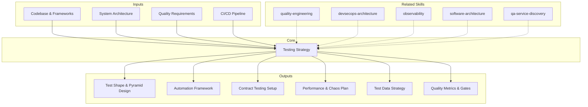

# Testing Strategy: Quality Assurance Architecture & Automation Design

Testing strategy defines how quality is verified, automated, and measured across the software delivery lifecycle. The skill produces comprehensive test architectures covering shape selection, automation frameworks, contract testing, performance and chaos testing, test data management, and quality metrics that shift quality left while maintaining production confidence. [EXPLICIT]

## Grounding Guideline

**A test that cannot fail protects nothing.** Testing strategy is not measured by coverage percentage — it is measured by the confidence it generates to deploy on a Friday at 5pm.

### Testing Strategy Philosophy

1. **Test pyramid is a guide, not a rule.** The right shape (pyramid, trophy, honeycomb, diamond) depends on the system architecture, not on an industry dogma. [EXPLICIT]
2. **Contract testing for microservices.** If you have N services with M consumers, E2E across all is O(N*M). Contract testing reduces that to O(N+M). [EXPLICIT]
3. **Test data management is architecture.** Shared data between tests = guaranteed flakiness. Each test creates, uses, and cleans up its own data. [EXPLICIT]

## Inputs

The user provides a project or system name as `$ARGUMENTS`. Parse `$1` as the **project/system name** used throughout all output artifacts. [EXPLICIT]

**Parameters:**
- `{MODO}`: `piloto-auto` (default) | `desatendido` | `supervisado` | `paso-a-paso`
  - **piloto-auto**: Auto para shape selection y tool matrix, HITL para contract testing decisions y chaos engineering scope. [EXPLICIT]
  - **desatendido**: Zero interruptions. Estrategia completa con supuestos documentados. [EXPLICIT]
  - **supervisado**: Autónomo con checkpoint en pyramid design y contract testing setup. [EXPLICIT]
  - **paso-a-paso**: Confirma cada test shape, framework selection, contract scope, y chaos plan. [EXPLICIT]
- `{FORMATO}`: `markdown` (default) | `html` | `dual`
- `{VARIANTE}`: `ejecutiva` (~40% — S1 pyramid + S3 contracts + S6 metrics) | `técnica` (full 6 sections, default)
- `{TIPO_SERVICIO}`: `SDA` (default) | `QA`
  - SDA: Test strategy for a software project (default behavior)
  - QA: Test strategy as a QA service offering (PITT, Testing Factory, QA CoE design)

Before generating strategy, detect the codebase context:

```
!find . -name "*.test.*" -o -name "*.spec.*" -o -name "*test*" -type d -o -name "jest*" -o -name "pytest*" -o -name "cypress*" | head -20
```

Use detected testing frameworks, languages, and existing test structure to tailor recommendations. [EXPLICIT]

If reference materials exist, load them:

```
Read ${CLAUDE_SKILL_DIR}/references/testing-patterns.md
```

---

## When to Use

- Designing test strategy for new projects or test infrastructure overhaul
- Establishing test automation frameworks and CI integration
- Implementing contract testing for microservices or API consumers
- Introducing performance testing and chaos engineering practices
- Building test data management and environment strategies
- Defining quality metrics, coverage targets, and quality gates
- Reducing flaky tests and improving test suite reliability

## When NOT to Use

- Application code architecture and design patterns
- CI/CD pipeline design and deployment automation
- Production monitoring and incident response
- Load testing and capacity planning as primary focus

---

## Delivery Structure: 6 Sections

### S1: Test Shape Selection & Pyramid Design

Define the test architecture shape with ratio targets and ROI-based prioritization. [EXPLICIT]

**Shape selection decision matrix:**

| System Type | Recommended Shape | Ratio (Unit:Integration:E2E) | Rationale |
|---|---|---|---|
| Backend API, business logic-heavy | **Pyramid** (Fowler) | 70:20:10 | Pure functions, fast unit tests dominate |
| Frontend SPA, UI-heavy | **Trophy** (Kent C. Dodds) | 20:50:20 + static 10 | Integration tests provide best ROI for component interactions |
| Microservices, many boundaries | **Honeycomb** | 10:70:20 | Integration across service boundaries matters most |
| Monolith, legacy | **Ice cream cone** (invert it) | Start E2E, add unit as refactored | Characterization tests first, unit tests on new code |

**Testing Trophy (Kent C. Dodds):** Static analysis at base, then unit, then *integration as the largest layer*, then E2E at top. The trophy argues integration tests provide the best confidence-to-cost ratio — they combine realistic coverage with reasonable speed. "Write tests. Not too many. Mostly integration." As E2E tooling matures (Playwright, Vitest Browser Mode), the trophy's top layer grows increasingly cost-effective.

**Produce:**
- Chosen test shape with justification for the system type
- Layer definitions: what each test level covers, what it trusts from the layer below
- ROI-based prioritization: test what breaks most often, costs most when broken, or changes most frequently
- Shift-left strategy: testing earlier (IDE, pre-commit, PR gate) reduces fix cost 10-100x
- Coverage targets: 80% line coverage for business logic, 60% overall — floors, not ceilings

**Key decisions:**
- Coverage as gate vs. guide: gate for critical paths (>80%), guide for everything else
- Test-first vs. test-after: TDD for complex business logic, test-after for CRUD and integration
- Maintenance budget: allocate 15-20% of development time to test maintenance

### S2: Test Automation Framework

Design the automation infrastructure including tool selection, patterns, and execution strategy. [EXPLICIT]

**Tool selection matrix:**

| Language/Platform | Unit | Integration | E2E | Visual Regression |
|---|---|---|---|---|
| JavaScript/TypeScript | Vitest, Jest | Testing Library, Supertest | Playwright | Chromatic, Percy |
| Python | pytest | pytest + Testcontainers | Playwright | Percy |
| Java/Kotlin | JUnit 5, jqwik | Spring Boot Test, Testcontainers | Playwright, Selenium | Percy |
| .NET | xUnit, NUnit | WebApplicationFactory | Playwright | Percy |
| Mobile (iOS) | XCTest | XCUITest | Detox, Appium | Percy |
| Mobile (Android) | JUnit, Espresso | Espresso | Detox, Appium | Percy |

**Produce:**
- Page Object Model / Screen Object: encapsulate UI interactions, isolate selector changes
- Test data factories: builder pattern for test fixtures, avoid shared mutable state
- Parallel execution: test isolation enables parallel runs, reducing CI time
- Test categorization: fast (unit, <1s), medium (integration, <10s), slow (E2E, <60s)
- CI trigger mapping: unit on every push, integration on PR, E2E on merge to main
- Local developer experience: tests run in <30s for the module being changed

### S3: Contract & API Testing

Ensure service interfaces remain compatible through consumer-driven contracts and schema validation. [EXPLICIT]

**Produce:**
- Consumer-driven contracts: consumers define expected interactions; providers verify compatibility
- Pact workflow: consumer writes Pact test --> generates contract --> provider verifies --> Pact Broker stores
- Specmatic/OpenAPI: schema-first contract testing from API specifications
- Schema validation: request/response validation against OpenAPI/JSON Schema in CI
- Backward compatibility: breaking change detection before deployment
- can-i-deploy checks before promoting to production
- Event contract testing: schema registry (Avro, Protobuf) for message-driven contracts

**Contract testing decision matrix:**

| Scenario | Approach | Tool |
|---|---|---|
| Internal microservices, multiple consumers | Consumer-driven | Pact |
| Public API, schema-first | Provider-driven | Specmatic, Prism |
| Event-driven, async messaging | Schema registry | Confluent Schema Registry, AWS Glue |
| GraphQL | Schema validation | Apollo Studio, GraphQL Inspector |

### S4: Performance & Chaos Testing

Integrate performance validation and failure injection into the testing lifecycle. [EXPLICIT]

**Produce:**
- Load testing in CI for critical paths (every release candidate, not every build)
- Performance budgets: response time per endpoint; regression alert when p95 degrades >10%
- Chaos engineering: inject failures in controlled environments. Define steady state hypothesis first.
- Fault injection patterns: pod termination, network latency, disk pressure, dependency unavailability
- Game days: scheduled chaos exercises, simulate production incidents in staging
- Blast radius control: start small (single pod), expand to zone, then region

**Chaos maturity model:**

| Level | Practice | Environment |
|---|---|---|
| 1 - Learning | Manual fault injection, document results | Staging only |
| 2 - Automated | Scheduled chaos experiments in CI | Staging |
| 3 - Production | Canary chaos with automatic rollback | Production canary |
| 4 - Advanced | Continuous chaos, GameDays, cross-team | Production |

Tools: Chaos Monkey, Litmus, Gremlin, or custom fault injection. Require automatic rollback if safety thresholds exceeded. [EXPLICIT]

### S5: Test Data Management

Design strategies for creating, managing, and cleaning test data across environments. [EXPLICIT]

**Produce:**
- Synthetic data generation: factories producing realistic fake data (Faker, custom generators)
- Data anonymization: production data scrubbed of PII for realistic test datasets
- Environment strategy: ephemeral environments per PR (ideal), shared staging (common)
- Seed and reset patterns: database seeded before suite, reset between runs, no shared state
- Test isolation: each test creates its own data, cleans up after, never depends on others' data
- Compliance: test data must not contain real customer data in non-production environments

**Database strategy per test level:**

| Test Level | Strategy | Tools |
|---|---|---|
| Unit | In-memory, mocked | H2, SQLite, mocks |
| Integration | Containerized, real engine | Testcontainers |
| E2E | Seeded staging or ephemeral | Terraform, Docker Compose |
| Performance | Production-scale anonymized | Custom ETL, Faker at scale |

### S6: Advanced Techniques & Quality Metrics

Incorporate modern testing approaches and define measurable quality indicators. [EXPLICIT]

**Property-based testing:** Define properties that must hold for *all* inputs instead of hand-writing examples (e.g., "encode then decode returns original"). Generate hundreds of random inputs; shrink failures to minimal reproducible cases. Particularly effective for parsers, serializers, algorithms, and state machines.

| Language | Tool | Integration |
|---|---|---|
| JS/TS | fast-check | Jest, Vitest |
| Python | Hypothesis | pytest |
| Java | jqwik | JUnit 5 |
| Scala | ScalaCheck | ScalaTest |
| Haskell | QuickCheck | HSpec |

**Mutation testing:** Seed small faults (mutants) into production code and verify tests catch them. Line coverage measures quantity; mutation testing measures quality.

| Language | Tool | Target Score | CI Cadence |
|---|---|---|---|
| Java | PIT/pitest | >80% on critical paths | Nightly |
| JS/TS/.NET | Stryker | >80% on critical paths | Nightly |
| Python | mutmut | >80% on critical paths | Nightly |

Run on CI nightly, not per-commit (too slow). Focus on critical business logic modules, not the entire codebase. [EXPLICIT]

**Visual regression testing:** Capture screenshots of UI components/pages, compare against baselines pixel-by-pixel or perceptually.

| Tool | Strength | Best For |
|---|---|---|
| Chromatic | Storybook-native, component-level | Design systems, component libraries |
| Percy | Cross-browser, full-page | Multi-browser apps, full pages |
| Playwright screenshots | Free, CI-integrated | Budget-conscious, custom pipelines |
| BackstopJS | Open source, self-hosted | Self-hosted requirement |

**Test impact analysis:** Map code changes to affected tests using coverage data. Run only tests that exercise changed code paths. Tools: Launchable, Gradle Enterprise predictive test selection. Reduces CI time 40-70% in large codebases while maintaining confidence.

**Quality metrics — track these:**
- Coverage trends: line, branch, and mutation coverage over time (not point-in-time)
- Defect escape rate: defects found in production vs. found in testing (lower = better)
- Flaky test rate: quarantine after 2 flakes, fix within sprint, delete if unfixable after 2 sprints
- Test execution time: total run time, pass rate, failure categories
- Quality gates: PR merge requires passing tests + coverage threshold + no critical vulnerabilities

---

## Trade-off Matrix

| Decision | Enables | Constrains | When to Use |
|---|---|---|---|
| **Heavy unit testing** | Fast feedback, cheap maintenance | Misses integration issues | Business logic-heavy, pure functions |
| **E2E-heavy strategy** | Catches user-facing bugs | Slow, flaky, expensive | Small apps, critical journeys only |
| **Contract testing** | Decoupled deployment, fast verification | Setup overhead, team coordination | Microservices, multi-team consumers |
| **Chaos engineering** | Reveals hidden failures | Risk of impact, needs monitoring | Production-ready with observability |
| **Mutation testing** | Validates test quality | Slow, high compute | Critical business logic modules |
| **Property-based testing** | Finds edge cases humans miss | Learning curve, slower tests | Parsers, serializers, algorithms |

---

## Assumptions

- Codebase is under version control with CI/CD pipeline available
- Team has testing experience or is willing to invest in upskilling
- Test environments can be provisioned (local, CI, staging)
- Quality targets are aligned with business risk tolerance

## Limits

- Does not design application architecture
- Does not build CI/CD pipelines
- Does not monitor production systems
- Coverage numbers alone do not guarantee quality; test quality matters more than quantity
- Strategy effectiveness depends on team discipline and maintenance investment

---

## Edge Cases

**Greenfield Project:**
Start with unit test framework from day one. Add integration tests as external dependencies emerge. Defer E2E until user journeys stabilize. Establish conventions early. [EXPLICIT]

**Legacy System with No Tests:**
Start with characterization tests (capture current behavior). Add integration tests around critical paths. Introduce unit tests for new code only. Do not attempt 80% coverage retroactively. [EXPLICIT]

**Microservices with Many Consumers:**
Contract testing is essential. Set up Pact Broker or schema registry. Establish can-i-deploy gates. Each team owns their consumer tests. [EXPLICIT]

**Monorepo with Multiple Teams:**
Use test impact analysis: detect changed modules, run only related tests. Shared test utilities in a common package. Team-owned suites with cross-team integration tests. [EXPLICIT]

**Regulated Environment:**
Test evidence is a compliance artifact. Document test plans, link tests to requirements, archive results. Maintain a traceability matrix: requirement --> test case --> execution result. [EXPLICIT]

---

## Validation Gate

Before finalizing delivery, verify:

- [ ] Test shape selected with justification for the system type
- [ ] Automation framework selected with team skill alignment
- [ ] Test categorization (fast/medium/slow) defined with CI trigger mapping
- [ ] Contract testing covers all cross-service boundaries
- [ ] Performance testing integrated into release process
- [ ] Test data strategy addresses isolation, compliance, and scale
- [ ] Flaky test management policy defined
- [ ] Quality gates are specific and measurable
- [ ] Mutation testing planned for critical business logic (>80% score target)
- [ ] Test maintenance budget explicitly allocated (15-20%)

## Knowledge Graph



## Output Templates

**Formato MD (default):**

```
# Testing Strategy: {project_name}
## S1: Test Shape Selection & Pyramid Design
### Shape Decision Matrix | Layer Definitions | Coverage Targets | Shift-Left

## S2: Test Automation Framework
### Tool Selection | Page Object/Screen Object | Parallel Execution | CI Triggers

## S3: Contract & API Testing
### Consumer-Driven | Pact/Specmatic | Schema Validation | can-i-deploy

## S4: Performance & Chaos Testing
### Load in CI | Performance Budgets | Chaos Maturity | Game Days

## S5: Test Data Management
### Synthetic Generation | Anonymization | Environment Strategy | Isolation

## S6: Advanced Techniques & Quality Metrics
### Property-Based | Mutation Testing | Visual Regression | Test Impact Analysis
```

**Formato HTML:**
`A-01_Testing_Strategy.html` -- Branded HTML con Design System CSS de MetodologIA. Incluye diagrama interactivo de test pyramid, matriz de herramientas por plataforma, y dashboard de quality metrics con targets y tendencias.

**Formato DOCX (bajo demanda):**
- Filename: `{fase}_{entregable}_{cliente}_{WIP}.docx`
- Generado con python-docx, Design System MetodologIA v5. Portada con logo y metadata del proyecto, TOC automático, encabezados/pies de página con marca. Tablas con zebra striping. Tipografía: Poppins para encabezados (navy), Trebuchet MS para cuerpo, acentos gold.

**Formato XLSX (bajo demanda):**
- Filename: `{fase}_testing-strategy_{cliente}_{WIP}.xlsx`
- Generado con openpyxl y MetodologIA Design System v5. Encabezados con fondo navy y texto Poppins blanco, formato condicional por prioridad de test (MUST/SHOULD/COULD) y estado de calidad, auto-filtros en todas las columnas, valores calculados sin fórmulas. Hojas: Test Shape & Pyramid, Framework de Automatización, Contract Testing, Performance & Chaos, Test Data Strategy, Quality Metrics.

**Formato PPTX (bajo demanda):**
- Filename: `{fase}_{entregable}_{cliente}_{WIP}.pptx`
- Generado con python-pptx y MetodologIA Design System v5. Slide master con gradiente navy, títulos en Poppins, cuerpo en Trebuchet MS, acentos gold. Máx 20 slides versión ejecutiva / 30 versión técnica. Notas del orador con referencias de evidencia por slide. Slides sugeridos: portada, test shape seleccionado con justificación, tool matrix por plataforma, contrato testing setup, performance & chaos plan, test data strategy, quality gates y métricas, roadmap de implementación.

## Evaluacion

| Dimension | Peso | Criterio (7/10 minimo) |
|---|---|---|
| Trigger Accuracy | 10% | Se activa ante keywords de test strategy, pyramid, automation, contract testing; no ante code architecture |
| Completeness | 25% | Las 6 secciones cubren shape, automation, contracts, chaos, data, y metrics con herramientas concretas |
| Clarity | 20% | Shape selection justificada por tipo de sistema; tool matrix es especifica por lenguaje/plataforma |
| Robustness | 20% | Edge cases (greenfield, legacy, microservices, monorepo, regulado) tienen estrategia diferenciada |
| Efficiency | 10% | Variante ejecutiva (S1+S3+S6) entrega shape + contracts + metrics en ~40% del contenido |
| Value Density | 15% | Cada seccion produce configuracion aplicable: framework setup, Pact config, chaos experiments, quality gates |

**Umbral minimo:** 7/10 en cada dimension. Composite ponderado >= 7.0 para considerar el output aceptable.

---

## Cross-References

- **metodologia-quality-engineering:** Strategic quality framework — maturity assessment, quality gates, shift-left practices
- **metodologia-devsecops-architecture:** CI/CD pipeline where tests execute and gates are enforced
- **metodologia-observability:** Production monitoring that validates test strategy effectiveness
- **metodologia-software-architecture:** System architecture that determines test shape selection

## Output Format Protocol

| Format | Default | Description |
|--------|---------|-------------|
| `markdown` | Yes | Rich Markdown + Mermaid diagrams. Token-efficient. |
| `html` | On demand | Branded HTML (Design System). Visual impact. |
| `dual` | On demand | Both formats. |

Default output is Markdown with embedded Mermaid diagrams. HTML generation requires explicit `{FORMATO}=html` parameter. [EXPLICIT]

## Output Artifact

**Primary:** `A-01_Testing_Strategy.html` — Executive summary, test shape design, automation framework, contract testing setup, chaos engineering plan, test data strategy, quality metrics dashboard.

**Secondary:** Test framework configuration files, Pact contract examples, quality gate definitions, flaky test management runbook.

## QA-as-a-Service Variant (`{TIPO_SERVICIO}=QA`)

When invoked with `{TIPO_SERVICIO}=QA`, this skill shifts from "test strategy for a software project" to "test strategy design as a QA service offering." Additional sections generated:

### QS1: Service Model Design
- PITT (Independent Testing Teams) configuration
- Testing Factory (Managed Service Center) design
- Strategic Quality Consulting scope definition
- Staff Augmentation QA team composition
- Hybrid model recommendations based on client maturity

### QS2: QA CoE Design
- Center of Excellence governance structure
- Test automation framework standardization
- Tool stack recommendations (with viability assessment)
- Quality metrics dashboard design
- Knowledge management and best practices repository

### QS3: Client-Facing QA Maturity Assessment
- TMMi-based maturity model for client assessment
- Gap analysis between current and target maturity
- Improvement roadmap with quick wins
- ROI model for QA investment (effort drivers, NOT prices)
- Benchmarking against industry standards

### QS4: QA Team Composition & Certification Strategy
- Role definitions (Test Analyst, Automation Engineer, Performance Tester, Security Tester, Test Manager)
- Certification roadmap (ISTQB Foundation → Advanced → Expert specializations)
- Training program design
- Career path and growth framework
- Team scaling model based on engagement size

### QS5: Quality Governance for Service Delivery
- Quality gates for service delivery milestones
- SLA definitions for testing services
- Defect management process and escalation
- Continuous improvement framework
- Client reporting and dashboards

**Output Artifact (QA variant):** `Testing_Strategy_QA_Service_{project}.md`

---
**Autor:** Javier Montaño | **Última actualización:** 12 de marzo de 2026
