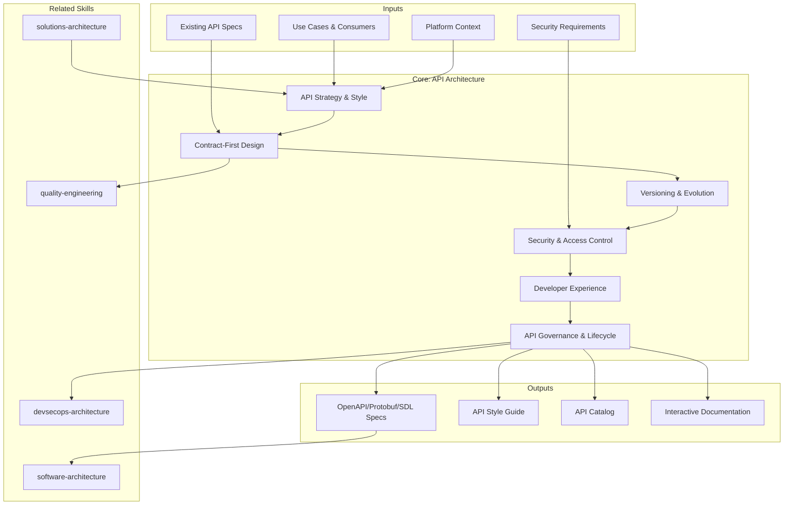

# API Architecture: Design, Governance & Developer Experience

API architecture defines how services expose capabilities to consumers — internal teams, partners, and third parties. The skill covers style selection, contract-first design, versioning strategy, security, developer experience, and lifecycle governance for APIs that scale and evolve gracefully. [EXPLICIT]

## Grounding Guideline

**An API without a contract is a promise without a guarantee.** The specification is the product — the code is just the implementation. Every API is born from a versioned contract, validated against measurable DX, and evolves with an explicit deprecation policy.

### API Architecture Philosophy

1. **Contract-first, always.** The spec (OpenAPI, Protobuf, SDL) is written BEFORE the code. If there is no contract, there is no API — there is an accident exposed to the world. [EXPLICIT]
2. **Versioning strategy upfront.** The versioning strategy is defined at design time, not when the first breaking change breaks production. Changing the strategy later costs 10x. [EXPLICIT]
3. **DX drives adoption.** Developer Experience is not a nice-to-have — it is the competitive differentiator. An API with poor docs is an abandoned API. APIs with better DX generate 2x more adoption. [EXPLICIT]

## Inputs

The user provides a system or platform name as `$ARGUMENTS`. Parse `$1` as the **system/platform name** used throughout all output artifacts. [EXPLICIT]

**Parameters:**
- `{MODO}`: `piloto-auto` (default) | `desatendido` | `supervisado` | `paso-a-paso`
  - **piloto-auto**: Auto para análisis de estilos y contract design, HITL para versioning strategy y governance decisions. [EXPLICIT]
  - **desatendido**: Zero interruptions. API architecture documentada automáticamente. Assumptions documented. [EXPLICIT]
  - **supervisado**: Autónomo con checkpoint en style selection y security design. [EXPLICIT]
  - **paso-a-paso**: Confirma cada style decision, contract spec, versioning policy, y DX plan. [EXPLICIT]
- `{FORMATO}`: `markdown` (default) | `html` | `dual`
- `{VARIANTE}`: `ejecutiva` (~40% — S1 strategy + S2 contracts + S4 security) | `técnica` (full 6 sections, default)

Before generating API architecture, detect the codebase context:

```
!find . -name "*.yaml" -o -name "*.json" -o -name "*.proto" -o -name "*.graphql" -o -name "openapi*" -o -name "swagger*" | head -30
```

Use detected API specs, schemas, and service definitions to tailor style recommendations, versioning approach, and governance structure. [EXPLICIT]

If reference materials exist, load them:

```
Read ${CLAUDE_SKILL_DIR}/references/api-design-patterns.md
```

---

## When to Use

- Designing APIs for a new platform or service
- Choosing between REST, GraphQL, gRPC, or event-driven APIs
- Establishing contract-first development workflow
- Defining versioning and deprecation strategies
- Implementing API security (OAuth2, rate limiting, abuse prevention)
- Improving developer experience (docs, SDKs, sandboxes)
- Setting up API governance and lifecycle management

## When NOT to Use

- Internal code architecture and module design — use software-architecture
- Event-driven messaging and streaming — use event-architecture
- Infrastructure and platform design — use infrastructure-architecture
- End-to-end solution integration across systems — use solutions-architecture

---

## Delivery Structure: 6 Sections

### S1: API Strategy & Style Selection

Select the right API style for each use case and define the overall API strategy. [EXPLICIT]

**Style Decision Matrix:**

| Criterion | REST | GraphQL | gRPC | AsyncAPI (event) |
|---|---|---|---|---|
| Primary use | CRUD, public APIs | Complex UIs, varied data | Internal high-perf | Real-time, decoupled |
| Tooling breadth | Broadest | Growing (60%+ enterprise by 2027) | Moderate | Emerging |
| Caching | HTTP native | Complex (requires persisted queries) | None built-in | N/A |
| Browser support | Full | Full | Limited (grpc-web) | WebSocket/SSE |
| Streaming | SSE only | Subscriptions | Bidirectional | Native |
| Best for | Broad adoption | Reducing over/under-fetching | Polyglot microservices | Pub/sub, webhooks |

**Richardson Maturity Model** — assess and target REST API maturity:
- **Level 0 (Swamp of POX):** Single URI, single HTTP method (POST), RPC-over-HTTP
- **Level 1 (Resources):** Multiple URIs for individual resources, still one HTTP method
- **Level 2 (HTTP Verbs):** Proper GET/POST/PUT/DELETE + status codes — minimum target for all APIs
- **Level 3 (HATEOAS):** Responses include hypermedia links guiding client next actions — target for public APIs where discoverability matters

**GraphQL Federation** — for organizations with 3+ teams contributing to a shared GraphQL API:
- Supergraph: unified schema composed from multiple subgraph services
- Gateway options: Apollo Router (Rust-based, high-perf), Netflix DGS (JVM), Grafbase (edge)
- Entity references: subgraphs extend types via `@key` directive
- Dedicated infra team owns the Gateway; domain teams own their subgraphs
- Below 3 teams: single-server GraphQL is simpler and sufficient

**API-first vs. Code-first Decision Criteria:**

| Factor | API-first (spec-first) | Code-first |
|---|---|---|
| Consumers | Multiple / external | Single / internal |
| Team size | >3 teams | 1-2 teams |
| Lifecycle | Long-lived, public | Prototype, short-lived |
| DX priority | High (2x revenue correlation) | Low |
| Overhead | Spec authoring, tooling setup | Minimal upfront |
| Risk | None | Spec drift, leaked internals |

**AsyncAPI 3.0** for event-driven API surfaces: When APIs include webhooks, SSE, or WebSocket channels, define them alongside OpenAPI. Supports Kafka, AMQP, MQTT protocol bindings and integrates with the same governance tooling.

### S2: Contract-First Design

Define APIs before implementation — schema as the source of truth. [EXPLICIT]

**Spec tooling by style:**
- **REST:** OpenAPI 3.1 — paths, schemas, responses, examples, security schemes
- **gRPC:** Protocol Buffers — service definitions, message types, streaming RPCs
- **GraphQL:** SDL — types, queries, mutations, subscriptions, input types
- **Events:** AsyncAPI 3.0 — channels, messages, payload schemas, bindings

**Validation & linting:** Spectral (OpenAPI), buf (Protobuf), graphql-inspector (GraphQL)
**Mock servers:** Automated from specs for parallel frontend/backend development
**Code generation:** Server stubs, client SDKs, type definitions from contracts
**Contract testing:** Pact, Dredd, or schema-diff tools to verify implementation matches spec

**Key decisions:**
- Schema strictness: `additionalProperties: false` (strict) vs. open (flexible evolution)
- Example quality: Examples in specs improve DX and enable better mocks
- Contract ownership: API team vs. consuming team maintains the spec

### S3: Versioning & Evolution

Manage API changes without breaking consumers. [EXPLICIT]

**Versioning Strategy Comparison:**

| Strategy | Pros | Cons | Best for |
|---|---|---|---|
| URI path (`/v1/`) | Explicit, easy routing | URL pollution | Public APIs |
| Header (`Accept: vnd.v2+json`) | Clean URLs | Harder to test/share | Partner APIs |
| Query param (`?version=2`) | Simple | Not RESTful | Internal APIs |
| Content negotiation | Different representations | Complex | Evolving resources |

**Lifecycle:** alpha -> beta -> stable -> deprecated -> sunset
**Deprecation policy:** Minimum 6-month notice, `Sunset` header (RFC 8594), migration guide
**Breaking vs. non-breaking:** Additive fields safe; removing/renaming breaks
**Compatibility testing:** Automated schema-diff in PRs detecting consumer impact
**Backward compatibility window:** 6 months (internal), 12 months (partner/public)

### S4: Security & Access Control

Protect APIs from unauthorized access, abuse, and attacks. [EXPLICIT]

**Authentication:** OAuth 2.0 flows (authorization code + PKCE for SPAs/mobile, client credentials for S2S), API keys for identification, JWT for stateless verification
**Authorization:** Scope-based (OAuth), role-based (RBAC), attribute-based (ABAC) for fine-grained
**API gateway security:** WAF integration, IP allowlisting, mutual TLS for service-to-service

**Rate Limiting Algorithms:**

| Algorithm | Behavior | Best for |
|---|---|---|
| Token bucket | Allows bursts up to bucket size, refills at steady rate | General-purpose, bursty traffic |
| Sliding window log | Exact count per rolling window, memory-intensive | Precise enforcement |
| Sliding window counter | Approximation of sliding window, low memory | High-throughput APIs |
| Fixed window | Simple counter per time window, boundary spike risk | Low-complexity needs |
| Leaky bucket | Smooths output to constant rate | Queue-based rate shaping |

**Concrete rate limit tiers:** Free (100 req/min), Standard (1000 req/min), Enterprise (10000 req/min). Always return `429 Too Many Requests` with `Retry-After` header.

**Latency budgets:** Rate limiting infrastructure must add <5ms p99 overhead. Use in-memory stores (Redis) for counter checks; never add a network hop to a remote DB for every request.

### S5: Developer Experience

Make APIs easy to discover, learn, integrate, and debug. [EXPLICIT]

**Documentation:** Interactive docs (Swagger UI, Redoc, GraphiQL, gRPC reflection)
**Getting started:** Auth setup -> first API call -> common workflows in <5 minutes
**SDKs:** Typed clients in JS, Python, Go, Java from OpenAPI/Protobuf specs
**Sandbox:** Isolated test environments with sample data, no production impact
**Error design:** Consistent format — `{ "type": "URI", "title": "string", "status": int, "detail": "string", "instance": "URI" }` (RFC 9457 Problem Details)
**Pagination:** Cursor-based (scalable, default) vs. offset-based (simple). Include `Link` headers.
**Status page:** API availability, latency metrics, incident history

### S6: API Governance & Lifecycle

Manage API portfolio — discovery, review, consistency, and retirement. [EXPLICIT]

**API catalog:** Searchable registry with metadata, ownership, status, consumer count
**Design review:** Pre-implementation contract review by architecture team or API CoP
**Style guide enforcement:** Automated Spectral linting in CI/CD — block merges on violations
**Breaking change detection:** Schema diff in PRs with consumer impact analysis
**Usage analytics:** Endpoint popularity, error rates, latency percentiles, consumer distribution
**Sunset policy:** Deprecation announcement -> migration period -> traffic monitoring -> final removal

**API Health Score (0-100):**
- Design quality (linting pass rate): 25 pts
- Documentation completeness: 20 pts
- Adoption (active consumers): 20 pts
- Reliability (error rate <1%): 20 pts
- Security (auth coverage, no vulnerabilities): 15 pts

**AI-assisted governance (2025+):** Use LLM-based review to auto-check naming conventions, detect anti-patterns, and suggest improvements in PR comments. Supplements human review, does not replace it.

---

## Trade-off Matrix

| Decision | Enables | Constrains | When to Use |
|---|---|---|---|
| **REST** | Broad tooling, HTTP caching, simplicity | Rigid resource model, over/under-fetching | Public APIs, CRUD, browser clients |
| **GraphQL** | Flexible queries, reduced round-trips | Caching complexity, N+1 risk, query cost | Complex UIs, mobile, varied data needs |
| **gRPC** | Performance, streaming, strong typing | Browser support limited, debugging harder | Internal services, high-throughput, polyglot |
| **Contract-First** | Design quality, parallel dev, mocks | Initial overhead, spec maintenance | Teams >3, public APIs, multi-consumer |
| **Code-First** | Speed, less ceremony | Spec drift, poor DX, breaking changes | Prototypes, single-consumer internal APIs |
| **Strict Versioning** | Stability, clear contracts | Maintenance burden, version proliferation | Public APIs, regulated industries |
| **Additive-Only** | No breaking changes, continuous deploy | Schema grows, deprecated fields linger | High-consumer-count APIs, SaaS platforms |

---

## Assumptions

- APIs serve identifiable consumers (internal teams, partners, or third parties)
- An API gateway or similar infrastructure exists or can be provisioned
- Team has capacity for API design review and documentation maintenance
- Security requirements are defined (authentication, authorization, rate limiting)

## Limits

- Focuses on API design and governance, not internal code architecture
- Does not design event-driven messaging systems
- Does not configure infrastructure (load balancers, gateways)
- GraphQL and gRPC require specialized operational knowledge beyond this scope
- API governance effectiveness depends on organizational adoption, not just tooling

---

## Edge Cases

| Case | Handling Strategy |
|---|---|
| Legacy APIs without existing spec | Generate spec from code (code-first); design target API; migrate consumers with facade pattern; legacy deprecation timeline |
| Internal APIs between 1-2 teams | Less ceremony but mandatory contracts; lighter governance (guidelines, not gates); gRPC with code generation reduces friction |
| API as public product | DX is competitive advantage; invest in docs, SDKs, sandboxes; conservative versioning because breaking changes lose clients |
| High throughput / low latency | gRPC with streaming, connection pooling, binary serialization; limit GraphQL query complexity; rate limiting < 5ms overhead |
| Multi-tenant API | Tenant isolation in API layer (scoping, data filtering); per-tenant rate limiting; universal API with per-tenant configuration over tenant-specific APIs |

## Decisions and Trade-offs

| Decision | Discarded Alternative | Justification |
|---|---|---|
| Contract-first always (spec before code) | Code-first with generated spec | The spec is the product; the code is the implementation; without a prior contract there is risk of spec drift, leaked internals, and undetected breaking changes |
| Versioning strategy defined at design time | Define versioning when the first breaking change occurs | Changing the versioning strategy after publishing costs 10x; consumers build against the initial stability contract |
| DX as adoption driver, not as nice-to-have | Minimal functional documentation | APIs with better DX generate 2x more adoption; poor docs produce abandoned APIs regardless of technical quality |

## Knowledge Graph



## Output Templates

| Formato | Nombre | Contenido |
|---|---|---|
| **Markdown** | `A-01_API_Architecture.md` | Documento completo con API strategy, style selection matrix, contract-first workflow, versioning policy, security design, DX plan y governance lifecycle. Diagramas Mermaid embebidos. |
| **HTML** | `A-01_API_Architecture.html` | Mismo contenido en HTML branded (Design System MetodologIA). Incluye interactive API style decision matrix, rate limiting algorithm comparison, y API health score calculator. |
| **DOCX** | `{fase}_{entregable}_{cliente}_{WIP}.docx` | Documento formal via python-docx (Design System MetodologIA v5). Cover page, TOC auto, headers/footers branded, tablas zebra. Para circulacion formal y auditoria. |
| **XLSX** | `{fase}_{entregable}_{cliente}_{WIP}.xlsx` | Via openpyxl con Design System MetodologIA v5. Headers branded (fondo navy, texto blanco, Poppins), formato condicional con colores semaforo, auto-filtros, valores sin formulas. Para inventario de APIs, matrices de versionamiento y tracking de health score. |
| **PPTX** | `{fase}_{entregable}_{cliente}_{WIP}.pptx` | Via python-pptx con MetodologIA Design System v5. Slide master con gradiente navy, titulos Poppins, cuerpo Trebuchet MS, acentos gold. Max 20 slides (ejecutiva) / 30 slides (tecnica). Speaker notes con referencias de evidencia. Para comites directivos y presentaciones C-level. |

## Evaluacion

| Dimension | Peso | Criterio |
|---|---|---|
| Trigger Accuracy | 10% | Descripcion activa triggers correctos (API design, REST, GraphQL, gRPC, contract-first, versioning) sin falsos positivos con solutions-architecture o event-architecture |
| Completeness | 25% | Las 6 secciones cubren strategy, contracts, versioning, security, DX y governance sin huecos; todos los estilos relevantes evaluados |
| Clarity | 20% | Instrucciones ejecutables sin ambiguedad; style decision matrix con criterios cuantificables; rate limits con algoritmos y tiers concretos |
| Robustness | 20% | Maneja legacy sin spec, APIs internas, APIs publicas, alto throughput y multi-tenant con estrategias diferenciadas |
| Efficiency | 10% | Proceso no tiene pasos redundantes; variante ejecutiva reduce a S1+S2+S4 sin perder decisiones criticas de estilo y seguridad |
| Value Density | 15% | Cada seccion aporta valor practico directo; style decision matrix y API health score son herramientas de decision inmediata |

**Umbral minimo: 7/10.**

---

## Validation Gate

Before finalizing delivery, verify:

- [ ] API style selection justified against use cases with decision matrix
- [ ] Contract-first workflow defined with specific linting and mock tooling
- [ ] Versioning strategy handles breaking and non-breaking changes with timelines
- [ ] Security covers authentication, authorization, and rate limiting with algorithm choice
- [ ] Error format is consistent, machine-readable (RFC 9457)
- [ ] Documentation is interactive with getting-started guide
- [ ] Governance process covers design review and breaking change detection in CI
- [ ] Deprecation and sunset policy defined with minimum notice periods
- [ ] API catalog or registry planned with health scoring
- [ ] Developer experience validated from consumer perspective

---

## Output Format Protocol

| Format | Default | Description |
|--------|---------|-------------|
| `markdown` | ✅ | Rich Markdown + Mermaid diagrams. Token-efficient. |
| `html` | On demand | Branded HTML (Design System). Visual impact. |
| `dual` | On demand | Both formats. |

Default output is Markdown with embedded Mermaid diagrams. HTML generation requires explicit `{FORMATO}=html` parameter. [EXPLICIT]

## Output Artifact

**Primary:** `A-01_API_Architecture.html` — Executive summary, API strategy, style selection matrix, contract-first workflow, versioning policy, security design, DX plan, governance lifecycle.

**Secondary:** OpenAPI spec templates, API style guide, review checklist, deprecation policy document, SDK generation configuration.

---
**Autor:** Javier Montaño | **Última actualización:** 12 de marzo de 2026
