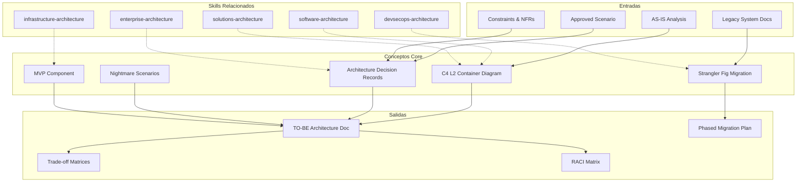

# TO-BE Architecture Design

Designs future-state architecture enabling legacy system gradual retirement while maintaining zero data loss and regulatory compliance. Produces C4 L2 container diagram, 6+ ADRs, nightmare scenario mitigations, MVP component design, and phased Strangler Fig migration plan. [EXPLICIT]

## Grounding Guideline

**Designing the future without understanding the present is architectural fiction.** The TO-BE architecture is built on AS-IS evidence, approved scenario decisions, and constraints validated in feasibility. Every container, every service, every pattern has a WHY documented in an ADR. It is not designed to impress — it is designed to migrate.

### Target Architecture Philosophy

1. **Migration > revolution.** Strangler Fig, not big-bang. Each migration phase is independently reversible and valuable. [EXPLICIT]
2. **Nightmare-first design.** Before celebrating the happy path, the 5 worst scenarios are modeled and mitigations are designed. If it does not survive the nightmare, it is not built. [EXPLICIT]
3. **The MVP proves the architecture.** The first deployed component validates patterns, performance, and operational readiness. If the MVP fails, the architecture is adjusted before scaling. [EXPLICIT]

## Inputs

The user provides a system or project name as `$ARGUMENTS`. Parse `$1` as the **system/project name** used throughout all output artifacts. [EXPLICIT]

**Parameters:**
- `{MODO}`: `piloto-auto` (default) | `desatendido` | `supervisado` | `paso-a-paso`
  - **piloto-auto**: Auto para C4 y trade-offs, HITL para ADRs y nightmare scenarios. [EXPLICIT]
  - **desatendido**: Zero interruptions. Arquitectura completa auto-generada. [EXPLICIT]
  - **supervisado**: Autónomo con checkpoint en ADRs y migration plan. [EXPLICIT]
  - **paso-a-paso**: Confirma cada layer, cada ADR, cada nightmare, y la migration. [EXPLICIT]
- `{FORMATO}`: `markdown` (default) | `html` | `dual`
- `{VARIANTE}`: `ejecutiva` (~40% — C4 diagram + trade-offs + migration phases) | `técnica` (full, default)

Before generating architecture, detect codebase context:

```
!find . -name "*.ts" -o -name "*.java" -o -name "*.py" -o -name "*.go" -o -name "*.cs" -o -name "*.tf" | head -30
```

Load reference materials for detailed ADR templates and nightmare scenario patterns:

```
Read ${CLAUDE_SKILL_DIR}/references/adr-templates.md
Read ${CLAUDE_SKILL_DIR}/references/nightmare-scenarios.md
```

---

## Assumptions & Limits

**Requires**: Approved scenario from prior discovery/analysis. Architecture is tailored to selected scenario constraints (Conservative/Moderate/Aggressive). Without prior approval, architecture design is premature.

**Cloud-eligible**: Assumes workloads are cloud-ready. If on-prem only, adjust: replace Kubernetes with VM-based deployment; replace managed cloud services with self-hosted equivalents.

**Blueprint-level scope**: Architecture is L2 container diagram + design decisions. Does NOT include class diagrams, API implementation code, or data schema DDL. Those are detailed design deliverables.

**Performance unvalidated**: Architecture proposes patterns (Saga, CQRS, Event Sourcing) but cannot validate performance without PoC. Include spike tasks to validate latency, throughput, consistency guarantees.

**Team skill availability**: Assumes team can adopt microservices patterns. If team has no microservices experience, architecture risk increases (flag in ADRs; add training phase).

**Legacy system data accessibility**: Assumes legacy systems expose data via API or database connector. If legacy is pure black box, Sidecar pattern becomes required (adds complexity/cost).

---

## Conditional Logic per Scenario

**IF Conservative scenario selected:**
- Monolith-first for new services (not microservices)
- 2-3 services max
- Strangler Fig velocity: 10-20% replacement over 18 months
- ADRs emphasize stability & risk mitigation

**IF Moderate scenario selected:**
- Hybrid: 3-5 microservices + legacy ACL
- Strangler Fig velocity: 40-60% replacement over 12 months
- Balanced trade-offs

**IF Aggressive scenario selected:**
- Full microservices: one per DDD domain (6-10 services)
- Event-driven + CQRS + Event Sourcing from day one
- Strangler Fig velocity: 60%+ replacement over 9 months
- Assumes experienced team

**IF budget is constrained:**
- Defer Event Sourcing; start with CRUD + immutable audit log
- Skip Istio; use simpler networking (Linkerd or CNI-only)
- ADR trade-offs favor cost over operational sophistication

**IF team expertise unavailable:**
- Saga (Orchestration) instead of Choreography
- Training phase: +2-3 weeks
- Flag: "Team risk elevated; recommend external coaching"

---

## Edge Cases & Workarounds

**Client mandates specific technology:** Override choice; document constraint in relevant ADR with trade-off analysis.

**No cloud allowed:** Replace K8s with VM-based deployment (Terraform + Ansible) or on-prem K8s (OpenShift). Replace managed services with self-hosted. Operational overhead increases.

**Team has no microservices experience:** Start with monolith + modular boundaries (DDD packages). Plan 2-week training phase. Add risk flag: "Learning curve increases deployment risk by 20%."

**Legacy system has no API:** Sidecar becomes critical path. Wrap legacy in process bridge; expose via message queue or REST. Data extraction via database-level CDC if schema accessible. Cost & complexity increase significantly.

**Multiple legacy systems with conflicting schemas:** Federated data model; ACL per system maintains logical separation. EDW aggregates for analytics (separate from OLTP). Data consistency becomes eventual.

**Regulatory mandate for on-prem data residency:** Data layer stays on-prem. Application layer can be cloud. Encrypted tunnel (VPN/DX) between layers. Document in Zero Trust and Data Storage ADRs.

---

## Architecture Decision Framework

**When to split a service vs keep monolithic:**
- Core domain (per DDD) -> Dedicated microservice (owns data + logic)
- Supporting domain -> Shared service or library module
- Generic domain -> Buy/SaaS (payment gateway, SMS, auth vendor)

**Service boundary heuristics:**
- Align with DDD bounded contexts
- Team ownership: one team per service (2-pizza rule)
- Data ownership: no shared databases (polyglot persistence per service)
- Deploy independently: release without coordinating other services

**When CQRS adds value vs over-engineering:**
- USE CQRS IF: Read/write ratio >10:1, strong consistency NOT required for reads, audit trail is legal requirement
- SKIP CQRS IF: Simple CRUD (ratio ~1:1), consistency critical for all reads, team unfamiliar with event sourcing

---

## Delivery Structure

### 1. C4 Level 2 Container Architecture

Produce a layered architecture diagram with these layers:

- **Consumer Layer:** Web (SPA), Mobile, Partner APIs
- **API Gateway Layer:** OAuth2/OIDC validation, rate limiting, mTLS, request routing/logging
- **Microservices Mesh:** Domain services (Auth, Account, Transaction Orchestrator, Payment, Audit, Notification), service mesh (mTLS, circuit breaking), message bus (event streaming, saga choreography)
- **Anti-Corruption Layer:** ACL adapters (protocol translation), sidecar pattern (legacy wrapping), data normalization
- **Legacy System Layer:** Existing systems (gradual replacement via Strangler Fig)
- **Data Layer:** Polyglot persistence (PostgreSQL for OLTP, Redis for cache/locks, Elasticsearch for audit/search, S3/Blob for data lake)
- **Infrastructure & Observability:** Container orchestration (K8s), service mesh, logging/tracing/metrics, GitOps

### 2. Trade-off Matrix

Document trade-offs for each major decision:

| Decision | TO-BE Choice | Alternative 1 | Alternative 2 | Trade-off |
|---|---|---|---|---|
| Service Communication | Event-Driven + REST | Pure REST | Pure Event-Driven | Complexity vs Resilience |
| Consistency Model | Saga + Local Transactions | Distributed Transactions | 2PC | Latency vs Strong Consistency |
| Security | Zero Trust (mTLS + OAuth2) | Network Perimeter | API Keys Only | Ops Complexity vs Security |
| Legacy Integration | ACL + Sidecar + Strangler Fig | Big Bang | No Migration | Time-to-Modern vs Risk |
| Data Storage | Event Sourcing + CQRS | Traditional CRUD | Snapshot-only | Complexity vs Audit Trail |
| Deployment | Kubernetes + GitOps | Traditional VMs | Serverless | Ops Overhead vs Control |

### 3. ADRs (6+ minimum)

Each ADR includes:
- **Decision:** What was chosen
- **Alternatives Considered:** Pros, cons, why rejected for each
- **Trade-off:** What we gain, what we lose, what we assume
- **Consequences:** Positive, negative, neutral

Minimum ADR topics:
1. Distributed transaction strategy (Saga vs 2PC)
2. Legacy integration pattern (ACL + Sidecar)
3. Security model (Zero Trust, mTLS)
4. Data storage & audit trail (Event Sourcing + CQRS)
5. Deployment platform (Kubernetes + GitOps)
6. Caching & session management (Redis)

See `${CLAUDE_SKILL_DIR}/references/adr-templates.md` for detailed ADR templates with banking/enterprise examples. [EXPLICIT]

### 4. Nightmare Scenarios (5 minimum)

For each scenario, document: **Problem**, **Trigger Conditions**, **Mitigations (Defense in Depth)**, **Monitoring & Early Detection** (alert definitions), **Acceptance Criteria (Go/No-Go)**. [EXPLICIT]

Minimum scenarios:
1. **Ghost Transaction** — Payment commits in one service, fails in another. Mitigations: Saga, Outbox, idempotency keys, reconciliation, DLQ, immutable audit log. [EXPLICIT]
2. **Schema Drift** — Legacy schema changes unannounced. Mitigations: Consumer-driven contracts, schema registry, data fingerprinting, ACL validation. [EXPLICIT]
3. **Auth Service Unavailable** — OAuth2 down, all requests rejected. Mitigations: Token caching + grace period, multi-replica, circuit breaker, emergency mode, identity provider redundancy. [EXPLICIT]
4. **Cascade Failure** — One service crashes, ripple effect takes down others. Mitigations: Circuit breaker, bulkhead, rate limiting + backpressure, service mesh retry, Kafka consumer lag monitoring. [EXPLICIT]
5. **Legacy System Corruption** — Buggy ACL sends malformed data to legacy. Mitigations: Pre-flight validation, dry-run mode, rollback from snapshots, change control, post-transfer data validation. [EXPLICIT]

See `${CLAUDE_SKILL_DIR}/references/nightmare-scenarios.md` for detailed monitoring alert definitions and acceptance criteria per scenario. [EXPLICIT]

### 5. MVP Component

Design the first deployable component (typically Authentication & Session Management):
- Architecture diagram (Client -> API Gateway -> AuthService -> Legacy Identity Provider)
- API contracts (OpenAPI): login, refresh, logout, verify
- Data model (PostgreSQL): users, user_roles, session_events
- Resilience patterns: idempotency, circuit breaker (LDAP fallback), saga (audit + session atomic), caching (Redis TTL)

### 6. Phased Migration (Strangler Fig)

**Phase 1: Assessment & Wrapping (Months 1-2)**
- Document legacy integrations, data flows, implicit rules
- Build sidecar pattern and ACL adapters
- Establish monitoring/logging baseline

**Phase 2: Modern Service Introduction (Months 3-5)**
- Deploy MVP (Auth Service) with canary (10%)
- Maintain legacy as fallback; parallel processing + result comparison
- Shadow mode: process all requests, compare results, don't apply to production

**Phase 3: Capability Migration (Months 6-12)**
- Migrate remaining domain services
- Deploy saga pattern for distributed transactions
- Implement event streaming (Kafka) for real-time consistency
- Reconciliation service for daily batch validation

**Phase 4: Legacy Sunset (Months 13+)**
- Stop writing to legacy (read-only mode)
- Archive historical data to data lake
- Maintain ACL for compliance/audit queries only
- Decommission legacy infrastructure

**Migration Risk Mitigation:**

| Phase | Risk | Mitigation |
|---|---|---|
| 1 | Incorrect legacy understanding | Detailed discovery + technical archaeology |
| 2 | Canary impacts production | Shadow mode: compare but don't apply |
| 3 | Data inconsistency | Reconciliation service + nightly batch |
| 4 | Legacy data inaccessibility | Data lake backup + read-only ACL |

---

## RACI Matrix

| Activity | Delivery Team | Client | Shared |
|---|---|---|---|
| Architecture Design & ADRs | R,A | C | I |
| Legacy System Documentation | C | R,A | I |
| Microservice Development | R | C | A |
| Testing & QA | C | R,A | I |
| Deployment & Infrastructure | R | C | A |
| Security Review & mTLS Setup | R | C | A |
| Migration Planning & Execution | A | R | C |
| Training & Knowledge Transfer | R | A | C |
| Production Support (6 months) | R | C | A |

**Legend:** R=Responsible, A=Accountable, C=Consulted, I=Informed

---

## Validation Gate

### Functional
- [ ] Auth Service: 5,000 concurrent logins with <100ms P99
- [ ] Transactions: <100ms P99, 99.9% success rate
- [ ] Sagas: compensation completes within 30 seconds
- [ ] ACL: >=99.5% data consistency validation
- [ ] MVP: zero data loss during PoC deployment

### Resilience
- [ ] System operational during single microservice failure
- [ ] Circuit breakers activate within 5 seconds
- [ ] Auth failure triggers graceful degradation (cached tokens)
- [ ] Legacy failure isolated by ACL (no cascade)
- [ ] Message queue backlog clears within 5 minutes post-recovery

### Security
- [ ] All service-to-service encrypted via mTLS
- [ ] OAuth2 token validation at gateway + service boundary
- [ ] No plaintext passwords in logs/event streams
- [ ] Audit trail captures auth events
- [ ] Secrets via vault (no hardcoded credentials)

### Operational
- [ ] All services deployable via GitOps
- [ ] Incident response time <15 minutes
- [ ] Observability operational (logs, metrics, traces)
- [ ] Runbook for top 10 failure scenarios
- [ ] On-call escalation playbook established

### Rejection Criteria (Blockers)
- Any unaccounted data loss
- Service-to-service communication without mTLS
- Audit trail gaps
- Orphaned sagas unable to compensate
- ACL translation errors affecting >0.1% of transactions
- Authentication latency >500ms

---

## Output Format Protocol

| `{VARIANTE}` | `{FORMATO}` | Archivo generado | Contenido |
|---|---|---|---|
| técnica | markdown | `04_Arquitectura_TO-BE_Deep.md` | C4 L2, trade-offs, 6+ ADRs, 5+ nightmares, MVP, migration, RACI |
| técnica | html | `04_Arquitectura_TO-BE_Deep.html` | Mismo contenido, HTML con estilos brand |
| técnica | dual | Ambos archivos | Markdown + HTML |
| ejecutiva | markdown | `04_Arquitectura_TO-BE_Ejecutiva.md` | C4 diagram, trade-off matrix, migration phases (~40%) |
| ejecutiva | html | `04_Arquitectura_TO-BE_Ejecutiva.html` | Mismo contenido ejecutivo, HTML con estilos brand |
| ejecutiva | dual | Ambos archivos | Markdown + HTML |

---

## Edge Cases

| Case | Handling Strategy |
|---|---|
| Client mandates specific technology | Override the choice; document constraint in relevant ADR with explicit trade-off analysis. |
| No cloud allowed | Replace K8s with VM-based deployment (Terraform + Ansible) or on-prem K8s (OpenShift). Managed services replaced by self-hosted. |
| Team with no microservices experience | Start with monolith + modular boundaries (DDD packages). Training phase +2-3 weeks. Flag elevated risk. |
| Legacy system without API | Sidecar becomes critical. Wrap legacy via message queue or REST. Data extraction via CDC if schema accessible. |
| Multiple legacy systems with conflicting schemas | Federated data model; ACL per system maintains logical separation. EDW aggregates for analytics. Eventual consistency. |
| On-prem data residency regulation | Data layer on-prem, application layer in cloud. Encrypted tunnel (VPN/DX) between layers. Document in Zero Trust and Data Storage ADRs. |

## Decisions and Trade-offs

| Decision | Discarded Alternative | Justification |
|---|---|---|
| Strangler Fig over Big-Bang | Full Big-Bang migration | Strangler Fig reduces risk with independently reversible phases. Big-bang maximizes blast radius and does not allow incremental learning. |
| Nightmare-first design (5 scenarios) | Happy-path-first design | If the architecture does not survive the worst scenarios, it is not built. Designing for nightmares first ensures resilience before optimizing the happy path. |
| MVP validates architecture before scaling | Implement all services in parallel | The MVP tests patterns, performance, and operational readiness with a real component. If it fails, the architecture is adjusted before multiplying the error. |
| Saga + Outbox over 2PC | Distributed 2PC transactions | 2PC has prohibitive latency and single point of failure (coordinator). Saga + Outbox is resilient, idempotent, and auditable. |

## Knowledge Graph



## Output Templates

**Formato Markdown (default):**

```
# Arquitectura TO-BE: {project}
## 1. C4 Level 2 Container Architecture
### Mermaid Diagram
### Layer Descriptions
## 2. Trade-off Matrix
| Decision | TO-BE Choice | Alternative 1 | Alternative 2 | Trade-off |
...
## 3. ADRs (6+)
### ADR-001: {title}
- Decision: ...
- Alternatives Considered: ...
- Trade-off: ...
- Consequences: ...
## 4. Nightmare Scenarios (5+)
### NS-001: {name}
- Problem | Trigger | Mitigations | Monitoring | Go/No-Go
## 5. MVP Component
## 6. Phased Migration (Strangler Fig)
## RACI Matrix
```

**Formato PPTX (bajo demanda):**

```
Slide 1: Portada — Arquitectura TO-BE: {project}
Slide 2: Executive Summary — scenario + key architectural decisions
Slide 3: C4 L2 Container Diagram
Slide 4: Trade-off Matrix (top decisions)
Slide 5-6: Nightmare Scenarios — top-3 con mitigaciones
Slide 7: MVP Component Architecture
Slide 8: Migration Phases (Strangler Fig timeline)
Slide 9: RACI Matrix
Slide 10: Next Steps + Validation Gates
```

**Formato HTML (bajo demanda):**
- Filename: `04_Arquitectura_TO-BE_{project}_{WIP}.html`
- Estructura: HTML self-contained branded (Design System MetodologIA v5). Light-First Technical page con diagrama C4 L2 interactivo, ADRs colapsables, nightmare scenarios con accordions de mitigacion, y Strangler Fig timeline. WCAG AA, responsive, print-ready.

**Formato DOCX (bajo demanda):**
- Filename: `{fase}_{entregable}_{cliente}_{WIP}.docx`
- Via python-docx con Design System MetodologIA v5. Cover page, TOC auto, headers/footers branded, tablas zebra. Para circulacion formal y auditoria.

**Formato XLSX (bajo demanda):**
- Filename: `{fase}_{entregable}_{cliente}_{WIP}.xlsx`
- Via openpyxl con Design System MetodologIA v5. Headers branded (fondo navy, texto blanco, Poppins), formato condicional con colores semaforo, auto-filtros, valores sin formulas. Para trade-off matrices, registro de ADRs y RACI de migracion.

## Evaluacion

| Dimension | Peso | Criterio |
|---|---|---|
| Trigger Accuracy | 10% | Activacion correcta ante keywords de TO-BE, target architecture, ADRs, Strangler Fig, migration, nightmare scenarios, C4 diagrams. |
| Completeness | 25% | 6 entregables: C4 L2, trade-offs, 6+ ADRs, 5+ nightmares, MVP, migration plan. RACI incluido. |
| Clarity | 20% | ADRs documentan decision + alternativas + trade-off + consecuencias. C4 diagram legible por audiencia tecnica y ejecutiva. |
| Robustness | 20% | Conditional logic per scenario (Conservative/Moderate/Aggressive). Edge cases (no cloud, no API, team sin experiencia) cubiertos. |
| Efficiency | 10% | Variante ejecutiva reduce a C4 + trade-offs + migration phases (~40%). Reusa scenario aprobado sin re-evaluar. |
| Value Density | 15% | Nightmare scenarios con mitigaciones defense-in-depth. MVP valida arquitectura antes de escalar. Migration plan reversible por fase. |

**Umbral minimo: 7/10.** Debajo de este umbral, revisar ADR completeness y nightmare scenario mitigations.

## Cross-References

- **metodologia-software-architecture:** Internal structure of each service in the TO-BE architecture
- **metodologia-solutions-architecture:** Integration patterns, channel architecture, observability stack
- **metodologia-infrastructure-architecture:** K8s clusters, network topology, HA/DR, cost optimization
- **metodologia-devsecops-architecture:** Pipeline design, security gates, GitOps deployment
- **metodologia-enterprise-architecture:** Capability mapping, technology radar alignment, governance

## Output Artifact

**Primary:** `04_Arquitectura_TO-BE_Deep.html` — C4 L2 diagram, trade-off matrices, nightmare scenarios with mitigations, MVP component design, ADRs, migration roadmap, acceptance criteria, RACI matrix.

---
**Autor:** Javier Montaño | **Última actualización:** 12 de marzo de 2026

## Usage

Example invocations:

- "/architecture-tobe" — Run the full architecture tobe workflow
- "architecture tobe on this project" — Apply to current context

