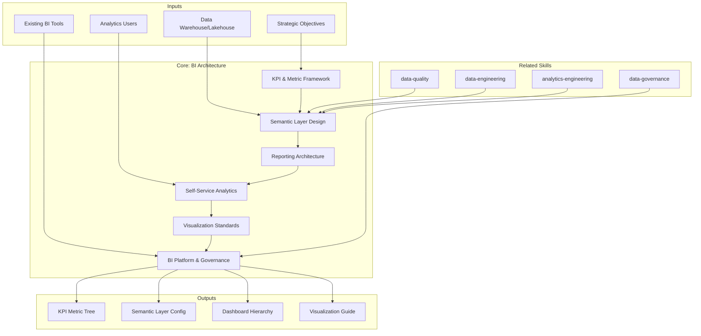

# BI Architecture: Business Intelligence Solution Design & Analytics Strategy

BI architecture defines how organizations consume data for decision-making — KPI frameworks, semantic layers, dashboard hierarchies, self-service analytics, and governance. This skill produces BI documentation that enables teams to deliver trustworthy, scalable, and accessible analytics. [EXPLICIT]

## Grounding Guideline

**A dashboard without semantics is a pretty chart without meaning.** BI architecture designs how organizations consume data for decision-making — from the semantic layer that defines what metrics mean to the dashboards that present them to the right audience.

### BI Philosophy

1. **Semantic layer = meaning contract.** Every metric has a unique definition, a formula, and an owner. Without a semantic layer, every team calculates revenue differently. [EXPLICIT]
2. **Self-service with guardrails.** Users must be able to explore data without filing tickets, but within a governance framework that ensures quality and security. [EXPLICIT]
3. **Fewer dashboards, more decisions.** The goal is not 100 dashboards — it is for decision-makers to act with confidence. KPI trees > dashboard sprawl. [EXPLICIT]

## Inputs

The user provides a system or project name as `$ARGUMENTS`. Parse `$1` as the **system/project name** used throughout all output artifacts. [EXPLICIT]

**Parameters:**
- `{MODO}`: `piloto-auto` (default) | `desatendido` | `supervisado` | `paso-a-paso`
  - **piloto-auto**: Auto para KPI framework y semantic layer, HITL para dashboard hierarchy y self-service strategy. [EXPLICIT]
  - **desatendido**: Zero interruptions. Arquitectura BI documentada automáticamente. Assumptions documented. [EXPLICIT]
  - **supervisado**: Autónomo con checkpoint en semantic layer design y platform selection. [EXPLICIT]
  - **paso-a-paso**: Confirma cada KPI tree, metric definition, dashboard tier, y governance policy. [EXPLICIT]
- `{FORMATO}`: `markdown` (default) | `html` | `dual`
- `{VARIANTE}`: `ejecutiva` (~40% — S1 KPI framework + S3 reporting + S6 governance) | `técnica` (full 6 sections, default)

Before generating architecture, detect the analytics context:

```
!find . -name "*.sql" -o -name "*.yml" -o -name "*.yaml" -o -name "*.lookml" -o -name "*.json" | head -30
```

Use detected tools (Looker, Tableau, Power BI, Metabase, dbt, etc.) to tailor recommendations. [EXPLICIT]

If reference materials exist, load them:

```
Read ${CLAUDE_SKILL_DIR}/references/bi-patterns.md
```

---

## When to Use

- Designing KPI frameworks and metric hierarchies for an organization
- Building semantic layers that define business metrics consistently
- Architecting dashboard hierarchies from executive to operational levels
- Enabling self-service analytics with governed data access
- Establishing visualization standards and chart selection guidelines
- Evaluating BI platform choices and migration strategies

## When NOT to Use

- Data pipeline design and orchestration → use data-engineering skill
- dbt transformations and data modeling → use analytics-engineering skill
- ML model serving and prediction systems → use data-science-architecture skill
- Data quality rules and validation → use data-quality skill

---

## Delivery Structure: 6 Sections

### S1: KPI & Metric Framework

Defines the organization's metric hierarchy — what to measure, how metrics relate, ownership. [EXPLICIT]

**Includes:**
- Metric tree decomposition (north star metric → supporting metrics → input metrics)
- Leading vs lagging indicator classification
- Metric ownership mapping (which team owns which metric)
- Metric definitions (formula, data source, grain, dimensions, filters)
- Target setting framework (benchmarks, thresholds, alerting rules)
- Metric lifecycle (proposed → active → deprecated → retired)

**Key decisions:**
- Top-down vs bottom-up metric design: executive alignment vs team autonomy
- Single source of truth: one definition per metric, enforced in semantic layer
- Metric granularity: too many metrics = noise; too few = blind spots — aim for 5-7 KPIs per department, 15-25 supporting metrics
- Alert thresholds: static vs dynamic baselines for anomaly detection

### S2: Semantic Layer Design

Establishes the translation layer between raw data and business concepts. [EXPLICIT]

**Headless BI / metrics layer tool comparison:**

| Criterion | dbt Metrics / MetricFlow | Cube | Looker (LookML) | AtScale |
|---|---|---|---|---|
| **Approach** | Transformation-layer metrics | Headless BI API server | BI-native semantic model | Virtual OLAP cube |
| **Best for** | dbt-centric teams | Multi-tool API consumers | Looker-committed orgs | Enterprise, Excel users |
| **Multi-tool serving** | Via Semantic Layer API | Native REST/GraphQL/SQL API | Looker only (or via API) | XMLA, SQL, REST |
| **Caching** | Warehouse-native | Pre-aggregation engine | PDTs + in-memory | Aggregate tables + cache |
| **AI/NL query readiness** | Growing (dbt + LLM integrations) | Strong (structured API) | Looker + Gemini | AtScale + Copilot |
| **Choose when** | Already using dbt, want metrics-as-code | Need tool-agnostic API layer | Looker is primary BI tool | Large enterprise, heavy Excel |

**Includes:**
- Metric definitions in semantic layer (measures, dimensions, filters)
- Dimension modeling (conformed dimensions, SCDs, hierarchies)
- Business glossary integration (term definitions, synonyms, ownership)
- Calculation logic (derived metrics, ratios, period-over-period, running totals)
- Access control at semantic layer (row-level security, column masking)

**Key decisions:**
- Tool-native vs tool-agnostic semantic layer: tool-agnostic preferred when multiple BI tools consume the same metrics
- Push-down vs materialize: compute on query for flexibility, precomputed aggregations for performance
- Metric drift prevention: define metrics once in the semantic layer, never in individual dashboards — duplicated definitions are the #1 cause of "my numbers don't match"
- Caching strategy: query cache for repeated queries, aggregate tables for heavy groupings, extract schedules for slow sources

### S3: Reporting Architecture

Designs the dashboard hierarchy — from executive summaries to operational detail. [EXPLICIT]

**Dashboard performance budget (non-negotiable targets):**
- Initial render: < 2 seconds (above 3s, users abandon)
- Query execution: < 5 seconds for interactive queries; < 30s for complex aggregations
- Data freshness SLA: define per dashboard tier — L1 executive: daily; L2 department: hourly; L3 operational: near-real-time; L4 ad-hoc: on-demand
- Embed load time: < 2 seconds for customer-facing embedded analytics

**Includes:**
- Dashboard hierarchy (L1: executive, L2: department, L3: operational, L4: ad-hoc)
- Drill-down patterns (summary to detail, cross-dashboard navigation)
- Refresh strategies (real-time, near-real-time, scheduled, on-demand)
- Report distribution (push: email/Slack alerts; pull: self-service portal)
- Embedded analytics patterns (JavaScript/React SDKs for in-app embedding; multi-tenant row-level security; white-label theming; SDK preferred over iframe for SSO and interactivity)
- Reverse ETL (sync churn scores to CRM, push segments to ad platforms, deliver metrics to Slack — define sync frequency, conflict resolution, idempotency per destination)

**Key decisions:**
- Push vs pull reporting: proactive alerts vs on-demand exploration
- Real-time dashboard viability: most BI tools are not built for sub-second refresh — use materialized views or streaming aggregates; reserve real-time for operations centers
- Dashboard count governance: audit quarterly, archive dashboards with zero views in 90 days
- Parameterized vs static: dynamic filters vs fixed executive views

### S4: Self-Service Analytics

Enables business users to explore data independently with guardrails. [EXPLICIT]

**Self-service guardrails — governed vs ungoverned zones:**

| Zone | Access | Data | Compute | Governance |
|---|---|---|---|---|
| **Certified / Governed** | All users | Curated marts, semantic layer | Shared warehouse | Metric definitions locked, row-level security enforced |
| **Exploratory / Sandbox** | Analysts, power users | Staging + marts, limited raw | Dedicated warehouse with quotas | Labeled "exploratory", not for executive reporting |
| **Raw / Ungoverned** | Data engineers only | All sources | Isolated compute | Full audit logging, no self-service access |

**Includes:**
- Data access tiers (curated datasets, governed sandbox, raw access for power users)
- User segmentation (consumer, explorer, analyst, data engineer)
- Training and enablement plan (onboarding, documentation, office hours)
- SQL access patterns (query editor, saved queries, shared snippets)
- Feedback loop (user requests, prioritization, data team response SLA: acknowledge in 1 business day, resolve in 5)

**Key decisions:**
- Openness vs governance: broad access increases adoption but risks misinterpretation
- Certified vs exploratory content: clearly labeled "trusted" dashboards vs experiments
- Compute guardrails: query timeouts (5 min default), row limits (1M rows for exports), cost quotas per user/group
- Data literacy investment: training budget correlates directly with self-service success

### S5: Visualization Standards

Defines chart selection, accessibility, color palettes, and interactivity guidelines. [EXPLICIT]

**Includes:**
- Chart selection guide (bar for comparison, line for trend, scatter for correlation, table for exact values — match chart type to analytical question)
- Color palette standards (categorical max 8 colors, sequential for continuous, diverging for positive/negative; WCAG 2.1 AA contrast ratio >= 4.5:1)
- Accessibility requirements (color-blind safe palettes, screen reader labels, alt text for all charts)
- Interactivity patterns (tooltips, filters, drill-down, cross-filtering)
- Layout templates (grid systems, information hierarchy, white space)
- Anti-patterns: pie charts for 10+ categories, 3D charts, truncated axes, dual axes without clear labeling, too many KPIs on one screen
- Information hierarchy: lead with big-picture KPIs, then detailed breakdowns; pair every metric with a target, prior period, or benchmark; always display active date range and units

**Key decisions:**
- Standardization vs flexibility: enforced templates vs creative freedom — enforce for L1-L2 dashboards, allow flexibility for L3-L4
- Dark mode support: design token approach for theme switching
- Print/export: PDF-optimized layouts for board presentations

### S6: BI Platform & Governance

**BI platform decision matrix:**

| Criterion | Looker | Power BI | Tableau | Superset | Metabase |
|---|---|---|---|---|---|
| **Best for** | Governed metrics-as-code | Microsoft ecosystem | Visual exploration | OSS, engineer-friendly | Simple self-service |
| **Semantic layer** | LookML (native, strong) | Composite model / DAX | Limited (extract-based) | SQL Lab (basic) | Questions (basic) |
| **Embedded analytics** | Good (Looker Embed SDK) | Power BI Embedded (strong) | Tableau Embedded | Superb (API-first) | Good (iframe + SDK) |
| **Cost model** | Per-user ($$$) | Per-user or capacity ($$) | Per-user ($$$) | Free (infra cost only) | Free tier + Pro ($) |
| **Choose when** | Strong governance needed | Already on Microsoft stack | Heavy visual exploration | Budget-constrained, technical team | Small team, quick start |

**Cost control patterns:**
- Query quotas: set per-user/group daily query limits; alert at 80% consumption
- Materialized views: precompute heavy aggregations that serve 80%+ of dashboard queries
- Extract schedules: move expensive queries to off-peak compute windows
- License optimization: audit monthly active users vs licensed seats; downgrade inactive users after 60 days

**Includes:**
- Platform evaluation criteria (features, cost, scalability, ecosystem, team skills)
- Access control design (RBAC, row-level security, data classification enforcement)
- Usage monitoring (dashboard views, query patterns, adoption metrics)
- Change management (dashboard versioning, promotion workflows, testing)
- Disaster recovery (backup, export, platform migration contingency)

**Key decisions:**
- Single platform vs best-of-breed: simplicity vs specialization — single platform covers 80% of needs for most organizations
- License model: per-user vs per-capacity vs consumption-based — model total cost at 2x current user count
- Migration strategy: phased with parallel running preferred; big bang only for small teams

---

## Trade-off Matrix

| Decision | Enables | Constrains | Threshold |
|---|---|---|---|
| **Centralized Semantic Layer** | Single source of truth | Bottleneck on central team | 50+ report consumers |
| **Self-Service Analytics** | Business agility, reduced data team load | Metric misinterpretation risk | Mature data culture with governance |
| **Real-Time Dashboards** | Immediate visibility | Infrastructure cost, complexity | Operations centers, trading floors |
| **Embedded Analytics** | In-context decisions, product differentiation | Maintenance complexity | SaaS products, customer-facing analytics |
| **Push Reporting (Alerts)** | Proactive awareness | Alert fatigue if poorly tuned | KPI monitoring, anomaly detection |
| **Governed Sandbox** | Safe exploration, innovation | Compute cost, data duplication | Teams transitioning to self-service |

---

## Assumptions

- Data warehouse or lakehouse exists with curated data models
- Business stakeholders have defined strategic objectives and KPIs
- Data team exists to maintain semantic layer and governance
- Analytics users have basic data literacy (or training is planned)
- Budget covers BI platform licensing and infrastructure

## Limits

- Focuses on *analytics consumption*, not data pipeline engineering
- Does not design *transformation logic* (dbt models, SQL)
- Does not address *data quality* upstream of consumption
- Dashboard design requires domain expertise; architecture enables but does not replace business context

---

## Edge Cases

| Case | Handling Strategy |
|---|---|
| Startup with no existing BI | Start simple: one dashboard tool, shared spreadsheet for metric definitions, basic access control; semantic layer is justified at 10+ reports |
| Multi-tool environment (Tableau + Power BI + Looker) | Enforce single semantic layer independent of consumption tool; or accept duplication with clear ownership boundaries per team |
| Executive resistance to self-service | Tiered approach: L1 curated for executives, L3-L4 self-service for analysts; build confidence incrementally with certified content labels |
| High-frequency data (sub-second) | Real-time dashboards require streaming architecture and materialized views; most BI tools limit to 1-min refresh; Grafana or custom dashboards for true real-time |
| Regulated reports (SOX, HIPAA) | Audit trails, report version control, access logging, and certified reports with change management workflows; zero ad-hoc modifications to compliance dashboards |

## Decisions and Trade-offs

| Decision | Discarded Alternative | Justification |
|---|---|---|
| Semantic layer as single source of truth for metrics | Metric definitions in each individual dashboard | Duplicated metrics in dashboards are the #1 cause of "my numbers don't match"; semantic layer enforces a single definition per metric |
| Self-service with guardrails (governed vs sandbox zones) | Unrestricted self-service or access only via tickets | Without guardrails there is risk of misinterpretation; with tickets only the data team becomes a bottleneck; zones balance autonomy and governance |
| Non-negotiable performance budget (render < 2s, query < 5s) | Performance as nice-to-have | Above 3 seconds of render, users abandon the dashboard; the performance budget is a design constraint, not an aspirational target |
| Quarterly dashboard audit with automatic archiving | Let dashboards accumulate indefinitely | Dashboard sprawl is organizational entropy; archiving dashboards with zero views in 90 days prevents valueless proliferation |

## Knowledge Graph



## Output Templates

| Formato | Nombre | Contenido |
|---|---|---|
| **Markdown** | `A-01_BI_Architecture.md` | Documento completo con KPI framework, semantic layer design, dashboard hierarchy, self-service strategy, visualization standards y platform governance. Diagramas Mermaid de metric tree y dashboard hierarchy. |
| **PPTX** | `A-01_BI_Architecture_Executive.pptx` | Presentacion ejecutiva con KPI tree visual, dashboard hierarchy, platform comparison matrix y adoption roadmap. Para alineacion con C-level y data leadership. |
| **HTML** | `A-01_BI_Architecture_{cliente}_{WIP}.html` | Mismo contenido en HTML branded (Design System MetodologIA v5). Light-First Technical page con metric tree interactivo, dashboard hierarchy navegable, y platform comparison matrix. WCAG AA, responsive, print-ready. |
| **DOCX** | `{fase}_{entregable}_{cliente}_{WIP}.docx` | Documento formal via python-docx (Design System MetodologIA v5). Cover page, TOC auto, headers/footers branded, tablas zebra. Para circulacion formal y auditoria. |
| **XLSX** | `{fase}_{entregable}_{cliente}_{WIP}.xlsx` | Via openpyxl con Design System MetodologIA v5. Headers branded (fondo navy, texto blanco, Poppins), formato condicional con colores semaforo, auto-filtros, valores sin formulas. Para catalogo de metricas, matrices de seleccion de plataforma y matriz de control de acceso. |

## Evaluacion

| Dimension | Peso | Criterio |
|---|---|---|
| Trigger Accuracy | 10% | Descripcion activa triggers correctos (BI architecture, KPI framework, semantic layer, self-service, dashboard hierarchy) sin falsos positivos con data-engineering o analytics-engineering |
| Completeness | 25% | Las 6 secciones cubren KPIs, semantic layer, reporting, self-service, visualizacion y governance sin huecos; metric tree traza de north star a metricas operativas |
| Clarity | 20% | Instrucciones ejecutables sin ambiguedad; cada metrica con definicion unica, formula, data source y owner; performance budgets con targets numericos |
| Robustness | 20% | Maneja startup sin BI, multi-herramienta, resistencia ejecutiva, datos sub-segundo y reportes regulados con estrategias diferenciadas |
| Efficiency | 10% | Proceso no tiene pasos redundantes; variante ejecutiva reduce a S1+S3+S6 sin perder KPI framework, reporting y governance |
| Value Density | 15% | Cada seccion aporta valor practico directo; semantic layer tool comparison y BI platform decision matrix son herramientas de seleccion inmediata |

**Umbral minimo: 7/10.**

---

## Validation Gate

Before finalizing delivery, verify:

- [ ] KPI hierarchy traces from north star to operational metrics
- [ ] Every metric has a single, documented definition with owner
- [ ] Semantic layer enforces consistent calculations across tools
- [ ] Dashboard hierarchy covers executive, department, and operational levels
- [ ] Performance budget met (render < 2s, query < 5s, freshness SLA defined)
- [ ] Self-service access has guardrails (query timeouts, row limits, cost quotas)
- [ ] Visualization standards address WCAG 2.1 AA accessibility
- [ ] Platform selection documented with cost model at 2x current scale
- [ ] Usage monitoring planned to track adoption and optimize licenses
- [ ] Dashboard governance prevents sprawl (quarterly audit, archive policy)

---

## Output Format Protocol

| Format | Default | Description |
|--------|---------|-------------|
| `markdown` | ✅ | Rich Markdown + Mermaid diagrams. Token-efficient. |
| `html` | On demand | Branded HTML (Design System). Visual impact. |
| `dual` | On demand | Both formats. |

Default output is Markdown with embedded Mermaid diagrams. HTML generation requires explicit `{FORMATO}=html` parameter. [EXPLICIT]

## Output Artifact

**Primary:** `A-01_BI_Architecture.html` — KPI framework, semantic layer design, dashboard hierarchy, self-service strategy, visualization standards, platform governance.

**Secondary:** Metric catalog (.md), chart selection guide, dashboard template library, access control matrix.

---
**Autor:** Javier Montaño | **Última actualización:** 12 de marzo de 2026
