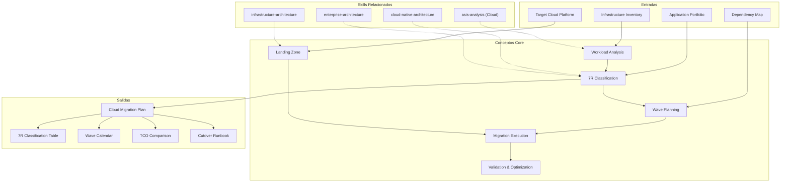

# Cloud Migration: Assessment, Planning & Execution

Cloud migration moves workloads from on-premises or legacy environments to cloud platforms. This skill produces comprehensive migration plans covering 7R assessment, workload analysis, wave planning, landing zone design, execution patterns, and post-migration optimization. [EXPLICIT]

## Grounding Guideline

**Migrating without a 7R strategy is moving datacenter problems to the cloud.** Every workload deserves an explicit classification (rehost, replatform, refactor, repurchase, retire, retain, relocate). Wave planning reduces risk. Cutover rehearsal is mandatory — a production cutover is never performed without a staging rehearsal.

### Cloud Migration Philosophy

1. **7R assessment per workload.** There is no "migrate everything the same way". Each application has context, dependencies, and constraints that determine its optimal strategy. [EXPLICIT]
2. **Wave planning reduces risk.** Big-bang migrations are gambles. Incremental waves allow learning, tooling adjustments, and progressive throughput scaling. [EXPLICIT]
3. **Cutover rehearsal is mandatory.** If the runbook has not been executed end-to-end in staging, it is not ready for production. Includes rollback — always. [EXPLICIT]
4. **Retire ruthlessly.** Every workload that does not migrate is cost avoided. The "retain" and "retire" classifications are legitimate architecture decisions. [EXPLICIT]

## Inputs

The user provides a migration program or portfolio name as `$ARGUMENTS`. Parse `$1` as the **program/portfolio name** used throughout all output artifacts. [EXPLICIT]

**Parameters:**
- `{MODO}`: `piloto-auto` (default) | `desatendido` | `supervisado` | `paso-a-paso`
  - **piloto-auto**: Auto para discovery y 7R classification, HITL para wave sequencing y cutover decisions. [EXPLICIT]
  - **desatendido**: Zero interruptions. Plan de migración completo automáticamente. Assumptions documented. [EXPLICIT]
  - **supervisado**: Autónomo con checkpoint en 7R classification y landing zone design. [EXPLICIT]
  - **paso-a-paso**: Confirma cada workload classification, wave assignment, landing zone component, y cutover step. [EXPLICIT]
- `{FORMATO}`: `markdown` (default) | `html` | `dual`
- `{VARIANTE}`: `ejecutiva` (~40% — S1 7R classification + S3 wave plan + S5 cutover) | `técnica` (full 6 sections, default)

Before generating migration plan, detect existing infrastructure context:

```
!find . -name "*.tf" -o -name "*.yaml" -o -name "inventory*" -o -name "*.csv" | head -20
```

If reference materials exist, load them:

```
Read ${CLAUDE_SKILL_DIR}/references/migration-patterns.md
```

---

## When to Use

- Planning migration of workloads from on-premises to cloud
- Classifying applications using the 7R framework
- Mapping application dependencies for migration sequencing
- Designing cloud landing zones for migrated workloads
- Planning migration waves and cutover execution
- Validating post-migration performance and decommissioning legacy systems

## When NOT to Use

- Designing cloud-native architecture for new applications --> use cloud-native-architecture skill
- Infrastructure platform design (VPC, compute, storage) --> use infrastructure-architecture skill
- Current-state analysis without migration intent --> use asis-analysis skill
- Enterprise portfolio strategy --> use enterprise-architecture skill

---

## Delivery Structure: 6 Sections

### S1: Migration Assessment & 7R Classification

Classify every workload using the 7R framework to determine optimal migration strategy. [EXPLICIT]

**7R Strategies:**
- **Rehost (Lift-and-Shift):** Move as-is to cloud VMs. Fastest, lowest risk, no modernization. Best for: quick wins, legacy apps with no code access.
- **Replatform (Lift-and-Reshape):** Minor adjustments (managed DB, container runtime). Moderate effort. Best for: apps that benefit from managed services without rewrite.
- **Refactor (Re-architect):** Redesign for cloud-native. Highest effort, highest cloud benefit. Best for: strategic apps with 5+ year lifecycle.
- **Repurchase (Drop-and-Shop):** Replace with SaaS equivalent. Best for: commodity functions (email, CRM, HR).
- **Retire:** Decommission. Best for: unused, redundant, or replaced applications.
- **Retain:** Keep on-premises. Best for: compliance constraints, recent investment, nearing end-of-life.
- **Relocate (Hypervisor-level):** Move VMs at hypervisor level (VMware Cloud on AWS). Best for: rapid datacenter exit.

**Classification Decision Matrix:**

| Factor | Rehost | Replatform | Refactor |
|---|---|---|---|
| Business criticality | Low-medium | Medium | High (strategic) |
| Technical complexity | Any | Low-medium | High (code access required) |
| Timeline pressure | Urgent (<3 months) | Moderate (3-6 months) | Long-term (6-18 months) |
| Cloud benefit needed | Minimal | Moderate | Maximum |
| Budget | Low ($) | Medium ($$) | High ($$$) |

**Output:** Application-by-application classification table with strategy, rationale, effort estimate, risk level, and wave assignment.

### S2: Workload Analysis & Dependency Mapping

Automated discovery using AWS Application Discovery/Migration Hub, Azure Migrate, Google Cloud Migration Center, Cloudamize, or Flexera One. Start agentless for broad inventory, deploy agents on Tier 1/2 apps. Run discovery minimum 30 days for full monthly patterns. [EXPLICIT]

Covers: application inventory (name, owner, criticality, stack, infra requirements, performance baseline), dependency graph (app-to-app, app-to-infra, data, external), data gravity analysis (scoring, transfer time estimates), and application difficulty scoring (composite 1-5 scale). See `references/workload-analysis.md` for the complete discovery tool matrix, scoring formulas, and anti-patterns. [EXPLICIT]

### S3: Wave Planning & Sequencing

**Migration Factory Model:**

A migration factory standardizes repeatable processes across waves. Structure:

| Role | Responsibility | Staffing |
|---|---|---|
| Factory Manager | Wave scheduling, escalation, metrics | 1 per program |
| Migration Architect | Technical design per application | 1 per 10-15 apps |
| Migration Engineer | Execute rehost/replatform using tooling | 2-4 per wave |
| Test Lead | Validation scripts, acceptance criteria | 1 per wave |
| App Owner (from business) | Requirements, UAT sign-off, cutover approval | 1 per application |

- Automation backbone: AWS Cloud Migration Factory, Azure Migrate, or custom Terraform + Ansible pipeline.
- Metrics: apps migrated/week, avg cutover duration, rollback rate, post-migration incidents.
- Target throughput: 15-25 apps/month at steady state after Wave 2.

**Wave Design:**
- Wave 0 (Foundation): Landing zone, connectivity, shared services, monitoring. Duration: 4-6 weeks.
- Wave 1 (Pilot): 2-3 low-risk, low-dependency applications. Duration: 2-4 weeks. Purpose: validate tooling and process.
- Wave 2-N (Production): Grouped by dependency clusters, business domain, or team. Duration: 2-6 weeks each.
- Final Wave: Complex, high-risk, deeply integrated systems.

**Pilot Selection Criteria:**
- Low business criticality (failure is recoverable)
- Few dependencies (isolated, self-contained)
- Representative technology (validates migration tooling)
- Willing team (champions who provide feedback)
- Measurable success criteria defined upfront

**Wave Calendar:**
- 1-2 week buffer between waves for retrospective and tooling fixes
- Go/no-go gate before each wave starts
- Parallel streams: infrastructure, application, data, testing, cutover

### S4: Landing Zone Design

**Account Structure:**
- Management: billing, organizational policies, SCPs
- Shared services: logging, monitoring, security tooling, CI/CD
- Network hub: transit gateway, VPN/Direct Connect, DNS
- Workload accounts: per-environment or per-application

**Networking:**
- Hybrid connectivity: VPN (quick, lower bandwidth) or Direct Connect/ExpressRoute (dedicated)
- Transit Gateway / Azure Virtual WAN: hub-and-spoke inter-account routing
- DNS: split-horizon for gradual cutover
- IP address planning: non-overlapping CIDR ranges with future growth headroom

**Security Baseline:**
- IAM: federated identity (SSO via SAML/OIDC), service roles, least privilege
- Encryption: at rest (KMS), in transit (TLS 1.2+), key rotation
- Network: security groups, NACLs, WAF, DDoS protection
- Logging: CloudTrail/Activity Log, VPC Flow Logs, centralized SIEM

**Governance Guardrails:**
- Preventive: SCPs/Azure Policy blocking dangerous actions (public storage, root usage)
- Detective: Config Rules, Security Hub, compliance dashboards
- Tagging: mandatory (owner, environment, cost-center, migration-wave)
- Budget alerts: per-account, per-wave, anomaly detection

### S5: Migration Execution Patterns

Covers rehost tools (AWS MGN, Azure Migrate/Site Recovery, GCP Migrate), database migration (homogeneous/heterogeneous, zero-downtime replication), TCO calculator methodology (7 cost categories, 18-36 month break-even), cutover rehearsal checklist (10-step dress rehearsal), rollback decision criteria (6 threshold-based triggers), and 7 common anti-patterns with mitigations. See `references/workload-analysis.md` for the complete execution patterns, TCO table, checklists, and anti-pattern catalog. [EXPLICIT]

### S6: Validation & Optimization

**Parallel-Run Validation:**
- Run source and target simultaneously for 1-4 weeks
- Compare: response codes, data checksums, latency percentiles
- Escalation gates: <1% discrepancy = proceed; 1-5% = investigate; >5% = halt

**Functional Validation:** Automated test suites, manual smoke testing of critical flows, integration testing with dependent systems, data validation.

**Performance Baseline:** Compare cloud vs. on-premises for latency, throughput, resource utilization. Document regressions.

**Cost Optimization (post-migration):**
- Right-size after 2-4 weeks of utilization data
- Reserved instances / savings plans for steady-state
- Spot for batch. Storage tiering. Delete orphaned resources.
- Target: 15-30% cost reduction within 90 days of migration completion.

**Decommission:**
- Validation period complete and signed off
- Archive required data per retention policy
- Reclaim licenses. Secure hardware disposal.
- Update architecture diagrams and CMDB

---

## Trade-off Matrix

| Decision | Enables | Constrains | When to Use |
|---|---|---|---|
| Rehost | Speed, low risk | No modernization | Datacenter exit deadline |
| Replatform | Some cloud benefit, moderate effort | Partial optimization | Managed DB, container runtime swaps |
| Refactor | Full cloud-native benefit | High effort, long timeline | Strategic, 5+ year lifecycle apps |
| Migration Factory | Repeatable, metrics-driven, scalable | Setup overhead, process rigidity | >20 applications, enterprise programs |
| Big Bang | Clean cutover, no hybrid period | High risk, long outage | Small portfolios (<10 apps), maintenance windows |
| Wave-Based | Incremental risk, learning curve | Hybrid period, dual costs | Large portfolios, enterprise migrations |
| Direct Connect | High bandwidth, low latency | Cost, 4-8 week lead time | Large data (>5TB), long-term hybrid |

---

## Assumptions

- Target cloud platform selected (AWS, Azure, GCP, or multi-cloud)
- Application inventory exists or can be discovered
- Budget approved for migration (dual-run costs included)
- Team has or will develop cloud operations skills
- Business stakeholders available for cutover scheduling and sign-off

## Limits

- Does not design cloud-native architecture for refactored applications (use cloud-native-architecture skill)
- Does not design infrastructure platform from scratch (use infrastructure-architecture skill)
- Does not assess current state without migration context (use asis-analysis skill)
- Organizational change management (training, team restructuring) acknowledged but not deeply covered

---

## Edge Cases

**Datacenter Exit with Hard Deadline:**
Favor rehost for speed. Accept technical debt. Plan post-migration optimization waves. Prioritize by lease expiry. [EXPLICIT]

**Shared Database Serving Multiple Applications:**
Cannot migrate database independently. Options: migrate all consumers together, introduce API layer to decouple, or replicate and gradually cut over consumers. [EXPLICIT]

**Mainframe Workloads:**
Specialized tools (Micro Focus, AWS Mainframe Modernization, Azure Mainframe Migration). Replatform to cloud-hosted emulation first, then gradually refactor. [EXPLICIT]

**Compliance-Restricted Data:**
Data residency may limit regions. Encryption requirements affect replication tooling. Audit trail must be maintained through migration. [EXPLICIT]

**No Source Code Available:**
Rehost is the only viable strategy. Containerization may be possible for binary apps. Evaluate repurchase with SaaS alternative. [EXPLICIT]

---

## Validation Gate

Before finalizing delivery, verify:

- [ ] Every application has a 7R classification with documented rationale
- [ ] Automated discovery tool deployed and ran for 30+ days
- [ ] Dependency graph covers all inter-application and data dependencies
- [ ] TCO comparison completed (on-prem vs. cloud, including migration costs)
- [ ] Wave plan sequences applications by dependency and risk
- [ ] Migration factory roles and automation defined
- [ ] Landing zone meets security, networking, and governance requirements
- [ ] Cutover rehearsal checklist completed for pilot wave
- [ ] Rollback decision criteria defined with specific thresholds
- [ ] Performance baselines captured for pre/post comparison
- [ ] Cost optimization plan ready for post-migration execution

---

## Output Format Protocol

| Format | Default | Description |
|--------|---------|-------------|
| `markdown` | Yes | Rich Markdown + Mermaid diagrams. Token-efficient. |
| `html` | On demand | Branded HTML (Design System). Visual impact. |
| `dual` | On demand | Both formats. |

Default output is Markdown with embedded Mermaid diagrams. HTML generation requires explicit `{FORMATO}=html` parameter. [EXPLICIT]

## Output Artifact

**Primary:** `A-01_Cloud_Migration_Plan.html` -- Executive summary, 7R classification table, dependency map, wave plan, landing zone design, execution playbook, validation checklist, cost optimization targets.

**Secondary:** Application inventory spreadsheet, wave calendar, cutover runbook, rollback procedures, TCO comparison, decommission checklist.

## Edge Cases

| Case | Handling Strategy |
|---|---|
| Datacenter exit with hard deadline | Favor rehost for speed. Accept tech debt. Plan post-migration optimization waves. Prioritize by lease expiry. |
| Shared database serving multiple apps | Do not migrate DB independently. Options: migrate all consumers together, API layer to decouple, or replicate and gradual cutover. |
| Mainframe workloads | Specialized tools (Micro Focus, AWS Mainframe Modernization). Replatform to cloud-hosted emulation first, gradual refactor. |
| Compliance-restricted data | Data residency may limit regions. Encryption requirements affect replication tooling. Audit trail during migration. |
| No source code available | Rehost is the only viable strategy. Containerization possible for binary apps. Evaluate repurchase with SaaS alternative. |
| >200 workloads without inventory | Deploy agentless discovery minimum 30 days before classifying. Migration factory model is mandatory for throughput. |

## Decisions and Trade-offs

| Decision | Discarded Alternative | Justification |
|---|---|---|
| 7R framework for classification | Binary migrate/no-migrate, simplified 3R | 7R (Rehost/Replatform/Refactor/Repurchase/Retire/Retain/Relocate) covers the full spectrum of options. Retire and Retain are legitimate decisions that avoid unnecessary cost. |
| Wave-based migration over big-bang | Big-bang of entire portfolio | Waves reduce blast radius, enable incremental learning, and scale throughput progressively. Big-bang maximizes risk. |
| Mandatory cutover rehearsal | Direct cutover in production | Rehearsal validates runbook end-to-end, measures real duration, and tests rollback. Without rehearsal, surprises on go-live night. |
| Migration factory model for >20 apps | Artisanal migration per application | Factory standardizes repeatable processes, enables metrics (apps/week), and scales throughput to 15-25 apps/month. |

## Knowledge Graph



## Output Templates

**Formato Markdown (default):**

```
# Cloud Migration Plan: {program}
## S1: Migration Assessment & 7R Classification
| Application | Strategy | Rationale | Effort | Risk | Wave |
...
## S2: Workload Analysis & Dependency Mapping
### Dependency Graph (Mermaid)
### Data Gravity Analysis
## S3: Wave Planning & Sequencing
### Wave 0: Foundation (4-6 weeks)
### Wave 1: Pilot (2-4 weeks)
### Wave 2-N: Production
## S4: Landing Zone Design
## S5: Migration Execution Patterns
### Cutover Rehearsal Checklist
### Rollback Decision Criteria
## S6: Validation & Optimization
### TCO Comparison
| Category | On-Prem | Cloud |
...
```

**Formato XLSX (bajo demanda):**

```
Sheet 1: Application Inventory — name, owner, criticality, stack, 7R, wave, effort, risk
Sheet 2: Dependency Matrix — source app, target app, dependency type, coupling level
Sheet 3: Wave Calendar — wave #, apps, dates, duration, go/no-go status
Sheet 4: TCO Comparison — cost categories, on-prem vs cloud, break-even
Sheet 5: Cutover Runbook — step, responsible, duration, rollback, status
Sheet 6: Post-Migration Optimization — right-sizing, RI/SP, storage tiering
```

**Formato HTML (bajo demanda):**
- Filename: `A-01_Cloud_Migration_Plan_{cliente}_{WIP}.html`
- Estructura: HTML self-contained branded (Design System MetodologIA v5). Light-First Technical page con tabla 7R clasificacion filtrable por wave, wave calendar como Gantt interactivo, y cutover runbook con checklist colapsable. WCAG AA, responsive, print-ready.

**Formato DOCX (bajo demanda):**
- Filename: `{fase}_Cloud_Migration_Plan_{cliente}_{WIP}.docx`
- Via python-docx con Design System MetodologIA v5. Cover page, TOC auto, headers/footers branded, tablas zebra. Poppins headings (navy), Trebuchet MS body, gold accents.

**Formato PPTX (bajo demanda):**
- Filename: `{fase}_{entregable}_{cliente}_{WIP}.pptx`
- Via python-pptx con MetodologIA Design System v5. Slide master con gradiente navy, titulos Poppins, cuerpo Trebuchet MS, acentos gold. Max 20 slides (ejecutiva) / 30 slides (tecnica). Speaker notes con referencias de evidencia. Para comites directivos y presentaciones C-level.

## Evaluacion

| Dimension | Peso | Criterio |
|---|---|---|
| Trigger Accuracy | 10% | Activacion correcta ante keywords de cloud migration, 7R, wave planning, landing zone, cutover, lift-and-shift. |
| Completeness | 25% | 6 secciones cubren assessment, workloads, waves, landing zone, execution, y validation. Cada app tiene 7R classification. |
| Clarity | 20% | 7R classification con rationale por aplicacion. Wave sequencing justificado por dependencias. Rollback criteria con thresholds especificos. |
| Robustness | 20% | Edge cases (deadline, shared DB, mainframe, compliance, no source code, >200 workloads) manejados. Anti-patterns documentados. |
| Efficiency | 10% | Variante ejecutiva reduce a S1+S3+S5 (~40%). Migration factory model escala throughput. |
| Value Density | 15% | TCO comparison con break-even. Cutover rehearsal checklist accionable. Rollback decision criteria con thresholds automatizables. |

**Umbral minimo: 7/10.** Debajo de este umbral, revisar 7R classification completeness y cutover rehearsal coverage.

---
**Autor:** Javier Montano · Comunidad MetodologIA | **Ultima actualizacion:** 15 de marzo de 2026
