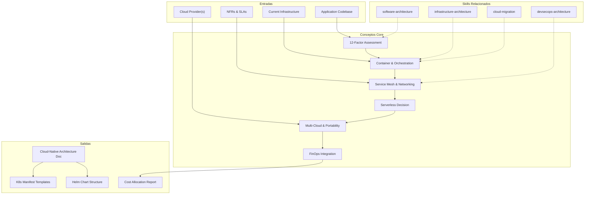

# Cloud-Native Architecture: Containers, Mesh, Serverless & Cost Optimization

Cloud-native architecture designs applications to fully exploit cloud platforms -- containers, orchestration, service mesh, serverless, infrastructure as code, and cost-aware engineering. This skill produces architecture documentation guiding teams from cloud readiness assessment through production-grade deployment. [EXPLICIT]

## Grounding Guideline

**Cloud-native is not "moving to the cloud" — it is designing FOR the cloud.** Containers by default, service mesh for observability, serverless where stateless, integral FinOps from day one. The goal is not to use cloud services — it is to exploit cloud properties: elasticity, resilience, observability, and continuous cost optimization.

### Cloud-Native Philosophy

1. **Containers by default.** Every workload starts as a container. Only deviates to serverless (stateless, event-driven) or VM (legacy without refactor) with explicit justification. [EXPLICIT]
2. **Service mesh for observability.** mTLS, traffic management, and distributed tracing are not optional — they are base infrastructure for operating microservices in production. [EXPLICIT]
3. **Serverless where stateless.** Serverless functions for event processing, transformations, and glue code. Never for stateful logic or latency-critical paths. [EXPLICIT]
4. **Integral FinOps.** Cost is a quality attribute. It is measured, allocated, optimized. OpenCost from day one. [EXPLICIT]

## Inputs

The user provides a system or platform name as `$ARGUMENTS`. Parse `$1` as the **system/platform name** used throughout all output artifacts. [EXPLICIT]

**Parameters:**
- `{MODO}`: `piloto-auto` (default) | `desatendido` | `supervisado` | `paso-a-paso`
  - **piloto-auto**: Auto para assessment y container strategy, HITL para decisiones mesh/serverless y FinOps targets. [EXPLICIT]
  - **desatendido**: Zero interruptions. Arquitectura cloud-native documentada automáticamente. Assumptions documented. [EXPLICIT]
  - **supervisado**: Autónomo con checkpoint en mesh adoption y multi-cloud decisions. [EXPLICIT]
  - **paso-a-paso**: Confirma cada 12-factor assessment, container design, mesh config, y FinOps plan. [EXPLICIT]
- `{FORMATO}`: `markdown` (default) | `html` | `dual`
- `{VARIANTE}`: `ejecutiva` (~40% — S1 assessment + S2 container strategy + S6 FinOps) | `técnica` (full 6 sections, default)

Before generating architecture, detect cloud-native context:

```
!find . -name "Dockerfile" -o -name "*.yaml" -o -name "*.tf" -o -name "helm" -type d -o -name "serverless.yml" | head -20
```

If reference materials exist, load them:

```
Read ${CLAUDE_SKILL_DIR}/references/cloud-native-patterns.md
```

---

## When to Use

- Assessing application readiness for cloud-native transformation
- Designing container strategy and Kubernetes architecture
- Evaluating service mesh adoption (Istio, Linkerd, Cilium)
- Making serverless vs. container decisions per workload
- Planning multi-cloud or cloud-agnostic architecture
- Implementing FinOps practices for cost visibility and optimization

## When NOT to Use

- Infrastructure platform design (VPCs, compute, storage) --> use infrastructure-architecture skill
- CI/CD pipelines and supply chain security --> use devsecops-architecture skill
- Application internal structure and patterns --> use software-architecture skill
- Migrating existing workloads to cloud --> use cloud-migration skill

---

## Delivery Structure: 6 Sections

### S1: Cloud-Native Assessment

Evaluate the application against cloud-native principles to identify gaps and transformation priorities. [EXPLICIT]

**12-Factor Compliance Audit:**
Rate each factor as compliant / partial / non-compliant with remediation effort (S/M/L):
1. Codebase: one repo, many deploys
2. Dependencies: explicitly declared, isolated
3. Config: stored in environment, not code
4. Backing services: attached resources (DB, cache, queue)
5. Build/release/run: strict stage separation
6. Processes: stateless, share-nothing
7. Port binding: self-contained, export via port
8. Concurrency: scale out via process model
9. Disposability: fast startup (<10s), graceful shutdown (SIGTERM handler, drain connections)
10. Dev/prod parity: minimize environment drift
11. Logs: treat as event streams (stdout)
12. Admin processes: run as one-off tasks

**Containerization Readiness Checklist:**
- Stateful components identified (database, file storage, sessions)
- External dependency inventory (APIs, queues, caches)
- Configuration externalized to env vars or config maps
- Health check endpoints (liveness + readiness + startup probes)
- Graceful shutdown with connection draining
- Secret management via Vault, AWS Secrets Manager, or sealed-secrets

### S2: Container & Orchestration Strategy

**Container Image Best Practices:**
- Base images: distroless (Google) or Alpine (<5MB). Never use `latest` tag.
- Multi-stage builds: separate build and runtime layers. Final image <100MB target.
- Image scanning in CI: Trivy (CNCF, free), Grype, or Snyk Container. Block Critical/High CVEs.
- Registry: private, image signing (cosign/Sigstore), tag immutability enforced.

**Kubernetes Architecture:**
- Cluster topology: single-cluster per env (simple) vs. multi-cluster per region (HA/DR).
- Namespace strategy: per-team or per-service. Enforce with NetworkPolicies + RBAC.
- Pod design: sidecar for cross-cutting (logging, proxy), init containers for bootstrapping, PodDisruptionBudgets for availability.

**Resource Request/Limit Guidance:**

| Resource | Request | Limit | Rationale |
|---|---|---|---|
| CPU | Set at P95 usage (from VPA data) | Omit or set 5x request | Avoids CPU throttling; burst on idle cores |
| Memory | Set at P95 usage | Set at 1.5-2x request | OOMKill preferred over node instability |
| Ephemeral storage | Set if logs/cache grow | Set at 2x request | Prevents eviction |

- Start with VPA in recommend-only mode for 7+ days before tuning.
- Default LimitRange guardrails: 100m CPU / 128Mi request, 500m CPU / 512Mi limit.
- Overcommit ratio: 1.2-1.5x for CPU (safe burst), 1.0x for memory (no overcommit).

**Node Autoscaling Decision Matrix:**

| Tool | Mechanism | Provision Speed | Best For |
|---|---|---|---|
| Cluster Autoscaler | ASG-based, node group templates | 2-5 min | Homogeneous workloads, simple setups |
| Karpenter (AWS) | Direct EC2 API, right-sized nodes | 30-60s | Heterogeneous workloads, spot optimization, cost-sensitive |
| GKE NAP | GKE-native, auto node pools | 1-2 min | GKE clusters, managed simplicity |

- **Prefer Karpenter** on EKS for new deployments: faster provisioning, better bin-packing, native spot/OD mix, consolidation (replaces underutilized nodes automatically).
- Use Cluster Autoscaler only when Karpenter is unavailable (AKS, on-prem) or organizational policy requires ASG-based scaling.

**Pod Autoscaling Decision Matrix:**

| Tool | Trigger | Scales To Zero | Best For |
|---|---|---|---|
| HPA | CPU/memory/custom metrics | No | HTTP traffic, steady load spikes |
| VPA | Historical usage analysis | N/A | Right-sizing, legacy apps (recommend-only mode safe) |
| KEDA | External events (Kafka lag, SQS, cron, Prometheus) | Yes | Queue workers, batch jobs, event-driven |

- Never combine VPA and HPA on the same metric.
- Combination pattern: KEDA for async + HPA for HTTP + VPA recommend-only + Karpenter for nodes.

**GitOps Deployment:**
- ArgoCD or Flux for declarative, auditable, rollback-capable deployments.
- Helm charts with values-per-environment. OCI registry for chart storage.

### S3: Service Mesh & Networking

**Gateway API vs. Ingress (2025-2026):**

| Aspect | Ingress (Legacy) | Gateway API (Standard) |
|---|---|---|
| Status | Ingress-NGINX retiring March 2026 | GA, v1.2+, CNCF standard |
| Role model | Single resource, annotation-heavy | HTTPRoute, GRPCRoute, TCPRoute (role-oriented) |
| TLS | Annotation-based | First-class TLSRoute |
| Multi-tenancy | Weak | Built-in (Gateway per team, shared GatewayClass) |
| Implementations | NGINX, HAProxy | Envoy Gateway, Cilium, Istio, Kong, Contour |

- **Migrate all new clusters to Gateway API.** Existing Ingress: plan migration before NGINX retirement.
- Recommended implementations: Envoy Gateway (highest conformance), Cilium Gateway (if already using Cilium CNI).

**CNI & Service Mesh Comparison:**

| Tool | Type | Data Plane | Resource Overhead | Best For |
|---|---|---|---|---|
| Cilium | CNI + mesh + observability | eBPF (kernel) | Lowest (no sidecar for L3/L4) | Teams wanting unified networking + mesh + observability |
| Calico | CNI + network policy | iptables or eBPF | Low | Network policy enforcement, simple CNI |
| Istio Ambient | Mesh (L4 ztunnel + L7 waypoint) | Per-node + per-namespace | 90% less than sidecar mode | Zero-trust mTLS at scale, new deployments |
| Istio Sidecar | Mesh (Envoy per pod) | Per-pod sidecar | ~50-100MB/sidecar | Complex L7 traffic management |
| Linkerd | Mesh (Rust proxy) | Per-pod sidecar (~10MB) | Very low | Teams wanting simplicity over features |

- **Decision rule:** <10 services with simple patterns = no mesh. Need mTLS only = Cilium or Istio Ambient. Need L7 traffic management = Istio Sidecar or Linkerd. Already using Cilium CNI = Cilium Service Mesh.

**mTLS & Zero Trust:** Mesh-managed short-lived certificates (hours). Service-to-service RBAC, deny-by-default. SPIFFE identities.

**Traffic Management:** Canary (gradual shift), blue-green (instant), A/B (header/weight). Circuit breaking, rate limiting, retry/timeout (idempotent operations only).

**Observability Stack:**
- Distributed tracing: OpenTelemetry (CNCF standard) with Jaeger or Grafana Tempo.
- Metrics: Prometheus + Grafana. RED metrics per service (Rate, Errors, Duration).
- eBPF-based observability (zero-instrumentation): Cilium Hubble (network flows), Pixie (auto-instrumented traces), Tetragon (security events). Use for polyglot environments where manual instrumentation is impractical.

### S4: Serverless Decision Framework

**Decision Matrix:**

| Factor | Favor Serverless | Favor Containers |
|---|---|---|
| Traffic pattern | Spiky, unpredictable | Steady, predictable |
| Execution time | <15 minutes | Long-running |
| State | Stateless | Stateful |
| Cold start tolerance | Acceptable (100-500ms) | Not acceptable (<50ms) |
| Cost at volume | <1M invocations/month | >10M invocations/month |
| Vendor lock-in | Acceptable | Not acceptable |

**Cold Start Mitigation:** Provisioned concurrency, smaller packages (tree-shaking, layers), language choice (Go/Rust <100ms, Java/C# 500ms-2s), SnapStart (Java on Lambda), warm-up pings.

**State Management:** External stores (DynamoDB, Redis, S3). Step Functions / Durable Functions for orchestration. Event-driven decoupling via queues.

**Vendor Lock-in Assessment:** Abstraction layers (SST, Pulumi, Serverless Framework). Exit cost per component. Prefer open standards (CloudEvents, OpenTelemetry).

### S5: Multi-Cloud & Portability

**Strategy Tiers:**
- Tier 1: Cloud-agnostic app (Kubernetes, standard APIs). Cost: low. Benefit: portability.
- Tier 2: Portable infrastructure (Terraform, Crossplane). Cost: medium. Benefit: negotiation leverage.
- Tier 3: Active multi-cloud (workloads distributed). Cost: high. Benefit: DR, compliance, best-of-breed.

**Abstraction Approaches:**
- Kubernetes as portability layer: same manifests across EKS/GKE/AKS.
- Terraform: provider-agnostic HCL modules. State in remote backend.
- Crossplane: Kubernetes-native infrastructure provisioning across clouds.
- Application-level: abstract cloud SDKs behind interfaces (storage, queue, identity).

**Cloud-Agnostic Patterns:**
- Use open standards: S3-compatible storage (MinIO), OpenTelemetry, OIDC, CloudEvents.
- Data gravity: place compute near data; minimize cross-cloud data transfer.
- Policy-as-code: OPA/Gatekeeper enforced across all clusters.

### S6: FinOps Integration

**FinOps Tooling Comparison:**

| Tool | License | Scope | Unique Value |
|---|---|---|---|
| OpenCost | Open source (CNCF Incubating) | K8s workload costs | Free, Prometheus-native, MCP server for AI-driven cost queries |
| Kubecost | Freemium (backed by IBM) | K8s + cloud costs | Savings recommendations, network cost visibility, enterprise support |
| Vantage | Commercial SaaS | Multi-cloud + SaaS | Unified dashboard across AWS/Azure/GCP/Datadog/Snowflake |
| FOCUS | Open standard (FinOps Foundation) | Billing data format | Normalize billing across providers for consistent reporting |

- **Start with OpenCost** for Kubernetes-native cost allocation. Add Kubecost for savings recommendations. Use Vantage or CloudHealth for multi-cloud executive dashboards.
- OpenCost 2025: runs without Prometheus (Collector Datasource), MCP server for AI agent cost queries, plugin framework for Datadog/OpenAI/MongoDB Atlas cost monitoring.

**Cost Allocation:** Namespace/pod-level via OpenCost/Kubecost. Label strategy: team, service, environment, cost-center. Showback reports per team.

**Optimization Levers:**
- Rightsizing: VPA recommendations after 2+ weeks of data.
- Spot/preemptible: 60-90% savings for fault-tolerant workloads. Karpenter automates spot/OD mix.
- Scale to zero: KEDA for queue workers, serverless for event-driven.
- Ephemeral environments: spin up per PR, tear down on merge.
- Storage lifecycle: S3 Intelligent Tiering, EBS snapshot cleanup.
- Network: minimize cross-AZ traffic via topology-aware routing.

**Cost Governance:**
- Daily cost by team/service/environment dashboard.
- Unit economics: cost per user, cost per transaction.
- Anomaly alerts: >20% daily spike triggers investigation.
- Budget alerts per account, per namespace.

---

## Trade-off Matrix

| Decision | Enables | Constrains | When to Use |
|---|---|---|---|
| Kubernetes | Portability, scaling, ecosystem | Operational complexity | Polyglot microservices, experienced teams |
| Service Mesh | mTLS, traffic control, observability | Resource overhead, complexity | >10 services, zero-trust required |
| Serverless | Zero ops, pay-per-use | Cold start, vendor lock-in | Event-driven, low-volume, spiky traffic |
| Multi-Cloud | Avoid lock-in, negotiate pricing | Complexity, lowest-common-denominator | Regulatory, negotiation leverage, DR |
| GitOps (ArgoCD) | Auditable, declarative, rollback | Learning curve, git as bottleneck | Kubernetes-native, compliance-driven |
| Spot Instances | 60-90% cost savings | Interruption risk | Stateless, fault-tolerant workloads |
| Karpenter over CA | Faster scaling, better bin-packing | AWS-only (EKS) | EKS clusters with heterogeneous workloads |
| Gateway API over Ingress | Multi-tenancy, role-based, extensible | Newer ecosystem | All new clusters; migrate existing before NGINX retirement |

---

## Assumptions

- Application is being modernized or built for cloud deployment
- Team has or is developing container and orchestration skills
- Cloud provider(s) selected or shortlisted
- Budget includes cloud-native tooling (mesh, GitOps, cost tools)

## Limits

- Does not design internal application architecture (use software-architecture skill)
- Does not cover infrastructure platform setup (use infrastructure-architecture skill)
- Does not plan CI/CD pipelines (use devsecops-architecture skill)
- FinOps practices require organizational buy-in beyond architecture decisions

---

## Edge Cases

**Monolith Containerization:**
Containerize the monolith first (lift-and-shift to container), then decompose. Use strangler fig pattern. Do not attempt simultaneous containerization and decomposition. [EXPLICIT]

**Stateful Workloads on Kubernetes:**
Use operators (CloudNativePG for PostgreSQL, Strimzi for Kafka). Alternative: managed services outside K8s. Evaluate operational burden vs. portability. [EXPLICIT]

**Serverless at Scale (>10M invocations/month):**
Model break-even point. Container alternative often cheaper at high volume. Reserved concurrency or Fargate may be more cost-effective. [EXPLICIT]

**Regulated Industries:**
Service mesh mTLS may be mandatory. Image provenance required (SLSA, Sigstore/cosign). Multi-cloud may be required for data residency. Audit logging at infrastructure layer. [EXPLICIT]

**Small Team (<5 developers):**
Full K8s + mesh is likely over-engineered. Use managed Kubernetes, skip mesh, use cloud-managed services. Revisit as team grows. [EXPLICIT]

---

## Validation Gate

Before finalizing delivery, verify:

- [ ] 12-factor compliance gaps identified with remediation plan
- [ ] Container strategy includes security scanning and minimal base images
- [ ] Resource requests/limits configured per guidance table (CPU burst, memory capped)
- [ ] Node autoscaler selected (Karpenter vs. CA) with rationale
- [ ] Service mesh decision justified (adopt vs. defer) with comparison matrix
- [ ] Gateway API adopted for ingress (or migration plan from Ingress documented)
- [ ] Serverless vs. container decision documented per workload
- [ ] FinOps tooling deployed (OpenCost minimum) with cost allocation labels
- [ ] Auto-scaling configured for all stateless workloads (HPA/KEDA + Karpenter)
- [ ] GitOps deployment pipeline in place

---

## Output Format Protocol

| Format | Default | Description |
|--------|---------|-------------|
| `markdown` | Yes | Rich Markdown + Mermaid diagrams. Token-efficient. |
| `html` | On demand | Branded HTML (Design System). Visual impact. |
| `dual` | On demand | Both formats. |

Default output is Markdown with embedded Mermaid diagrams. HTML generation requires explicit `{FORMATO}=html` parameter. [EXPLICIT]

## Output Artifact

**Primary:** `A-01_Cloud_Native_Architecture.html` -- Executive summary, 12-factor assessment, container strategy, Kubernetes architecture, service mesh design, serverless decisions, multi-cloud plan, FinOps dashboard.

**Secondary:** Kubernetes manifest templates, Helm chart structure, service mesh configuration, cost allocation report, 12-factor compliance checklist.

## Edge Cases

| Case | Handling Strategy |
|---|---|
| Monolith containerization | Containerize monolith first (lift-and-shift to container), then decompose with strangler fig. Do not attempt containerization and decomposition simultaneously. |
| Stateful workloads on Kubernetes | Use operators (CloudNativePG for PostgreSQL, Strimzi for Kafka). Alternative: managed services outside K8s. Evaluate operational burden vs portability. |
| Serverless at scale (>10M invocations/month) | Model break-even point. Container alternative more cost-effective at high volume. Reserved concurrency or Fargate may be better option. |
| Regulated industries | Service mesh mTLS may be mandatory. Image provenance required (SLSA, Sigstore/cosign). Multi-cloud for data residency. |
| Small team (<5 developers) | Full K8s + mesh probably over-engineered. Managed K8s, skip mesh, cloud-managed services. Revisit as team grows. |

## Decisions and Trade-offs

| Decision | Discarded Alternative | Justification |
|---|---|---|
| Containers by default as baseline | VMs as default, serverless-first | Containers balance portability, reproducibility, and tooling ecosystem (K8s, Helm, ArgoCD). Serverless only for stateless event-driven; VMs only for legacy without refactor. |
| Gateway API over Ingress | Ingress-NGINX, custom load balancers | Gateway API is GA (v1.2+, CNCF standard), supports native multi-tenancy, and replaces Ingress (NGINX retiring March 2026). |
| Karpenter over Cluster Autoscaler (EKS) | Cluster Autoscaler, manual scaling | Karpenter provides 30-60s provisioning (vs 2-5min CA), better bin-packing, and native spot/OD mix. CA only when Karpenter not available (AKS, on-prem). |
| OpenCost as baseline FinOps | Cloud billing dashboards only | OpenCost is CNCF Incubating, free, Prometheus-native, and provides cost allocation at namespace/pod level. Cloud billing lacks K8s granularity. |

## Knowledge Graph



## Output Templates

**Formato Markdown (default):**

```
# Cloud-Native Architecture: {platform}
## S1: Cloud-Native Assessment
### 12-Factor Compliance Audit
| Factor | Status | Remediation | Effort |
...
### Containerization Readiness Checklist
## S2: Container & Orchestration Strategy
### Kubernetes Architecture
### Resource Requests/Limits
### Autoscaling Strategy
## S3: Service Mesh & Networking
### CNI & Mesh Selection
### mTLS & Zero Trust
## S4: Serverless Decision Framework
### Decision Matrix per Workload
## S5: Multi-Cloud & Portability
## S6: FinOps Integration
### Cost Allocation Labels
### Optimization Levers
```

**Formato DOCX (bajo demanda):**

```
1. Executive Summary — cloud-native readiness + key decisions
2. 12-Factor Compliance Matrix — status per factor con remediation plan
3. Container Strategy — image standards, registry, K8s topology
4. Networking & Security — mesh selection, Gateway API, mTLS
5. Serverless vs Container Decisions — per-workload matrix
6. Multi-Cloud Architecture — portability tier, abstraction approach
7. FinOps Dashboard Spec — cost allocation, optimization targets
Appendix A: K8s Manifest Templates
Appendix B: Helm Values per Environment
```

**Formato HTML (bajo demanda):**
- Filename: `A-01_Cloud_Native_Architecture_{cliente}_{WIP}.html`
- Estructura: HTML self-contained branded (Design System MetodologIA v5). Light-First Technical page con 12-factor compliance audit interactivo, service mesh comparison matrix, y FinOps cost allocation dashboard. WCAG AA, responsive, print-ready.

**Formato XLSX (bajo demanda):**
- Filename: `{fase}_{entregable}_{cliente}_{WIP}.xlsx`
- Via openpyxl con Design System MetodologIA v5. Headers branded (fondo navy, texto blanco, Poppins), formato condicional con colores semaforo, auto-filtros, valores sin formulas. Para auditoria 12-factor, matriz de decision serverless vs container y tracking de optimizacion FinOps.

**Formato PPTX (bajo demanda):**
- Filename: `{fase}_{entregable}_{cliente}_{WIP}.pptx`
- Via python-pptx con MetodologIA Design System v5. Slide master con gradiente navy, titulos Poppins, cuerpo Trebuchet MS, acentos gold. Max 20 slides (ejecutiva) / 30 slides (tecnica). Speaker notes con referencias de evidencia. Para comites directivos y presentaciones C-level.

## Evaluacion

| Dimension | Peso | Criterio |
|---|---|---|
| Trigger Accuracy | 10% | Activacion correcta ante keywords de cloud-native, Kubernetes, containers, service mesh, serverless, FinOps, 12-factor. |
| Completeness | 25% | 6 secciones cubren assessment, containers, mesh, serverless, multi-cloud, y FinOps. 12-factor audit completo. |
| Clarity | 20% | Comparison matrices (mesh, autoscaler, serverless vs container) con criterios claros. Decision rules documentadas. |
| Robustness | 20% | Edge cases (monolith, stateful, serverless at scale, regulated, small team) manejados. Gateway API migration path incluido. |
| Efficiency | 10% | Variante ejecutiva reduce a S1+S2+S6 (~40%). Context detection automatiza tailoring a stack existente. |
| Value Density | 15% | Resource request/limit guidance con formulas. FinOps tooling comparison accionable. Autoscaling decision matrix reusable. |

**Umbral minimo: 7/10.** Debajo de este umbral, revisar 12-factor audit completeness y FinOps tooling integration.

---
**Autor:** Javier Montano · Comunidad MetodologIA | **Ultima actualizacion:** 15 de marzo de 2026
