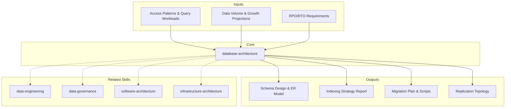

> **Scope:** This skill applies to `{TIPO_SERVICIO}=SDA` and `{TIPO_SERVICIO}=Data-AI`. Database design is relevant for software development and data strategy. For other data contexts, see `data-engineering`, `data-governance`, or `bi-architecture`.

# Database Architecture: Schema Design, Storage Strategy & Data Evolution

Database architecture defines how data is structured, stored, accessed, replicated, and evolved over time. This skill produces comprehensive database design documentation covering schema modeling, indexing, partitioning, high availability, migration strategy, and performance tuning. [EXPLICIT]

## Grounding Guideline

**A schema without an evolution strategy is a schema condemned to break.** Schema evolution is planned BEFORE the first migration. Indexes are designed from measured access patterns, not intuition. Migrations are executed with zero-downtime or not executed at all. Every partitioning, replication, and indexing decision carries quantitative justification and a rollback plan.

## Inputs

The user provides a system or database name as `$ARGUMENTS`. Parse `$1` as the **system/database name** used throughout all output artifacts. [EXPLICIT]

**Parameters:**
- `{MODO}`: `piloto-auto` (default) | `desatendido` | `supervisado` | `paso-a-paso`
  - **piloto-auto**: Auto para profiling y schema design, HITL para decisiones de particionamiento y replicación. [EXPLICIT]
  - **desatendido**: Zero interruptions. Schema, índices y migraciones documentados automáticamente. Assumptions documented. [EXPLICIT]
  - **supervisado**: Autónomo con checkpoint en indexing strategy y migration plan. [EXPLICIT]
  - **paso-a-paso**: Confirma cada tabla, índice, partición y plan de migración. [EXPLICIT]
- `{FORMATO}`: `markdown` (default) | `html` | `dual`
- `{VARIANTE}`: `ejecutiva` (~40% — S1 schema design + S2 indexing + S5 migration plan) | `técnica` (full 6 sections, default)

Before generating architecture, detect the data context:

```
!find . -name "*.sql" -o -name "*.prisma" -o -name "*.schema" -o -name "migrations" -type d | head -20
```

If reference materials exist, load them:

```
Read ${CLAUDE_SKILL_DIR}/references/database-patterns.md
```

---

## Polyglot Persistence Decision Matrix

Match workload to engine. Default to PostgreSQL unless a specialized need is clear. [EXPLICIT]

| Workload | Engine | Why | When NOT to use |
|---|---|---|---|
| **OLTP** (transactions, CRUD) | PostgreSQL, MySQL | ACID, mature tooling, JSON support | Write throughput >100K TPS single-node |
| **Cache / Session** | Redis, Memcached | Sub-ms latency, TTL, pub/sub | Data >RAM, durability required |
| **Full-Text Search** | Elasticsearch, Meilisearch | Inverted index, relevance scoring | Primary datastore, strong consistency |
| **Graph** (relationships) | Neo4j, Amazon Neptune | Traversal queries, path finding | Tabular data, simple joins |
| **Time-Series** | TimescaleDB, ClickHouse | Compression, continuous aggregates | Random-access CRUD |
| **Document** (flexible schema) | MongoDB, DynamoDB | Schema flexibility, horizontal scale | Complex joins, strict consistency |
| **Wide-Column** (high write) | Cassandra, ScyllaDB | Linear write scaling, tunable consistency | Ad-hoc queries, strong consistency |
| **Vector** (embeddings/AI) | pgvector, Pinecone, Qdrant | ANN search, similarity queries | Exact match queries |

**HTAP consideration:** For mixed OLTP+analytics, evaluate AlloyDB, TiDB, or CockroachDB before splitting into separate engines. Fewer moving parts outweighs theoretical optimization.

---

## When to Use

- Designing schema for new systems or major data model changes
- Evaluating indexing strategy for query workloads
- Planning partitioning or sharding for large-scale data
- Setting up replication and high availability
- Planning zero-downtime schema migrations
- Tuning database performance (slow queries, connection management, caching)

## When NOT to Use

- Data pipeline and ETL architecture (data-engineering skill)
- Internal software module structure (software-architecture skill)
- Infrastructure compute and storage platform (infrastructure-architecture skill)
- Data quality rules and profiling (data-quality skill)

---

## Delivery Structure: 6 Sections

### S1: Schema Design & Modeling

Defines the logical and physical data model. [EXPLICIT]

**Includes:**
- Entity-relationship model with cardinality (1:1, 1:N, M:N)
- Normalization analysis (3NF baseline, strategic denormalization with justification)
- Data type selection (precision, storage cost, query implications)
- Naming conventions (snake_case, singular/plural, prefix strategy)
- Constraint design (PKs, FKs, unique, check, NOT NULL, defaults)
- Soft delete vs hard delete strategy with audit trail implications

**Key decisions:**
- Normalization depth: 3NF prevents anomalies; denormalize only with measured read-performance justification
- Surrogate vs natural keys: surrogate (UUID/serial) for stability; natural for domain clarity
- JSON/JSONB columns: flexible schema within structured tables; index with GIN; avoid for frequently queried fields
- Temporal data: SCD Type 2 for history, event sourcing for full audit trail

### S2: Indexing Strategy

Plans indexes to optimize query patterns without degrading write performance. [EXPLICIT]

**Index types and use cases:**
- **B-tree:** Default. Range queries, sorting, equality. Most RDBMS.
- **Hash:** Equality-only lookups. PostgreSQL, DynamoDB.
- **GIN:** Full-text search, JSONB containment, array membership.
- **GiST:** Geometric data, range types, nearest-neighbor.
- **BRIN:** Large tables with naturally ordered data (timestamps, sequential IDs). 1000x smaller than B-tree for time-series.

**Composite indexes:** Column order matters -- most selective first for equality, range column last.

**Covering indexes:** Include non-key columns (INCLUDE clause) to enable index-only scans.

**Partial indexes:** Filter rows at index creation (WHERE clause) -- smaller index for subset queries.

**Index maintenance:**
- Detect unused indexes: `pg_stat_user_indexes.idx_scan = 0` over 30+ days -- drop to reduce write overhead
- Monitor bloat via `pgstatindex` or `pgstattuple`; REINDEX when bloat exceeds 30%
- `REINDEX CONCURRENTLY` (PG 12+) to rebuild without locking reads/writes
- Set `maintenance_work_mem` to 512MB-2GB for faster rebuilds during low-traffic windows
- Alert on index size growth: sudden spikes indicate schema or workload changes

**Key decisions:**
- Read-heavy: more indexes, covering indexes, materialized views
- Write-heavy: fewer indexes, batch inserts, deferred index builds
- Validate with `EXPLAIN ANALYZE`: sequential scan vs index scan vs bitmap scan

### S3: Partitioning & Sharding

Strategies for splitting data across partitions or physical nodes. [EXPLICIT]

**Partitioning (single node):**
- **Range:** Time-based (monthly, yearly), ID ranges -- best for time-series, log data
- **List:** Categorical values (region, status) -- best for enumerated dimensions
- **Hash:** Even distribution by key hash -- best for uniform access patterns
- **Composite:** Range + list for multi-dimensional partitioning

**Sharding (multi-node):**
- Shard key selection: high cardinality, even distribution, query locality
- Consistent hashing: minimizes data movement on shard add/remove
- Directory-based: lookup table maps key ranges to shards (flexible, adds latency)

**Cross-shard considerations:**
- Avoid cross-shard joins by co-locating related data
- Distributed transactions (2PC): high overhead; prefer eventual consistency where possible
- Rebalancing: online shard splitting, background data migration
- Global indexes: trade query speed for write fan-out

### S4: Replication & High Availability

Replication topology, failover strategy, MVCC tuning, and recovery objectives. [EXPLICIT]

**Replication models:**
- **Primary-replica (async):** Low latency writes, eventual consistency reads
- **Primary-replica (sync):** Strong consistency, higher write latency
- **Multi-primary:** Concurrent writes, conflict resolution required
- **Consensus-based (Raft/Paxos):** Strong consistency, automatic leader election (CockroachDB, etcd)

**Failover strategy:**
- Automatic promotion: replica promoted on primary failure (Patroni, pg_auto_failover)
- Semi-automatic: alert + human confirmation before promotion
- Manual: full human control; longer RTO, lower risk of split-brain

**Recovery objectives:**
- RPO (max data loss): sync replication = 0, async = seconds/minutes
- RTO (max downtime): auto-failover = seconds, manual = hours

**MVCC tuning (PostgreSQL):**
- UPDATE/DELETE create dead tuples; autovacuum cleans them but defaults are too conservative for high-write tables
- Tune per-table: `autovacuum_vacuum_scale_factor = 0.01` (1% vs default 20%) for tables >1M rows
- `autovacuum_vacuum_threshold = 50` (vs default 50) combined with lower scale_factor triggers vacuum earlier
- Set `idle_in_transaction_session_timeout = 30s` to prevent long transactions from blocking vacuum
- Replication slots prevent vacuum cleanup if replica falls behind -- monitor `pg_replication_slots.confirmed_flush_lsn` lag
- Table bloat >20% degrades scan performance; monitor with `pgstattuple` or `pgmetrics`

**Read replica management:**
- Lag monitoring: alert at **>1s for interactive reads**, **>30s for analytics reads**; query `pg_stat_replication.replay_lag`
- Lag-aware routing: application checks `pg_last_xact_replay_timestamp()` before routing
- Stale-read protection: route post-write reads to primary; use replicas for eventual-consistency-tolerant reads
- Connection routing: PgBouncer, ProxySQL, or HAProxy for write/read splitting

### S5: Migration & Evolution

Schema versioning, zero-downtime migrations, and rollback strategy. [EXPLICIT]

**Zero-downtime migration patterns:**

| Pattern | Mechanism | Use When |
|---|---|---|
| **Expand-contract** | Add new column/table, backfill, switch reads, drop old | Column renames, type changes |
| **Dual-write** | Write to old and new schema simultaneously during transition | Table restructuring, cross-service migrations |
| **Shadow columns** | Add new column, populate via trigger/backfill, swap at cutover | Non-nullable column additions |
| **Ghost tables** | Shadow table + trigger sync + atomic rename (gh-ost, pt-osc) | Large table ALTERs in MySQL |

**Migration framework:**
- Versioned migration files (sequential numbering or timestamps)
- Forward-only preferred; rollback scripts for critical changes
- Idempotent migrations: safe to re-run (IF NOT EXISTS, IF EXISTS)

**Data backfill:**
- Batch processing: chunked updates (1000-10000 rows) to avoid long locks
- Background jobs: async backfill with progress tracking
- Validation: row counts, checksums, sample comparison before cutover

**Rollback strategy:**
- Backward-compatible migrations: old code works with new schema during transition
- Rollback window: define time limit after which rollback becomes impractical (typically 24-72h)
- Data-preserving rollback: reverse migration without data loss

### S6: Performance Tuning

Query optimization, connection management, caching, and monitoring. [EXPLICIT]

**Connection pool sizing:**
- PostgreSQL formula: `max_connections = (core_count * 2) + effective_spindle_count` (typically 20-50 for SSD)
- PgBouncer `default_pool_size` = application instances * threads per instance, capped at PostgreSQL max_connections minus 10% overhead
- Cloud-managed (RDS Proxy, Cloud SQL): start at 2x vCPU count, tune via `pg_stat_activity` wait_event analysis
- Connection leak detection: `idle_in_transaction_session_timeout = 30s`; alert on connections idle >5 min
- Pool saturation threshold: queue time >50ms = undersized pool; >80% utilization triggers scale-up investigation

**Query optimization:**
- `EXPLAIN ANALYZE` for execution plans (sequential scan, nested loop, hash join)
- N+1 query detection: batch loading, eager joins, DataLoader pattern
- Materialized views for expensive aggregations; refresh scheduling based on staleness tolerance
- CTEs vs subqueries: CTEs for readability; subqueries for optimizer flexibility (PG 12+ can inline CTEs)

**Memory configuration:**
- `shared_buffers`: 25-40% of total system memory
- `work_mem`: 4-64MB per sort/hash operation (multiply by max_connections for total impact)
- `effective_cache_size`: 50-75% of total memory (planner hint, not allocation)
- `maintenance_work_mem`: 512MB-2GB for VACUUM, CREATE INDEX, REINDEX

**Caching strategy:**
- Application-level cache (Redis): TTL-based, cache-aside pattern
- Cache invalidation: event-driven (CDC), TTL, write-through
- Cache warming: pre-populate on deploy or schedule

**Monitoring thresholds:**
- Slow query log: 100ms for OLTP, 1s for OLAP
- Lock contention: deadlocks >0/day requires investigation
- Buffer cache hit ratio: <95% indicates insufficient shared_buffers
- Connection pool utilization: >80% triggers capacity review
- Replication lag: per S4 thresholds

---

## Trade-off Matrix

| Decision | Enables | Constrains | When to Use |
|---|---|---|---|
| **3NF Normalization** | Data integrity, no anomalies | More joins, slower reads | Transactional systems, accuracy critical |
| **Strategic Denormalization** | Faster reads, simpler queries | Update anomalies, storage | Read-heavy, reporting, materialized views |
| **Composite Indexes** | Multi-column query optimization | Write overhead, storage | Frequent multi-column WHERE/ORDER BY |
| **Range Partitioning** | Fast time-range queries, pruning | Cross-partition queries slower | Time-series, log data, append-heavy |
| **Horizontal Sharding** | Linear write scaling | Cross-shard complexity | Beyond single-node write capacity |
| **Sync Replication** | Zero data loss (RPO=0) | Higher write latency | Financial, compliance-critical |
| **Async Replication** | Low write latency, read scaling | Potential data loss on failover | Most web apps, analytics replicas |

---

## Assumptions & Limits

- Assumes workload characterization (OLTP, OLAP, mixed) is known or can be profiled from existing queries
- Performance recommendations assume standard hardware; specialized hardware (NVMe, persistent memory) changes trade-offs
- Cost estimates for managed database services vary by region and commitment terms — use as order-of-magnitude guidance
- Schema recommendations assume relational as default; document or graph models require explicit justification
- Migration complexity estimates assume clean schemas; legacy databases with undocumented triggers/procedures add 30-50% overhead

## Edge Cases

| Case | Handling Strategy |
|---|---|
| Legacy database without documentation (hidden triggers, unversioned stored procedures) | Reverse-engineer from `information_schema` and `pg_stat_statements`. Document as-is before proposing changes. Add 30-50% overhead to migration estimates. |
| Multi-tenant with >1000 tenants and tables >1TB | Evaluate shard-by-tenant with consistent hashing. Implement RLS for shared-schema isolation. Monitor noisy-neighbor with per-tenant metrics. |
| Zero-downtime migration on tables with >100M rows | Use expand-contract with backfill in batches of 5K-10K rows. Shadow columns with sync triggers. Validate checksums before cutover. Define 48h rollback window. |
| Cross-regulatory requirements (GDPR + HIPAA + data residency) | Geography-restricted replication. Soft-delete with audit trail for right-to-erasure. TDE + TLS mandatory. Separate PII in dedicated schemas with audited access. |

## Decisions and Trade-offs

| Decision | Discarded Alternative | Justification |
|---|---|---|
| Backward-compatible migrations with expand-contract | Direct ALTER on active table | ALTER blocks reads/writes on large tables. Expand-contract allows zero-downtime with safe rollback. |
| BRIN indexes for time-series tables instead of B-tree | Conventional B-tree | BRIN occupies 1000x less space for naturally ordered data. B-tree unnecessary when queries always filter by time range. |
| PgBouncer transaction-mode instead of session-mode | Session pooling | Transaction-mode allows connection reuse between requests, supporting more concurrent users with fewer backend connections. Session-mode wastes connections on idle. |

## Knowledge Graph



## Output Templates

**Formato MD (default):**
```
# Database Architecture: {system_name}
## S1: Schema Design & Modeling
  - ER diagram (Mermaid)
  - Normalization analysis
  - Constraint catalog
## S2: Indexing Strategy
  - Index recommendations table
  - EXPLAIN ANALYZE evidence
## S3-S6: [remaining sections]
## Anexos: DDL scripts, migration files
```

**Formato XLSX (secondary):**
- Hoja 1: Catalogo de tablas (nombre, columnas, constraints, owner)
- Hoja 2: Index inventory (tabla, columnas, tipo, justificacion, tamano estimado)
- Hoja 3: Migration tracker (version, descripcion, status, rollback window)

**Formato HTML (bajo demanda):**
- Filename: `A-01_Database_Architecture_{system}_{WIP}.html`
- Estructura: HTML self-contained branded (Design System MetodologIA v5). Light-First Technical. Incluye diagrama ER interactivo (Mermaid CDN), tabla de índices colapsable y checklist de validación. WCAG AA, responsive, print-ready.

**Formato DOCX (circulación formal):**
- Filename: `{fase}_{entregable}_{cliente}_{WIP}.docx`
- Generado via python-docx con MetodologIA Design System v5. Portada con metadata del engagement, TOC automático, encabezados/pies de página con marca. Tablas con zebra striping, tipografía Poppins en headings (navy), Trebuchet MS en cuerpo, acentos dorados. Para circulación formal y auditoría.

**Formato PPTX (bajo demanda):**
- Filename: `{fase}_{entregable}_{cliente}_{WIP}.pptx`
- Via python-pptx con MetodologIA Design System v5. Navy gradient slide master, Poppins titles, Trebuchet MS body, gold accents. Máx 20 slides ejecutivo / 30 técnico. Speaker notes con referencias de evidencia.

## Evaluacion

| Dimension | Peso | Criterio | Umbral Minimo |
|---|---|---|---|
| Trigger Accuracy | 10% | El skill se activa correctamente ante menciones de schema, indexing, partitioning, replication, migration, tuning | 7/10 |
| Completeness | 25% | Las 6 secciones cubren el dominio completo con profundidad proporcional al contexto | 7/10 |
| Clarity | 20% | Decisiones documentadas con justificacion cuantitativa, sin ambiguedad en recommendations | 7/10 |
| Robustness | 20% | Edge cases cubiertos, rollback strategy para cada migracion, monitoring thresholds definidos | 7/10 |
| Efficiency | 10% | Output generado sin redundancia, reutiliza context del codebase detectado | 7/10 |
| Value Density | 15% | Cada seccion entrega insights accionables (scripts, configs, thresholds), no solo teoria | 7/10 |

**Umbral minimo global:** 7/10. Deliverables por debajo requieren re-work antes de entrega.

## Edge Cases

**Greenfield with Unknown Query Patterns:** Start normalized, add indexes reactively from slow query logs. Avoid premature optimization. Use `EXPLAIN ANALYZE` early.

**Legacy Database with No Documentation:** Reverse-engineer from `information_schema`. Profile active queries via `pg_stat_statements` to understand actual access patterns. Document as-is before proposing changes.

**Multi-Tenant Database:** Schema-per-tenant (isolation, migration complexity) vs shared schema with `tenant_id` (simpler, noisy neighbor risk). Row-level security (RLS) for shared schema. Shard by tenant at scale (>1000 tenants or >1TB).

**High-Write Throughput (IoT, Logging):** Append-only tables, time-based partitioning, bulk inserts, minimal indexes. Evaluate TimescaleDB or ClickHouse. WAL tuning: `wal_buffers = 64MB`, `checkpoint_completion_target = 0.9`.

**Regulatory Compliance (GDPR, HIPAA):** Data residency constraints affect replication topology. Right-to-erasure requires soft-delete audit or cryptographic erasure. Encryption at rest (TDE) and in transit (TLS) mandatory.

---

## Validation Gate

Before finalizing delivery, verify:

- [ ] Schema normalized to 3NF minimum; denormalization justified with query benchmarks
- [ ] All tables have primary keys and appropriate constraints
- [ ] Indexes cover top query patterns (verified with EXPLAIN)
- [ ] Partitioning strategy matches data volume and access patterns
- [ ] Replication topology meets stated RPO/RTO requirements
- [ ] Migration plan supports zero-downtime deployment
- [ ] Rollback strategy documented with time window
- [ ] Connection pooling configured with sizing rationale
- [ ] MVCC/autovacuum tuned for high-write tables (if PostgreSQL)
- [ ] Monitoring covers slow queries, replication lag, connection saturation, bloat

## Output Format Protocol

| Format | Default | Description |
|--------|---------|-------------|
| `markdown` | Yes | Markdown con Mermaid embebido (ER diagrams, replication topology). |
| `html` | On demand | Branded HTML (Design System). Visual impact. |
| `dual` | On demand | Both formats. |

Default output is Markdown with embedded Mermaid diagrams. HTML generation requires explicit `{FORMATO}=html` parameter. [EXPLICIT]

## Output Artifact

**Primary:** `A-01_Database_Architecture.html` -- ER diagram, schema design, indexing strategy, partitioning plan, replication topology, migration roadmap, performance tuning checklist.

**Secondary:** Migration scripts (.sql), index recommendation report, slow query analysis, replication monitoring dashboard config.

---
**Autor:** Javier Montaño | **Última actualización:** 12 de marzo de 2026
