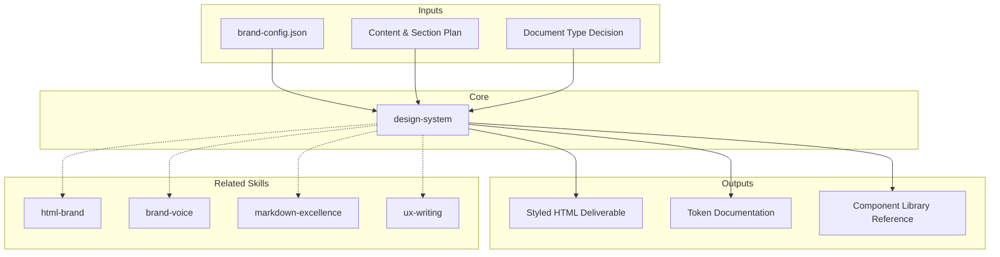

# Design System v4 (Brand-Configurable)

Foundation system for building styled HTML documents. All colors, typography, layout patterns, and component specs. **CRITICAL:** All brand tokens are configurable via `brand-config.json` — no hardcoded brand colors. Works for ANY brand. [EXPLICIT]

## Grounding Guideline

**A deliverable without branding is a generic document. A deliverable with branding is a professional experience.** The design system converts technical documents into brand artifacts that convey confidence, professionalism, and attention to detail. Every color, every typeface, every spacing has a purpose.

### Design System Philosophy

1. **Tokens, not hardcode.** Everything configurable via brand-config.json. Changing brand = changing one file, not rewriting CSS. [EXPLICIT]
2. **Consistency > creativity.** Within an engagement, all deliverables look like part of the same system. No visual surprises. [EXPLICIT]
3. **Responsive and accessible.** Print-ready layout, high contrast for readability, semantic HTML for screen readers. [EXPLICIT]

## $ARGUMENTS

```
$ARGUMENTS format: [action] [brand-config-path]
Examples:
  "generate template with ./brand-config.json"  → load config, produce HTML template
  "apply tokens to report.html"                 → apply design tokens to existing file
  "show component library"                      → list all available components
  "validate colors in dashboard.html"           → check all colors match token reference
```

- If no brand-config.json exists → use neutral defaults (shown below)
- If action missing → show available actions: template, apply, components, validate

### Pipeline Parameters

| Parameter | Values | Default | Effect |
|-----------|---------|---------|--------|
| `MODO` | `piloto-auto`, `desatendido`, `supervisado`, `paso-a-paso` | `piloto-auto` | Level of human intervention during generation |
| `FORMATO` | `html`, `markdown`, `dual` | `html` | Deliverable output format |
| `VARIANTE` | `ejecutiva`, `tecnica` | `tecnica` | Executive (~40% content, visual-first) vs technical (full token docs + snippets) |

- `MODO=desatendido` → generates without pauses, validates at the end
- `FORMATO=dual` → produces .html + .md with documented tokens
- `VARIANTE=ejecutiva` → component quick reference + brand config only, no raw CSS

## Output Format Protocol

| FORMATO | Structure | Primary Use |
|---------|-----------|---------------|
| `html` | Full HTML with tokens injected in :root, rendered components | Final deliverables, client presentations |
| `markdown` | Token tables in MD, snippets in code blocks, no rendered HTML | Internal documentation, wikis, READMEs |
| `dual` | Both files generated in parallel | When the consumer needs both formats |

- HTML always includes Google Fonts link, print stylesheet, and skip-to-content
- Markdown includes front-matter YAML with brand-config metadata

## Brand Configuration Schema

All brand identity lives in `brand-config.json`. No brand values hardcoded in skill or templates. [EXPLICIT]

```json
{
  "brand": {
    "name": "Acme Corp",
    "logo_text": "acme_",
    "primary": "#3B82F6",
    "primary_light": "#60A5FA",
    "primary_dark": "#2563EB",
    "primary_dim": "rgba(59,130,246,0.10)",
    "black": "#000000",
    "white": "#FFFFFF",
    "background": "#F5F5F5",
    "muted": "#9CA3AF"
  },
  "fonts": {
    "display": "'Inter', system-ui, sans-serif",
    "body": "'Inter', system-ui, sans-serif",
    "google_fonts_url": "https://fonts.googleapis.com/css2?family=Inter:wght@300;400;500;600;700&display=swap"
  }
}
```

### Neutral Defaults (when no brand-config.json provided)

| Token | Default Value | Usage |
|-------|--------------|-------|
| `--brand-primary` | #3B82F6 (blue) | Accents, borders, active states |
| `--brand-primary-light` | #60A5FA | Hover states |
| `--brand-primary-dark` | #2563EB | Pressed states, dark mode |
| `--brand-primary-dim` | rgba(59,130,246,0.10) | Light backgrounds |
| `--brand-black` | #000000 | Text, headings, hero bg |
| `--brand-white` | #FFFFFF | Text on dark, card backgrounds |
| `--brand-background` | #F5F5F5 | Body background |
| `--brand-muted` | #9CA3AF | Secondary text |

### Mapping Rule

In ALL templates and components, reference `var(--brand-primary)` never a hex literal. The CSS custom properties are set from brand-config.json at generation time: [EXPLICIT]

```css
:root {
  --brand-primary: var(--from-config, #3B82F6);
  --brand-primary-light: var(--from-config, #60A5FA);
  --brand-primary-dark: var(--from-config, #2563EB);
  --brand-primary-dim: var(--from-config, rgba(59,130,246,0.10));
  --brand-black: var(--from-config, #000000);
  --brand-white: var(--from-config, #FFFFFF);
  --brand-background: var(--from-config, #F5F5F5);
  --brand-muted: var(--from-config, #9CA3AF);
}
```

## Semantic Colors (Brand-Independent)

These are universal and do NOT change per brand: [EXPLICIT]

| Token | Value | Usage |
|-------|-------|-------|
| `--semantic-positive` | #137DC5 | Success state (yellow, not green — v4 rule) |
| `--semantic-positive-dim` | rgba(255,215,0,0.12) | Positive background tint |
| `--semantic-positive-border` | rgba(255,215,0,0.45) | Positive border |
| `--semantic-positive-text` | #06B6D4 | Text on positive backgrounds |
| `--semantic-warning` | #D97706 | Warning state |
| `--semantic-warning-dim` | rgba(217,119,6,0.08) | Warning background |
| `--semantic-critical` | #DC2626 | Error/critical state |
| `--semantic-critical-dim` | rgba(220,38,38,0.07) | Critical background |
| `--semantic-info` | #2563EB | Information state |
| `--semantic-info-dim` | rgba(37,99,235,0.07) | Info background |

### Decorative Colors (Charts/Data Visualization Only)

| Token | Value |
|-------|-------|
| `--chart-green` | #42D36F |
| `--chart-teal` | #06C8C8 |
| `--chart-violet` | #9747FF |
| `--chart-pink` | #FE9CAB |
| `--chart-yellow` | #FFD700 |

## Typography

| Element | Font | Size | Weight | Line Height |
|---------|------|------|--------|-------------|
| h1 | var(--font-display) | clamp(2.5rem, 5vw, 4.2rem) | 700 | 1.1 |
| h2 | var(--font-display) | 2.2rem | 700 | 1.2 |
| h3 | var(--font-display) | 1.8rem | 700 | 1.2 |
| h4 | var(--font-display) | 1.4rem | 600 | 1.3 |
| Body | var(--font-body) | 1rem | 400 | 1.6 |
| Small | var(--font-body) | 0.875rem | 400 | 1.5 |
| Mono | Menlo, Monaco, monospace | 0.85rem | 400 | 1.4 |

## Spacing & Radius

| Token | Value | Usage |
|-------|-------|-------|
| `--radius-sm` | 6px | Small buttons |
| `--radius-md` | 12px | Callouts, medium elements |
| `--radius-lg` | 16px | Cards, panels |
| `--radius-xl` | 24px | Large containers |
| `--shadow-sm` | 0 1px 2px rgba(0,0,0,0.05) | Subtle elevation |
| `--shadow-md` | 0 4px 12px rgba(0,0,0,0.08) | Medium elevation |
| `--shadow-lg` | 0 12px 40px rgba(0,0,0,0.12) | Modals |
| `--shadow-card` | 0 1px 3px rgba(0,0,0,0.04), 0 6px 16px rgba(0,0,0,0.06) | Cards |

## Page Structure

### Layout Grid
- Max-width: 1100px, margin: 0 auto, padding: 0 2rem (1rem on mobile)
- Body background: var(--brand-background)

### Standard Sections

1. **Hero Header** — bg: var(--brand-black), border-bottom: 8px solid var(--brand-primary), radial gradient glow. Contains: logo, meta badges, h1 with brand-primary highlight, subtitle. [EXPLICIT]

2. **Sticky Nav** — bg: var(--brand-white), sticky top:0 z-100, border-bottom 1px solid gray-200. Links: uppercase 0.72rem, active = brand-primary border-bottom. [EXPLICIT]

3. **Main Container** — max-width 1100px, margin 0 auto, padding 0 2rem. [EXPLICIT]

4. **Sections** — scroll-margin-top 60px, padding 6rem 0. Section header: 60x60px black box with brand-primary number + title. [EXPLICIT]

5. **Footer** — bg: var(--brand-black), border-top: 8px solid var(--brand-primary), white text. Two-row: (logo + badges) above (confidentiality + doc ref). [EXPLICIT]

## Component Quick Reference

| Component | Class | Notes |
|-----------|-------|-------|
| Card Base | `.card` | White, padded, rounded |
| Card Accent | `.card-accent` | Brand-primary top border |
| Card Critical | `.card-critical` | Red left border + red tint |
| Card Warning | `.card-warning` | Amber left border + amber tint |
| Card Success | `.card-success` | Yellow (v4) left border + yellow tint |
| Card Info | `.card-info` | Blue left border + blue tint |
| Card Dark | `.card-dark` | Black bg, white text |
| Card Grid | `.card-grid-2/3/4` | Multi-column layout |
| Badge | `.badge` | Brand-primary bg, white text |
| Badge Outline | `.badge-outline` | Brand-primary border, transparent bg |
| Severity Critical | `.sev-critical` | Red bg, white text |
| Severity High | `.sev-high` | #EA580C bg, white text |
| Severity Medium | `.sev-medium` | Amber bg, BLACK text (WCAG) |
| Severity Low | `.sev-low` | Yellow bg, black text (v4) |
| Callout Info | `.callout-info` | Blue bg + blue border |
| Callout Warning | `.callout-warning` | Amber bg + amber border |
| Callout Success | `.callout-success` | Yellow bg + yellow border |
| Callout Critical | `.callout-critical` | Red bg + red border |
| Table Wrapper | `.table-wrap` | Overflow container |
| Diagram Box | `.diagram-box` | Dark monospace block |
| Progress Bar | `.progress-bar` | Horizontal indicator |
| Timeline | `.timeline` | Vertical with markers |
| Score Ring | `.score-ring` | Circular visualization |

For full component HTML snippets, read: `${CLAUDE_SKILL_DIR}/references/component-snippets.md` [EXPLICIT]

## Generation Workflow

1. **Load Config** — Read brand-config.json (or use neutral defaults)
2. **Plan** — Define sections, required components, color usage, TOC structure
3. **Generate HTML** — Apply base template with brand tokens injected into :root
4. **Build Hero** — Logo from config, meta badges, h1 with brand-primary span, subtitle
5. **Build Nav** — Auto-generate from section IDs
6. **Build Sections** — Section headers with brand-primary numbers, content with semantic components
7. **Validate** — All colors match tokens (no hex literals outside :root). Severity low = yellow. Hero/footer borders = brand-primary. TOC is horizontal sticky. Semantic HTML used. WCAG AA contrast met. [EXPLICIT]
8. **Export** — Save .html, test responsive, verify font loading, check keyboard nav

## Color Usage Rules

- **Brand colors** (primary, black, white, background): from brand-config.json via CSS custom properties
- **Semantic states** (positive=yellow, warning=amber, critical=red, info=blue): universal, never change per brand
- **Decorative** (green, teal, violet, pink, yellow): charts and data visualization ONLY
- **NEVER** use hex literals in component HTML — always reference var(--token-name)

## Responsive Breakpoints

- Mobile: < 768px (1rem padding)
- Tablet: 768-1024px (1.5rem padding)
- Desktop: > 1024px (2rem padding)

## Accessibility

- Skip link: href="#main"
- Focus-visible: outline 2px solid var(--brand-primary)
- Contrast: WCAG AA (4.5:1 body text, 3:1 large text)
- Semantic HTML: header, nav, main, section, footer
- Alt text required on all images
- Severity medium: BLACK text on yellow bg (WCAG AA compliance)

## Trade-off Matrix

| Dimension | Option A | Option B | Decision Rule |
|-----------|----------|----------|-------------------|
| Tokens vs Inline | CSS custom properties (tokens) | Inline styles | Always tokens. Inline only for specific overrides in email templates |
| System fonts vs Web fonts | Fast, no CDN dependency | Consistent branding, additional load | Web fonts for client deliverables; system fonts for internal use |
| Full component lib vs Minimal | 25+ components, flexible | 8-10 core, quick to learn | Full for long engagements; minimal for one-shot deliverables |
| Print-first vs Screen-first | Optimized for PDF/print | Optimized for interactive screen | Screen-first by default; print-first if deliverable is for board/committee |

## Assumptions & Limits

- Requires brand-config.json for branded output; without it, uses neutral blue defaults
- Font loading depends on Google Fonts CDN availability; fallback to system fonts
- Component library covers 90% of deliverable needs; custom components follow same token system
- Responsive design targets 3 breakpoints; complex dashboards may need additional breakpoints
- WCAG AA compliance assumed; AAA requires additional contrast verification
- Mermaid diagrams render client-side via CDN; offline environments need pre-rendered SVGs
- Design system assumes single-brand per engagement; multi-brand requires separate config files

## Edge Cases

| Case | Handling Strategy |
|---|---|
| Extremely light brand primary (#FFE0B2) that does not pass WCAG AA as text | Auto-darken for text using HSL shift (-30% lightness). Use brand-dark for borders and visible accents. Validate contrast with automated tool before delivery. |
| Bilingual document (es + en) with different text lengths | Use `lang` attribute per section. Flexible layout with min-width on cards. Test that long text does not break grid in both languages. |
| Brand config with a single color (no secondary, no light/dark variants) | Derive primary-light (HSL +15% lightness) and primary-dark (HSL -15% lightness) programmatically. Document derived colors in the output for client validation. |
| Offline environment without Google Fonts CDN access | Fallback to system-ui, -apple-system, sans-serif. Document visual degradation. Offer alternative with base64-embedded fonts if size < 500KB. |

## Decisions and Trade-offs

| Decision | Discarded Alternative | Justification |
|---|---|---|
| CSS custom properties (tokens) over inline styles | Inline styles for each element | Tokens allow brand change with a single file. Inline requires rewriting the entire document. Maintainability > generation speed. |
| Single-file HTML with inline CSS over external CSS | CSS in separate file | Self-contained HTML guarantees portability. The deliverable opens in any browser without dependencies. Additional weight (~20KB CSS) is acceptable vs. risk of missing file. |
| Yellow for success states over conventional green | Green (#22C55E) for positive states | Green introduces a cool tone that clashes with the warm MetodologIA palette (indigo/dark). Yellow maintains brand coherence. Visual differentiator vs. competitors. |

## Knowledge Graph



## Output Templates

**MD format (default):**
```
# Design System: {brand_name}
## Token Reference
  - Brand colors (primary, light, dark, dim)
  - Semantic colors (positive, warning, critical, info)
  - Typography scale
  - Spacing & radius
## Component Quick Reference
  - Cards, badges, callouts, tables
  - Usage guidelines per component
## Validation Checklist
```

**HTML format (primary):**
- Filename: `D-01_Design_System_{project}_{WIP}.html`
- Self-contained HTML document with tokens injected in `:root`, branded (Design System MetodologIA v5). Includes rendered components with interactive examples, visual token palette, and WCAG validation checklist. Print stylesheet included, skip-to-content and WCAG AA compliance.

**DOCX format (formal circulation):**
- Filename: `{phase}_{deliverable}_{client}_{WIP}.docx`
- Generated via python-docx with MetodologIA Design System v5. Cover page with engagement metadata, auto-generated TOC, branded headers/footers. Tables with zebra striping, Poppins typography in headings (navy), Trebuchet MS in body, gold accents. For formal circulation and audit.

**XLSX format (on demand):**
- Filename: `{phase}_{deliverable}_{client}_{WIP}.xlsx`
- Via openpyxl with MetodologIA Design System v5. Headers with navy background and white Poppins typography, conditional formatting by token type and WCAG validation status, auto-filters on all columns, direct values without formulas.

**PPTX format (on demand):**
- Filename: `{phase}_{deliverable}_{client}_{WIP}.pptx`
- Via python-pptx with MetodologIA Design System v5. Navy gradient slide master, Poppins titles, Trebuchet MS body, gold accents. Max 20 slides executive / 30 technical. Speaker notes with evidence references.

## Evaluation

| Dimension | Weight | Criterion | Minimum Threshold |
|---|---|---|---|
| Trigger Accuracy | 10% | Skill activates correctly on mentions of design system, tokens, brand config, styled HTML | 7/10 |
| Completeness | 25% | All tokens documented, components with snippets, responsive and accessibility covered | 7/10 |
| Clarity | 20% | Mapping rules without ambiguity, each token with defined usage, anti-patterns documented | 7/10 |
| Robustness | 20% | Color, RTL, print, dark mode edge cases covered with functional fallbacks | 7/10 |
| Efficiency | 10% | Output generated without duplicate tokens, optimized CSS, single-file under 500KB | 7/10 |
| Value Density | 15% | Each component delivers a copy-ready snippet, not just theoretical description | 7/10 |

**Global minimum threshold:** 7/10. Deliverables below this require re-work before delivery.

## Edge Cases

| Scenario | Adaptation |
|----------|-----------|
| No brand-config.json | Use neutral defaults (blue primary, gray background) |
| Brand primary is very light (e.g., #FFE0B2) | Auto-darken for text; use brand-dark for borders |
| Brand primary is very dark (e.g., #1A1A2E) | Use brand-light for hover states; ensure contrast on dark hero |
| Print/PDF output | Remove sticky nav, reduce shadows, use high-contrast borders |
| Dark mode requested | Invert background tokens; keep semantic colors unchanged |
| RTL language brand | Mirror layout, flip border-left to border-right on accent cards |
| Brand with no secondary color | Derive primary-light and primary-dark programmatically from primary |
| Multiple brand configs in one project | Namespace tokens per brand; generate separate CSS bundles |

## Validation Gate

Before delivering design system output: [EXPLICIT]
- [ ] All brand colors sourced from brand-config.json (no hardcoded hex in components)
- [ ] Semantic colors applied correctly (positive=yellow, not green)
- [ ] Hero and footer use brand-primary for 8px borders
- [ ] All text meets WCAG AA contrast ratios
- [ ] Responsive at all 3 breakpoints
- [ ] No hex literals in component HTML (only var() references)
- [ ] Font fallbacks specified for display and body
- [ ] MODO/FORMATO/VARIANTE params respected in output
- [ ] Print stylesheet present when FORMATO=html
- [ ] Mermaid diagrams render correctly if included

## Cross-References

- `brand-html` — applies this design system to generate full HTML deliverables
- `brand-voice` — brand tone and messaging (complements visual system)
- `markdown-excellence` — writing standard for markdown output format

## Output Artifact

**Primary:** `D-01_Design_System_{project}.md` (or `.html` if `{FORMATO}=html|dual`) — Design tokens, component library, usage guidelines, accessibility standards.

**Included diagrams:**
- Component hierarchy diagram
- Token inheritance flowchart
- Responsive breakpoint matrix

---
**Author:** Javier Montano | **Last updated:** March 12, 2026

## Usage

Example invocations: [EXPLICIT]

- "/design-system" — Run the full design system workflow
- "design system on this project" — Apply to current context

