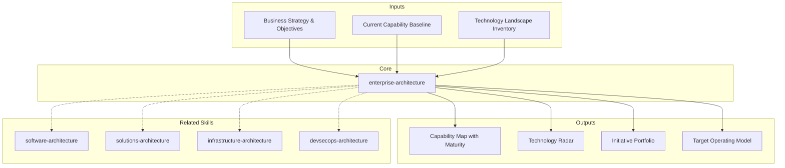

# Enterprise Architecture: Strategy & Portfolio Alignment

Enterprise architecture aligns technology initiatives with business strategy. It defines what capabilities the enterprise needs, what technologies support them, how decisions are governed, and how investments are prioritized. [EXPLICIT]

## Grounding Guideline

**An enterprise without a capability map is an army without a terrain map.** Enterprise architecture connects business strategy with technology: what capabilities the enterprise needs, what technology supports them, how they are governed, and how investment is prioritized. Without this layer, each team optimizes locally while the enterprise fragments.

### Enterprise Architecture Philosophy

1. **Capabilities > systems.** Systems change; business capabilities persist. Invest in capabilities, not in technology for its own sake. [EXPLICIT]
2. **Radar > mandate.** The technology radar guides, it does not mandate. Teams propose, the ARB validates, context decides. [EXPLICIT]
3. **Proportional governance.** More governance for high risk/cost. Less for experiments and innovation. Governance enables, it does not hinder. [EXPLICIT]

## Inputs

The user provides an organization or initiative name as `$ARGUMENTS`. Parse `$1` as the **enterprise/organization name** used throughout all output artifacts. [EXPLICIT]

**Parameters:**
- `{MODO}`: `piloto-auto` (default) | `desatendido` | `supervisado` | `paso-a-paso`
  - **piloto-auto**: Auto para capability mapping y radar, HITL para governance decisions y portfolio prioritization. [EXPLICIT]
  - **desatendido**: Zero interruptions. Arquitectura enterprise documentada automáticamente. Assumptions documented. [EXPLICIT]
  - **supervisado**: Autónomo con checkpoint en domain boundaries y governance framework. [EXPLICIT]
  - **paso-a-paso**: Confirma cada capability, domain context, radar entry, y initiative. [EXPLICIT]
- `{FORMATO}`: `markdown` (default) | `html` | `dual`
- `{VARIANTE}`: `ejecutiva` (~40% — S1 capability map + S3 radar + S5 portfolio) | `técnica` (full 6 sections, default)

Before generating architecture, detect organizational context:

```
!find . -name "*.md" -o -name "*.yaml" -o -name "*.json" | head -20
```

If reference materials exist, load them:

```
Read ${CLAUDE_SKILL_DIR}/references/capability-templates.md
Read ${CLAUDE_SKILL_DIR}/references/governance-frameworks.md
```

---

## When to Use

- Aligning initiatives with enterprise strategy and business objectives
- Evaluating portfolio fit of new projects or acquisitions
- Establishing architectural governance (principles, standards, review process)
- Building technology radar to guide decisions across teams
- Prioritizing initiatives based on business value, cost, risk, alignment
- Defining capability roadmaps (current state to target state)
- Designing team topologies and organizational structure to match architecture

## When NOT to Use

- Internal software structure of a single system → **metodologia-software-architecture**
- End-to-end solution design for a business problem → **metodologia-solutions-architecture**
- Infrastructure, compute, and platform design → **metodologia-infrastructure-architecture**
- Build pipelines and supply chain security → **metodologia-devsecops-architecture**

---

## Delivery Structure: 6 Sections

### S1: Capability Map (Maturity 1-5)

Hierarchical decomposition of business capabilities from strategic to operational level. [EXPLICIT]

**Structure:**
- **Level 1 (Strategic):** Core business capabilities (e.g., "Acquire Customers", "Process Payments")
- **Level 2 (Management):** Supporting capabilities (e.g., "Customer Onboarding", "Identity Verification")
- **Level 3 (Operational):** Detailed activities (e.g., "Validate ID", "Run Credit Check")

**Per capability:**
- **Current maturity** (1-5): 1=Ad-hoc, 2=Defined, 3=Managed, 4=Optimized, 5=Strategic
- **Target maturity:** Where the capability needs to be
- **Gap:** Maturity gap and effort to close
- **Ownership:** Business unit/team
- **Systems:** Applications supporting it
- **Data:** Key data entities involved

**Key outcomes:**
- Identifies underinvested capabilities (gaps between current and target)
- Shows capability dependencies (which must improve first)
- Guides infrastructure and system investment decisions
- Reveals redundancies (multiple systems doing same thing)

**Format:** Heat map (capability x maturity x color), dependency matrix

### S2: Domain Model (DDD)

Decomposes the enterprise into cohesive domains using Domain-Driven Design principles. [EXPLICIT]

**Bounded Contexts:**
- Core Domain: differentiates from competitors (invest heavily)
- Supporting Domain: necessary but not unique (build or buy selectively)
- Generic Domain: commoditized (buy, don't build)

**Context Mapping:**
- Upstream/Downstream dependencies
- Shared Kernel (minimize), Anti-Corruption Layer (isolate from legacy)
- Customer/Supplier (formal contracts between teams)

**Domain Ownership:**
- Conway's Law: org structure mirrors system structure
- Team topologies aligned to domains (stream-aligned, enabling, platform, complicated subsystem)

**Key decisions:**
- Granularity: too many contexts = overhead; too few = tight coupling
- Shared concepts: minimize shared kernel; prefer ACL
- Team alignment: teams should own contexts end-to-end

### S3: Technology Radar (Adopt/Trial/Assess/Hold)

Guides technology adoption across the enterprise (ThoughtWorks-style). [EXPLICIT]

**Classification:**
- **Adopt:** Proven, recommended; invest in new projects
- **Trial:** Being evaluated, limited production use; appropriate for small/medium bets
- **Assess:** Interesting, no production use yet; keep watching
- **Hold:** Avoid in new projects; existing can continue; consider migration plan

**Dimensions:** Platforms, Languages, Frameworks, Data, Infrastructure, Architectural Patterns, Security & Compliance

**Per technology:**
- Status (Adopt/Trial/Assess/Hold), rationale, owner, alternatives, migration path

**Principles:**
- Technology decisions serve business goals, not fashionability
- Limit tech diversity: too many = operational burden
- Platform team manages adoption process, not mandates
- Teams can propose new entries with business justification

### S4: Architectural Governance (ARB)

Framework for making and enforcing architecture decisions. [EXPLICIT]

**Architectural Principles:** Long-lived, guide decision-making
- "Cloud-first: default to cloud; on-prem justified by specific constraints"
- "API-first: all capabilities exposed via APIs"
- "Data-driven: all systems expose metrics; decisions based on data"

**Standards & Patterns:** API design, logging (structured, correlation IDs), deployment (blue-green, canary), database selection criteria

**Architecture Review Board (ARB):**
- Composition: CTO, domain architects, lead engineers, ops lead
- Review criteria: strategic fit, compliance, cost, risk, technology alignment
- Frequency: monthly or quarterly
- Escalation: conflicts resolved by CTO/VP Engineering

**Approval Process:**
- Threshold: when review required (new service, tech outside radar, >$100k cost)
- Proposal format: ADR, business case, implementation plan
- Timeline: 2-week review window
- Exception handling: emergency path for urgent issues

**Compliance & Audit:**
- Regular audits of architecture decisions
- Technology drift tracking (unauthorized tech in production)
- Compliance controls mapping (regulations to architecture controls)

### S5: Initiative Portfolio

Prioritized list of strategic initiatives aligned with business objectives and capability gaps. [EXPLICIT]

**Per initiative:**
- Name & Objective, Business Value, Cost estimate, Risk, Strategic Alignment
- Capability Mapping (which capabilities it improves)
- Effort Estimate (t-shirt: S/M/L/XL), Timeline, Dependencies, Success Metrics

**Portfolio Analysis:**
- Pareto: 20% of initiatives drive 80% of value
- Risk vs. Value plot
- Capacity planning: total effort vs. available capacity
- Balance: 60% strategic/transformational, 20% operational, 20% technical debt

**Principles:**
- Keep portfolio <20 initiatives (focus)
- Initiatives are living; reprioritize quarterly
- Portfolio governance ensures alignment and prevents chaos

### S6: Target Operating Model (Team Topologies, DORA)

How the organization is structured and operates to deliver and manage architecture. [EXPLICIT]

**Organizational Structure (Team Topologies):**
- Stream-aligned teams: own end-to-end capabilities, cross-functional
- Platform teams: shared infrastructure, tools, standards
- Enabling teams: help others adopt new ways of working
- Complicated subsystem teams: specialized experts (ML, security, performance)

**Funding Model:** Product funding per capability, platform shared budget, CapEx vs. OpEx

**Delivery Cadence:** Sprint length, release cadence, ceremonies

**Decision Rights:** Strategic (CTO), Tactical (ARB), Operational (Teams)

**Metrics & Accountability:**
- DORA: Deployment frequency, lead time, failure rate, MTTR
- Business: Revenue per team, cost per transaction, customer satisfaction
- Capability: Maturity, reliability, performance, security posture

---

## Trade-off Matrix

| Decision | Enables | Constrains | When to Use |
|---|---|---|---|
| **Cloud-First** | Scalability, flexibility, innovation speed | Vendor lock-in, compliance complexity, cost | Digital-native orgs, variable workloads |
| **Build vs. Buy** | Control, differentiation | Higher cost, longer time-to-market | Core domains, competitive advantage |
| **Microservices** | Independent scaling, tech diversity, autonomy | Ops complexity, distributed debugging | Large teams, high-scale, polyglot |
| **Monolithic** | Simple operations, single deployment, consistency | Tight coupling, hard to scale independently | Small teams, simple domains |
| **Centralized Data Warehouse** | Single source of truth, analytics, governance | ETL complexity, latency, tight coupling | Traditional BI, regulatory reporting |
| **Decentralized Data Lakes** | Agility, quick onboarding, independent optimization | Inconsistency, data quality, governance burden | Data science, exploratory analytics |
| **Governance (Heavy)** | Control, compliance, consistency | Slow decisions, innovation risk, friction | Regulated industries, large enterprises |
| **Governance (Light)** | Speed, innovation, team autonomy | Chaos, technical debt, inconsistency | Startups, small teams, fast-moving |

---

## Assumptions

- Enterprise strategy and business objectives defined
- Capability baseline assessed (current maturity levels)
- Key stakeholders engaged (business, technology, operations)
- Sufficient lead time for governance and transformation
- Investment available for strategic initiatives and platform infrastructure

## Limits

- Does not design individual systems (see **metodologia-software-architecture**)
- Does not design end-to-end solutions (see **metodologia-solutions-architecture**)
- Does not design infrastructure topology (see **metodologia-infrastructure-architecture**)
- Does not manage day-to-day delivery (product/engineering management)
- Governance is advisory; enforcement requires executive sponsorship

## Edge Cases

| Case | Handling Strategy |
|---|---|
| Legacy enterprise con deuda tecnica masiva y >50 sistemas en produccion | Capability map retroactivo desde sistemas existentes. Priorizar modernizacion por valor de negocio (Pareto: 20% de sistemas = 80% valor). Parallel running durante transicion. No big-bang. |
| Startup en crecimiento rapido sin governance previo | Introducir governance gradualmente. Empezar con technology radar y principios arquitectonicos (3-5 maximos). ARB ligero (async reviews). Evitar burocracia prematura que frene innovacion. |
| Fusion o adquisicion con dos stacks tecnologicos incompatibles | Capability analysis separada por empresa. Identificar sinergias (shared kernel). Roadmap de integracion phased: datos primero, plataforma despues, aplicaciones ultimo. Domain model por region si regulacion difiere. |
| Organizacion multi-geografica con regulaciones divergentes (GDPR, CCPA, LGPD) | Arquitectura con regional customization. Domain model per region con shared kernel para capabilities comunes. Compliance controls mapeados a controles de arquitectura por jurisdiccion. |

## Decisions & Trade-offs

| Decision | Discarded Alternative | Justification |
|---|---|---|
| Capability map como eje organizador sobre inventario de sistemas | Inventario de aplicaciones como base de analisis | Los sistemas cambian; las capacidades del negocio persisten. Organizar por capability permite razonar sobre inversion en terminos de negocio, no de tecnologia. |
| Technology radar advisory (Adopt/Trial/Assess/Hold) sobre mandatos tecnologicos | Lista de tecnologias aprobadas con prohibicion de alternativas | Mandatos generan shadow IT y resentimiento. Radar advisory guia decisiones respetando autonomia de equipos. Platform team facilita, no impone. |
| Team topologies (stream-aligned, platform, enabling) sobre equipos funcionales | Organizacion por funcion (frontend, backend, QA, ops) | Conway's Law: estructura org = estructura sistema. Equipos stream-aligned reducen handoffs y aceleran delivery. Equipos funcionales crean silos y dependencias. |

## Knowledge Graph



## Output Templates

**Formato MD (default):**
```
# Enterprise Architecture: {organization_name}
## S1: Capability Map
  - Heat map (capability x maturity x color)
  - Dependency matrix
## S2: Domain Model (DDD)
  - Bounded contexts, context mapping
## S3: Technology Radar
  - Adopt/Trial/Assess/Hold per dimension
## S4-S6: [remaining sections]
## Anexos: ARB charter, initiative scorecards, DORA metrics baseline
```

**Formato PPTX (secondary):**
- Slide 1: Capability heat map (visual, color-coded)
- Slide 2: Domain model con bounded contexts (Mermaid rendered)
- Slide 3: Technology radar (circular visualization)
- Slide 4: Initiative portfolio (risk vs value plot)
- Slide 5: Target operating model (team topologies diagram)
- Slide 6: Strategic roadmap (Gantt con initiatives phased)

**Formato HTML (bajo demanda):**
- Filename: `A-03_Enterprise_Architecture_{cliente}_{WIP}.html`
- Estructura: HTML self-contained branded (Design System MetodologIA v5). Dark-First Executive page con capability heat map interactivo, technology radar visual, e initiative portfolio con filtros. WCAG AA, responsive, print-ready.

**Formato DOCX (bajo demanda):**
- Filename: `A-03_Enterprise_Architecture_{cliente}_{WIP}.docx`
- Generado con python-docx bajo MetodologIA Design System v5: portada, TOC automático, encabezados/pies de página con marca, tablas zebra, tipografía Poppins (headings navy), Trebuchet MS (body), acentos dorados

**Formato XLSX (bajo demanda):**
- Filename: `{fase}_{entregable}_{cliente}_{WIP}.xlsx`
- Generado via openpyxl con MetodologIA Design System v5. Encabezados con fondo navy y texto blanco Poppins, formato condicional por madurez (1-5) y estado de iniciativa (Adopt/Trial/Assess/Hold), auto-filtros en todas las columnas, valores calculados (sin fórmulas). Hojas: Capability Map (maturity heatmap), Technology Radar, Initiative Portfolio Scorecard, ARB Decision Log.

## Evaluacion

| Dimension | Peso | Criterio | Umbral Minimo |
|---|---|---|---|
| Trigger Accuracy | 10% | El skill se activa correctamente ante menciones de capability map, radar, governance, DDD domains, team topologies | 7/10 |
| Completeness | 25% | Las 6 secciones cubren capabilities, domains, radar, governance, portfolio, y operating model | 7/10 |
| Clarity | 20% | Cada capability con maturity score justificado. Radar entries con rationale. Initiative portfolio con scoring transparente. | 7/10 |
| Robustness | 20% | Edge cases de legacy, M&A, multi-geo cubiertos. Governance proporcional al riesgo. Portfolio <20 iniciativas (focus). | 7/10 |
| Efficiency | 10% | Output proporcional al contexto (ejecutiva vs tecnica). Sin overlap con skills de arquitectura especifica. | 7/10 |
| Value Density | 15% | Capability gaps accionables. Radar entries con alternatives. Initiative portfolio con ROI estimado. | 7/10 |

**Umbral minimo global:** 7/10. Deliverables por debajo requieren re-work antes de entrega.

---

## Edge Cases

**Legacy Enterprise with Technical Debt:**
Capabilities supported by outdated tech. Modernization competes with new feature development. Prioritize highest-value, lowest-cost improvements; parallel running during transition. [EXPLICIT]

**Multi-Geographic or Multi-Regulatory:**
Different regions have different compliance (GDPR EU, CCPA California). Architecture must accommodate regional customization. Domain model per region, shared kernel for common capabilities. [EXPLICIT]

**High-Growth Startup Becoming Enterprise:**
"Move fast, break things" needs governance. Retrospective capability mapping, gradual governance introduction, strategic initiative prioritization. [EXPLICIT]

**Merger or Acquisition:**
Two enterprises with different architectures, technologies, governance. Capability analysis for synergies, phased integration roadmap, shared platform investments. [EXPLICIT]

**Digital Transformation Initiative:**
High visibility, multiple stakeholders, cross-cutting impact. Clear vision, phased capability evolution, frequent communication, quick wins early. [EXPLICIT]

---

## Validation Gate

Before finalizing delivery, verify:

- [ ] Capability map complete and maturity assessed
- [ ] Domains identified with clear ownership
- [ ] Technology radar guides new investments
- [ ] Governance process defined and understood
- [ ] Initiative portfolio prioritized and funded
- [ ] Operating model aligns org structure with architecture
- [ ] Strategic initiatives on track and delivering value
- [ ] Technology decisions traceable to business objectives
- [ ] Architecture is enabling (not blocking) business agility
- [ ] Enterprise can articulate its technology strategy clearly

---

## Cross-References

- **metodologia-software-architecture:** Receives technology standards and patterns from radar; aligns internal structure with domains
- **metodologia-solutions-architecture:** Uses capability map and domain model for end-to-end solutions
- **metodologia-infrastructure-architecture:** Implements platform recommendations from technology radar and operating model
- **metodologia-devsecops-architecture:** Enforces governance standards and compliance controls in pipeline

## Output Format Protocol

| Format | Default | Description |
|--------|---------|-------------|
| `markdown` | Yes | Rich Markdown + Mermaid diagrams. Token-efficient. |
| `html` | On demand | Branded HTML (Design System). Visual impact. |
| `dual` | On demand | Both formats. |

Default output is Markdown with embedded Mermaid diagrams. HTML generation requires explicit `{FORMATO}=html` parameter. [EXPLICIT]

## Output Artifact

**Primary:** `A-03_Enterprise_Architecture_Deep.html` — Executive summary, capability map, domain model, technology radar, governance framework, initiative portfolio, target operating model.

**Secondary:** Capability heat map (PNG/SVG), technology radar visualization, strategic roadmap (Gantt), governance flowchart, metrics dashboard.

---
**Autor:** Javier Montaño | **Última actualización:** 12 de marzo de 2026
