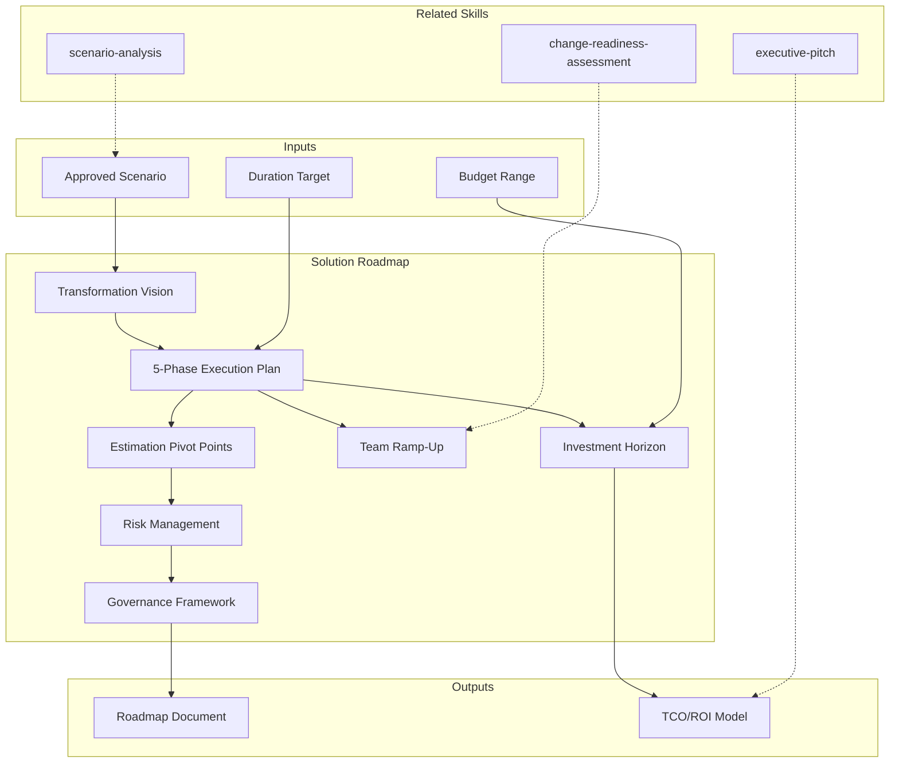

# Solution Roadmap — Transformation Blueprint

Defines the complete transformation plan AFTER scenario approval but BEFORE PoC validation. Covers transformation vision, phased execution (Foundation > Build > Integrate > Optimize > Scale), investment horizon with TCO/ROI, team ramp-up curve, estimation pivot points with PoC validation, risk management with cascade failure analysis, and governance framework. [EXPLICIT]

## Grounding Guideline

**A roadmap without gates is a plan of hope. A roadmap without pivot points is a plan of fantasy.** This skill produces transformation blueprints that survive contact with reality: every phase has go/no-go criteria, every estimate has pivot points with validation PoCs, and every milestone has kill criteria. The difference between a roadmap and a wish list is governance.

### Transformation Philosophy

1. **Phases, not big-bang.** Each phase is independently valuable. If the project stops at Phase 2, what was built in Phase 1 has value on its own. [EXPLICIT]
2. **Honest estimates.** Ranges with P50/P80/P95 — never an exact number. The Cone of Uncertainty is respected. [EXPLICIT]
3. **Explicit kill criteria.** Each phase has conditions under which it stops, gets re-planned, or pivots. There is no "press on at all costs."

## Inputs

- `$1` — Transformation duration target in months (default: 18-24)
- `$2` — Budget range: `under2m`, `2m-5m`, `5m-10m`, `over10m` (default: `2m-5m`)

Parse from `$ARGUMENTS`. [EXPLICIT]

**Parameters:**
- `{MODO}`: `piloto-auto` (default) | `desatendido` | `supervisado` | `paso-a-paso`
  - **piloto-auto**: Auto para construcción de fases y timeline, HITL para validación de gates y kill criteria. [EXPLICIT]
  - **desatendido**: Zero interruptions. Roadmap completo auto-generado. Assumptions documented. [EXPLICIT]
  - **supervisado**: Autónomo con checkpoint en estructura de fases y antes del governance plan. [EXPLICIT]
  - **paso-a-paso**: Confirma cada fase, cada gate, y cada pivot point. [EXPLICIT]
- `{FORMATO}`: `markdown` (default) | `html` | `dual`
- `{VARIANTE}`: `ejecutiva` (~40% — S1 vision + S2 phases + S3 investment) | `técnica` (full 7 sections, default)

## Required Inputs

- Approved scenario from scenario analysis (component breakdown, tech stack, integration points)
- Cumulative findings from prior phases (business case, current state, target scenario)
- Organization willing to commit phased transformation
- Budget authority with phased funding tolerance (+/-25%)

## Assumptions & Limits

### Assumptions
- Organizational change management runs parallel (not in roadmap scope).
- Executive sponsorship stable throughout transformation.
- Current team available for transition; no mass attrition mid-program.
- Cloud infrastructure available on-demand (no procurement bottlenecks).
- Partner/vendor relationships stable for transformation duration.

### Estimation Confidence at This Stage
- Cost: +/-25% confidence (refines to +/-15% after PoC, +/-10% after build)
- Timeline: +/-15% confidence (refines after PoC)
- Team sizing: +/-20% variance expected from PoC learnings

### Cannot Predict
Market disruptions, regulatory changes mid-transformation, organizational restructuring, key person dependencies, exact talent availability for emerging technologies. [EXPLICIT]

## Conditional Logic

```
IF transformation > 12 months:
  -> Quarterly re-calibration gates
  -> Steering committee approval for >5% scope/budget/timeline changes

IF team size (peak) > 20 people:
  -> Add team topology planning (Inverse Conway's Law)
  -> Budget 1 month in Phase 1 for org design

IF multi-region deployment required:
  -> Add rollout wave planning per region
  -> Sequence: low-risk to medium-risk to high-risk

IF budget not fully committed upfront:
  -> Phased funding model with kill points:
    Phase 1 gate: commit ~35% of 3-year TCO
    Phase 2 gate: commit ~50%
    Phase 3 gate: commit ~15%

IF PoC learnings invalidate >2 major assumptions:
  -> Pause Phase 2 for 2-week re-planning sprint
  -> Present re-scoped roadmap to steering committee

IF team resistance detected in Phase 1:
  -> Extend Phase 1 by 1 month for change management
  -> Require department head alignment before Phase 2
```

## Edge Cases & Triggers

- **Transformation >18 months:** Break into 6-month waves. Each wave independently viable. Replan after Wave 1 PoC.
- **Budget >$5M:** Add governance layer (PMO, steering committee, investment review board). Quarterly re-calibration mandatory.
- **No PMO exists:** Embed PM capacity in Phase 1. Budget PM as permanent overhead.
- **Legacy team resistance:** Add change management track. Budget 2-3 months for people engagement before Phase 2.
- **Multiple vendors:** Add vendor coordination track. Lock vendor roadmaps to SLAs before Phase 1 gate. +15% on Phase 2-3 timelines.
- **Regulatory deadline:** Add compliance milestone track. Reserve 20% team capacity for regulatory validation.
- **Key person risk:** Identify single points of knowledge. Document knowledge transfer milestones. Budget redundancy for critical roles.

## Trade-off Matrix

| Decision | Enables | Constrains | When to Use |
|----------|---------|------------|-------------|
| **Incremental over big-bang** | Lower catastrophic failure risk; each phase independently valuable | Higher upfront planning cost; longer total timeline | Default — always. Big-bang only if regulatory deadline forces it. |
| **70/30 internal/outsourced** | Knowledge retention; sustainable velocity post-transformation | +40% labor cost vs full outsource; slower Phase 2 ramp | Default. Shift to 50/50 if skill gaps exceed 40% of team. |
| **Build over buy** | Full control; no vendor lock-in; custom fit | +2-3 months Phase 2; higher maintenance burden | When differentiating capability. Buy for commodity functions. |
| **60% stability / 40% innovation** | Balanced risk; innovation without destabilizing core | Innovation capped; may lag competitors on bleeding edge | Default. Adjust at Phase 2 gate based on PoC learnings. |
| **18-month production vs 12-month MVP** | Higher quality at launch; fewer post-launch fires | Longer time-to-market; higher upfront investment | When brand/reputation risk outweighs speed. MVP path for market validation. |

## Delivery Structure

### Section 1: Transformation Vision
Business objective alignment with approved scenario. Success metrics table (baseline > 18-month target > 36-month target > owner). North star metric. Strategic capabilities unlocked per phase. [EXPLICIT]

### Section 2: Transformation Phases

| Phase | Name | Duration | Peak Team | Budget % | Key Gate |
|-------|------|----------|-----------|----------|---------|
| 1 | Foundation | 3-4 months | 10-12 | 20-25% | PoC validates target metrics |
| 2 | Build | 6-8 months | 24-28 | 45-55% | Core services in production |
| 3 | Integrate | 4-6 months | 28-32 | 25-35% | Full cutover, legacy decommissioned |
| 4 | Optimize | 4-6 months | 16-18 | 10-15% | Cost reduction targets met |
| 5 | Scale | 6-12 months | 20-24 | Varies | Multi-region, innovation velocity |

Each phase has explicit GO/NO-GO criteria. NO-GO halts downstream phases. [EXPLICIT]

**Per phase:** team composition and roles, key deliverables with acceptance criteria, dependency map, risk table with mitigations, gate criteria with measurable thresholds.

### Section 3: Investment Horizon
3-year TCO projection, year-by-year breakdown, cost categories (labor, infrastructure, licensing, training, contingency), phased funding release points, kill points, break-even timeline, ROI modeling, cost/timeline variance scenarios (optimistic/likely/pessimistic/severe). [EXPLICIT]

### Section 4: Team Roadmap
Month-by-month headcount, skill gap analysis (current to required), training roadmap (bootcamp to pair programming to autonomous), technology introduction sequence, knowledge transfer milestones, technical debt retirement schedule. [EXPLICIT]

### Section 5: Estimation Pivot Points
5+ key assumptions that drive estimates. Per assumption: current estimate impact, why it matters, PoC validation criteria (specific measurable tests), pivot options if invalidated, decision gate timing. [EXPLICIT]

**Pivot Decision Framework:**
```
IF validation PASSES -> proceed with planned schedule
IF FAILS with minor issue (<4 weeks) -> evaluate Pivot A (<$150K, <4 weeks)
IF FAILS with major issue (>4 weeks) -> pause, 2-day re-plan, steering committee
IF showstopper (pivot cost >$500K) -> escalate to board for viability decision
```

Risk-adjusted timeline with Monte Carlo confidence intervals (P10/P50/P90) for key milestones. [EXPLICIT]

### Section 6: Risk Management
Risk timeline (when each risk peaks per phase), risk-by-phase breakdown tables, cascade failure chains (3+ documented), mitigation investment vs exposure analysis, early warning indicators (Green/Yellow/Red per metric per phase), kill criteria (hard stops and soft stops). [EXPLICIT]

### Section 7: Governance Plan
Steering committee structure and cadence, technical architecture forum, phase gate review board, risk management committee, escalation hierarchy, RACI matrix, three-tier change control process (minor/significant/major), reporting dashboard (monthly/weekly/real-time). [EXPLICIT]

## Output Artifact

**Primary:** `06_Solution_Roadmap_{project}.md` (o `.html` si `{FORMATO}=html|dual`) — Transformation vision, 5-phase execution plan with gates, investment horizon with TCO/ROI, team ramp-up, estimation pivot points, risk management, governance framework.

**Diagramas incluidos:**
- Gantt chart: phased timeline with P50/P80/P95 markers
- Flowchart: pivot point decision tree
- Flowchart: team ramp-up/ramp-down visualization

## Validation Gate

- [ ] Transformation phases defined with clear gates and success criteria per phase
- [ ] Investment horizon: 3-year TCO with phased funding model and kill points
- [ ] Estimation pivots explicit: 5+ major assumptions with PoC validation criteria
- [ ] Team ramp-up: month-by-month headcount with role introduction sequence
- [ ] Risk timeline: shows when each risk peaks with interdependencies
- [ ] Governance: steering committee, decision authority, escalation paths, kill criteria
- [ ] All estimates linked to assumptions; all assumptions linked to PoC validation
- [ ] Break-even and ROI calculated with stated assumptions
- [ ] Roadmap immediately actionable: steering committee can approve Phase 1 funding on this plan
- [ ] Sensitivity analysis covers optimistic/likely/pessimistic/severe scenarios

## Output Format Protocol

| Format | Default | Description |
|--------|---------|-------------|
| `markdown` | ✅ | Rich Markdown + Mermaid diagrams. Token-efficient. |
| `html` | On demand | Branded HTML (Design System). Visual impact. |
| `dual` | On demand | Both formats. |

Default output is Markdown with embedded Mermaid diagrams. HTML generation requires explicit `{FORMATO}=html` parameter. [EXPLICIT]

### Diagrams (Mermaid)
- Gantt chart: phased timeline with P50/P80/P95 markers
- Flowchart: pivot point decision tree
- Flowchart: team ramp-up/ramp-down visualization

## Edge Cases

| Case | Handling Strategy |
|------|---------------------|
| Executive sponsor changes mid-transformation (Phase 2+) | Trigger a 2-week re-alignment sprint; present roadmap to new sponsor with original rationale; adjust governance cadence; document any scope/priority shifts as formal change requests |
| PoC invalidates a foundational assumption in Phase 1 | Activate pivot decision framework; if minor (<4 weeks fix), execute Pivot A; if major, pause Phase 2 and present re-scoped roadmap to steering committee within 5 business days |
| Client demands big-bang delivery despite phased recommendation | Document the risk differential (phased vs big-bang) with quantified failure probability; require steering committee sign-off on big-bang risk acceptance; add 30% contingency to timeline |
| Key technology vendor announces end-of-life during Phase 2 | Activate vendor risk mitigation plan from Section 6; assess alternative vendors against Phase 3-5 requirements; present impact assessment to steering committee within 1 week |

## Decisions & Trade-offs

| Decision | Discarded Alternative | Justification |
|----------|----------------------|---------------|
| 5-phase incremental structure (Foundation > Build > Integrate > Optimize > Scale) | Big-bang delivery with single release | Each phase is independently valuable; if the project stops at Phase 2, delivered value is preserved; big-bang creates all-or-nothing risk |
| Estimation ranges with P50/P80/P95 confidence intervals | Single-point estimates | Single-point estimates create false precision; the Cone of Uncertainty is a reality that ranges communicate honestly to stakeholders |
| Kill criteria explicit at every gate | Gates with approval-only (no kill option) | Without kill criteria, sunk-cost fallacy drives continued investment in failing initiatives; explicit kill conditions give the steering committee permission to stop |
| 70/30 internal/outsourced default team ratio | Full outsourcing for speed | Knowledge retention post-transformation requires internal capability; 70/30 ensures the client can sustain the solution after the engagement ends |

## Knowledge Graph



## Output Templates

### Markdown (default)
- Filename: `06_Solution_Roadmap_{cliente}_{WIP}.md`
- Structure: TL;DR > Transformation Vision > Phase cards with gates > Investment Horizon tables > Team Ramp-Up curve > Pivot Points with PoC criteria > Risk Timeline > Governance RACI > Mermaid Gantt + flowcharts > ghost menu

### XLSX
- Filename: `06_Solution_Roadmap_{cliente}_{WIP}.xlsx`
- Structure: Sheet 1: Phase summary with gates and dates; Sheet 2: Investment horizon year-by-year; Sheet 3: Team headcount month-by-month; Sheet 4: Risk register with scores; Sheet 5: Pivot point tracker; pivot-table-ready formatting

### DOCX (bajo demanda)
- Filename: `{fase}_solution_roadmap_{cliente}_{WIP}.docx`
- Generado con python-docx y MetodologIA Design System v5. Portada con nombre del proyecto y fecha, TOC automático, encabezados Poppins navy, cuerpo Trebuchet MS, acentos dorados, tablas zebra. Secciones: Transformation Vision, 5-Phase Execution Plan (con gates go/no-go), Investment Horizon, Team Ramp-Up, Estimation Pivot Points, Risk Management, Governance Framework.

### PPTX (bajo demanda)
- Filename: `{fase}_solution_roadmap_{cliente}_{WIP}.pptx`
- Generado con python-pptx y MetodologIA Design System v5. Slide master con gradiente navy, títulos Poppins, cuerpo Trebuchet MS, acentos dorados. Máximo 20 slides (ejecutiva). Speaker notes con referencias de evidencia. Slides: Portada, Transformation Vision y north star metric, Resumen de 5 fases (tabla con gates), Investment Horizon (TCO/ROI), Team Ramp-Up curve, Estimation Pivot Points, Risk Timeline, Governance Plan, próximos pasos.

### HTML (bajo demanda)
- Filename: `06_Solution_Roadmap_{cliente}_{WIP}.html`
- Estructura: HTML self-contained branded (Design System MetodologIA v5). Timeline visual con las 5 fases y gates go/no-go, investment horizon chart y pivot point decision tree interactivo. WCAG AA, responsive, print-ready.

## Evaluacion

| Dimension | Peso | Criterio |
|-----------|------|----------|
| Trigger Accuracy | 10% | Descripcion activa triggers correctos sin falsos positivos |
| Completeness | 25% | Todos los entregables cubren el dominio sin huecos |
| Clarity | 20% | Instrucciones ejecutables sin ambiguedad |
| Robustness | 20% | Maneja edge cases y variantes de input |
| Efficiency | 10% | Proceso no tiene pasos redundantes |
| Value Density | 15% | Cada seccion aporta valor practico directo |

**Umbral minimo**: 7/10 en cada dimension para considerar el skill production-ready.

---
**Autor:** Javier Montaño | **Ultima actualizacion:** 15 de marzo de 2026

## Usage

Example invocations:

- "/solution-roadmap" — Run the full solution roadmap workflow
- "solution roadmap on this project" — Apply to current context

