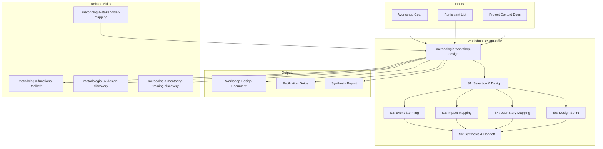

# Workshop Design: Collaborative Discovery & Design Techniques

Workshop design creates structured collaborative sessions to extract knowledge, align stakeholders, and produce actionable artifacts. Covers technique selection, session design, facilitation guides, and synthesis — from event storming to design sprints. [EXPLICIT]

## Grounding Guideline

> A poorly facilitated workshop does not just waste time — it destroys the team's trust in collaborative processes. Excellent facilitation is the difference between genuine alignment and superficial consensus.

1. **Collaborative discovery over unilateral presentation.** Tacit knowledge only emerges when people do, not when they listen. Every minute of a workshop must be designed to extract, not to transmit. [EXPLICIT]
2. **Structure in service of creativity.** Time-boxes, techniques, and participation rules do not limit creativity — they amplify it. Without structure, the loudest voices dominate and the most valuable ideas are lost. [EXPLICIT]
3. **Living artifacts over dead meeting notes.** The value of a workshop is not in the synthesis document — it is in the shared mental models that are built. Artifacts must be working tools, not evidence files. [EXPLICIT]

## Inputs

The user provides a project or workshop goal as `$ARGUMENTS`. Parse `$1` as the **project/workshop name** used throughout all output artifacts. [EXPLICIT]

Before generating workshop design, detect project context:

```
find . -name "*.md" -o -name "*.miro" -o -name "*.figjam" -o -name "*.pdf" -o -name "workshop*" | head -20
```

**Parameters:**
- `{MODO}`: `piloto-auto` (default) | `desatendido` | `supervisado` | `paso-a-paso`
  - **piloto-auto**: Auto for agenda design and technique selection, HITL for participant validation and format decisions. [EXPLICIT]
  - **desatendido**: Zero interruptions. Complete design auto-generated. Assumptions documented. [EXPLICIT]
  - **supervisado**: Autonomous with checkpoints on technique selection and final design. [EXPLICIT]
  - **paso-a-paso**: Confirms before each design decision. [EXPLICIT]
- `{FORMATO}`: `markdown` (default) | `html` | `dual`
- `{VARIANTE}`: `ejecutiva` (~40%) | `técnica` (full, default)
- `{MODO_OPERACIONAL}`: `integral` (default, complete workshop design + synthesis) | `facilitacion` (energy management, diverge/converge cycles, breaks, energizers, facilitation timeline) | `sintesis` (output consolidation, deduplication, thematic clustering, owner assignment, action items)

## When to Use

- Kicking off a new project and needing shared understanding
- Exploring a complex domain before designing solutions
- Aligning cross-functional teams on scope, priorities, or architecture
- Breaking down epics into deliverable slices
- Running rapid prototyping and validation cycles
- Resolving conflicting mental models among team members
- Extracting tacit knowledge from domain experts

## Delivery Structure: 6 Sections

### S1: Workshop Selection & Design

Matches the right technique to the workshop goal, selects participants, and designs the agenda. [EXPLICIT]

**Technique selection matrix:**
- "Understand the domain" — Event Storming
- "Define impact and scope" — Impact Mapping
- "Plan releases and slices" — User Story Mapping
- "Prototype and validate" — Design Sprint
- "Prioritize and decide" — Dot Voting, MoSCoW, WSJF
- "Retrospect and improve" — Sailboat, 4Ls, Start/Stop/Continue

**Core facilitation principles:**
- **Diverge-Converge rhythm:** Every activity follows Generate > Cluster > Vote > Decide. Never skip clustering.
- **Silent-before-spoken rule:** Start ideation with 5-10 min of silent individual writing. Solo ideation produces broader, more creative input. Discussion follows to combine and build.
- **Energizer techniques:** Quick creative prompts at session start and after breaks to reset attention.

**Key decisions:**
- Duration: half-day, full-day, multi-day, or compressed format
- In-person vs. remote vs. hybrid: facilitation approach differs significantly
- Participant count: 5-8 ideal; larger groups need breakout strategies
- Facilitation style: structured (strict time-boxes) vs. emergent (follow the energy)

### S2: Event Storming

Discovers domain knowledge by exploring events, commands, aggregates, and bounded contexts. [EXPLICIT]

**Includes:**
- Domain event discovery: past-tense verbs on orange stickies (OrderPlaced, PaymentReceived)
- Timeline construction: events arranged chronologically left-to-right
- Command identification: what triggers each event (blue stickies)
- Aggregate clustering: grouping events around domain entities (yellow stickies)
- Bounded context identification: drawing boundaries around related aggregates
- Hot spot marking: conflicts, unknowns, areas needing deeper exploration (pink stickies)
- Temporal modeling: parallel streams, eventual consistency points, saga boundaries
- Policy identification: automated reactions between events ("when X happens, then Y")

### S3: Impact Mapping

Connects business goals to deliverables through actors and impacts. [EXPLICIT]

**Includes:**
- Goal definition: measurable business objective at the center
- Actor identification: who can help or hinder the goal
- Impact discovery: what behavior changes in actors would achieve the goal
- Deliverable brainstorming: what can we build/do to create those impacts
- Assumption testing: which impacts are assumptions vs. validated knowledge
- Scope negotiation: using the map to cut scope while preserving goal achievement

### S4: User Story Mapping

Organizes user activities into a backbone and plans releases as horizontal slices. [EXPLICIT]

**Includes:**
- Backbone construction: high-level user activities across the top (left to right = user journey)
- Walking skeleton: the minimum set of stories that deliver end-to-end value
- Vertical slicing: each column is an activity; stories arranged top-to-bottom by priority
- Release planning: horizontal lines across the map define release boundaries
- MVP identification: the thinnest horizontal slice that delivers a testable product
- Dependency flagging: stories that block others, requiring sequencing

### S5: Design Sprint

Compressed prototyping and validation cycle — understand, sketch, decide, prototype, test. [EXPLICIT]

**Includes:**
- Day 1 — Understand: map the challenge, interview experts, set sprint goal, pick target
- Day 2 — Sketch: lightning demos, individual solution sketching, Crazy 8s, solution sketch
- Day 3 — Decide: art museum, heat map voting, speed critique, storyboard the winner
- Day 4 — Prototype: realistic facade prototype (Figma, HTML, slide deck), assign roles
- Day 5 — Test: 5 user interviews, structured observation, pattern identification
- Compressed formats: 3-day sprint, 1-day lightning sprint, async sprint

### S6: Synthesis & Handoff

Consolidates workshop outputs into actionable artifacts and establishes follow-up cadence. [EXPLICIT]

**Includes:**
- Insight consolidation: key findings, decisions made, open questions
- Artifact packaging: photographs, digital boards, structured documents
- Action item extraction: who does what by when
- Decision log: what was decided, by whom, with what rationale
- Follow-up cadence: next workshop, check-in meeting, async review
- Knowledge transfer: how to bring non-attendees up to speed

## Trade-off Matrix

| Decision | Enables | Constrains | When to Use |
|---|---|---|---|
| **Event Storming** | Deep domain understanding, DDD alignment | Requires domain experts, time-intensive | Complex domains, DDD projects |
| **Impact Mapping** | Goal alignment, scope negotiation | Abstract, requires clear business goal | Strategy-to-execution alignment |
| **User Story Mapping** | Release planning, shared understanding | Requires known user journey | Agile planning, MVP definition |
| **Design Sprint** | Fast validation, reduced risk | Requires 5 days, facilitator skill | New products, risky features |
| **Full-Day Workshop** | Deep exploration, relationship building | Calendar cost, energy management | Kickoffs, complex problems |
| **Compressed Format** | Time-efficient, lower commitment | Shallow output, risk of rushing | Follow-ups, well-scoped questions |

## Assumptions & Limits

- Workshop participants are available and empowered to contribute
- Facilitator has access to collaboration tools (physical or digital)
- Workshop goal is defined, even if broadly
- Outputs will be used — workshops without follow-through waste trust
- Does not produce technical specifications — produces inputs for them
- Cannot force stakeholder alignment — surfaces disagreements, doesn't resolve politics

## Edge Cases

**Remote-Only Team:** Use Miro, FigJam, or Excalidraw. Shorter sessions (2-3 hours max). More structured facilitation. Breakout rooms for parallel work. Maintain dual-agenda: external schedule for participants and internal facilitator script.

**Remote Facilitation Anti-Patterns (avoid):**
- Death by screen-share: make participants DO things on the board
- Phantom consensus: silence does not equal agreement — use explicit polls
- Breakout abandonment: always provide clear instructions, time limit, and a template
- Energy blindness: build breaks at 40 min intervals
- Over-tooling: consolidate to one collaboration surface

**Large Group (15+):** Split into breakout groups of 4-6. Assign sub-facilitators. Gallery walks and dot voting for convergence.

**Conflicting Stakeholders:** Surface conflicts explicitly. Use structured techniques (silent brainstorming, anonymous voting) to reduce power dynamics. Facilitator must be neutral.

**Domain Experts Unavailable:** Event storming without domain experts produces developer assumptions. Either postpone or run preliminary session marking assumptions explicitly.

**Workshop Fatigue:** Demonstrate follow-through. Keep session shorter, action-oriented. Show how prior outputs were used.

## Edge Cases

| Case | Handling Strategy |
|------|---------------------|
| Equipo 100% remoto sin experiencia en talleres colaborativos | Usar Miro/FigJam; sesiones mas cortas (2-3h max); facilitacion mas estructurada con templates pre-llenados; breaks cada 40 min; instrucciones escritas en cada actividad |
| Grupo grande (15+ participantes) sin posibilidad de reducir | Dividir en breakout groups de 4-6; asignar sub-facilitadores; usar gallery walks y dot voting para convergencia; evitar plenarias extensas |
| Domain experts no disponibles para event storming | Posponer event storming o ejecutar sesion preliminar marcando supuestos explicitamente; el output sin domain experts es developer assumptions, no domain knowledge |
| Fatiga de talleres en la organizacion (demasiados workshops sin follow-through) | Demostrar follow-through de sesiones anteriores; mantener sesiones cortas y orientadas a accion; mostrar como outputs anteriores fueron utilizados |

## Decisions & Trade-offs

| Decision | Discarded Alternative | Justification |
|----------|----------------------|---------------|
| Seleccionar tecnica segun objetivo del taller (event storming para dominio, impact mapping para scope, etc.) | Usar siempre la misma tecnica independiente del objetivo | Cada tecnica tiene un sweet spot; usar event storming para priorizar o design sprint para descubrir dominio produce resultados sub-optimos |
| Aplicar regla "silent-before-spoken" en toda ideacion | Comenzar directamente con discusion abierta | La ideacion silenciosa produce mas ideas diversas; la discusion abierta tiende a sesgo del mas vocal y groupthink |
| Disenar agenda con ritmo diverge-converge explicito | Agenda lineal sin ciclos de divergencia/convergencia | Sin convergencia, el taller produce ideas sin decisiones; sin divergencia, las ideas son limitadas por el pensamiento grupal |

## Knowledge Graph



## Output Templates

**Formato MD (default):**

```
# Workshop Design — {nombre del taller}
## Objetivo
> Que se busca lograr y como se medira el exito.
## Tecnica Seleccionada
| Tecnica | Justificacion | Duracion | Participantes |
## Agenda Detallada
| Bloque | Actividad | Duracion | Facilitador | Output |
## Pre-work
[Materiales a enviar antes del taller]
## Guia de Facilitacion
[Script interno para el facilitador con time-boxes y transiciones]
## Template de Sintesis
[Estructura para consolidar outputs post-taller]
```

**Formato DOCX (bajo demanda):**
- Filename: `{fase}_{entregable}_{cliente}_{WIP}.docx`
- Generado con python-docx, Design System MetodologIA v5. Portada con logo y metadata del proyecto, TOC automático, encabezados/pies de página con marca. Tablas con zebra striping. Tipografía: Poppins para encabezados (navy), Trebuchet MS para cuerpo, acentos gold.

**Formato XLSX (bajo demanda):**
- Filename: `{fase}_workshop-design_{cliente}_{WIP}.xlsx`
- Generado con openpyxl y MetodologIA Design System v5. Encabezados con fondo navy y texto Poppins blanco, formato condicional por técnica seleccionada y estado de acción, auto-filtros en todas las columnas, valores calculados sin fórmulas. Hojas: Agenda Time-boxed, Participantes y Roles, Pre-work Checklist, Action Items con Owners, Decision Log.

**Formato PPTX (bajo demanda):**
- Filename: `{fase}_{entregable}_{cliente}_{WIP}.pptx`
- Generado con python-pptx y MetodologIA Design System v5. Slide master con gradiente navy, títulos en Poppins, cuerpo en Trebuchet MS, acentos gold. Máx 20 slides versión ejecutiva / 30 versión técnica. Notas del orador con referencias de evidencia por slide. Slides sugeridos: portada, objetivo y criterios de éxito, técnica seleccionada con justificación, agenda visual time-boxed, participantes y roles, pre-work requerido, guía de facilitación por bloque, template de síntesis, action items con owners y deadlines.

**Formato HTML (para distribucion a participantes):**

```
Header: Logo + nombre del taller + fecha
Section 1: Objetivo y Expectativas (callout box)
Section 2: Agenda Visual (timeline con bloques de color)
Section 3: Pre-work Required (checklist con links)
Section 4: Que Traer / Como Prepararse
Section 5: Logistics (lugar/link, horario, breaks)
Footer: Contacto del facilitador + MetodologIA attribution
--- Documento separado (interno): Facilitation Guide (no distribuir a participantes)
```

## Evaluacion

| Dimension | Peso | Criterio | Umbral Minimo |
|-----------|------|----------|---------------|
| Trigger Accuracy | 10% | El skill se activa ante prompts de workshop design, event storming, impact mapping, design sprint, story mapping | 7/10 |
| Completeness | 25% | Tecnica seleccionada con justificacion; agenda time-boxed; pre-work definido; sintesis planificada; action items con owners | 7/10 |
| Clarity | 20% | Agenda es ejecutable por un facilitador sin contexto adicional; participantes entienden que se espera de ellos | 7/10 |
| Robustness | 20% | Edge cases cubiertos (remoto, grupo grande, sin experts, fatiga); anti-patterns de facilitacion remota documentados | 7/10 |
| Efficiency | 10% | Duracion y formato adaptados al contexto (no usar full-day cuando 2h es suficiente); modo operacional correcto | 7/10 |
| Value Density | 15% | Outputs del taller alimentan directamente actividades downstream; follow-up cadence definida; knowledge transfer para no-asistentes | 7/10 |

**Umbral minimo global: 7/10.** Si alguna dimension cae por debajo, el entregable requiere revision antes de entrega.

## Validation Gate

Before finalizing delivery, verify:

- [ ] Workshop technique matches the stated goal
- [ ] Participant list includes the right roles (domain experts, decision-makers)
- [ ] Agenda is time-boxed with clear activities per block
- [ ] Pre-work is defined and distributed
- [ ] Success criteria are explicit and measurable
- [ ] Facilitation approach accounts for remote/in-person dynamics
- [ ] Synthesis plan is defined (who packages, when, in what format)
- [ ] Action items have owners and deadlines
- [ ] Follow-up cadence is agreed upon
- [ ] Workshop outputs feed into downstream activities

## Output Format Protocol

| Format | Default | Description |
|--------|---------|-------------|
| `markdown` | ✅ | Rich Markdown + Mermaid diagrams. Token-efficient. |
| `html` | On demand | Branded HTML (Design System). Visual impact. |
| `dual` | On demand | Both formats. |

Default output is Markdown with embedded Mermaid diagrams. HTML generation requires explicit `{FORMATO}=html` parameter. [EXPLICIT]

## Output Configuration

- **Language**: Spanish (Latin American, business register — simple, clear, concise, direct)
- **Attribution**: Expert committee of the MetodologIA Discovery Framework
- **Tagline**: *"Construido por profesionales, potenciado por la red agéntica de MetodologIA."*

## Output Artifact

**Primary:** `A-01_Workshop_Design.html` — Technique selection rationale, detailed agenda, facilitation guide, participant briefing, synthesis template, action item tracker.

### Diagrams (Mermaid)
- Flowchart: workshop agenda flow with decision points
- Mindmap: workshop outputs and their connections to deliverables

## Operational Modes

Formerly separate sub-agents (`energy-manager`, `synthesis-engine`) are now operational modes:

| Mode | Focus | Best For |
|---|---|---|
| `integral` (default) | Complete workshop design: technique selection, agenda, facilitation, energy, synthesis | Standard discovery workshop design |
| `facilitacion` | Energy management, diverge/converge cycles, strategic breaks, energizers, attention monitoring, energy arc | Optimizing engagement and productivity during the workshop |
| `sintesis` | Raw output consolidation, deduplication, thematic clustering, contradiction resolution, action items with owners and deadlines | Post-workshop: transforming raw outputs into actionable deliverables |

Invoke with `{MODO_OPERACIONAL}=facilitacion` or `{MODO_OPERACIONAL}=sintesis`. [EXPLICIT]

---
