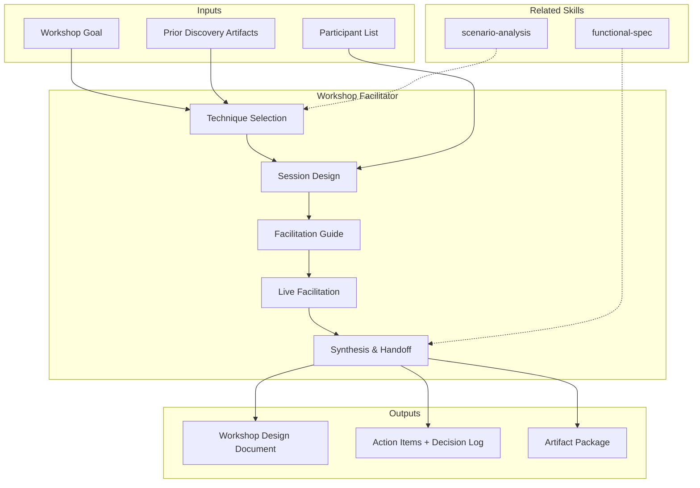

# Workshop Facilitator: Collaborative Discovery & Design Techniques

Workshop facilitation designs and runs structured collaborative sessions to extract knowledge, align stakeholders, and produce actionable artifacts. Covers technique selection, session design, facilitation guides, and synthesis — from event storming to design sprints. [EXPLICIT]

## Grounding Guideline

> A poorly facilitated workshop does not just waste time — it destroys the team's trust in collaborative processes. Excellent facilitation is the difference between genuine alignment and superficial consensus.

1. **Collaborative discovery over unilateral presentation.** Tacit knowledge only emerges when people do, not when they listen. Every minute of a workshop must be designed to extract, not to transmit. [EXPLICIT]
2. **Structure in service of creativity.** Time-boxes, techniques, and participation rules do not limit creativity — they amplify it. Without structure, the loudest voices dominate and the most valuable ideas are lost. [EXPLICIT]
3. **Living artifacts over dead meeting notes.** The value of a workshop is not in the synthesis document — it is in the shared mental models that are built. Artifacts must be working tools, not evidence files. [EXPLICIT]

## Inputs

The user provides a project or workshop goal as `$ARGUMENTS`. Parse `$1` as the **project/workshop name** used throughout all output artifacts. [EXPLICIT]

Before generating workshop design, detect project context:

```
find . -name "*.md" -o -name "*.miro" -o -name "*.figjam" -o -name "*.pdf" -o -name "workshop*" | head -20
```

**Parameters:**
- `{MODO}`: `piloto-auto` (default) | `desatendido` | `supervisado` | `paso-a-paso`
  - **piloto-auto**: Auto para diseño de agenda y selección de técnicas, HITL para validación de participantes y decisiones de formato. [EXPLICIT]
  - **desatendido**: Zero interruptions. Diseño completo auto-generado. Assumptions documented. [EXPLICIT]
  - **supervisado**: Autónomo con checkpoints en selección de técnica y diseño final. [EXPLICIT]
  - **paso-a-paso**: Confirms before cada decisión de diseño. [EXPLICIT]
- `{FORMATO}`: `markdown` (default) | `html` | `dual`
- `{VARIANTE}`: `ejecutiva` (~40%) | `técnica` (full, default)

## When to Use

- Kicking off a new project and needing shared understanding
- Exploring a complex domain before designing solutions
- Aligning cross-functional teams on scope, priorities, or architecture
- Breaking down epics into deliverable slices
- Running rapid prototyping and validation cycles
- Resolving conflicting mental models among team members
- Extracting tacit knowledge from domain experts

## Delivery Structure: 6 Sections

### S1: Workshop Selection & Design

Matches the right technique to the workshop goal, selects participants, and designs the agenda. [EXPLICIT]

**Technique selection matrix:**
- "Understand the domain" — Event Storming
- "Define impact and scope" — Impact Mapping
- "Plan releases and slices" — User Story Mapping
- "Prototype and validate" — Design Sprint
- "Prioritize and decide" — Dot Voting, MoSCoW, WSJF
- "Retrospect and improve" — Sailboat, 4Ls, Start/Stop/Continue

**Core facilitation principles:**
- **Diverge-Converge rhythm:** Every activity follows Generate > Cluster > Vote > Decide. Never skip clustering.
- **Silent-before-spoken rule:** Start ideation with 5-10 min of silent individual writing. Solo ideation produces broader, more creative input. Discussion follows to combine and build.
- **Energizer techniques:** Quick creative prompts at session start and after breaks to reset attention.

**Key decisions:**
- Duration: half-day, full-day, multi-day, or compressed format
- In-person vs. remote vs. hybrid: facilitation approach differs significantly
- Participant count: 5-8 ideal; larger groups need breakout strategies
- Facilitation style: structured (strict time-boxes) vs. emergent (follow the energy)

### S2: Event Storming

Discovers domain knowledge by exploring events, commands, aggregates, and bounded contexts. [EXPLICIT]

**Includes:**
- Domain event discovery: past-tense verbs on orange stickies (OrderPlaced, PaymentReceived)
- Timeline construction: events arranged chronologically left-to-right
- Command identification: what triggers each event (blue stickies)
- Aggregate clustering: grouping events around domain entities (yellow stickies)
- Bounded context identification: drawing boundaries around related aggregates
- Hot spot marking: conflicts, unknowns, areas needing deeper exploration (pink stickies)
- Temporal modeling: parallel streams, eventual consistency points, saga boundaries
- Policy identification: automated reactions between events ("when X happens, then Y")

### S3: Impact Mapping

Connects business goals to deliverables through actors and impacts. [EXPLICIT]

**Includes:**
- Goal definition: measurable business objective at the center
- Actor identification: who can help or hinder the goal
- Impact discovery: what behavior changes in actors would achieve the goal
- Deliverable brainstorming: what can we build/do to create those impacts
- Assumption testing: which impacts are assumptions vs. validated knowledge
- Scope negotiation: using the map to cut scope while preserving goal achievement

### S4: User Story Mapping

Organizes user activities into a backbone and plans releases as horizontal slices. [EXPLICIT]

**Includes:**
- Backbone construction: high-level user activities across the top (left to right = user journey)
- Walking skeleton: the minimum set of stories that deliver end-to-end value
- Vertical slicing: each column is an activity; stories arranged top-to-bottom by priority
- Release planning: horizontal lines across the map define release boundaries
- MVP identification: the thinnest horizontal slice that delivers a testable product
- Dependency flagging: stories that block others, requiring sequencing

### S5: Design Sprint

Compressed prototyping and validation cycle — understand, sketch, decide, prototype, test. [EXPLICIT]

**Includes:**
- Day 1 — Understand: map the challenge, interview experts, set sprint goal, pick target
- Day 2 — Sketch: lightning demos, individual solution sketching, Crazy 8s, solution sketch
- Day 3 — Decide: art museum, heat map voting, speed critique, storyboard the winner
- Day 4 — Prototype: realistic facade prototype (Figma, HTML, slide deck), assign roles
- Day 5 — Test: 5 user interviews, structured observation, pattern identification
- Compressed formats: 3-day sprint, 1-day lightning sprint, async sprint

### S6: Synthesis & Handoff

Consolidates workshop outputs into actionable artifacts and establishes follow-up cadence. [EXPLICIT]

**Includes:**
- Insight consolidation: key findings, decisions made, open questions
- Artifact packaging: photographs, digital boards, structured documents
- Action item extraction: who does what by when
- Decision log: what was decided, by whom, with what rationale
- Follow-up cadence: next workshop, check-in meeting, async review
- Knowledge transfer: how to bring non-attendees up to speed

## Trade-off Matrix

| Decision | Enables | Constrains | When to Use |
|---|---|---|---|
| **Event Storming** | Deep domain understanding, DDD alignment | Requires domain experts, time-intensive | Complex domains, DDD projects |
| **Impact Mapping** | Goal alignment, scope negotiation | Abstract, requires clear business goal | Strategy-to-execution alignment |
| **User Story Mapping** | Release planning, shared understanding | Requires known user journey | Agile planning, MVP definition |
| **Design Sprint** | Fast validation, reduced risk | Requires 5 days, facilitator skill | New products, risky features |
| **Full-Day Workshop** | Deep exploration, relationship building | Calendar cost, energy management | Kickoffs, complex problems |
| **Compressed Format** | Time-efficient, lower commitment | Shallow output, risk of rushing | Follow-ups, well-scoped questions |

## Assumptions & Limits

- Workshop participants are available and empowered to contribute
- Facilitator has access to collaboration tools (physical or digital)
- Workshop goal is defined, even if broadly
- Outputs will be used — workshops without follow-through waste trust
- Does not produce technical specifications — produces inputs for them
- Cannot force stakeholder alignment — surfaces disagreements, doesn't resolve politics

## Edge Cases

**Remote-Only Team:** Use Miro, FigJam, or Excalidraw. Shorter sessions (2-3 hours max). More structured facilitation. Breakout rooms for parallel work. Maintain dual-agenda: external schedule for participants and internal facilitator script.

**Remote Facilitation Anti-Patterns (avoid):**
- Death by screen-share: make participants DO things on the board
- Phantom consensus: silence does not equal agreement — use explicit polls
- Breakout abandonment: always provide clear instructions, time limit, and a template
- Energy blindness: build breaks at 40 min intervals
- Over-tooling: consolidate to one collaboration surface

**Large Group (15+):** Split into breakout groups of 4-6. Assign sub-facilitators. Gallery walks and dot voting for convergence.

**Conflicting Stakeholders:** Surface conflicts explicitly. Use structured techniques (silent brainstorming, anonymous voting) to reduce power dynamics. Facilitator must be neutral.

**Domain Experts Unavailable:** Event storming without domain experts produces developer assumptions. Either postpone or run preliminary session marking assumptions explicitly.

**Workshop Fatigue:** Demonstrate follow-through. Keep session shorter, action-oriented. Show how prior outputs were used.

## Validation Gate

Before finalizing delivery, verify:

- [ ] Workshop technique matches the stated goal
- [ ] Participant list includes the right roles (domain experts, decision-makers)
- [ ] Agenda is time-boxed with clear activities per block
- [ ] Pre-work is defined and distributed
- [ ] Success criteria are explicit and measurable
- [ ] Facilitation approach accounts for remote/in-person dynamics
- [ ] Synthesis plan is defined (who packages, when, in what format)
- [ ] Action items have owners and deadlines
- [ ] Follow-up cadence is agreed upon
- [ ] Workshop outputs feed into downstream activities

## Output Format Protocol

| Format | Default | Description |
|--------|---------|-------------|
| `markdown` | ✅ | Rich Markdown + Mermaid diagrams. Token-efficient. |
| `html` | On demand | Branded HTML (Design System). Visual impact. |
| `dual` | On demand | Both formats. |

Default output is Markdown with embedded Mermaid diagrams. HTML generation requires explicit `{FORMATO}=html` parameter. [EXPLICIT]

## Output Artifact

**Primary:** `A-01_Workshop_Design.html` — Technique selection rationale, detailed agenda, facilitation guide, participant briefing, synthesis template, action item tracker.

### Diagrams (Mermaid)
- Flowchart: workshop agenda flow with decision points
- Mindmap: workshop outputs and their connections to deliverables

## Edge Cases

| Case | Handling Strategy |
|------|---------------------|
| Key domain expert is unavailable for the scheduled workshop | Postpone the session if the expert's knowledge is critical (event storming without domain experts produces developer assumptions); alternatively, run a preliminary session and mark all outputs as [SUPUESTO] pending expert validation |
| Workshop participants speak different languages (e.g., Spanish + English + Portuguese) | Designate bilingual facilitators per breakout group; use visual artifacts (stickies, diagrams) as the primary communication medium; provide translated templates for key activities |
| Hybrid workshop (some in-person, some remote) | Assign a dedicated "bridge facilitator" to ensure remote participants have equal voice; use a shared digital board as the canonical artifact even for in-person participants; run explicit check-ins with remote attendees every 20 minutes |
| Workshop output contradicts prior discovery phase findings | Document the contradiction explicitly; do not suppress either version; flag for steering committee arbitration; the workshop may have surfaced tacit knowledge that prior analysis missed |

## Decisions & Trade-offs

| Decision | Discarded Alternative | Justification |
|----------|----------------------|---------------|
| Silent-before-spoken rule for all ideation activities | Open discussion from the start | Open discussion allows dominant voices to anchor the group; 5-10 minutes of silent individual writing produces broader, more diverse input that discussion then refines |
| Maximum 8 participants per workshop session (breakouts for larger groups) | Allow 15+ participants in a single session | Groups larger than 8 suffer from diffusion of responsibility and reduced psychological safety; breakouts with sub-facilitators maintain quality and participation |
| Diverge-Converge rhythm as mandatory structure for every activity | Emergent facilitation that follows energy | Emergent facilitation works only with expert facilitators; the diverge-converge structure provides guardrails that produce consistent quality regardless of facilitator experience |

## Knowledge Graph



## Output Templates

### Markdown (default)
- Filename: `A-01_Workshop_Design_{cliente}_{WIP}.md`
- Structure: TL;DR > Technique Selection Rationale > Participant Briefing > Detailed Agenda with time-boxes > Facilitation Guide per activity > Pre-work Instructions > Synthesis Template > Action Item Tracker > Mermaid flowchart (agenda) + mindmap (outputs) > ghost menu

### HTML
- Filename: `A-01_Workshop_Design_{cliente}_{WIP}.html`
- Structure: MetodologIA Design System v4; interactive agenda timeline; collapsible facilitation instructions per activity; participant card grid; embedded Mermaid diagrams; print-ready for facilitator handout

### DOCX (bajo demanda)
- Filename: `{fase}_{entregable}_{cliente}_{WIP}.docx`
- Generado con python-docx, Design System MetodologIA v5. Portada con logo y metadata del proyecto, TOC automático, encabezados/pies de página con marca. Tablas con zebra striping. Tipografía: Poppins para encabezados (navy), Trebuchet MS para cuerpo, acentos gold.

### XLSX (bajo demanda)
- Filename: `{fase}_workshop-facilitator_{cliente}_{WIP}.xlsx`
- Generado con openpyxl y MetodologIA Design System v5. Encabezados con fondo navy y texto Poppins blanco, formato condicional por técnica y estado de acción post-taller, auto-filtros en todas las columnas, valores calculados sin fórmulas. Hojas: Agenda Time-boxed, Participantes y Roles, Pre-work Checklist, Action Items con Owners, Decision Log.

### PPTX (bajo demanda)
- Filename: `{fase}_{entregable}_{cliente}_{WIP}.pptx`
- Generado con python-pptx y MetodologIA Design System v5. Slide master con gradiente navy, títulos en Poppins, cuerpo en Trebuchet MS, acentos gold. Máx 20 slides versión ejecutiva / 30 versión técnica. Notas del orador con referencias de evidencia por slide. Slides sugeridos: portada, objetivo y criterios de éxito, técnica seleccionada con justificación, agenda visual time-boxed, participantes y roles, pre-work requerido, guía de facilitación por bloque, template de síntesis, action items con owners y deadlines.

## Evaluacion

| Dimension | Peso | Criterio |
|-----------|------|----------|
| Trigger Accuracy | 10% | Descripcion activa triggers correctos sin falsos positivos |
| Completeness | 25% | Todos los entregables cubren el dominio sin huecos |
| Clarity | 20% | Instrucciones ejecutables sin ambiguedad |
| Robustness | 20% | Maneja edge cases y variantes de input |
| Efficiency | 10% | Proceso no tiene pasos redundantes |
| Value Density | 15% | Cada seccion aporta valor practico directo |

**Umbral minimo**: 7/10 en cada dimension para considerar el skill production-ready.

---
**Autor:** Javier Montaño | **Ultima actualizacion:** 15 de marzo de 2026
