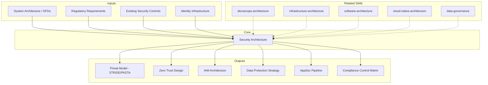

# Security Architecture: Threat Modeling, Identity & Compliance Design

Security architecture defines how systems protect data, verify identity, enforce access, and maintain compliance across the entire technology stack. The skill produces comprehensive security designs covering threat modeling, zero trust implementation, identity management, data protection, application security pipelines, and compliance mapping. [EXPLICIT]

## Grounding Guideline

**Security that depends on a perimeter has already been compromised.** Zero Trust is not a product — it is a design philosophy. Threat modeling before designing, compliance as a minimum floor not a maximum ceiling, and every security decision documented before implementing.

### Security Architecture Philosophy

1. **Zero Trust everywhere.** There is no trusted network, no trusted user, no trusted service. Every request is authenticated, authorized, and encrypted — no exceptions. [EXPLICIT]
2. **Threat modeling before design.** Modeling threats AFTER design is auditing. Modeling them BEFORE is architecture. STRIDE/PASTA in the design phase reduces remediation cost by 100x. [EXPLICIT]
3. **Compliance is minimum bar, not maximum goal.** Passing an audit does not mean being secure. Frameworks (SOC2, PCI-DSS, ISO 27001) define the floor — security architecture defines the ceiling. [EXPLICIT]

## Inputs

The user provides a system or organization name as `$ARGUMENTS`. Parse `$1` as the **system/organization name** used throughout all output artifacts. [EXPLICIT]

**Parameters:**
- `{MODO}`: `piloto-auto` (default) | `desatendido` | `supervisado` | `paso-a-paso`
  - **piloto-auto**: Auto para threat enumeration y control mapping, HITL para Zero Trust maturity y compliance scope decisions. [EXPLICIT]
  - **desatendido**: Zero interruptions. Security architecture documentada automáticamente. Assumptions documented. [EXPLICIT]
  - **supervisado**: Autónomo con checkpoint en threat model review y IAM design. [EXPLICIT]
  - **paso-a-paso**: Confirma cada threat, mitigation, encryption decision, y compliance mapping. [EXPLICIT]
- `{FORMATO}`: `markdown` (default) | `html` | `dual`
- `{VARIANTE}`: `ejecutiva` (~40% — S1 threat model + S2 zero trust + S6 compliance) | `técnica` (full 6 sections, default)

### NIST CSF 2.0 Alignment

All deliverables map to the six NIST CSF 2.0 functions:

| Function | Focus | Key categories |
|---|---|---|
| **Govern** (new in 2.0) | Cybersecurity risk governance, strategy, supply chain risk | GV.OC (context), GV.RM (risk management), GV.SC (supply chain) |
| **Identify** | Asset management, risk assessment, improvement | ID.AM, ID.RA, ID.IM |
| **Protect** | Access control, awareness, data security, platform security | PR.AA, PR.AT, PR.DS, PR.PS |
| **Detect** | Continuous monitoring, adverse event analysis | DE.CM, DE.AE |
| **Respond** | Incident management, analysis, mitigation, reporting | RS.MA, RS.AN, RS.MI |
| **Recover** | Recovery execution, communication | RC.RP, RC.CO |

Use the Govern function to ensure security architecture has executive sponsorship and integrates into enterprise risk management. CSF 2.0 explicitly addresses supply chain security, zero trust, and AI-related risks. [EXPLICIT]

Before generating architecture, detect the technology context:

```
!find . -name "*.tf" -o -name "Dockerfile" -o -name "*.yaml" -o -name "auth*" -o -name "security*" | head -20
```

If reference materials exist, load them:

```
Read ${CLAUDE_SKILL_DIR}/references/security-frameworks.md
```

---

## When to Use

- Designing security architecture for new systems or major platform changes
- Conducting threat modeling for applications, APIs, or infrastructure
- Implementing zero trust architecture
- Designing identity and access management systems
- Planning encryption and data protection strategies
- Mapping compliance requirements to technical controls

## When NOT to Use

- CI/CD pipeline security (SAST/DAST integration only) — use devsecops-architecture
- Infrastructure provisioning and network design — use infrastructure-architecture
- Application code patterns and module design — use software-architecture
- Penetration testing execution — requires specialized security team

---

## Delivery Structure: 6 Sections

### S1: Threat Modeling

Systematically identify threats using structured methodologies applied to the system's architecture. [EXPLICIT]

**Methodology selection:**
- **STRIDE** (per-element): Spoofing, Tampering, Repudiation, Information Disclosure, DoS, Elevation of Privilege. Best for component-level analysis.
- **PASTA** (risk-centric, 7-stage): Business objective -> tech scope -> decomposition -> threat analysis -> vulnerability mapping -> attack modeling -> risk/impact. Best for business-aligned threat assessment.

**Process:**
1. Draw data flow diagrams (DFDs): processes, data stores, data flows, external entities, trust boundaries
2. Identify attack surface: entry points (APIs, UIs, file uploads), external dependencies, admin interfaces
3. Enumerate threats per element using STRIDE categories
4. Score risks: likelihood x impact matrix (5x5), prioritize for mitigation
5. Map threats to mitigations and residual risk acceptance

**Attacker profiles:** External anonymous, authenticated user, malicious insider, supply chain compromise

### S2: Zero Trust Architecture

Design identity-centric security that assumes no implicit trust regardless of network location. [EXPLICIT]

**Core principles:** Verify explicitly, least privilege access, assume breach.

**NIST SP 800-207 + SP 1800-35 Implementation Patterns:**
- Identity as perimeter: every request authenticated and authorized, regardless of source network
- Micro-segmentation: network policies restricting lateral movement between services
- Continuous verification: session validation, device posture checks, risk-based step-up auth
- Service-to-service: mutual TLS (mTLS), service mesh authorization policies (Istio, Linkerd)
- Software-defined perimeter: encrypted overlay networks, private endpoints

**Zero Trust Maturity Model:**

| Level | Scope | Controls | Timeline |
|---|---|---|---|
| **Crawl** | Perimeter + identity | MFA everywhere, network segmentation, centralized IdP | 0-6 months |
| **Walk** | Micro-segmentation | Service mesh mTLS, per-service auth policies, device trust | 6-18 months |
| **Run** | Continuous adaptive trust | Real-time risk scoring, behavioral analytics, just-in-time access | 18-36 months |

**Key decisions:**
- Greenfield (designed-in) vs. brownfield (progressive adoption per maturity model)
- Service mesh overhead: sidecar proxy adds 1-3ms latency per hop — justify against security benefit
- Device trust: managed-only, BYOD with posture assessment, or device-agnostic

### S3: Identity & Access Management

Design authentication, authorization, and secret management for human and machine identities. [EXPLICIT]

**Authentication:** OAuth 2.0 / OIDC for user flows, client credentials for S2S, WebAuthn/FIDO2 for passwordless
**MFA:** TOTP/WebAuthn for users, certificate-based for services, risk-based triggers
**SSO:** Centralized IdP, federation with external IdPs (SAML, OIDC)
**Service identity:** Workload identity (SPIFFE/SPIRE), short-lived certificates, zero long-lived secrets
**Secret management:** HashiCorp Vault, AWS Secrets Manager. Rotation: 90 days for credentials, on-demand for incident.

**Authorization Model Selection:**

| Model | Granularity | Complexity | Best for |
|---|---|---|---|
| **RBAC** | Role-level | Low | Simple hierarchies, <20 roles |
| **ABAC** | Attribute-level | High | Multi-tenant, data-level access, regulatory |
| **ReBAC** | Relationship-level | Medium | Social graphs, document sharing (Google Zanzibar) |

**Token decisions:** JWT (stateless, verifiable, larger) vs. opaque (requires introspection, revocable). Use JWT for S2S, opaque for user sessions needing immediate revocation.

### S4: Data Protection

Design encryption, key management, and data loss prevention across the data lifecycle. [EXPLICIT]

**Encryption at rest:** Database TDE, filesystem encryption, backup encryption — AES-256 minimum
**Encryption in transit:** TLS 1.3 everywhere, certificate management (ACME/Let's Encrypt), certificate pinning for mobile
**Key management:** Cloud KMS or HSM-backed. Key hierarchy: master key -> data encryption keys. Rotation: annual for master, monthly for DEKs.
**Tokenization:** Replace sensitive data with non-reversible tokens for analytics and testing
**Data masking:** Dynamic masking in non-prod environments, role-based visibility

**Data Classification and Handling:**

| Class | Examples | Encryption | Access | Retention |
|---|---|---|---|---|
| **Restricted** | PII, PHI, payment cards | At rest + in transit, customer-managed keys | Named individuals only | Minimum required by law |
| **Confidential** | Business plans, source code | At rest + in transit | Role-based | Per policy |
| **Internal** | Org communications | In transit | All employees | 1-3 years |
| **Public** | Marketing, docs | In transit (integrity) | Anyone | Indefinite |

### S5: Application Security

Integrate security testing into the development lifecycle. [EXPLICIT]

**Shift-Left Cost Multiplier:**

| Phase | Fix cost | Implication |
|---|---|---|
| Design (threat model) | **1x** | Highest ROI — invest here |
| Code (SAST, code review) | **6x** | Catch before merge |
| Testing (DAST, pen test) | **15x** | Catch before release |
| Production (incident) | **100x** | Most expensive, reputational damage |

**Security pipeline:**
- **SAST:** Code scanning in IDE and CI (SonarQube, Semgrep, CodeQL). Fail PR on critical findings.
- **DAST:** Runtime scanning against staging (ZAP, Burp Suite). Run weekly or pre-release.
- **SCA:** Dependency vulnerability scanning + license compliance (Snyk, Dependabot, Renovate). Vulnerability SLA: critical <24h, high <7d, medium <30d.

**Supply Chain Security (SLSA + SBOM):**

| SLSA Level | Requirements | Effort |
|---|---|---|
| **Level 1** | Build provenance (document the build process) | Low — start here |
| **Level 2** | Hosted build service, signed provenance | Medium |
| **Level 3** | Hardened builds, non-falsifiable provenance | High — when compliance requires |

**SBOM format choice:**
- **CycloneDX:** Security-focused, VEX support, OWASP-backed. Pick for application security.
- **SPDX:** License/legal detail, ISO standard (ISO/IEC 5962:2021). Pick for compliance/legal.
- Tools: Syft (generation), Dependency-Track (analysis), cosign/Sigstore (signing)
- EU Cyber Resilience Act (2027) makes SBOMs mandatory for software sold in EU.

**RASP (Runtime Application Self-Protection):** Instrument runtime to detect/block SQL injection, deserialization, path traversal from inside the application. Complement WAF with runtime visibility for high-value applications.

**Security Champions Program:**
- Embed 1 trained champion per dev team (10-20% time allocation)
- Champions conduct first-pass threat models, triage SAST findings, escalate to central security
- Scales security knowledge without growing security team linearly
- Training: OWASP Top 10, secure coding, threat modeling basics (40h initial, 8h/quarter ongoing)

### S6: Compliance & Audit

Map regulatory frameworks to technical controls with evidence collection and continuous compliance. [EXPLICIT]

**Compliance Framework Mapping Table:**

| Control Area | SOC 2 (TSC) | ISO 27001 (Annex A) | PCI-DSS 4.0 | HIPAA | GDPR |
|---|---|---|---|---|---|
| Access control | CC6.1-CC6.3 | A.9 | Req 7-8 | 164.312(a) | Art 32 |
| Encryption | CC6.1, CC6.7 | A.10 | Req 3-4 | 164.312(a)(2)(iv) | Art 32 |
| Logging/monitoring | CC7.1-CC7.3 | A.12.4 | Req 10 | 164.312(b) | Art 30 |
| Incident response | CC7.4-CC7.5 | A.16 | Req 12.10 | 164.308(a)(6) | Art 33-34 |
| Vendor management | CC9.2 | A.15 | Req 12.8 | 164.308(b) | Art 28 |
| Change management | CC8.1 | A.14 | Req 6 | 164.308(a)(1) | — |

**Control matrix:** Framework requirement -> technical control -> evidence source -> testing frequency
**Continuous compliance:** Automated policy checks (OPA, Cloud Custodian), drift detection
**Tooling:** Vanta, Drata for automated evidence collection; manual for complex controls
**Audit readiness:** Evidence repository, control owner assignments, pre-audit checklists

---

## Trade-off Matrix

| Decision | Enables | Constrains | When to Use |
|---|---|---|---|
| **Zero trust everywhere** | Strong posture, lateral movement prevention | Implementation complexity, latency overhead | Regulated industries, high-value targets |
| **RBAC only** | Simple to implement and audit | Coarse-grained, role explosion at scale | Small teams, simple authorization |
| **ABAC policies** | Fine-grained, context-aware | Complex policy management | Multi-tenant, data-level access, regulatory |
| **Customer-managed keys** | Customer control, compliance enabler | Ops complexity on customer side | Data sovereignty, regulated customers |
| **Automated compliance** | Continuous assurance, audit efficiency | Tool cost, false positives | SOC 2, ISO 27001, PCI-DSS environments |
| **Security champions** | Distributed awareness, faster reviews | Training investment, time split | Scaling security beyond dedicated team |

---

## Assumptions

- System has defined data flows and component boundaries (or they can be established)
- Organization has identified applicable regulatory frameworks
- Security tooling budget is available or can be justified
- Executive sponsorship exists for security architecture initiatives

## Limits

- Does not perform penetration testing or vulnerability exploitation
- Does not replace legal counsel for regulatory interpretation
- Threat models require periodic refresh as systems evolve (quarterly recommended)
- Zero trust full maturity takes 18-36 months

---

## Edge Cases

**Greenfield System:** Design security from day one. Embed threat modeling in architecture review. Choose IdP and encryption strategy before first deployment.

**Legacy System with No Security Architecture:** Start with threat model of current state. Prioritize: auth/authz gaps, data encryption, dependency vulnerabilities. Phase improvements aligned with existing roadmap.

**Multi-Tenant SaaS:** Tenant isolation is paramount. Data-level access control, tenant-scoped encryption keys, per-tenant audit logging. Test for cross-tenant data leakage explicitly.

**Regulated Industry (Finance, Health):** Compliance drives architecture. Map every control to framework requirement. Budget for audit prep and external assessments. Encryption and access logging are non-negotiable.

**Acquisitions / Mergers:** Multiple identity systems, inconsistent security postures. Prioritize identity federation, network segmentation between entities, unified compliance reporting.

---

## Validation Gate

Before finalizing delivery, verify:

- [ ] Threat model covers all trust boundaries and data flows with STRIDE/PASTA
- [ ] Zero trust maturity level realistic with phased roadmap
- [ ] Identity architecture covers human, service, and machine identities
- [ ] Encryption covers data at rest and in transit with key management defined
- [ ] Application security pipeline includes SAST, DAST, SCA with vulnerability SLAs
- [ ] SLSA level and SBOM format selected with generation integrated into CI
- [ ] Compliance frameworks mapped to specific technical controls (mapping table)
- [ ] Evidence collection automated where possible
- [ ] Secret management eliminates long-lived credentials
- [ ] Security champions program structured with training plan

---

## Knowledge Graph



## Output Templates

**Formato MD (default):**

```
# Security Architecture: {system_name}
## S1: Threat Modeling
### DFDs | Attack Surface | STRIDE Enumeration | Risk Scoring | Mitigations

## S2: Zero Trust Architecture
### NIST 800-207 | Micro-Segmentation | mTLS | Maturity Model

## S3: Identity & Access Management
### AuthN (OAuth/OIDC/FIDO2) | AuthZ (RBAC/ABAC/ReBAC) | Secret Management

## S4: Data Protection
### Encryption at Rest/Transit | Key Management | Classification | Masking

## S5: Application Security
### SAST/DAST/SCA | SLSA/SBOM | RASP | Security Champions

## S6: Compliance & Audit
### Framework Mapping (SOC2/ISO27001/PCI-DSS/HIPAA/GDPR) | Evidence | Continuous Compliance
```

**Formato XLSX:**
Matriz de controles de seguridad: filas por framework regulatorio (SOC2, ISO27001, PCI-DSS, HIPAA, GDPR), columnas por area de control, con estado de implementacion, evidencia requerida, owner, y frecuencia de testing. Incluye hoja de threat model con scoring de riesgo. [EXPLICIT]

### DOCX (bajo demanda)
- Filename: `{fase}_security_architecture_{cliente}_{WIP}.docx`
- Generado con python-docx y MetodologIA Design System v5. Portada con nombre del sistema y fecha, TOC automático, encabezados Poppins navy, cuerpo Trebuchet MS, acentos dorados, tablas zebra. Secciones: Threat Model (STRIDE/PASTA), Zero Trust Design, IAM Architecture, Data Protection, AppSec Pipeline, Compliance Control Matrix.

### HTML (bajo demanda)
- Filename: `{fase}_security_architecture_{cliente}_{WIP}.html`
- Estructura: HTML self-contained branded (Design System MetodologIA v5). Light-First Technical. Threat model con DFD visual, zero trust maturity gauge (Crawl/Walk/Run), compliance control matrix con estado por framework. WCAG AA, responsive, print-ready.

### PPTX (bajo demanda)
- Filename: `{fase}_security_architecture_{cliente}_{WIP}.pptx`
- Generado via python-pptx con MetodologIA Design System v5. Slide master con gradiente navy, títulos en Poppins, cuerpo en Trebuchet MS, acentos en gold. Máx 20 slides ejecutivo / 30 técnico. Notas del presentador con referencias de evidencia. Slides: Threat Model (STRIDE/PASTA), Zero Trust Maturity Model, IAM Architecture, Data Protection Strategy, AppSec Pipeline, Compliance Control Matrix (SOC2/ISO27001/PCI-DSS/HIPAA/GDPR).

## Evaluacion

| Dimension | Peso | Criterio (7/10 minimo) |
|---|---|---|
| Trigger Accuracy | 10% | Se activa ante keywords de security architecture, threat modeling, zero trust, IAM, compliance; no ante pen testing |
| Completeness | 25% | Las 6 secciones cubren threat model, zero trust, IAM, data protection, appsec, y compliance con mappings |
| Clarity | 20% | Maturity model tiene niveles claros (crawl/walk/run); compliance mapping es framework-a-control especifico |
| Robustness | 20% | Edge cases (greenfield, legacy, multi-tenant, regulado, M&A) tienen estrategia de adopcion definida |
| Efficiency | 10% | Variante ejecutiva entrega threat model + zero trust + compliance en ~40% sin perder rigor |
| Value Density | 15% | Cada seccion produce controles implementables: policies, configurations, pipeline stages, control matrices |

**Umbral minimo:** 7/10 en cada dimension. Composite ponderado >= 7.0 para considerar el output aceptable.

---

## Output Format Protocol

| Format | Default | Description |
|--------|---------|-------------|
| `markdown` | Yes | Rich Markdown + Mermaid diagrams. Token-efficient. |
| `html` | On demand | Branded HTML (Design System). Visual impact. |
| `dual` | On demand | Both formats. |

Default output is Markdown with embedded Mermaid diagrams. HTML generation requires explicit `{FORMATO}=html` parameter. [EXPLICIT]

## Output Artifact

**Primary:** `A-01_Security_Architecture.html` — Executive summary, threat model, zero trust design, IAM architecture, data protection strategy, application security pipeline, compliance control matrix.

**Secondary:** Threat model diagrams (DFD), control matrix spreadsheet, compliance gap analysis, secret rotation runbook.

---
**Autor:** Javier Montaño | **Última actualización:** 12 de marzo de 2026
