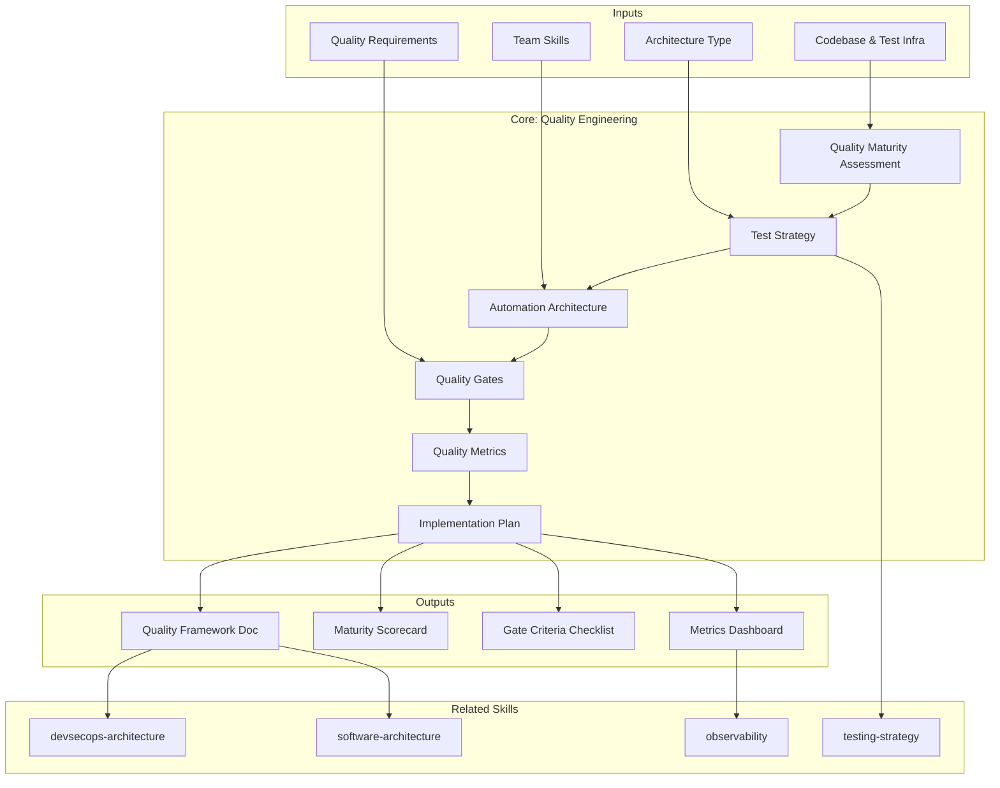

# Quality Engineering: Strategic Quality Architecture & Shift-Left Practices

Strategic quality engineering framework. Designs the system — QA teams execute it. For architects, engineering leads, and quality strategists who define *how* quality works. [EXPLICIT]

## Grounding Guideline

**Quality is not inspected — it is built in every commit.** Quality is an architectural attribute, not a lifecycle phase. It is designed into the code structure, automated in the pipeline, and measured with leading indicators — not with bugs in production.

### Quality Engineering Philosophy

1. **Test strategy shapes > test counts.** The pyramid, the trophy, and the diamond are guides, not dogmas. The right shape depends on the architecture, not on convention. [EXPLICIT]
2. **Shift-left quality.** Every defect found after merge costs 10-100x more. Pre-commit hooks, PR gates, and developer-owned tests are investment, not overhead. [EXPLICIT]
3. **Quality gates in pipeline.** A gate without measurable criteria is a decorative traffic light. Every gate defines pass/fail, timeout, and escalation path. [EXPLICIT]

## Inputs

The user provides a system or project name as `$ARGUMENTS`. Parse `$1` as the **system/project name** used throughout all output artifacts. [EXPLICIT]

**Parameters:**
- `{MODO}`: `piloto-auto` (default) | `desatendido` | `supervisado` | `paso-a-paso`
  - **piloto-auto**: Auto para maturity assessment y test strategy, HITL para quality gates y automation decisions. [EXPLICIT]
  - **desatendido**: Zero interruptions. Framework completo con supuestos documentados. [EXPLICIT]
  - **supervisado**: Autónomo con checkpoint en gate criteria y automation architecture. [EXPLICIT]
  - **paso-a-paso**: Confirma cada maturity score, test shape, gate criteria, y metric target. [EXPLICIT]
- `{FORMATO}`: `markdown` (default) | `html` | `dual`
- `{VARIANTE}`: `ejecutiva` (~40% — S1 maturity + S4 gates + S5 metrics) | `técnica` (full 6 sections, default)

Before generating framework, detect the codebase context:

```
!find . -name "*.test.*" -o -name "*.spec.*" -o -name "*test*" -type d -o -name "jest*" -o -name "pytest*" | head -20
```

Use detected testing frameworks, languages, and existing test structure to tailor recommendations. [EXPLICIT]

If reference materials exist, load them:

```
Read ${CLAUDE_SKILL_DIR}/references/quality-patterns.md
```

---

## When to Use

- Designing quality strategy for new projects or quality infrastructure overhaul
- Assessing quality maturity and building improvement roadmaps
- Establishing test automation architecture and CI/CD quality gates
- Defining quality metrics, coverage targets, and dashboard design
- Introducing shift-left practices across development teams

## When NOT to Use

- Writing test code or test suites → development team responsibility
- CI/CD pipeline design and deployment automation → **metodologia-devsecops-architecture**
- Production monitoring and incident response → **metodologia-observability**
- Application architecture and design patterns → **metodologia-software-architecture**

---

## Delivery Structure: 6 Sections

### S1: Quality Maturity Assessment

### 5-Level Model

| Level | Name | Characteristics |
|-------|------|-----------------|
| 1 | Ad-Hoc | No formal strategy. Reactive testing. No automation. |
| 2 | Repeatable | Basic processes. Some automation. Pre-release testing. |
| 3 | Defined | Formal strategy. Automation architecture. Quality gates in CI. |
| 4 | Managed | Automated gates enforced. Metrics-driven decisions. Shift-left. |
| 5 | Optimizing | Continuous improvement. Predictive analytics. Zero-toil automation. |

### Assessment Dimensions (score 0-100% each)

1. **Test Strategy & Planning** — formal strategy documented? pyramid/diamond defined? ownership clear?
2. **Test Automation** — framework selected? patterns in place? execution speed acceptable?
3. **Quality Gates & CI/CD** — commit/PR/release gates automated?
4. **Test Data Management** — synthetic generation? masking? versioning?
5. **Quality Metrics & Dashboards** — leading+lagging collected? dashboards shared? actions taken?
6. **Shift-Left Practices** — developers write unit tests? code review includes quality? pre-commit hooks?

**Output:** Current score (1-5) overall + per dimension, target maturity (12-month), gap analysis, DORA benchmark comparison, quick wins + long-term improvements.

### S2: Test Strategy

### Architecture-Driven Shape

**Monolith → Test Pyramid:** Unit 55% | Integration 25% | API 15% | E2E 5%
**Microservices → Test Diamond:** Unit 20% | Integration 40% | Contract 30% | E2E 10%

### Test Types Summary

| Type | Owner | Frequency | Pass Criteria |
|------|-------|-----------|---------------|
| Unit | Developer | Every commit | 100% scope; <1s/test |
| Integration | Developer | Every PR | Happy + unhappy paths; <3s/test |
| Contract | Both teams | Every PR | Consumer expectations = Provider responses |
| API | QA/Automation | PR + nightly | HTTP status, schema, business logic |
| E2E | QA/Automation | Nightly | Workflow completes; no UI glitches |
| Performance | Perf Eng | Weekly + pre-release | Throughput/latency meets SLA |
| Security | Security Eng | SAST per commit, DAST weekly | No critical vulns; compliance pass |
| Exploratory | QA | Per sprint | Novel bugs found; readiness confirmed |

### Test Data Strategy

- **Synthetic generation:** Data factories (Builder pattern, Faker). Never hardcode. Version alongside code.
- **Masking (regulated):** PII → fake values. PCI → last 4 digits. Healthcare → encrypt or exclude.
- **Management:** Dedicated test DB. Tag snapshots for reproducibility. Reset between tests.

For framework recommendations by language and automation patterns (Page Object, Screenplay, Test Data Factory, Golden Master, Testcontainers), read: `${CLAUDE_SKILL_DIR}/references/automation-patterns.md`

### S3: Automation Architecture

### Framework Selection Criteria

Evaluate: language alignment, team skills, community support, maintenance cost, scalability, reporting, cost (OSS vs commercial). [EXPLICIT]

### CI/CD Pipeline Stages

| Stage | Tests | Timeout | On Failure |
|-------|-------|---------|------------|
| Commit Gate (every push) | Unit + lint + SAST | 5 min | Block merge |
| PR Gate (PR create/update) | Integration + contract + coverage >70% | 15 min | Block merge to main |
| Nightly Gate (post-merge) | Full E2E + API regression + DAST + perf baseline | 60 min | Alert team; manual review |
| Release Gate (pre-release) | Full load test (10x peak) + smoke + manual sign-off | 120 min | Block release |
| Production Gate (post-deploy) | Smoke + canary metrics validation | 15 min | Automated rollback |

For detailed pipeline YAML examples and report/dashboard architecture, read: `${CLAUDE_SKILL_DIR}/references/pipeline-stages.md`

### S4: Quality Gates

### Gate Enforcement Rules

- **Blocking:** Commit, PR, Release gates block deployment
- **Async:** Nightly gate alerts but requires manual decision
- **No bypass:** Security gates (SAST, DAST) cannot be bypassed
- **Bypass audit:** Any bypass logged with reason and approver
- **Timeout policy:** Exceeding timeout = fail the gate
- **Flaky tests:** Failing >2x/week → remove from gate, refactor separately

### Gate Pass Criteria

| Gate | Pass Criteria | Escalation |
|------|--------------|------------|
| Commit | All tests pass; no lint errors; no critical vulns | Developer fixes locally |
| PR | All tests pass; coverage >70%; no regressions | Tech lead reviews |
| Nightly | E2E pass; perf regression <5%; DAST reviewed | QA lead investigates |
| Release | Load SLA met; E2E pass; security sign-off; checklist complete | Release manager + eng leads |
| Production | Smoke pass; canary metrics within 2-sigma of baseline | On-call engineer |

### S5: Quality Metrics

### Leading Indicators (predict future quality)

| Metric | Target |
|--------|--------|
| Code review catch rate | >50% of issues |
| Test coverage | 70-80% |
| PR review time | <24 hours |
| Build stability | >95% pass |
| Flaky test rate | <2% |
| PR gate execution time | <15 min |
| Deployment frequency | >1/week |

### Lagging Indicators (measure past quality)

| Metric | Target |
|--------|--------|
| Production incidents | <1/week |
| Escaped defects | <5% of total bugs |
| MTTR | <1 hour (critical) |
| Regression rate | <1% |

### Dashboard Design

4 panels: Test Health (pass/fail, execution time, flaky list, coverage trend), Quality Metrics (DORA, incidents, escaped defects), Automation Coverage (by type and team), SLA Compliance (build stability, PR pass rate, deploy success). [EXPLICIT]

### S6: Implementation Plan

| Phase | Weeks | Focus | Key Deliverables | Success Criteria |
|-------|-------|-------|-----------------|-----------------|
| Foundations | 1-4 | Baseline CI/CD + strategy | Commit gate, test strategy doc, framework selection, metrics dashboard | 90%+ build pass; strategy approved |
| Automation | 5-8 | PR gate + test coverage | Integration + contract tests, API suite, test data factory | PR gate >90% pass; API coverage >80% |
| Advanced | 9-12 | E2E + perf + security | E2E suite, perf regression tests, SAST/DAST integration | E2E >70% critical paths; perf baseline set |
| Optimization | Ongoing | Continuous improvement | Monthly flaky elimination, quarterly metric review, bi-annual framework assessment | Flaky <2%; stable execution time |

## Assumptions & Limits

- Quality engineering designs; QA executes. This outputs strategy, not test suites.
- Automation ROI requires 3-4 execution cycles. Do not automate one-off tests.
- Shift-left requires developer buy-in for unit tests and pre-commit gates.
- Production-like environments required for reliable performance testing.
- Cannot guarantee zero defects — goal is risk-appropriate quality investment.
- Exploratory testing finds bugs automation misses; budget 25-30% for it.

## Edge Cases & Adaptations

| Scenario | Approach |
|----------|----------|
| Greenfield (no tests) | Smoke tests on critical paths first (20-30 cases); grow coverage organically to 70-80% |
| Legacy migration (no coverage) | Golden Master pattern → characterization tests before refactoring → gradual replacement |
| Microservices contract breaks | Consumer-driven contract testing (Pact); replaces E2E between services |
| Event-driven / async | Event schema validation + eventual consistency tests + saga pattern tests |
| Multi-platform (mobile+web+API) | Unify at API layer; platform-specific UI tests only for native functionality |
| Regulated (banking, health, PCI) | Add compliance test layer, data masking, audit trail verification, mandatory pen testing |
| No third-party sandbox | Service virtualization (WireMock); quarterly manual testing against real systems |

## Trade-off Matrix

| Decision | Habilita | Restringe | Cuando Usar |
|---|---|---|---|
| **Full test pyramid** (unit-heavy) | Fastest feedback, cheapest to maintain, high isolation | Limited integration confidence, misses contract issues | Monoliths, well-defined APIs, mature codebase |
| **Test diamond** (integration-heavy) | High confidence in service interactions, catches contract breaks | Slower execution, requires test infrastructure (containers, mocks) | Microservices, event-driven, distributed systems |
| **Shift-left maximum** (pre-commit gates) | Defects caught earliest (10-100x cheaper to fix), developer ownership | Slower developer workflow, requires team buy-in and tooling investment | High-frequency deployment teams (>1/day), regulated industries |
| **Coverage targets** (70-80%) | Measurable quality baseline, identifies untested areas | Goodhart's law risk (tests for coverage, not value), maintenance cost | New projects establishing baselines; avoid as sole quality metric |
| **Automation-first** (minimize manual) | Repeatable, scalable, fast feedback loops | High upfront investment, misses exploratory edge cases | Stable features with clear acceptance criteria; complement with 25-30% exploratory |

## Conditional Logic

```
IF deployment frequency > 1/day → full CI/CD with automated gates; no manual gates in critical path; feature flags required
IF financial/healthcare/PCI → add data integrity, encryption, audit trail, PII masking tests; mandatory pen testing
IF team has no automation experience → 4-6 week ramp-up; start with API-level; avoid UI frameworks initially
IF performance SLA exists → add perf regression to CI; baseline in staging; alerts on PR threshold violations
IF multiple teams → consumer-driven contract testing; shared test data contracts; monthly contract reviews
IF legacy with no tests → characterization tests first; NEVER refactor without tests
```

## Edge Cases

| Case | Handling Strategy |
|---|---|
| Greenfield sin tests existentes | Smoke tests en critical paths primero (20-30 casos); crecer coverage organicamente a 70-80%; NO refactorizar sin tests previos |
| Legacy migration sin coverage | Golden Master pattern para characterization tests antes de refactoring; reemplazo gradual; priorizar paths de mayor riesgo |
| Contract breaks en microservicios | Consumer-driven contract testing (Pact); reemplaza E2E entre servicios; revisiones mensuales de contratos entre equipos |
| Equipo sin experiencia en automatizacion | Ramp-up de 4-6 semanas; comenzar con API-level; evitar UI frameworks inicialmente; pairing con automation engineer |
| Regulacion estricta (banca, salud, PCI) | Agregar capa de compliance testing, data masking, verificacion de audit trail, pen testing mandatorio; documentar evidencia por gate |

## Decisions & Trade-offs

| Decision | Discarded Alternative | Justification |
|---|---|---|
| Test shape driven by architecture (pyramid vs diamond) | Shape unica para todos los proyectos | La forma correcta depende de la arquitectura (monolito vs microservicios), no de la convencion; un diamond en monolito desperdicia recursos |
| Shift-left con gates pre-commit | Testing solo en staging/pre-release | Cada defecto encontrado despues del merge cuesta 10-100x mas; pre-commit hooks y PR gates son inversion, no overhead |
| Quality gates con criterios medibles y timeout | Gates decorativos sin criterios de pass/fail | Un gate sin criterio medible es un semaforo decorativo; cada gate define pass/fail, timeout y escalation path |
| 25-30% del budget para testing exploratorio | 100% automatizacion | La automatizacion no encuentra bugs que no se saben buscar; el testing exploratorio descubre edge cases que la automatizacion misses |

## Knowledge Graph



## Output Templates

| Formato | Nombre | Contenido |
|---|---|---|
| **Markdown** | `A-01_Quality_Engineering.md` | Framework completo con maturity assessment, test strategy, automation architecture, quality gates, metrics dashboard design y implementation plan. Diagramas Mermaid de pipeline stages y test shape. |
| **XLSX** | `A-01_Quality_Maturity_Scorecard.xlsx` | Scorecard interactivo con assessment por dimension (0-100%), gap analysis, DORA benchmark comparison, y plan de mejora con quick wins y long-term improvements. |
| **HTML** | `{fase}_Quality_Engineering_{cliente}_{WIP}.html` | Mismo contenido en HTML branded (Design System MetodologIA v5). Self-contained, WCAG AA, responsive. Tipo: Light-First Technical. Incluye maturity scorecard visual por dimension, gate criteria checklist interactivo, y dashboard de métricas leading/lagging. |
| **DOCX** | `{fase}_quality_engineering_{cliente}_{WIP}.docx` | Generado via python-docx con MetodologIA Design System v5. Portada, TOC automático, encabezados en Poppins (navy), cuerpo en Trebuchet MS, acentos en gold. Tablas de maturity scorecard, gate criteria y métricas leading/lagging con zebra striping. Encabezados y pies de página con branding MetodologIA. |
| **PPTX** | `{fase}_quality_engineering_{cliente}_{WIP}.pptx` | Generado via python-pptx con MetodologIA Design System v5. Slide master con gradiente navy, títulos en Poppins, cuerpo en Trebuchet MS, acentos en gold. Máx 20 slides ejecutivo / 30 técnico. Notas del presentador con referencias de evidencia. Slides: Quality Maturity Assessment (6 dimensiones), Test Strategy Shape, Automation Architecture, Quality Gate Criteria, Metrics Dashboard, Implementation Plan. |

## Evaluacion

| Dimension | Peso | Criterio |
|---|---|---|
| Trigger Accuracy | 10% | Descripcion activa triggers correctos (test strategy, quality gates, automation, maturity, shift-left) sin falsos positivos con devsecops-architecture o testing-strategy |
| Completeness | 25% | Las 6 secciones cubren maturity, strategy, automation, gates, metrics e implementation sin huecos; todos los pipeline stages con criterios de pass/fail |
| Clarity | 20% | Instrucciones ejecutables sin ambiguedad; cada gate tiene criterio medible, timeout y escalation; metricas con targets numericos |
| Robustness | 20% | Maneja greenfield, legacy, microservicios, event-driven, multi-plataforma y regulacion estricta con adaptaciones especificas |
| Efficiency | 10% | Proceso no tiene pasos redundantes; variante ejecutiva reduce a S1+S4+S5 sin perder capacidad de decision sobre gates y metricas |
| Value Density | 15% | Cada seccion aporta valor practico directo; maturity scorecard y gate criteria son herramientas de decision inmediata |

**Umbral minimo: 7/10.**

---

## Validation Gate

Before delivering quality engineering output:
- [ ] Architecture type identified (monolith/microservices/hybrid) and test shape matched
- [ ] All 5 pipeline stages have defined pass criteria and timeouts
- [ ] Metrics include both leading and lagging indicators with targets
- [ ] Edge cases addressed for the client's specific context
- [ ] Implementation plan is phased with realistic effort estimates
- [ ] Regulatory requirements (if any) explicitly layered in

## Cross-References

- **metodologia-testing-strategy:** Detailed test architecture — pyramid, automation, contract testing, chaos engineering
- **metodologia-devsecops-architecture:** CI/CD pipeline design where quality gates are enforced
- **metodologia-observability:** Production monitoring that validates quality in production
- **metodologia-software-architecture:** Internal system structure that quality engineering validates

## Output Format Protocol

| Format | Default | Description |
|--------|---------|-------------|
| `markdown` | Yes | Rich Markdown + Mermaid diagrams. Token-efficient. |
| `html` | On demand | Branded HTML (Design System). Visual impact. |
| `dual` | On demand | Both formats. |

Default output is Markdown with embedded Mermaid diagrams. HTML generation requires explicit `{FORMATO}=html` parameter. [EXPLICIT]

## Output Artifact

**Primary:** `A-01_Quality_Engineering.html` — Maturity assessment, test strategy, automation architecture, quality gates, metrics dashboard, implementation plan.

**Secondary:** Quality maturity scorecard, gate criteria checklist, metrics dashboard template, implementation timeline.

---
**Autor:** Javier Montaño | **Última actualización:** 12 de marzo de 2026
