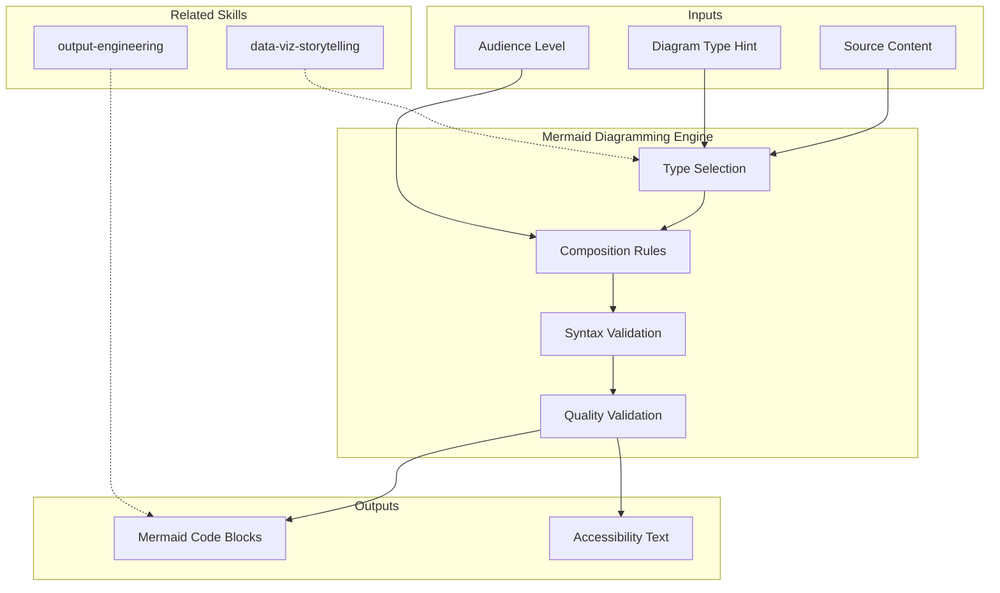

# Mermaid Diagramming Engine

Generates syntactically valid, semantically precise Mermaid diagrams for discovery deliverables. Every diagram earns its place — no decorative visuals. Each diagram must compress complexity into clarity, replacing paragraphs of prose with a single visual that a reader grasps in seconds. [EXPLICIT]

## Grounding Guideline

**A diagram that does not compress complexity into clarity does not deserve to exist.** Every Mermaid diagram must replace paragraphs of prose with a visual that the reader grasps in seconds. Decoration ≠ documentation — only diagrams that earn their place survive.

### Diagramming Philosophy

1. **Information density.** If a diagram does not convey more than 3 sentences of text, it is visual noise. Remove it. [EXPLICIT]
2. **Impeccable syntax.** A diagram that does not render is worse than no diagram. Validate before delivery. [EXPLICIT]
3. **Context > aesthetics.** Nodes are named with domain meaning, not codes. Arrows carry labels. Subgraphs group with purpose. [EXPLICIT]

## Inputs ($ARGUMENTS)

| Argument | Required | Description |
|----------|----------|-------------|
| `$CONTEXT` | Yes | Source material: deliverable content, code analysis, or structured data to visualize |
| `$DIAGRAM_TYPE` | No | Specific type requested (auto-selected if omitted based on content) |
| `$AUDIENCE` | No | Target reader: `executive` (simplified), `technical` (detailed), `operational` (actionable) |

**Parameters:**
- `{MODO}`: `piloto-auto` (default) | `desatendido` | `supervisado` | `paso-a-paso`
  - **piloto-auto**: Auto para selección de tipo y composición, HITL para validación de diagramas complejos (>15 nodos). [EXPLICIT]
  - **desatendido**: Zero interruptions. Diagramas generados automáticamente. Assumptions documented. [EXPLICIT]
  - **supervisado**: Autónomo con checkpoint al seleccionar tipo de diagrama. [EXPLICIT]
  - **paso-a-paso**: Confirma tipo, composición, y validación de cada diagrama. [EXPLICIT]
- `{FORMATO}`: `markdown` (default, fenced code blocks) | `html` (pre class="mermaid") | `dual`
- `{VARIANTE}`: `ejecutiva` (simplified, ≤10 nodes) | `técnica` (full detail, default)

## When to Use

- Any discovery deliverable needs architectural, flow, or relationship visualization
- A concept is better understood visually than textually
- Cross-references between components, stakeholders, or phases need mapping
- Decision trees, timelines, or state machines need representation

## When NOT to Use

- The diagram would merely repeat what the text already says clearly
- Data is better represented as a table (metrics, scores, comparisons)
- The audience won't have Mermaid rendering capability (use ASCII fallback)

## S1 — Diagram Type Selection

Analyze the content and select the optimal diagram type:

| Content Pattern | Diagram Type | Mermaid Syntax |
|----------------|--------------|----------------|
| System components + relationships | C4 Context/Container | `C4Context` / `C4Container` |
| Sequential process steps | Flowchart | `flowchart TD/LR` |
| Actor interactions over time | Sequence Diagram | `sequenceDiagram` |
| Entity relationships | Entity Relationship | `erDiagram` |
| State transitions | State Diagram | `stateDiagram-v2` |
| Project timeline / phases | Gantt Chart | `gantt` |
| Hierarchical decomposition | Mindmap | `mindmap` |
| 2-axis positioning (e.g., risk vs impact) | Quadrant Chart | `quadrantChart` |
| Class/module structure | Class Diagram | `classDiagram` |
| Git/decision branching | Gitgraph | `gitGraph` |
| User journey steps | User Journey | `journey` |
| Data flow / pipeline | Flowchart with subgraphs | `flowchart LR` + `subgraph` |

Selection criteria: Choose the type that maximizes information density while minimizing cognitive load. [EXPLICIT]

## S2 — Diagram Composition Rules

1. **Syntax validity**: Every diagram MUST render without errors in standard Mermaid renderers (GitHub, GitLab, Obsidian, Mermaid Live Editor). [EXPLICIT]
2. **Node naming**: Use descriptive IDs (`authService` not `A1`). Wrap display labels in quotes if they contain spaces. [EXPLICIT]
3. **Edge labels**: Every relationship/arrow carries a label explaining the connection. [EXPLICIT]
4. **Subgraphs**: Group related nodes. Name subgraphs meaningfully. [EXPLICIT]
5. **Direction**: Use `TD` (top-down) for hierarchies, `LR` (left-right) for flows/sequences. [EXPLICIT]
6. **Color/styling**: Use `classDef` for semantic coloring (e.g., `classDef critical fill:#f96,stroke:#333`). Max 4 style classes per diagram. [EXPLICIT]
7. **Size discipline**: Max 20 nodes per diagram. If more needed, split into multiple diagrams with cross-references. [EXPLICIT]
8. **Accessibility**: Include a 1-line text summary before each diagram for screen readers and non-rendering contexts. [EXPLICIT]

## S3 — Deliverable-Specific Diagram Catalog

Each discovery deliverable has recommended diagram types:

| Deliverable | Primary Diagram | Secondary Diagram |
|------------|-----------------|-------------------|
| 01_Stakeholder_Map | Quadrant (influence × interest) | Mindmap (org structure) |
| 02_Brief_Tecnico | Mindmap (stack overview) | Quadrant (health semaphore) |
| 03_Analisis_AS-IS | C4 Context + Container | Class (module dependencies) |
| 04_Mapeo_Flujos | Sequence (E2E flows) | Flowchart (integration map) |
| 05_Escenarios | Flowchart (decision tree) | Quadrant (score positioning) |
| 06_Solution_Roadmap | Gantt (phase timeline) | Flowchart (pivot decision tree) |
| 07_Spec_Funcional | Flowchart (use case flows) | ER (data model) |
| 08_Pitch_Ejecutivo | Mindmap (value pillars) | Gantt (investment timeline) |
| 09_Handover | Flowchart (governance flow) | Gantt (90-day plan) |

Minimum: 1 diagram per deliverable. Recommended: 2. Maximum: 4 (avoid visual overload). [EXPLICIT]

## S4 — Quality Validation

Every diagram passes through validation:

| Criterion | Check |
|-----------|-------|
| Syntax | Renders without errors in Mermaid Live Editor |
| Semantics | Accurately represents the source data |
| Readability | Understandable in <10 seconds for target audience |
| Information density | Conveys info that would take ≥3 sentences in prose |
| Consistency | Uses same terminology as the surrounding document |
| Cross-reference | Node names match entity names used elsewhere in the deliverable |

## S5 — Output Format Integration

**In Markdown deliverables (default):**
````markdown
> **Figure N**: [1-line description for accessibility]

```mermaid
[diagram code]
```

*Source: [CÓDIGO] / [DOC] / [INFERENCIA]*
````

**In HTML deliverables (on demand):**
Embed Mermaid via `<pre class="mermaid">` tag with Mermaid JS CDN include. Add `alt` attribute with text description. [EXPLICIT]

## Trade-off Matrix

| Decision | Enables | Constrains | When to Use |
|---|---|---|---|
| **Max 20 nodes** | Readability, quick comprehension | Cannot show full system in one view | Always — split complex diagrams |
| **Max 4 style classes** | Visual clarity | Limited visual differentiation | Always — more colors = more cognitive load |
| **Descriptive IDs** | Source readability, self-documenting | Longer Mermaid code | Always — readability > brevity |
| **Text summary before diagram** | Accessibility, fallback rendering | Minor overhead per diagram | Always — non-negotiable for accessibility |
| **C4 extension usage** | Rich architecture notation | Limited renderer support | When architecture visualization is primary |

## Assumptions

- Target renderers support Mermaid v10+ syntax
- Readers have basic familiarity with flowchart/diagram conventions
- Diagrams supplement text, never replace it entirely

## Limits

- Cannot generate raster images (PNG/SVG) — output is Mermaid code only
- C4 diagrams use Mermaid's C4 extension (may not render in all contexts)
- Complex diagrams (>20 nodes) require decomposition into sub-diagrams
- Animation/interactivity not supported in Mermaid

## Edge Cases

- If source data is insufficient for a meaningful diagram → skip diagram, note gap
- If two diagram types are equally valid → prefer the one with fewer nodes
- If diagram would contain sensitive data (credentials, internal IPs) → abstract to categories

## Validation Gate

Before delivering any diagram:
1. Paste into Mermaid Live Editor mentally — would it render? Fix syntax if not. [EXPLICIT]
2. Does it add information the text doesn't? If no, remove it. [EXPLICIT]
3. Can the target audience understand it without explanation? If no, simplify. [EXPLICIT]
4. Are all labels/names consistent with the document? If no, align. [EXPLICIT]

## Edge Cases

| Case | Handling Strategy |
|------|---------------------|
| Requested diagram type is not supported by the target renderer (e.g., C4 extension in a basic Mermaid viewer) | Fall back to flowchart with subgraphs that emulate C4 structure; document the fallback with a note to the reader |
| Source data would require >40 nodes for a complete representation | Decompose into 2-3 sub-diagrams with explicit cross-reference labels (e.g., "see Diagram 2B for detail"); add an index diagram showing how sub-diagrams relate |
| Diagram contains node labels with special characters that break Mermaid syntax (quotes, brackets, pipes) | Escape characters per Mermaid spec; use descriptive IDs without special characters; place full labels in quoted strings |
| Two equally valid diagram types for the same content (e.g., flowchart vs sequence for an API call chain) | Prefer the type with fewer nodes; if equal, prefer the type that shows temporal ordering (sequence) over structural relationship (flowchart) |

## Decisions & Trade-offs

| Decision | Discarded Alternative | Justification |
|----------|----------------------|---------------|
| Enforce max 20 nodes per diagram as a hard rule | Allow unlimited nodes with a "best effort" readability guideline | Soft guidelines are ignored under time pressure; the hard cap forces conscious decomposition decisions that improve every diagram |
| Require accessibility text summary before every diagram | Rely on diagram self-explanation | Screen readers cannot parse Mermaid; non-rendering contexts (email, print) lose all information without text summaries; accessibility is non-negotiable |
| Use descriptive node IDs (authService, paymentDB) over short codes (A1, B2) | Short IDs for compact Mermaid source | Descriptive IDs make the raw Mermaid source self-documenting; when diagrams are reviewed in code, short IDs require cross-referencing a legend |

## Knowledge Graph



## Output Templates

### Markdown (default)
- Filename: embedded within parent deliverable (e.g., `03_Analisis_ASIS_{cliente}_{WIP}.md`)
- Structure: Figure number > accessibility text summary > fenced mermaid code block > source evidence tag

### HTML
- Filename: embedded within parent HTML deliverable
- Structure: `<pre class="mermaid">` with CDN v10; alt attribute with accessibility text; responsive container; print fallback CSS

### DOCX (bajo demanda)
- Filename: `{fase}_{entregable}_{cliente}_{WIP}.docx`
- Generado via python-docx con MetodologIA Design System v5. Portada con logo y metadatos, TOC automatico, headers/footers con nombre del skill y numeracion, tablas zebra, titulos Poppins navy, cuerpo Trebuchet MS, acentos gold. Diagramas Mermaid exportados como imagen PNG e incrustados en el documento.

### XLSX (bajo demanda)
- Filename: `{fase}_{entregable}_{cliente}_{WIP}.xlsx`
- Generado con openpyxl bajo MetodologIA Design System v5. Headers con fondo navy y tipografía Poppins blanca, formato condicional, auto-filtros activados, valores sin fórmulas. Hojas: Diagram Catalog (tipo, entregable, nodos, descripción), Validation Gate por diagrama, Deliverable-Diagram Matrix.

### PPTX (bajo demanda)
- Filename: `{fase}_{entregable}_{cliente}_{WIP}.pptx`
- Generado via python-pptx con MetodologIA Design System v5. Slide master navy gradient, titulos Poppins, cuerpo Trebuchet MS, acentos gold. Max 20 slides variante ejecutiva / 30 variante tecnica. Speaker notes con referencias de evidencia [DOC]/[INFERENCIA]/[SUPUESTO].

## Evaluacion

| Dimension | Peso | Criterio |
|-----------|------|----------|
| Trigger Accuracy | 10% | Descripcion activa triggers correctos sin falsos positivos |
| Completeness | 25% | Todos los entregables cubren el dominio sin huecos |
| Clarity | 20% | Instrucciones ejecutables sin ambiguedad |
| Robustness | 20% | Maneja edge cases y variantes de input |
| Efficiency | 10% | Proceso no tiene pasos redundantes |
| Value Density | 15% | Cada seccion aporta valor practico directo |

**Umbral minimo**: 7/10 en cada dimension para considerar el skill production-ready.

## Cross-References

- discovery-orchestrator — coordinates which diagrams each deliverable needs
- All pipeline skills — embed diagrams in their output artifacts
- brand-html / brand-html-extended — HTML embedding with Mermaid JS

## Output Format Protocol

| Format | Default | Description |
|--------|---------|-------------|
| `markdown` | ✅ | Rich Markdown + Mermaid diagrams. Token-efficient. |
| `html` | On demand | Branded HTML (Design System). Visual impact. |
| `dual` | On demand | Both formats. |

Default output is Markdown with embedded Mermaid diagrams. HTML generation requires explicit `{FORMATO}=html` parameter. [EXPLICIT]

## Output Artifact

**Primary:** Mermaid diagram code blocks ready to embed in Markdown or HTML deliverables. Each diagram includes accessibility text summary, source evidence tag, and figure numbering.

**Supported diagram types:** C4Context, C4Container, flowchart, sequenceDiagram, erDiagram, stateDiagram-v2, gantt, mindmap, quadrantChart, classDiagram, gitGraph, journey.

**Autor:** Javier Montaño | **Última actualización:** 12 de marzo de 2026
